ParaView 5.10.0 Release Notes
=============================

Major changes made since ParaView 5.9.1 are listed in this document. The full list of issues addressed by this release is available [here](https://gitlab.kitware.com/paraview/paraview/-/issues?scope=all&state=closed&milestone_title=5.10%20(Fall%202021)).

* [New features](#new-features)
* [Rendering enhancements](#rendering-enhancements)
* [Plugin updates](#plugin-updates)
* [Filter changes](#filter-changes)
* [Readers, writers, and filters changes](#readers-writers-and-filters-changes)
* [Interface improvements](#interface-improvements)
* [Python scripting improvements](#python-scripting-improvements)
* [Virtual reality improvements](#virtual-reality-improvements)
* [Miscellaneous bug fixes](#miscellaneous-bug-fixes)
* [Catalyst](#catalyst)
* [Cinema](#cinema)
* [Developer notes](#developer-notes)

# New features

## macOS arm64 Binaries

ParaView is now tested on the macOS arm64 platform.

Due to this change, ParaView binaries are now available using the processor name according to the platform in the binary filename rather than a generic "32Bit" or "64Bit" indicator.

Linux: `x86_64`
macOS: `arm64` and `x86_64`
Windows: `AMD64`

## HPC benchmarks and validation suite

To make it easier to test and validate HPC builds, we have added a new package under the `paraview` Python package called `tests`. This package includes several modules that test and validate different aspects of the ParaView build.

The tests can be run as follows:

```python
# all tests
pvpython -m paraview.tests -o /tmp/resultsdir

# specific tests
pvpython -m paraview.tests.verify_eyedomelighting -o /tmp/eyedome.png
pvpython -m paraview.tests.basic_rendering -o /tmp/basic.png
```

Use the `--help` or `-h` command line argument for either the `paraview.tests`
package or individual test module to get list of additional options available.

The list is expected to grow over multiple releases. Suggestions to expand this validation
test suite are welcome.

## Command-line option parsing

The command-line options parsing code has been completely refactored. ParaView now uses [CLI11](https://github.com/CLIUtils/CLI11). This has implications for users and developers alike.

### Changes for users

There way to specify command line options is now more flexible. These can be provided as follows:

* `-a` : a single flag / boolean option
* `-f filename`: option with value, separated by space
* `--long`:  long flag / boolean option
* `--file filename`: long option with value separated using a space
* `--file=filename`: long option with value separated by equals

Note this is a subset of ways supported by CLI11 itself. This is because ParaView traditionally supported options of form `-long=value` i.e. `-` could be used as the prefix for long-named options. This is non-standard and now deprecated. Instead, one should add use `--` as the prefix for such options, e.g., `-url=...` becomes `--url=...`. Currently, this is done automatically to avoid disruption and a warning is raised. Since this conflicts with some of the other more flexible ways of specifying options in `CLI11`, we limit ourselves to the ways listed above until this legacy behavior is no longer supported.

The `--help` output for all ParaView executables is now better formatted. Options are grouped, making it easier to inspect related options together. Mutually exclusive options and deprecated options are clearly marked to minimize confusion. Also, in most terminals, the text width is automatically adjusted to the terminal width and text is wrapped to make it easier to read.

Several options support overriding default values using environment variables. If the option is not specified on the command line, then that denoted environment variable will be used to fetch the value for that option (or flag).

### Changes for developers

`vtkPVOptions` and subclasses are deprecated. Instead of a single class that handled the parsing of the defining of command line flags/options, command-line arguments, and then keep state for the flag/option selections, the new design uses two different classes. `vtkCLIOptions` handle the parsing (using CLI11), while singletons such as `vtkProcessModuleConfiguration`, `vtkRemotingCoreConfiguration`, `pqCoreConfiguration` maintain the state and also populate `vtkCLIOptions`  with supported flags/options. Custom applications can easily add their own `*Configuration` classes to populate `vtkCLIOptions` to custom options or override the default ParaView ones. If your custom code was simply checking user selections from `vtkPVOptions` or subclasses, change it to using the corresponding `*Configuration` singleton

## Consistent string substitutions and formatting across ParaView

The format of text strings used to reference certain quantities in ParaView have been standardized across sources, filters, and views. ParaView now uses the `{fmt}` library and associated syntax to reference particular quantities available in different contexts.

In all sources, filters, and views that make use of substitution strings, the following globally available text strings can be used to reference the information they represent:

* `{username}` (equivalently, `{ENV_username}`) - name of user logged in to machine on which ParaView is running
* `{hostname}` (equivalently, `{ENV_hostname}`) - name of host machine on which ParaView is running
* `{os}` (equivalently, `{ENV_os}`) - name of operating system on which ParaView is running
* `{date}` (equivalently, `{GLOBAL_date}`) - date and time at which ParaView was started.
* `{appname}` (equivalently, `{GLOBAL_appname}`) - name of the application, e.g ParaView. For ParaView-based applications, this will evaluate to the name of the application.
* `{appversion}` (equivalently, `{GLOBAL_appversion}`) - version of the application.

The actual information represented by the strings listed above is substituted into the string that is rendered, subject to [formatting modifiers](https://fmt.dev/latest/syntax.html#format-specification-mini-language) supported by the `{fmt}` library for strings, numbers, and dates.

These sources and filters use the new string formatting method:

* **Annotate Time** - To reference time, use `{time}`. The number formatting syntax from the `{fmt}` library are available to control the precision of the displayed time, e.g., `{time:3.2f}` limits the number of displayed digits after the decimal point to two.
* **Python Calculator** - In addition to using the Python variables ``time_value``, and ``time_index`` in the provided expression, now you may also use ``{timevalue} == {CALCULATOR_timevalue}``, and ``{timeindex} == {CALCULATOR_timeindex}``.

* Views - The view types **Bar Chart View**, **Bar Chart View (Comparative)**, **Box Chart View**, **Histogram View**, **Line Chart View**, **Line Chart View (Comparative)**, **Plot Matrix View**, **Point Chart View** and  **Quartile Chart View** all have `{time}` available in their **Chart Title** properties in addition to the globally available substitutions. The **Bag Chart View (Comparative)** views provided in the `BagPlotViewsAndFilters` plugin also defines a `{variance}` string substitution available for use in the **Chart Title** property.
* Extract writers - All extract writers listed in the *Extractors* menu have `{time}` (equivalently, `{EXTRACT_time}`) and an additional `{timestep}` (equivalently, `{EXTRACT_timestep}`) substitution that provides the current timestep index. In addition, image extractors have available a `{camera}` (equivalently, `{EXTRACT_camera}`) substitution for encoding camera information in the output **File Name** property.

>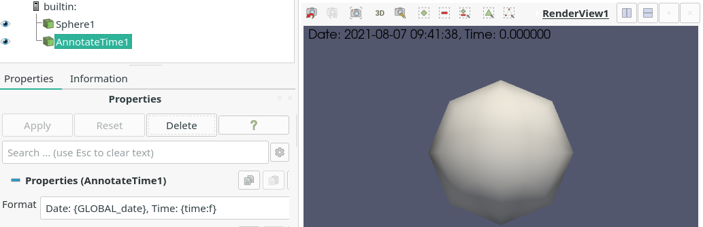
>
> Example of new string formatting in an **Annotate Time** filter.

## Favorite directory customization in file dialog

You can now customize a set of favorite directories displayed in file dialogs. Buttons to "Add current directory to favorites", "Remove current directory from favorites" and "Reset favorites to system default" are available in the dialog. The context menu that appears when right-clicking a directory in the files list now includes "Add to favorites", "Remove from favorites", "Rename", and "Open in file explorer" options. When the "Open in file explorer" option is selected, if the selected item is a directory, it will be opened in the system file explorer. Otherwise, if a file or nothing is selected, the current directory is opened in the file explorer. The context menu shows a "Delete empty directory" when right-clicking an empty directory in the files list.

When right-clicking a directory in the favorites list, a "Rename label" option is available, which can also be triggered by pressing the F2 key. It only renames the label displayed in the favorites list and not the actual folder name. If a favorites directory does not exist (e.g., it was deleted), the name is greyed out and in italic, and the icon indicates a warning and the tooltip says that the path does not exist.

Standard shortcuts to some buttons in the file dialog have been added as well. `Alt+Left` goes back, `Alt+Right` goes forward, `Alt+Up` goes to the parent directory and `Ctrl+N` creates a new directory. The "Create New Folder" button is now disabled when opening an existing file.

>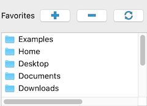

## New stride property for animations

It is now possible to change the granularity of the animation using the **Stride** property in the *Animation View*. This property only makes sense in the **Snap to Timesteps** and **Sequence** mode, i.e., when there is a fixed number of frames. The **Stride** property allows skipping a fixed number of frames to control how many frames should be displayed. For example, with a dataset having a time domain of `[0,1,2,3,4,5,6]` and when setting the stride to 2, only the times `[0,2,4,6]` will be used. The stride is taken into account when using the `Play`, `Go To Next Frame` or `Go To Previous Frame` buttons. A stride of 1 will act as the default behavior, i.e., no frames are skipped.

## RealTime animation mode deprecated

The 'RealTime' animation mode is deprecated and will be removed in a future release. Rationale:

* ParaView does not aim do be a video editor.
* ParaView processes data and takes the time it needs so real-time replay is unlikely to happen as expected.

See the [discussion](https://discourse.paraview.org/t/paraview-time-refactoring/5506/6) leading to the decision to remove this animation mode.

## New default view setting 'Empty'

The **Default View Type** advanced property under "General" settings/preferences tab now has an "Empty" option. This setting will open ParaView with an empty view that lets you select one of the available views.

## PVSC updates

ParaView server configuration files (PVSC) now support two new predefined
variables:

1. `PV_APPLICATION_DIR`: This is set to the directory containing the application
   executable. For macOS app bundles, for example, this will be inside the
   bundle. This is simply `QCoreApplication::applicationDirPath`.
2. `PV_APPLICATION_NAME`: This is set to the name of the Qt application as
   specified during application initialization. This is same as
   `QCoreApplication::applicationName`.


## Support for 19-node tri-quadratic pyramid cells

ParaView now supports a 19-node-pyramid (`vtkTriQuadraticPyramid`) element. This new cell type is included as an option in the **UnstructuredCellTypes** source.

## Additional example data files

ParaView 5.10.0 installers now include many more example datasets. A netCDF example with sea surface temperature has been added. VTK legacy and XML examples have also been added, including both structured and unstructured datasets. Some of these datasets are parallel and/or time-dependent examples.

# Rendering enhancements

## Render View background color

Render View (and related views) now have a property **UseColorPaletteForBackground** that indicates if the view-specific background overrides should be used or the view should simply use the global color palette to determine how the background is rendered. Previously, it was confusing to know which views were using the global color palette and which ones were using user overridden values for background color.

>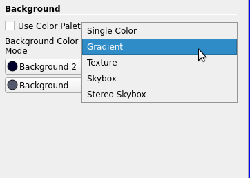

In addition, instead of having separate boolean properties that are largely mutually exclusive, the view now adds a **BackgroundColorMode** property that lets the user choose how the background should be rendered. Supported values are "Single Color", "Gradient", "Texture" and "Skybox".

This change impacts the Python API. **UseGradientBackground**, **UseTexturedBackground** and **UseSkyboxBackground** properties have been replaced by **BackgroundColorMode** which is now an enumeration that lets you choose how to render the background. Also, unless Python compatibility for ParaView 5.9 or earlier is specified, view specific background color changes will get ignored unless `UseColorPaletteForBackground` property is not set to 0 explicitly.

## Simulate clear coat layer in the PBR representation

When using the PBR representation under the lighting panel, you can now add a second layer on top of the base layer. This is useful to simulate a coating on top of a material. This layer is dielectric (as opposed to metallic), and can be configured with various parameters. You can set the coat strength to control the presence of the coat layer (1.0 means strongest coating), the coat roughness and the coat color. You can also choose the index of refraction of the coat layer as well as the base layer. The more the index of refraction goes up, the more specular reflections there are.

You can also use a texture to normal map the coating. These parameters are supported by OSPRay pathtracer.

## Simulate anisotropic materials in the PBR representation

When using the PBR representation under the lighting panel, you can now set the anisotropy strength and anisotropy rotation for a material. The anisotropy strength controls the amount of light reflected along the anisotropy direction (i.e., the tangent). The anisotropy rotation rotates the tangent around the normal. Notice that the object must have normals and tangents defined to work. You can also use a texture to hold the anisotropy strength in the red channel, and the anisotropy rotation in the green channel. These parameters are supported by OSPRay pathtracer.

## Rotating skyboxes

You can now rotate the Skybox horizontally with Control + Left Click. This binding was previously set to rotate the view. You can still rotate the view with Left Click alone. This is useful when using "PBR" (physically-based rendering) shading and "Image Based Lighting" and you want to change the reflection without moving geometry in the scenery.

## **Text Source Representation** style options

The **Text Source Representation** used to represent how text sources are rendered has been updated to let you customize the borders and the background of the text. For the borders, it is now possible to draw round corners, choose the color as well as the thickness. A combo box allows you to define the visibility of the border (only on hover, always or never). For the text, you can now choose the background color and opacity and the right and top padding between the border and the text.

## Multicolumn and multiline support in equation text rendering

The rendering of equations using mathtext now supports multiline and multicolumn equations. You can define a new line by writing a new line in the text source, and you can define a new column by entering the character '|'. You can still write a '|' by escaping it with a backslash ('\\|').

## View Property **WindowResizeNonInteractiveRenderDelay**

A new double property, **WindowResizeNonInteractiveRenderDelay**, on view proxies has been added that lets you set the time in seconds before doing a full-resolution render after the last WindowResize event. This allows the view to render interactively when resizing a window, improving rendering performance when using large data sets.

# Plugin updates

[Topology Toolkit (TTK) filters](https://topology-tool-kit.github.io/) are now available in ParaView by loading the TopologyToolkit plugin. TTK is a collection of filters that help with topological data analysis.

>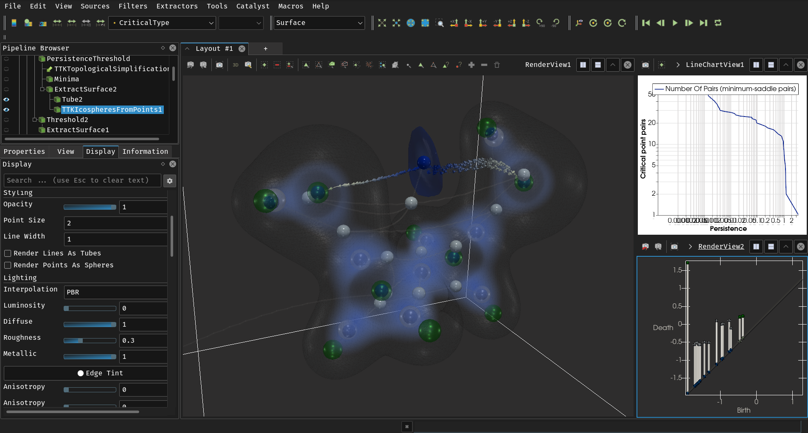

## NVIDIA IndeX plugin improvements

### Cropping structured grid rendering

Structured grids rendered by the "NVIDIA IndeX" representation can now be cropped to a volume of interest (VOI) by checking the "Use Cropping" property. Cropping is controlled by an interactive box widget or through the associated text widgets.

This replaces the custom "NVIDIA IndeX Region of Interest" properties, which however are still in use for unstructured grids. Existing state files that rely on the old properties will continue to work, but a warning will be printed, showing the corresponding settings for the "Cropping Origin" and "Cropping
Scale" parameters.

### Remote rendering on macOS clients

A limited "remote rendering only" version of the NVIDIA IndeX plugin is now available for macOS, making it possible to connect a macOS ParaView client to a remote `pvserver` running Linux and rendering with NVIDIA IndeX there. The plugin does not support local rendering on macOS and an error will be printed when the user tries to enable the "NVIDIA IndeX" representation locally.

### Additional data type support

32-bit integer data values (signed/unsigned) of structured and unstructured grids will be automatically converted to an internal float representation by the plugin, to enable efficient rendering. This automatic data conversion does not affect the memory utilization.

Multiple components per voxel (e.g. vector or RGB data) are now supported for structured grids. The component to be rendered can be selected with the "Coloring" setting in the "Properties" panel. Rendering the vector magnitude is also supported.

### Settings dialog

Plugin settings can be changed in the new "NVIDIA IndeX" tab of the "Settings" dialog:

* Logging: The minimum required severity level for messages to appear in ParaView's *Output Messages* window as well as on standard output can be set. The current timestamp and the hostname can optionally be added to each log message.

* Performance values: Output statistics about rendering performance to a file or to standard output.

* Session export: Output the state of the NVIDIA IndeX scene to a file or to standard output.

* Network Configuration: Various settings for running on multiple hosts in cluster mode. This covers the same settings as in `nvindex_config.xml`, which still takes precedence if it exists.

* Extra Configuration: Allows setting low-level configuration options, e.g. for performance tuning.

* License keys: An NVIDIA IndeX license (e.g., for enabling cluster mode) can now be entered directly in the UI, as an alternative to using environment variables or `nvindex_config.xml` (both have precedence).

### Stability fixes and usability improvements

Fixed the "Update kernel" button not always updating the rendering after the source code of an XAC shader was modified.

On Windows, the NVIDIA IndeX plugin can now be used to connect to a remote `pvserver` even if no NVIDIA display driver is installed locally.

Fixed an issue that could lead to visible seams on structured grids for certain configurations when rendering in cluster mode on multiple hosts.

## GmshReader plugin deprecation

The `GmshReader` plugin is deprecated in favor of the `GmshIO` plugin.

# Filter changes

## **Calculator** filter rewrite

The **Calculator** filter implementation has a completely new backend and has been multhithreaded using VTK's symmetric multiprocessing tools. The implementation uses the [ExprTk](https://github.com/ArashPartow/exprtk) library for expression parsing and evaluation. The new implementation solves several bugs found in the previous calculator implementation, and it offers improved performance as well. Expression syntax is largely unchanged, but the expression for a dot product operation has changed from `A.B` to `dot(A,B)`. Data arrays with names that include spaces or characters unsupported by the backend can be used as long as they are surrounded by quotation marks. The previous implementation will be used for backwards compatibility when loading state files from ParaView 5.9.1 or earlier.

>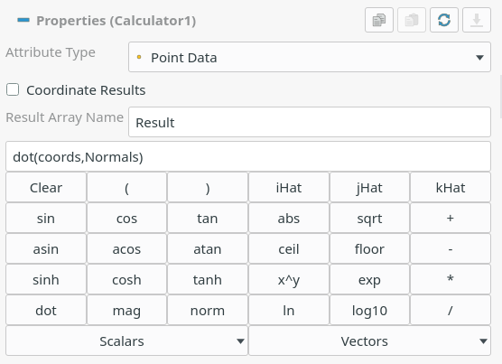

## The Threshold filter can now threshold below or above a value

New thresholding methods have been added to the **Threshold** filter:

- **Between**: Keep cells with values between the lower and upper thresholds.
- **Below Lower Threshold**: Keep cells with values smaller than the lower threshold.
- **Above Upper Threshold**: Keep cells with values larger than the upper threshold.

Previously, it was possible to keep only cells with values falling between two values.

Accordingly, the property **ThresholdBetween** has been removed. Instead, the following three properties have been added: **LowerThreshold**, **UpperThreshold** and **ThresholdMethod**.

>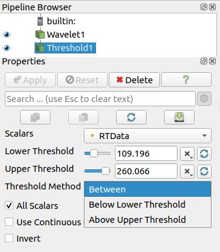

## Changes to **Extract Block** filter

**Extract Block** filter now supports choosing blocks to extract using selector expressions. This makes the block selection more robust to changes to the input hierarchy than the previous selection implementation, which was based on block indices.

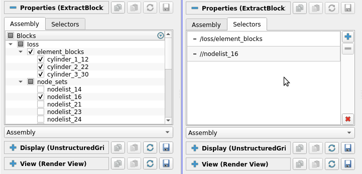|


## Improvements to Group Datasets filter #

The **Group Datasets** filter now supports multiple types of outputs including `vtkPartitionedDataSetCollection`, `vtkPartitionedDataSet`, and `vtkMultiBlockDataSet`. One can also assign names to inputs which then get assigned as blocked names in the output.

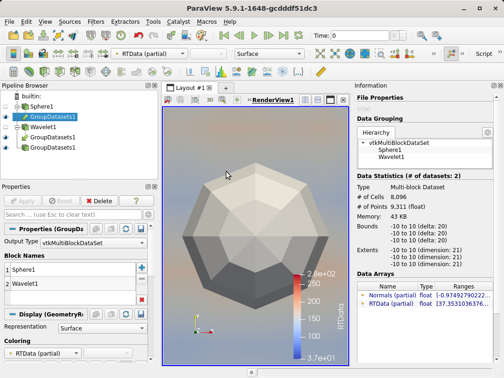

## The filters Gradient and Gradient Of Unstructured DataSet have been merged #

Before ParaView 5.10, these two filters could be used to compute the gradient of a dataset:
- `Gradient` for `vtkImageData` only
- `Gradient Of Unstructured DataSet` for all `vtkDataSet` types

These two filters have been replaced with a single `Gradient` filter based on `vtkGradientFilter` and including the functionalities from the former `Gradient` filter.

For `vtkImageData` objects, it is still possible to use the specialized implementation through the `BoundaryMethod` property, which has two options defining the gradient computation at the boundaries:
- `Smoothed` corresponds to the the old `Gradient` filter and uses central differencing for the boundary elements by duplicating their values
- `Non-Smoothed` corresponds to the old `Gradient of Unstructured DataSet` implementation and simply uses forward/backward differencing for the boundary elements

For all other `vtkDataSet` objects, the filter usage is unchanged.

## **Resample With Dataset** can work with partial arrays

Previously, **Resample With Dataset** would not pass partial arrays from composite dataset input. A new option, **Pass Partial Arrays** has been added. When on, partial arrays are sampled from the source data.

For all those blocks where a particular data array is missing, this filter uses `vtkMath::Nan()` for `double` and `float` arrays, and 0 for all other types of arrays (e.g., `int`, `char`, etc.)

## Histogram filter improvements

The **Histogram** filter has been enhanced in several ways:

* Values from hidden points or cells are no longer included in the histogram results.
* The data range used for automatic bin range values now excludes hidden points and cells.
* A new option, **Normalize**, makes the filter produce normalized histogram values for applications where knowing the fraction of values that fall within each bin is desired.
* The filter has been multithreaded using VTK's SMP tools.

# Grid Connectivity has been removed

Filter named **Grid Connectivity** has been removed. The **Connectivity** filter should support a wider set of use cases than the **Grid Connectivity** filter and should be preferred.

## New **Convert To Point Cloud** filter

A new filter, **Convert To Point Cloud**, has been added. It let users convert any dataset into a `vtkPolyData` containing the same points as the inputs but with either a single poly vertex cell, one vertex cell per point, or no cells.

>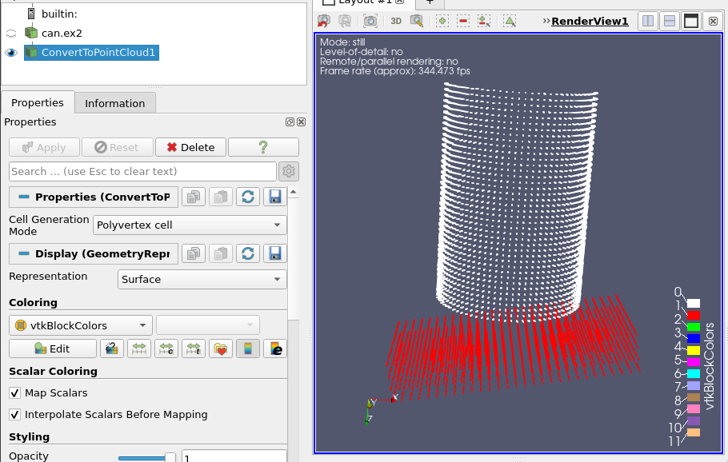

## New **Merge Time** filter

The **Merge Time** filter takes multiple temporal datasets as input and synchronizes them.

The output data is a multiblock dataset containing one block per input dataset. The output timesteps are the union (or the intersection) of each input's timestep list. Duplicate time values within an absolute or relative tolerance are removed.

## New **Merge Vector Components** filter

The **Merge Vector Components** filter takes three separate single-component data arrays and combines them into a single vector (three-component) data array in the output. [More](https://gitlab.kitware.com/paraview/paraview/-/issues/20491)

>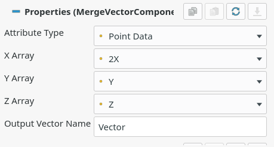

## **Rotational Extrusion** filter has new axis selection property

The **Rotational Extrusion** filter has a new property named **Rotation Axis** to select the axis around which the extrusion shall be done. The default stays the z-axis.

# Readers, writers, and filters changes

## H.264-encoded MP4 video export on Windows

ParaView Windows binaries now offer export of H.264-encoded MP4 files. The frame rate and bit rate are both exposed as options.

## IOSS reader for Exodus files

ParaView now uses the IOSS library to read Exodus files. This new reader,`vtkIOSSReader`, was introduced in 5.9 as a plugin. In this release, ParaView now uses this new reader as the default reader for all Exodus files. The previous reader is still available and can be used in the UI by simply loading the **LegacyExodusReader** plugin. XML state files and Python scripts using the old Exodus reader explicitly will continue to work without any changes.

The IOSS reader has several advantages over the previous implementation. One of the major advantage is that it uses the modern `vtkPartitionedDataSetCollection` as the output data-type instead of `vtkMultiBlockDataSet`.

## IOSS reader for CGNS files

In additional to Exodus, IOSS reader now supports reading CGNS files as well. Note, the reader only supports a subset of CGNS files that are generated using the IOSS library and hence may not work for all CGNS files. The CGNS reader is still the preferred way for reading all CGNS files.

## New OpenVDB Writer

ParaView now has a writer for [OpenVDB Format](https://www.openvdb.org/) files. The writer currently works with `vtkDataSets` and time-series data.

>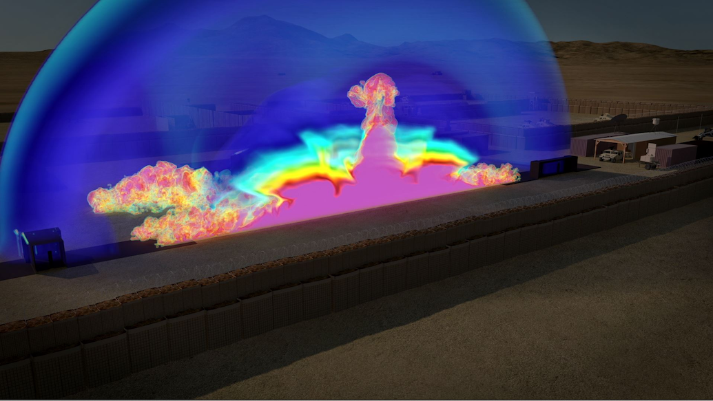 Uniform grid data exported from ParaView using the OpenVDB writer and rendered  in 3D Studio Max. Data generated by the Geotechnical and Structures Laboratory at the US Army's ERDC and visualization generated by the US DoD HPCMP.

## New OMF Reader

ParaView now has a reader for [Open Mining Format](https://omf.readthedocs.io/en/stable/index.html) files. You can specify which elements - point set, line set, surface, or volume - should be loaded.

## New NIST SAVG file format reader

ParaView now includes a reader for the SAVG file format, developed by the High Performance Computing and Visualization Group at the National Institute of Standards and Technology. SAVG is an ASCII format supporting definition of primitives likes points, lines, and polygons.


## OpenFOAM reader improvements and bug fixes

* Added support for reading of internal dimensioned fields

* Updated string expansion for newer syntax:
  * `#sinclude` directive (silent include) - OpenFOAM-v1806
  * `<case>`, `<constant>`, ` <system>` tagss - OpenFOAM-v1806

* Removed very old `include` compatibility keyword, which was poorly documented, rarely (if ever) used. Was deprecated in 2008 (OpenFOAM-v1.5)

* Removed special handling of `uniformFixedValue`. The content that can be specified as a "uniformValue" has evolved well beyond a simple value that can be handled without using OpenFOAM libraries.

* Ensure 32/64 bit information is propagated throughout to increase robustness for mixed precision workflows

* Avoid 32bit overflow when constructing face and cell lists

* Fix segfault or bad reads with large meshes (#18082)

* Correctly handle multi-region cases without a default region (#18091)

* Respect the boundary "inGroups" entry for selection of multiple boundary patches by group

* Support floating-point dimensions entries (fixes #18103)

* Properly handle empty zones

* Improve zone addressing and handling. Basic support for face zones

* Reduced disk IO when setting up cases, when scanning time directories, do cheaper string operations before
  filestat. This eliminates unnecessary checks for items that cannot be times anyhow.

* Avoid lagrangian and region name ambiguity.

  Now prefix all non-default regions as "/regionName/...". The default region has now prefix. This eliminates any possible ambiguity if we happen to have slightly odd region names like "patch", "lagrangian", "internalMesh", ...

  * Drop old OpenFOAM 1.3 cloud naming.
    These were simply dumped into the time directory without any region qualifications. Defunct since about 2007.

* Respect point patch value fields (fixes #18125), use the correct "visit" order for the points

* Remove hard-coded limits on polyhedral size

  For some systems, one can have a so-called "single-cell" OpenFOAM mesh with a single polyhedral cell that has LOTS of faces.

  This can be used for mapping surface noise data to retain most of the geometry but entirely discarding the internal field. It can also potentially arise from finiteArea situations.

* Preserve uncollated lagrangian information (fixes #18179)

  Old version assumed lagrangian data are available on all processor
  sub-directories and used a central naming mechanism accordingly.

  This meant that missing clouds on higher processors would
  effectively block out clouds. Likely didn't work properly with
  clouds in multiple regions.

* Cleanup/simplify processor directory detection

* Avoid rescanning of time directories for decomposed

  Avoids repetitive calls to directory listings, which tend to really
  slow down loading.

* fixed handling of SetTimeValue() in vtkPOpenFOAMReader.

  This mostly affected direct calls from VTK (not from ParaView)

## SEP reader enhancements

The SEP reader can now read up to `32` dimensions and output either 2D or 3D scalar fields. Be careful, though, as the proxy settings have changed: the default parameters for the scalar field may not necessarily correspond to the original one, leading to different output.

# Interface improvements

## Information Panel

The **Information Panel** has been redesigned to improve the way information is presented. Besides general layout improvements that make the panel more compact and consistent with other panels:

* When showing composite datasets, one can view information specific to a subtree by selecting that subtree in the panel. However, if the data changes, for example, due to animation, the selection was lost making it tedious to monitor data information changes for a specific subtree. This has been fixed.

* All numbers now use locale specific formatting. For example, for US-EN based locale, large number are formatted by placing commas. Memory used is shown in KB, MB, or GB as appropriate.

>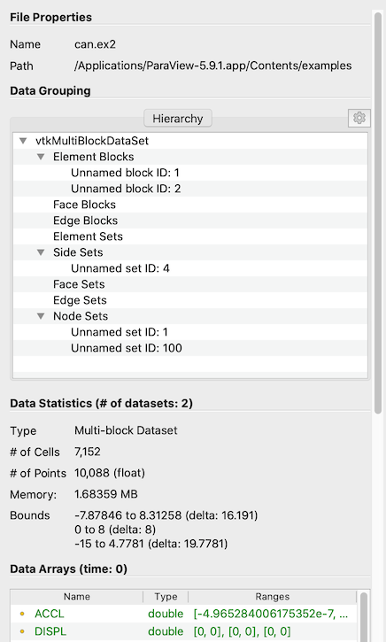

## Color Map Editor improvements

The *Color Map Editor* now has a combo box to quickly apply a preset from the `Default` group without needing to open the *Choose Preset* dialog.

Imported presets can specify a `Groups` field in their `json` definition files to add the preset to one or more groups. For example this preset will be added to the groups `Default`, `CustomGroup1`, and `Linear`:

  ```json
  [
    {
      "ColorSpace" : "RGB",
      "Groups" : ["Default", "CustomGroup1", "Linear"],
      "Name" : "X_Ray_Copy_1",
      "NanColor" :
      [
        1,
        0,
        0
      ],
      "RGBPoints" :
      [0, 1, 1, 1, 1, 0, 0, 0]
    }
  ]
  ```

  In this case, `CustomGroup1` does not exist beforehand so it will be created on import. If the `Groups` field is absent in the JSON definition, the preset is added to the `Default` and `User` groups. The `DefaultMap` field is no longer used as it is redundant with the new `Groups` field. Additionally, any preset can now be added or removed from the `Default` group.

To aid in viewing the results of applying differet color maps to the visualization, the *Choose Preset* dialog is now non-modal, meaning it can remain open while you interact with ParaView's other user interface elements. Lastly, imported presets are displayed in italics to be able to differentiate them from base presets.

## Find Data panel

The *Find Data* dialog has been replaced by *Find Data* panel which offers similar capabilities but is now a dockable panel.

The *Selection Display Inspector* been removed since the *Find Data* panel presents the same information under the *Selection Display* section.

>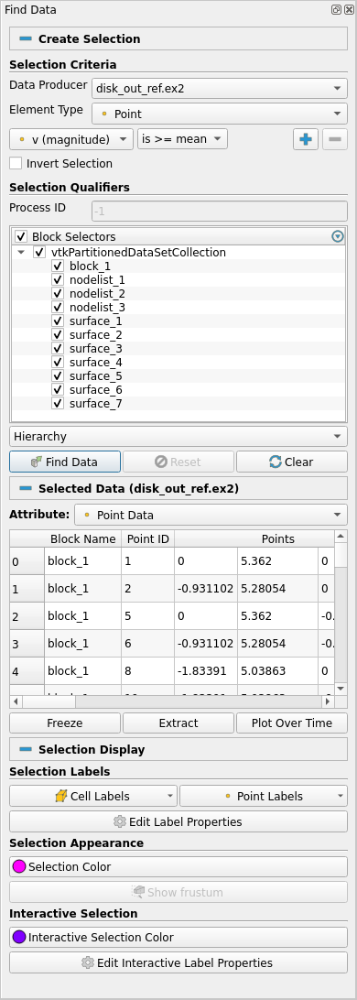

## Python Editor improvements

The following was added to the ParaView Python script editor:

* Auto save of opened buffers in swap files and the option of recovery if ParaView crashes
* Opening of multiple tabs in the editor
* Integration with ParaView's Python trace functionality in its own tab
* Integration with the **Programmable Filter**/**Source**/**Annotation** in a synchronized tab
* Improvements of the undo/redo feature within the editor
* A new entry in ParaView's "Edit" menu to access the editor directly
* Faster syntax highlighting
* More robust file saving

>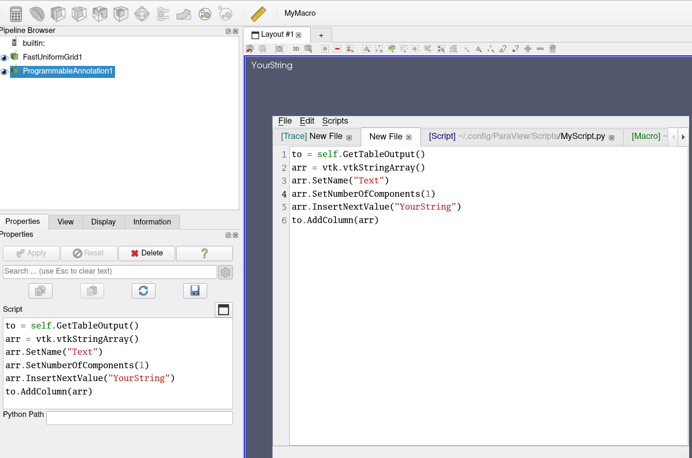

## Tooltips in *Edit Color Legend* window

Some property widgets in the *Edit Color Legend Window* now have descriptions.

Basic properties:
* Auto Orient check box
* Orientation drop down
* Title text box
* Component Title text box
* Draw annotations check box

Advanced properties:
* Automatic Label Format check box
* Label format text box
* Add Range Labels check box
* Range Label Format text box
* Add range annotations check box
* Draw NaN annotation check box
* NaN annotation text box

## **Window Location** values now have spaces

Options for the **Window Location** property in the *Edit Color Legend Properties* have been made more readable by adding spaces between words. For example, `LowerLeftCorner` has been replaced with `Lower Left Corner`.

## Add Symmetric Multiprocessing (SMP) backend information to the About dialog

Adds the following in the Help -> About dialog:

- The SMPTools backend in use
- The maximum number of threads available

## New toolbar buttons "Reset Camera Closest" and "Zoom Closest To Data"

Two new buttons "Reset Camera Closest" and "Zoom Closest To Data" has been added to the right of the existing "Reset Camera" and "Zoom To Data" buttons. These buttons reset the camera to maximize the screen occupancy occupation of the whole scene bounding box ("Reset Camera Closest") or of the active source bounding box ("Zoom Closest To Data").

>

## Effect of modifier key reversed for saving, copying screenshots

When clicking the screenshot capture button, a simple click now saves the screenshot to a file and a click with a modifier key (Option or Ctrl) copies it to the clipboard, which is the opposite of what it was before.

When copying a screenshot to the clipboard, the view now blinks to confirm the copying action.

## OSPRay Material Editor

A new OSPRay material editor control panel has been added to control the OSPRay materials. This control panel can be accessed by selecting the "Material Editor" item in the "View" menu. The control panel is available when ParaView is compiled with `PARAVIEW_ENABLE_RAYTRACING` CMake option set to `ON` to enable the editor widget.

This editor enables the following:

* Load a material library using a `.json` file or create materials directly in the GUI
* Edit / Add / Remove properties on the materials
* Attach the selected material to the current selected source

>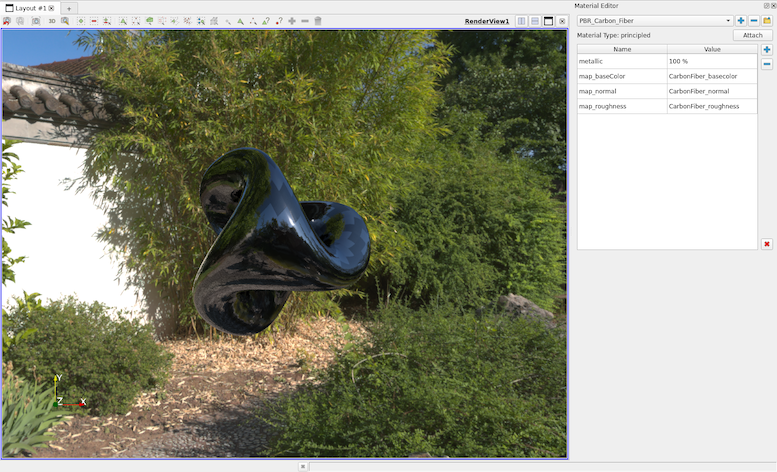

## OSPRay Runtime Detection

ParaView will now detect whether OSPRay is supported at runtime and enable it only if it is. Of note is when using under macOS' Rosetta translation support of `x86_64` binaries on `arm64` hardware.

## "ParaView Community Support" item in "Help" menu now links to discourse.paraview.org

The "ParaView Community Support" link in the "Help" menu will send you to the [ParaView Support Discourse](https://discourse.paraview.org) page to open a new topic or search for an existing one.

# Python scripting improvements

## Improvements to 'LoadState' Python API

When loading `.pvsm` state files in Python using `LoadState` function, it was tricky to provide arguments to override data files used in the state file. The `LoadState` function has now been modified to enable you to specify filenames to override using a Python dictionary. The Python trace captures this new way of loading state files. Invocations of this function with previously used arguments is still supported and will continue to work.

Some examples:

```python
# use data files under a custom directory
LoadState(".....pvsm",
          data_directory="/...",
          restrict_to_data_directory=True)

# explicitly override files
LoadState(".....pvsm",
    filenames=[\
        {
            'name' : 'can.ex2',
            'FileName' : '/..../disk_out_ref.ex2',
        },
        {
            'name' : 'timeseries',
            'FileName' : [ '/..../sample_0.vtp',
                            '/..../sample_1.vtp',
                            '/..../sample_2.vtp',
                            '/..../sample_3.vtp',
                            '/..../sample_4.vtp',
                            '/..../sample_5.vtp',
                            '/..../sample_6.vtp',
                            '/..../sample_7.vtp',
                            '/..../sample_8.vtp',
                            '/..../sample_9.vtp',
                            '/..../sample_10.vtp']
        },
    ])
```

## Python initialization during import

To make creation of various proxies easier, ParaView defines classes for each known proxy type. These class types were immediately defined when `paraview.simple` was imported or a connection was initialized. Creation of these class types is now deferred until they are needed. This helps speed up ParaView Python initialization.

This change should be largely transparent to users except for those who were directly accessing proxy types from the `paraview.servermanager` as follows:

```python
# will no longer work
cls = servermanager.sources.__dict__[name]

# replace as follows (works in previous versions too)
cls = getattr(servermanager.sources, name)
```

## Fetching data to the client in Python

`paraview.simple` now provides a new way to fetch all data from the data server to  the client from a particular data producer. Using `paraview.simple.FetchData` users can fetch data from the data-server locally for custom processing.

Unlike `Fetch`, this new function does not bother applying any transformations to the data and hence provides a convenient way to simply access remote data.

Since this can cause large datasets to be delivered the client, this must be used with caution in HPC environments.

##  openPMD: 1D & 2D Support

The openPMD python module now supports 1D and 2D particle and mesh data.
API changes for openPMD-api 0.13+ were incorporated and several read bugs have been fixed.

# Virtual reality improvements

## OpenVR Plugin improvements

Many updates to improve the OpenVR plugin support have been made in ParaView 5.10:

* Added a "Come to Me" button to bring other collaborators to your current location/scale/pose.

>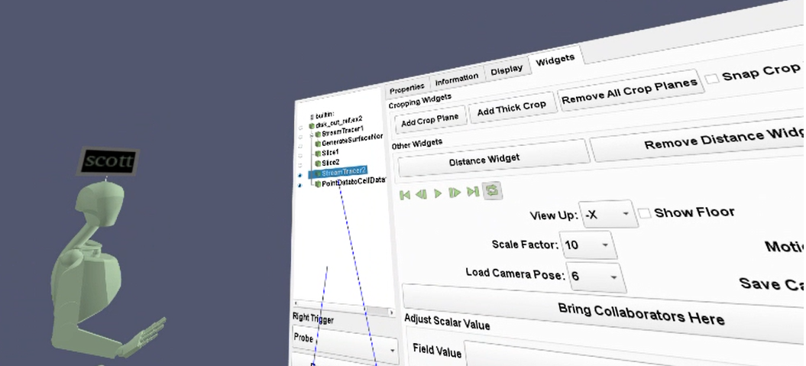

* Fixed crop plane sync issues and a hang when in collaboration.
* Support desktop users in collaboration with an "Attach to View" option that makes the current view behave more like a VR view (shows avatars/crop planes etc).

>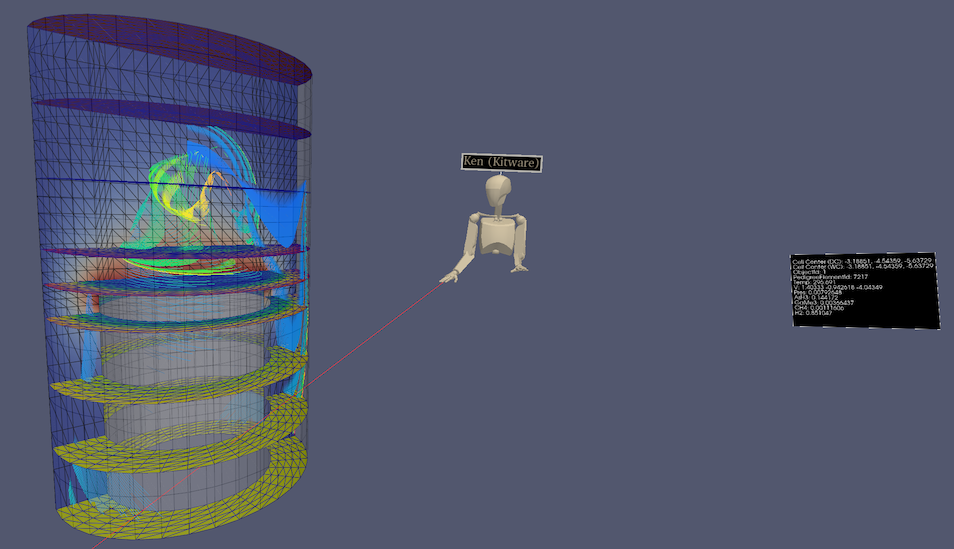

* Added a "Show VR View" option to show the VR view of the user when they are in VR. This is like the SteamVR option but is camera stabilized making it a better option for recording and sharing via video conferences.
* Add Imago Image Support - added support for displaying images strings that are found in a dataset's cell data (optional, off by default).
* Fix thick crop stepping within collaboration.
* Update to new SteamVR Input API, which allows you to customize controller mappings for ParaView. Default bindings for VIVE, HP Motion, and Oculus Touch controllers are provided.
* Add an option controlling base station visibility.
* Re-enabled the option and GUI settings to set cell data value in VR.
* Adding points to a polypoint, spline, or polyline source when in collaboration now works even if the other collaborators do not have the same representation set as active.

## zSpace plugin

A new Microsoft Windows-only plugin named **zSpace** has been added. It adds a new view named **zSpaceView** that let a user interact with a zSpace device directly. This device is designed to work with Crystal Eyes (quad-buffered) stereo, in full screen or in a CAVE display. The zSpace glasses use a head tracking system that allow you to look around 3D object by moving your head.

This plugin requires a [zSpace System Software >= 4.4.2](https://support.zspace.com/s/article/zSpace-System-Software-release-Required?language=en_US), and a SDK version >= 4.0.0.
It was tested on a zSpace 200 device but should be compatible with more recent devices as well.

# Miscellaneous bug fixes and updates

## Icons in macOS 11 style

The icons in macOS 11 Big Sur are in a new unified style, and ParaView's icon has been updated to conform to this style.

## ParaViewWeb

ParaViewWeb now supports `[unsigned] long long` data arrays when retrieving data information.

# Catalyst

## Add Conduit node IO and Catalyst replay executable

To assist in debugging in-situ pipelines, Catalyst now supports `conduit_node` I/O. The `params` argument to each invocation of `catalyst_initialize`, `catalyst_execute`, and `catalyst_finalize` can be written to disk. These can later be read back in using the `catalyst_replay` executable. Please see the corresponding [documentation](https://catalyst-in-situ.readthedocs.io/en/latest/catalyst_replay.html) for more information.

## Better Fortran Catalyst bindings

Fortran bindings to Catalyst APIs has been improved. There is now a `catalyst` and `catalyst_python` module available with namespaced APIs.

## `catalyst` module

* `coprocessorinitialize()` is now `catalyst_initialize()`
* `coprocessorfinalize()` is now `catalyst_finalize()`
* `requestdatadescription(step, time, need)` is now `need = catalyst_request_data_description(step, time)`
* `needtocreategrid(need)` is now `need = catalyst_need_to_create_grid()`
* `coprocess()` is now `catalyst_process()`

The `need` return values are of type `logical` rather than an integer.

## `catalyst_python` module

* `coprocessorinitializewithpython(filename, len)` is now `catalyst_initialize_with_python(filename)`
* `coprocessoraddpythonscript(filename, len)` is now `catalyst_add_python_script(filename)`

# Catalyst 2.0 Steering

Add steering capabilities to Catalyst 2.0, by implementing the `catalyst_results` method in ParaView Catalyst.

With steering, you are now able to change simulation parameters through the ParaView Catalyst GUI. See `CxxSteeringExample` in `Examples/Catalyst2` folder for live example of the feature.

>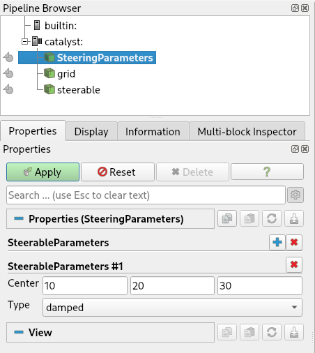

## Catalyst 2.0 TimeValue trigger

A new **TimeValue** trigger option for triggering output through Catalyst 2.0 has been added which is based on the amount of simulation time that has passed since the last output of the specified extract. This trigger option is more appropriate for simulation codes that have variable timestep lengths.

# Support for Polygonal and Polyhedral elements in Catalyst 2.0

Catalyst Adaptor API V2 now supports polygonal and polyhedral elements. This is done by adding support for such elements in `vtkConduitSource`. Two new examples, `CxxPolygonal` and `CxxPolyhedra`, demonstrate how to use Conduit Mesh Blueprint to communicate information about these elements.

## Added support for empty mesh Blueprint coming from Conduit to Catalyst

Catalyst 2.0 used to fail when the simulation code sent a mesh through Conduit with a full Conduit tree that matches the Mesh Blueprint but without any cells or points. This can happen, for example, with distributed data where some of the dataset may be empty on some ranks. When using `vtkUnstructedGrid`s, Catalyst 2.0 now checks the number of cells in the Conduit tree and returns an empty `vtkUnstructuredGrid` when needed.

[More](https://gitlab.kitware.com/paraview/paraview/-/issues/20833)

# Cinema

## Extractor for recolorable images

This release reintroduces the experimental recolorable images generation capability. It is exposed using **Extractors**. A new experimental extractor called **Recolorable Image** is now available. The extractor is experimental and requires specific conditions to work.
# Developer notes

## Changes to `vtkPVDataInformation`

`vtkPVDataInformation` implementation has been greatly simplified.

`vtkPVDataInformation` no longer builds a complete composite data hierarchy information. Thus, `vtkPVCompositeDataInformation` is no longer populated and hence removed. This simplifies the logic in `vtkPVDataInformation` considerably.

`vtkPVDataInformation` now provides access to `vtkDataAssembly` representing the hierarchy for composite datasets. This can be used by application to support cases where information about the composite data hierarchy is needed. For `vtkPartitionedDataSetCollection`, which can other assemblies associated with it, `vtkPVDataInformation` also collects those.

For composite datasets, `vtkPVDataInformation` now gathers information about all unique leaf datatypes. This is useful for applications to determine exactly what type of datasets comprise a composite dataset.

`vtkPVTemporalDataInformation` is now simply a subclass of `vtkPVDataInformation`. This is possible since `vtkPVDataInformation` no longer includes `vtkPVCompositeDataInformation`.

## `ProxyListDomain` support default for group

A proxy list domain containing a group can define a proxy from that group to use as the default. As an example, the following says to use the **SphereSource** as the default proxy for the property to which this `ProxyListDomain` is assigned.

```
    <ProxyListDomain name="proxy_list">
      <Group name="sources" default="SphereSource" />
    </ProxyListDomain>
```

Previously, the default proxy was alphabetically the first in the group.

Most filters using `ProxyListDomain` have been converted to use group and default in order for it to be easier to add a new proxy to a proxy list domain through plugins.

## Example plugin for `paraview_plugin_add_proxy`

A new example plugin **AddPQProxy** has been added to demonstrate how to use the `paraview_plugin_add_proxy` CMake macros (`add_pqproxy` before ParaView 5.7.0).

## Improved documentation mechanism for ParaView plugins

Three new CMake options to the `paraview_add_plugin` function have been added:

 * **DOCUMENTATION_ADD_PATTERNS**: If specified, add patterns for the documentation files within `DOCUMENTATION_DIR` other than the default ones (i.e., `*.html`, `*.css`, `*.png`, `*.js` and `*.jpg`). This can be used to add new patterns (ex: `*.txt`) or even subdirectories (ex: `subDir/*.*`). Subdirectory hierarchy is kept so if you store all of your images in a `img/` sub directory and if your HTML file is at the root level of your documentation directory, then you should reference them using `` in the HTML file.

 * **DOCUMENTATION_TOC**: If specified, the function will use the given string to describe the table of content for the documentation. A TOC is divided into sections. Every section points to a specific file (`ref` keyword) that is accessed when double-clicked in the UI. A section that contains other sections can be folded into the UI. An example of such a string is:
```html
  <toc>
    <section title="Top level section title" ref="page1.html">
      <section title="Page Title 1" ref="page1.html"/>
      <section title="Sub section Title" ref="page2.html">
        <section title="Page Title 2" ref="page2.html"/>
        <section title="Page Title 3" ref="page3.html"/>
      </section>
    </section>
  </toc>
```

 - **DOCUMENTATION_DEPENDENCIES**: Targets that need to be built before actually building the documentation. This can be useful when a plugin relies on a third party documentation generator such as [Doxygen](https://www.doxygen.nl/).

See `Examples/Plugins/ElevationFilter` for an example of how to use these features.

## Javascript support for documentation in Paraview

It is possible to add a `.js` file to a plugins documentation and reference it into an `.html` file. However JS scripts will only be evaluated if `PARAVIEW_USE_WEBENGINE` is activated. Inline scripting using `<script> [...] </script>` is also possible. An example of how to add a documentation folder is available at `Examples/Plugins/ElevationFilter/`.

## Added a complex architecture plugin example

A new example that shows how to create a plugin with a complex architecture is now available.

This new example contains two plugins. One plugin uses multiple internal VTK modules. Both plugins use a third, shared, VTK module.

The example can be found in `Examples/Plugins/ComplexPluginArchitecture`.

## ParaView plugin debugging

New CMake options to debug plugin discovery and building have been added. The `ParaView_DEBUG_PLUGINS`, `ParaView_DEBUG_PLUGINS_ALL`, `ParaView_DEBUG_PLUGINS_building`, and `ParaView_DEBUG_PLUGINS_plugin` flags may be used to enable various logging for plugins.

## Plugin Location Interface

Dynamically-loaded plugins can now get the file system location of the plugin binary file (DLL, shared object) with the addition of the `pqPluginLocationInterface` class and `paraview_add_plugin_location` CMake function. This allows dynamic plugins to include text and/or data files that can be located and loaded at runtime.

## Improvements to `pqProxyWidget`

`pqProxyWidget` is the widget used to auto-generate several panels based on proxy definitions. The class supports two types of panel visibilities for individual widgets for properties on the proxy: **default** and **advanced**. These needed to match the value set for the `panel_visibility` attribute used the defining the property in ServerManager XML. `pqProxyWidget` now has API to make this configurable. One can now use arbitrary text for `panel_visibility` attribute and then select how that text is interpreted, default or advanced, by a particular `pqProxyWidget` instance. This makes it possible for proxies to define properties that are never shown in the **Properties** panel, for example, but are automatically shown in some other panel such as the **Multiblock Inspector** without requiring any custom code. For more details, see `pqProxyWidget::defaultVisibilityLabels` and `pqProxyWidget::advancedVisibilityLabels`.

## Filtering in `pqTabbedMultiViewWidget`

`pqTabbedMultiViewWidget` which is used to show multiple view layouts as tabs now supports filtering based on annotations specified on the underlying layout proxies. Checkout the `TabbedMultiViewWidgetFilteringApp.cxx` test to see how this can be used in custom applications for limiting the widget to only a subset of layouts.

## Decorator to show/hide or enable/disable properties based on session type

Certain properties on a filter may not be relevant in all types of connections supported by ParaView and hence one may want to hide (or disable) such properties except when ParaView is in support session. This is now supported using `pqSessionTypeDecorator`.

## Customizing context menus

ParaView now supports plugins that add to or replace the default context menu, via the `pqContextMenuInterface` class. The default ParaView context menu code has been moved out of `pqPipelineContextMenuBehavior` into `pqDefaultContextMenu`.

Context menu interface objects have a priority; when preparing a menu in response to user actions, the objects are sorted by descending priority. This allows plugins to place menu items relative to others (such as the default menu) as well as preempt all interfaces with lower priority by indicating (with their return value) that the behavior should stop iterating over context-menu interfaces.

There is an example in `Examples/Plugins/ContextMenu` and documentation in `Utilities/Doxygen/pages/PluginHowto.md`.

## Enable customization of scalar bar titles for array names

Settings JSON configuration files can now specify default scalar bar titles for arrays of specific names. In a settings JSON file, a `<custom title> `for `<array name>` can be specified with the following JSON structure:

```
{
  "array_lookup_tables" :
  {
    "<array name>" :
    {
      "Title" : "<custom title>"
    }
  }
}
```

Custom titles can only be read from JSON - this change does not include a mechanism to save custom titles from ParaView.

## Building on Windows with Python debug libraries supported

A new CMake option `PARAVIEW_WINDOWS_PYTHON_DEBUGGABLE` has been added. Turn this option `ON` to build ParaView on Windows with Python debug libraries.

## Improved documentation and CMake handling of OpenGL options

The [documentation](https://kitware.github.io/paraview-docs/nightly/cxx/Offscreen.html) about OpenGL options has been improved. In addition, CMake now checks which options are compatible with each other.

## Force `QString` conversion to and from Utf8 bytes

The practice of converting `QString` data to a user's current locale has been replaced by an explicit conversion to UTF-8 encoding. This change integrates neatly with VTK's UTF-8 everywhere policy and is in line with Qt5 string handling, whereby C++ `string`s and `char*` are assumed to be UTF-8 encoded. Any legacy text files containing extended character sets should be saved as UTF-8 documents, in order to load them in the latest version of ParaView.

## Use wide string Windows API for directory listings

Loading paths and file names containing non-ASCII characters on Windows is now handled via the wide string API and uses `vtksys` for the utf8 <-> utf16 conversions. Thus the concept of converting text to the system's current locale has been completely eliminated.

## Static builds with kits enabled no longer supported

ParaView no longer allows building kits with static builds. There are issues with *in situ* modules being able to reliably load Python in such configurations. However, the configuration does not make much sense in the first place since the goal of kits is to reduce the number of libraries that need to be loaded at runtime and static builds do not have this problem.
