ParaView 5.11.0 Release Notes
=============================

Major changes made since ParaView 5.10.1 are listed in this document. The full list of issues addressed by this release is available [here](https://gitlab.kitware.com/paraview/paraview/-/issues/?sort=updated_desc&state=closed&milestone_title=5.11%20%28Spring%202022%29).

* [New features](#new-features)
* [Rendering enhancements](#rendering-enhancements)
* [Plugin updates](#plugin-updates)
* [Filter changes](#filter-changes)
* [Changes in readers and writers](#changes-in-readers-and-writers)
* [Interface improvements](#interface-improvements)
* [Python scripting improvements](#python-scripting-improvements)
* [Virtual reality improvements](#virtual-reality-improvements)
* [Miscellaneous bug fixes](#miscellaneous-bug-fixes)
* [Catalyst](#catalyst)
* [Cinema](#cinema)
* [Developer notes](#developer-notes)

# New features

## Advanced multi-channel volume visualization

ParaView's user interface now allows you to define and edit 2-dimensional transfer functions for volume visualization of structured data. 2D transfer functions enable the color and opacity of a data sample to be determined by the value of two separate scalar fields. This enables the visualization to compare and contrast spatial features of the two fields. The new functionality also provides for a special mode where a scalar field can be coupled with its gradient magnitude that enhances "edges" in the scalar values.

### 2D histogram

To aid in the definition of 2D transfer functions, it is useful to compute a 2D histogram over the two different scalar fields of choice. This histogram helps highlight areas where interesting relationships between the two fields exist.

ParaView has a new filter called **ExtractHistogram2D** to compute 2D histograms for most types of vtkDataSets over two different data array components or their gradient magnitudes. The output of this filter is a one-component vtkImageData of type double that can be visualized in ParaView's render view as an image slice.

>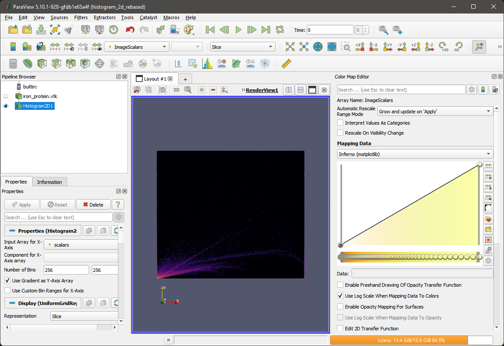
>
> Histogram2D filter

### Transfer Function Editor

When you enable the **Use 2D transfer function** checkbox, the color opacity editor switches to the 2D transfer function editor.

The editor displays the 2D histogram of the chosen scalar field with the number of bins defined by the **Number of histogram bins** property. Changing the number of bins triggers an update to the histogram based on whether or not the **Automatic histogram** property is enabled.

>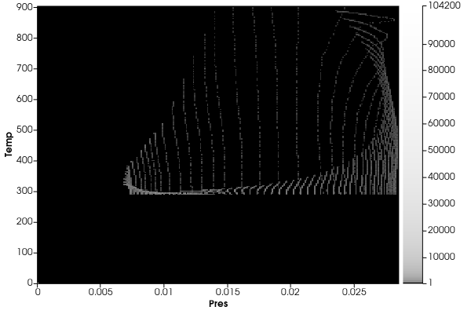
>
> 2D Histogram in ParaView's color opacity editor.

The histogram is displayed as a grayscale image where white indicates the highest density and black indicates lowest density. A legend on the right shows the density range. Hovering over a pixel/point in the histogram shows the data values for the histogrammed arrays as well as the density.

### 2D transfer function editor UI

ParaView's new 2D transfer function editor allows you to generate a 2D transfer function via rectangular regions of interest. You can add as many of these regions as you like to customize the transfer function. Each region is assigned a user-specifiable color and opacity which are distributed in the box area as a 2D Gaussian distribution. These regions can be dragged and resized over the 2D histogram to change the overall function.

Once the 2D transfer function editor is activated, a transfer function box can be added by double clicking anywhere inside the bounds of the histogram. The box can then be moved by left-clicking, holding and dragging the mouse cursor anywhere inside the bounds of the box. The box can be resized by holding and dragging any of the four corners of the box. The color and opacity of the box can be changed by activating the color chooser dialog using the new tool button provided on the right hand side of the editor. A box can be deleted by clicking on it to select it and pressing the *Delete* key on the keyboard.

> 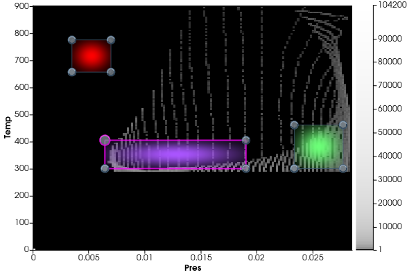
>
> 2D transfer function editor in ParaView showing a 2D histogram of arrays "Pres" vs. "Temp" and three boxes defining 2D Gaussian profiles that define the transfer function.

> 
>
> 2D transfer function applied to simulation data.

### New representation properties

> 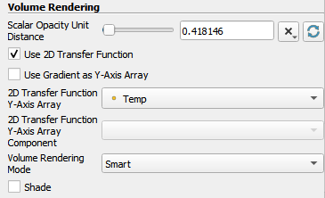
>
> New Properties that control 2D transfer functions

The new properties are availabe in the **Volume rendering** section of the *Properties* panel. They are only visible when the advanced properties option is toggled on. Note that the widget for selecting the Y-axis array is only shown if the option to use gradient is disabled.

## New ParaView Tutorials

Available ParaView tutorials are of two types. The ParaView Classroom Tutorials, are meant for following along with an instructor. The ParaView Self-directed Tutorial has written guidance and background and can be followed independently. Both tutorials are now part of the [ParaView Documentation](https://docs.paraview.org) website.

## Resolution presets for screenshots and animations

The ParaView *Save Screenshot* and *Save Animation* dialogs now allow you to select the resolution from a list of commonly used presets. It is also possible to select the most recently used resolution.

> 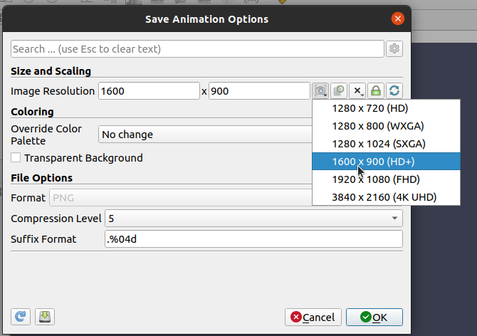
>
> New controls for setting screenshot and animation resolutions

## New **Frame Stride** property when saving animations

The *Save Animation* dialog now has a property that lets you define the stride of the output animation frames, i.e., the number of frames to skip when saving out an animation.

## *Selection Editor*

*Selection Editor* is a new panel that enables saving and combining many selections of different types using a boolean expression.

> 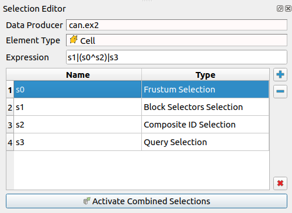

*Selection Editor* has:

1. `Data producer` - a field that is set based on the source of the active selection.
    - If the source of the active selection changes, the Data producer will change as well, and any saved selection will be deleted.
2. `Element type` - a field that is set based on the element type of the active selection.
    - If a selection is saved and a new active selection is made that has a different element type, ParaView will prompt you to decide if you want to change the element type to add the new active selection. Doing so will result in deleting the saved selection.
3. `Expression` - a string you can set, but which is also automatically filled while adding new selections.
4. `Saved Selections` - a table that lists the name assigned to each selection that will be used to define the expression, and the type of the selection. If you choose a selection from the `Saved Selections` table, and the active view is a render view, the selected selection will be shown. When the chosen selection is unchosen, the previously chosen selection is hidden from the render-view.
5. `Add Active Selection` - a button that adds the active selection to the list of saved selections.
6. `Remove Selected Selection` - a button that removes the chosen selection from the list of saved selections.
7. `Remove All Selections` - a button that removes all saved selections.
8. `Activate Combined Selections` - a button that sets the combined saved selections as the active selection.

An example of a combined selection created using the *Selection Editor* is shown below.

> 
>
> ParaView now supports arbitrary combinations of multiple selections.
## Introducing the Expression Manager

Filters like the **Calculator** and **Python Calculator** have a text property that defines an expression to apply. Any one line expression can freely be typed in, but it used to be a strictly manual operation, to be repeated at each filter creation.

ParaView now provides an expression manager to ease this property configuration by storing expressions, and giving quick access to them. Each expression can be named, to help future reuse, and has an associated group so it is easy to filter Python expressions from others.

This feature comes in two parts:

From the `Property Panel`, the one-line property text entry is augmented with:
- a drop down list to access existing expressions
- a "Save Current Expression" button
- a shortcut to the _Choose Expression_ dialog
> 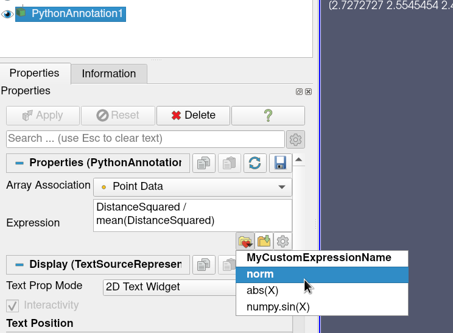

The _Choose Expression_ dialog, also accessible from the `Tools -> Manage Expressions` menu item, is an editable and searchable list of the stored expressions. ParaView keeps track of them through the settings, but they can also be exported to a JSON file for backup and sharing.

> 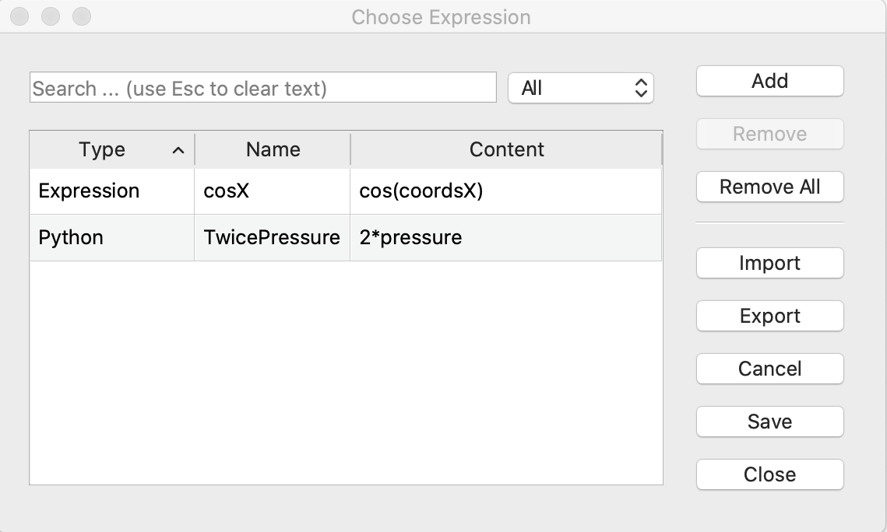

## Server-side timeout command

Previously, the timeout value for a `pvserver` instance is set during its launch (example : ./`pvserver --timeout=60`). The countdown is then handled exclusively by the client, without taking into account possible changes on the server side. ParaView now has a feature that lets you provide a command to the `pvserver` instance, that will be regularly called on the server side to directly ask it the remaining time available (example : `./pvserver --timeout-command="timeoutCommand"`).

## Connection timeout improvements

The current attribute `timeout` in the XML for the **server command** has been deprecated and replaced with `process_wait`. This parameter let you set how long the client will wait for the `exec` content to be run in a process, in seconds.

It was previously:
```
  <Server name="SimpleServer" configuration="" resource="cs://localhost:11111">
    <CommandStartup>
      <Command exec="path/to/server.sh" timeout="3" delay="5"/>
    </CommandStartup>
  </Server>
```

It should now be:
```
  <Server name="SimpleServer" configuration="" resource="cs://localhost:11111">
    <CommandStartup>
      <Command exec="path/to/server.sh" process_wait="3" delay="5"/>
    </CommandStartup>
  </Server>
```

A new `timeout` attribute on the XML of the **server** is now connected to the timeout spinbox in the UI.

This new parameter let you control how long will the client try to connect to the server, in seconds. Default is 60 for standard connection and infinite for reverse connection.

You can now write:
```
  <Server name="SimpleServer" configuration="" resource="cs://localhost:11111" timeout="15">
    <CommandStartup>
      <Command exec="path/to/server.sh"/>
    </CommandStartup>
  </Server>
```

There is new support for aborting connections in all cases (except catalyst). Previously, aborting connections was limited to reverse connections only.

There is support for connection retry in case of timeout on connection.

Timeouts for reverse connections are now supported on the client side only.

## Server connection improvements

There have been multiple improvements to the server connection.

1. When creating a new server, a default name is provided.
1. An issue with SSH server parsing has been fixed.
1. The concept of server name has been added and it is used when available (see below)
1. The concepts of session scheme and session server have been removed (see below)

Server resources can now contains a server name, resulting in the following URI:

```
<connection-scheme>:[//<server-details>]/<path-to-data-file>[#serverName]
```

When available, this server name is now used to list and open recent files and states, favorites folder and differentiate more generally between servers of the same scheme-host-ports URI. When not available, the behavior stays as it was before.

The server resource concept of `session` scheme has been removed and related methods have been deprecated.

This causes a small backwards compatibility issue where `session` recent state files will not be detected. Resetting ParaView's settings (`Edit -> Reset to default settings`) is a simple fix to that.

## Delete all macros, scripts and servers

You can now delete all macros or scripts or servers in one go.

1. To delete all macros, select `Macros -> Delete All`.
1. To delete all Python scripts, open the *Python Script Editor* (`Tools -> Python Script Editor`), then go to `Scripts -> Delete All`.
1. To delete all user server configurations, go to the *Choose Server Dialog*, click on the *Delete All* button.

ParaView will ask for a confirmation before deleting all items to prevent an accidental wipe of all items.

> 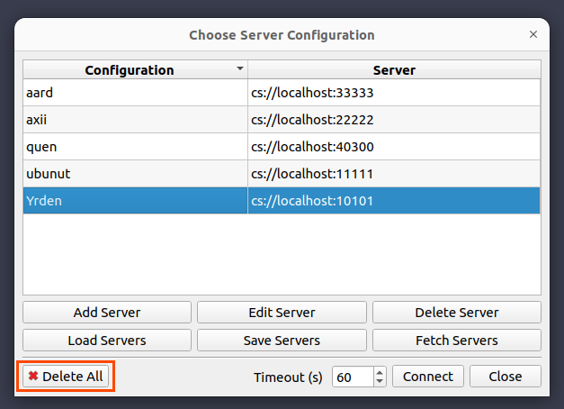
>
> New "Delete All" button in the _Choose Server Configuration_ dialog.

## Options for removing layers when growing selections

Two new **Render View** settings have been added to control whether or not to remove layers when growing selections:

* **Remove seed on grow selection**: controls whether to remove the initial selection seed to grow from.

* **Remove intermediate layers on grow selection**: controls whether to remove the intermediate selection layers when growing a selection.

When enabling both, only the last layer is shown.

## **Transfer Function Reset Mode** removed from General Settings

You can now set the automatic rescale mode for the color transfer function only in the color editor. The  confusing equivalent setting in the General group has been removed.


# Rendering enhancements

## Volume rendering with scattering model

A newly implemented alternative illumination model is based on the physical behavior of light: while traversing a medium, photons can either be absorbed by matter or scattered in another direction. Both types of events are controlled by material-dependent properties. Absorption and out-scattering with the volume’s opacity are associated because both correspond to the light’s extinction inside the volume. In-scattered light is modeled by evaluating the light coming from secondary rays. The existing ray marching algorithm was augmented by adding a single secondary ray. At every sample point, a secondary ray is shot towards each light source and the light transmitted along each ray is estimated. The resulting quantity is integrated at each sample point and scattered using a Henyey-Greenstein phase function.

A new volume rendering property called **Global Illumination Reach** has been added. It is a value between 0 and 1, and it acts as a trade-off between realism and performance. More precisely, it controls the extent of the secondary ray: a value close to 0 will result in very short secondary rays (less realistic, only ambient occlusion, but faster), whereas a value close to 1 will result in long-extent shadow rays (more realistic, but slower).

> and new volume rendering mode with scattering (right).")
>
> Comparison between the former volume rendering shading model (left) and the new one with scattering (right) on a medical dataset of a human thorax.

## New Palette Backgrounds

Palette backgrounds have been reorganized and a few new palettes have been introduced.

- "Gray Background" is renamed "Blue Gray Background (Default)"
- "Default Background" and "Print Background" have been removed (they were duplicates of "Blue Gray Background" and "White Background" respectively)
- "Warm Gray Background", "Neutral Gray Background" and "Light Gray Background" are newly added palette backgrounds.

## Added a new representation logo in the Chart View

It is now possible to add a logo in a Chart View. Previously, the **Logo Source** could only be used with **Render View** and other 3D views.

> 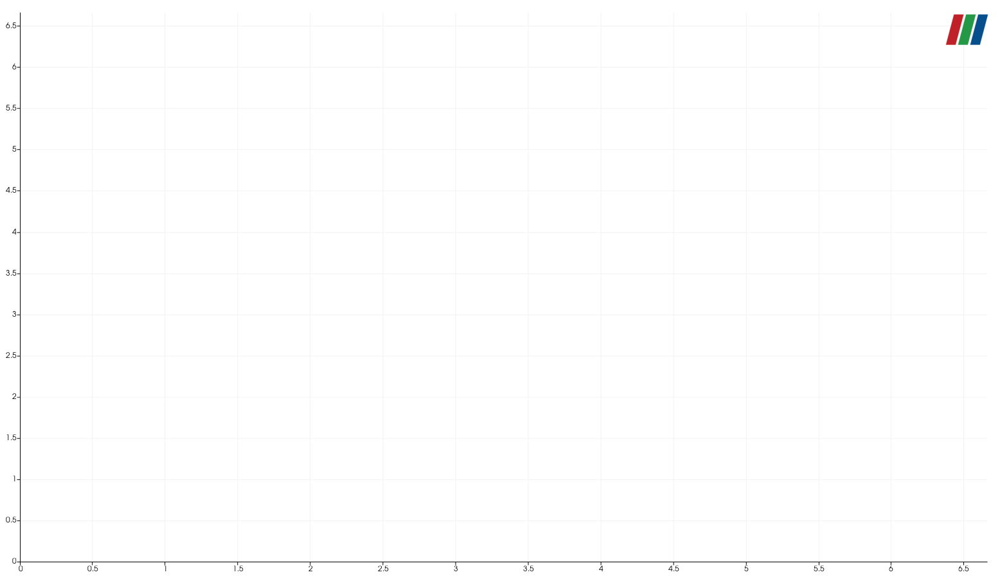
>
> An example of a logo in a Chart View.

## Add opacity controls to chart elements

Plots elements now have an opacity property that can be set.

The parameter is exposed in all chart representations based on the `vtkXYChartRepresentation` class: `Line Chart`, `Point Chart`, and `Bar Chart` representations.

> 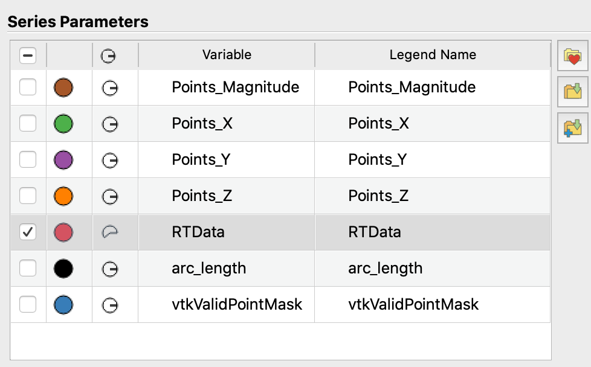
>
> New chart opacity controls.

## Hyper Tree Grid Representation

A new representation has been added that behaves like the **Geometry Representation** by default and adds three new modes for 2-dimensional Hyper Tree Grid (HTG) datasets:

- HTG Surface
- HTG Surface With Edges
- HTG Wireframe

When using these modes, if the **Camera Parallel Projection** property is enabled in the view and the HTG is 2-dimensional, the **Adaptive Decimation** filter is used to map only the part of the HTG that is visible on the screen to enhance rendering performance.

## Support for hyper tree grids in additional filters

Hyper Tree Grid datasets are supported in more filters:

- **Plot Over Line**
- **Gradient** - the gradient computation is based on an implicit dual. This behavior regarding cells of different levels is still to be improved.
- **Python Calculator**
- **Calculator**
- **Programmable Filter**

## Added a setting to toggle VTK-m filter overrides

ParaView now supports overriding certain filters such as **Contour**, **Gradient**, **Cell Data to Point Data**, and **Point Data to Cell Data** with VTK-m accelerated versions of those filters. A new ParaView General setting **Use Accelerated Filters** controls whether overrides are enabled.

## Isometric view direction in ParaView

You can now apply an isometric camera view direction from the camera toolbar in ParaView.

> 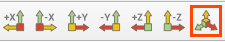
>
> New isometric view button.

## Color legend background properties

Color legends may now have a background drawn behind the color legend components. The color and opacity of the background can be specified, as can padding around the color legend components and the edge of the background.

Additionally, an outline around the scalar bar can now be displayed. The scalar bar outline's color and thickness can be set via newly added properties.

Properties for the new addition have been added to a new *Appearance* group in the *Edit Color Legend Properties* dialog. The previously existing properties controlling the thickness and length of the scalar bar have been added to this group as well.

>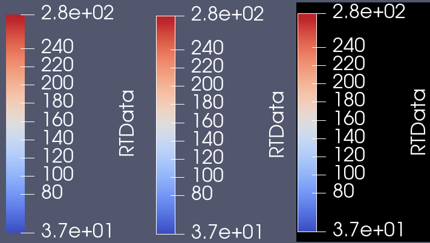
>
> New display properties for color legends. Left: existing display. Middle: scalar bar outline enabled. Right: Background set to black and scalar bar outline enabled.

>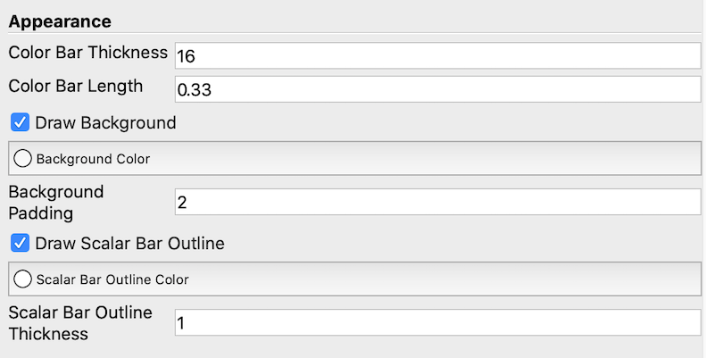
>
> Controls for new color legend display properties.

## New option in color legends to show displayed range values

The range values of the visible scalar fields can now be displayed on color legends. To do so, click on the "Edit Color Map" icon, then in the new menu, click on the "Edit color legend properties" icon. If the checkbox **Show Range** is on, then the range will be printed next to the color bar.

The range printed consists of a Min value and a Max value. The Min value (Max value) is the minimum (maximum) value of all combined arrays that share the same name and are visible in the view, i.e., those with an open eyeball in the *Pipeline Browser*.

## Logo window location

A **Window Location** property has been added to the **Logo Representation** to position the logo more easily at different locations in the window.

## Save OSPRay materials in the material editor

You can now save the materials created in the **Material editor** using the "Save materials" button. All materials are written in a new single json file. See https://gitlab.kitware.com/paraview/materials/blob/master/ospray_mats.json for an example.


# Plugin updates

## ParaView Node Editor

Integration of the project https://github.com/JonasLukasczyk/paraview-node-editor

This plugin contains a node editor for ParaView that makes it  convenient to modify filter and view properties, filter input and output connections, as well as control the visibility of outputs in views. The editor is complementary to the existing ParaView widgets such as the _Pipeline Browser_ and the _Properties_ panel. They can be used simultaneously.

> 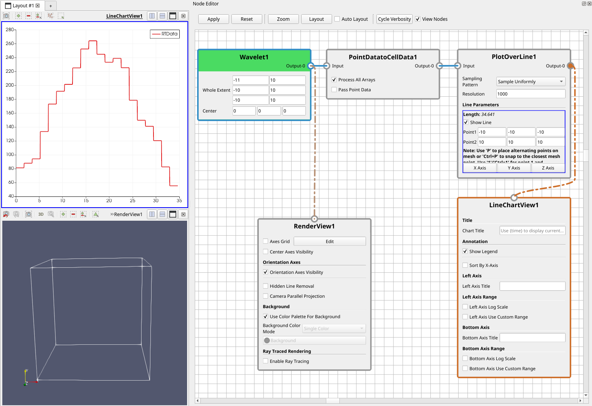
>
> A simple pipeline represented in the Node Editor plugin's interface.

## SpaceMouseInteractor plugin to control the camera with a SpaceMouse

The new SpaceMouseInteractor plugin enables ParaView to connect to a SpaceMouse-style device from 3DConnexion if it is available, and use it to manipulate the camera in the active **Render View**. The 3Dconnexion Settings app provided with the device driver can be used to change the style of interaction from object-centered to camera-centered (flying). This feature works on Windows and Mac only.

## Parametric Surfaces plugin

This new plugin expose most of parametric surfaces from VTK in a single source called "Parametric Surfaces". The surfaces have many parameters to control the generated surfaces and support to generate texture coordinates.

## CDI Reader plugin updates

The CDI reader plugin now uses CDI version 2.0. Also, CDI is now an external dependency so building this plugin requires obtaining libcdi (see https://gitlab.dkrz.de/mpim-sw/libcdi).

## Plugin loading on connection

Instead of showing the *Plugin Manager* on connection when plugin requirements are not satisfied, the *Plugin Manager* will now try to load server plugins if they are available. If not, the behavior is the same as before.

## Looking Glass plugin

### Apple M1/ARM64 support

The Looking Glass plugin is now available on Apple Macintosh systems with ARM64 processors.

### Additional device support

The Looking Glass plugin now supports portrait devices and target device selection. Target device selection enables you to save quilt images and movies for a different device than the one currently connected, meaning it is possible to make quilts for devices you cannot access directly.n the one currently connected, meaning it is possible to make quilts for devices you cannot access directly.

# Filter changes

## **Rename Arrays** filter

The **Rename Arrays** filter allows renaming arrays from any dataset. Data arrays are shallow copied so there is no memory increase using this array (note that string arrays are still deep copied).

## Add Table support for the **Python Calculator**

Table data inputs are now accepted in the **PythonCalculator** filter. Basic Python operations can be performed on the columns of one or multiple input table(s). If the **Copy Arrays** property is enabled when the result of the Python operation happens to be a scalar value, the output will be a column whose values are all set to this scalar result. When using multiple input tables, the data may be accessed using the syntax : `inputs[0].RowData["column"] `.

## Improve performance of box clipping with exact flag on

The `Clipping` filter has been sped up overall. Box clipping with the `Exact` property turned on has been significantly sped up using a smart strategy for determining the order of clips to apply.

## New **Compute Connected Surface Properties** filter

**Compute Connected Surface Properties** is a new filter that enables computation of surface area, volume, and centroid of individual objects in an input polygonal dataset.

## New **Extract Cells By Type** filter

This new filter enables cell extraction based on cell type (i.e. triangles, hexahedra, etc.). More than one type of cell can be selected for extraction via checkboxes.

## Add a **Generate Time Steps** filter

A new **Generate Time Steps** filter that adds time steps on any input data, ignoring input time steps if any. Example usage for this filter is to create timesteps on non-temporal sources to enable use of the **Particle Tracer** filter.

## New Threshold Table filter

The *Threshold Table* filter is now available to perform four different thresholding operations. Its input properties are:

- **Column** : Specifies which column to use for thresholding.
- **Min Value** : Lower bound of the thresholding operation.
- **Max Value** : Upper bound of the thresholding operation.
- **Mode** : Specifies one of the four available thresholding methods.

The four different modes are:

- **Below Max Threshold** : Accepts rows with values < MaxValue
- **Above Min Threshold** : Accepts rows with values > MinValue
- **Between** : Accepts rows with values > MinValue and < MaxValue
- **Outside** :  Accepts rows with values < MinValue and > MaxValue

## Improvements to **Particle Tracer**, **Particle Path**, and **StreakLine** filters

These filters have the following improvements:

1) The filters are now multithreaded. Multithreading is used when there is only one MPI process, and the number of particles is greater than 100.
1) They now have an **Interpolator Type** property which can either use a cell locator (default) or a point locator for interpolation.
1) Instead of the **Static Mesh** flag, they now have the **Mesh Over Time** flag which has the following values:
   1) "Different": The mesh is different over time.
   1) "Static": The mesh is the same over time.
   1) "Linear Transformation": The mesh is different over time, but it is a linear transformation of the first time-step's mesh.
   1) "Same Topology": The mesh is different over time, but it preserves the same topology (same number of points/cells, same connectivity).
      1) For cell locators, this is equivalent to when **Mesh Over Time** is set to **Different**.
      2) For point locators, this flag internally reuses the same cell links.

## **Extract Particles Over Time** filter

ParaView now provides the **Extract Particles Over Time** filter to extract particles passing through a volume over time.

The filter has two inputs: Particles and Volume. The Particles input should contain points evolving over time and the Volume input is expected to be a volumetric dataset.

The output is a subset of the particles from the input, still temporal.


## Improvements to Slice filters

Slice filters have the following improvements:

- **Slice With Plane** now supports `vtkHyperTreeGrid` and `vtkOverlappingAMR` inputs.
- **AMR CutPlane** has been deprecated, because it has been integrated inside the **Slice With Plane** filter. Use the **Slice With Plane** filter with **Plane Type** property set to "Plane" to achieve the same functionality.
- **Slice AMR data** has been deprecated, because it has been integrated inside the **Slice With Plane** filter. Use the **Slice With Plane** filter with **Plane Type** type set to "Axis Aligned Plane" to achieve the same functionality.
- **Slice With Plane**'s performance has been significantly improved for inputs of type `vtkStructuredGrid`, `vtkRectilinearGrid` `vtkUnstructuredGrid` with 3d linear cells, and `vtkPolyData` with convex cells.
- **Slice with Plane** now supports the generation of polygons for `vtkImageData`.
- **Slice With Plane** now has a **Merge Points** property to specify if output points will be merged.
- **Slice** performance has been significantly improved because it delegates to **Slice With Plane**, whenever possible.

## Updated **Mesh Quality** filter metrics

The **Mesh Quality** filter now supports wedges and pyramids cell types and has additional metrics for the existing cell types. Moreover, it has been multithreaded.

## New filter for finite element field visualization

The new **Finite Element Field Distributor** filter can be employed to visualize Discontinuous Galerkin (DG) finite element fields of type H(Grad), H(Curl), and H(Div).

Note that all cells must be of the same type and the field data must contain a `vtkStringArray` describing the DG fields, basis types, and reference cells. Currently, the IOSS Exodus reader is the only one that produces this field data array.

## Backward time property in **Temporal Particles Path Lines** filter

The **Temporal Particles Path Lines** filter now can compute particles lines when you set the time backward. The new behavior can be activated by checking the **Backward Time** checkbox (advanced property).

# Changes in readers and writers

## File extension case insensitivity

ParaView's file reader selection mechanism now ignores the case of file extensions.

## VTKHDF files

A new [VTKHDF file reader](https://kitware.github.io/vtk-examples/site/VTKFileFormats/#hdf-file-formats) specific to VTK datasets is now available. In this version, the VTKHDF reader supports serial and parallel image data and unstructured grid and serial Overlapping AMR support. One format supports both serial and parallel processing and only one extension (.hdf) for all VTK data formats. For HDF AMR datasets, it is possible to select the maximum number of level to read for HDF AMR in the same way the classic `.vth` file reader.

## IOSSReader improvements

### New Displacement Magnitude property

If the IOSSReader detects the displacements array, you can now scale those displacements by specifying a displacement magnitude. The default value is 1 (no scaling).

### Vector array control properties

You can now toggle the **Group Numeric Vector Field Components** property from the IOSSReader property panel. You can also specify a string for the **Field Suffix Separator** property that is interpretted as the string that separates the vector field name from the index of the component the array provides.

When **Group Numeric Vector Field Components** is

1. ON - numeric suffices are treated as the components of a vector. The names field_1, field_2, field_3 will result in a 3-component vector field named "field".

1. OFF (default) - numeric suffices are not treated as components of a vector. The names field_1, field_2, field_3 will result in three scalar fields named "field_1", "field_2", and "field_3".

By default, the IOSS reader ignores real[n] fields and the field suffix separator is empty.

### Show Exodus block ids in the *Properties Panel*

Exodus files have block/set ids, in addition to optional custom names. When these custom names were present, it was not clear which name corresponded to which id in the file. To help with this, the IOSS reader now shows block/set ids in the Blocks/Sets selection widgets shown on the *Properties Panel*.

> 
>
> The _Properties Panel_ now shows block IDs from the IOSS Reader.

## IOSS writer for Exodus files

An initial version of IOSS writer that uses the IOSS library to write Exodus files is now available. The writer is used when writing files with extensions `.exo`. The writer is not fully functional yet, for example, it does not support serializing other entity blocks / sets besides element blocks, node sets and side sets. Once these capabilities are added and the writer goes though some aggressive testing, this will replace the Exodus writer for all Exodus files. Until then, the current version should be treated as a beta-release.

## EnSight Case Gold reader additional extension added

Added recognition of `.encas` file extension for the Ensight Case Gold reader.

## Parallel Ensight readers no longer generate GlobalIDs

Generation of a "GlobalNodeId" array in the parallel versions of the Ensight Gold and Binary readers can lead to duplicate IDs. These duplicate IDs could make some filters, such as the **Ghost Cell Generator** and **Redistribute Dataset**, crash afterward.

Because creating global IDs in the readers is not needed anymore, we remove it to resolve the problem.


## CGNS Reader can now read face data

It is now possible to read either cell or face-centered data arrays in CGNS files describing meshes with 3D cells. This is done by considering the 3D cells or the 2D faces (e.g., one cell versus six faces for a cube), respectively.

Note that the element connectivity in the CGNS file must be defined with element type `NGON_n` to construct face-based meshes. Data arrays should then be defined with `GridLocation_t` either set to `CellCenter` or `FaceCenter`, respectively. Note: the `FaceCenter` location is an unofficial extension of the [CGNS standard](https://cgns.github.io/).

The location of the data to read can be selected using the combo box **Data Location** in the *Properties* tab when reading a CGNS file. The available options are "Cell Data" or "Face Data", respectively. Note that the default value is "Cell Data", which corresponds to the previous default behavior.

## OpenVDB reader

It is now possible to read `.vdb` files containing grids or point sets. This offers the ability to open volumetric datasets exported from popular animation software such as [Blender](https://www.blender.org/) or [Maya](https://www.autodesk.com/products/maya/overview).

## Nastran Bulk Data reader

A new reader adds support for the Nastran Bulk Data file format (`.bdf` extension). Only a subset of the "free field format" is now supported, including the following keywords: `GRID`, `CTRIA3` and `PLOAD2`.

## openPMD particle time series support fixed

Particle time series support was fixed for the openPMD Python module. Previously, when meshes were deselected, particle time updates did not work anymore.

## Display Sized Plane Widget

ParaView has a new plane widget which replaces the old plane widget.

> 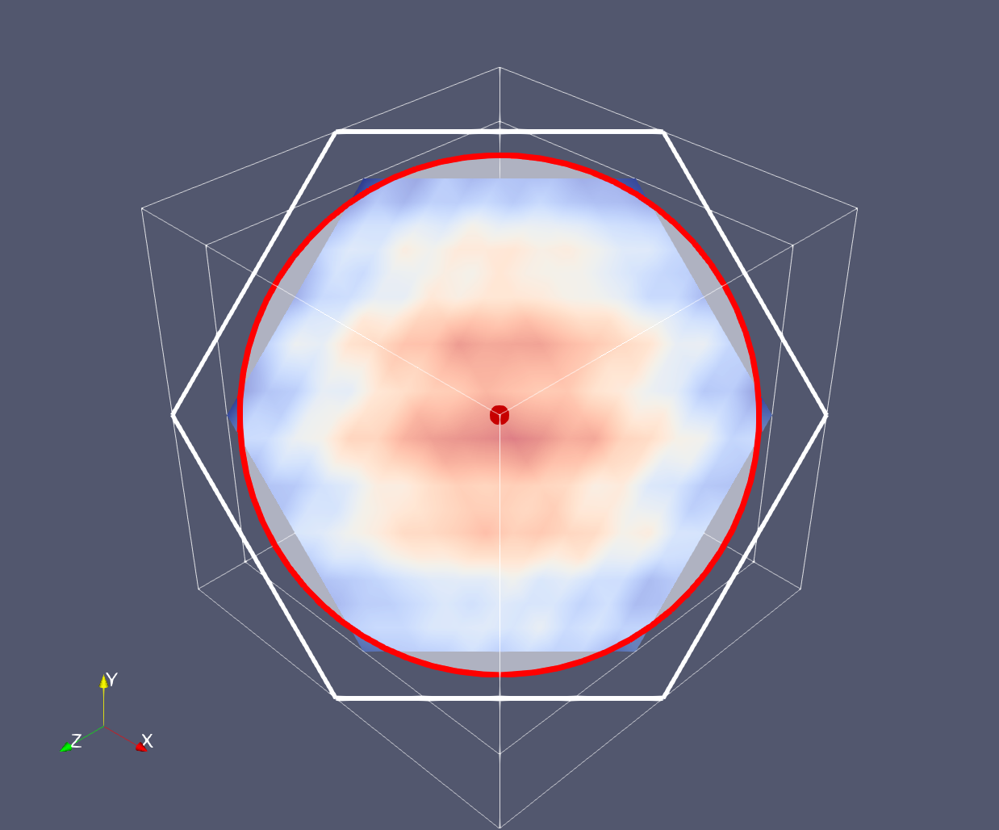
>
> The new plane widget defining a slice plane.

## Add block selection to writers

When saving VTK XML file writers for multiblock datasets (`.vtm`), partitioned dataset collections (`.vtpc`), and uniform grid AMR datasets (`.vthb`), you can choose which blocks to write with a new block selector in the *Configure Writer* dialog.

## CSV writer time improvements

The CSV file writer is now a time-aware writer, and it can write all time steps in a single file or separate files (the default is a single file). Additionally, it can now write a column with the timestep values (the default is off).

## CGNS writer improvements

The CGNS writer can now handle partitioned datasets that are empty. In addition, the writer can now handle writing all steps of a dataset in different timesteps files which can be read by the CGNS reader.

## New capabilities in *Resample With Dataset*

- Hyper tree grids can now be used as sources for resampling with datasets.

- A new property named **Snap To Cell With Closest Point** allows you to snap a point to the cell with the closest point if no cell has been identified as containing the point. This property is only useful when the source is a `vtkPointSet`.

# Interface improvements

## Keep **Output Messages** window closed for new messages option

A checkbox is now provided in the _Output Messages_ window to keep it closed when there is a new message available. This can prevent the annoying behavior of the _Output Messages_ window popping up for repeated warnings that can be safely ignored. ParaView disables this checkbox when the *Output Messages* window is docked and the window remains open regardless of the option's value.

> 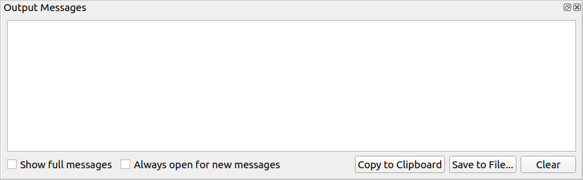

## **Output Messages** window now cleared on session reset

ParaView now clears the contents of the *Output Messages* window when you reset the session.

## Movement constraint on interactive widgets in 3D view

When using interactive widgets in the 3D view (**Line Source**, **Plot Over Line**, **Stream Tracer**, etc.) it is now possible to lock the movement of the widget along the X, Y or Z axis by pressing the 'x' , 'y' or 'z' key, respectively, while interacting with the widget.

With the line widget it is also possible to constrain its movement along the vector of its own direction using the `l` (for **L**ine) key.

## Default readers setting for the file dialog

When opening some file formats, ParaView needs help to determine which reader to use. A new setting keeps track of the preferred reader to use when reading a file that matches a particular pattern. The preferred reader can be set when choosing the reader in the _Open Data With..._ dialog. This setting is editable in the "Miscellaneous" settings.

## New _Pipeline Browser_ context menu options

You can now change the file of a reader by right-clicking on it in the *Pipeline Browser*, and then clicking on `Change File` in the menu.

A `Delete Downstream Pipeline` option has been added to the context menu and _Edit_ menu. When selected, this will delete the selection and all downstream filters, eliminating the need to delete each filter individually.

> 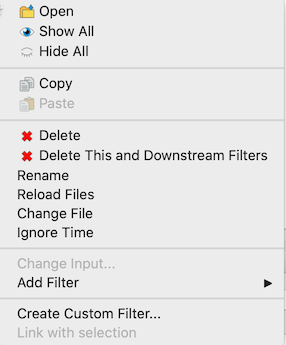
>
> The "Delete Downstream Pipeline" and "Change File" items are new options in the _Pipeline Browser_ context menu.

## Light Controls toolbar

There is now a new toolbar for lighting. This toolbar currently contains only a button to enable/disable the light kit.

> 
>
> The _Light Controls_ toolbar.

## Camera animation improvements to track creation and editing

New options in the _Animation Keyframes_ editors, leading to:
 - more flexible camera modes while keeping previous features
 - easier camera configuration in interpolation mode

Camera animation track modes are now available as follows:

### Follow Path
Each keyframe defines a control point on a spline for camera position, and an independent one for the camera's focal location. An orbit (i.e. a circle) can be configured from the _Animation Keyframes_ editor instead of upon track creation. By default, the orbit path is defined by points around the selected source from current camera.

### Follow Data
The camera is moved so its focal point is set to the center of the data selected in the _Pipeline Browser_. No keyframes are defined in this mode.

### Interpolate cameras
Each keyframe is a camera. The animation interpolates between cameras, either with spline or line depending on whether the **Spline Interpolation** option is enabled in the _Animation Keyframes_ dialog. Buttons in the _Animation Keyframees_ provide ways to set keyframe positions from the current camera position.

By implementing these new options, it was possible to simplify the camera cue creation menu in the _Animation View_. The previously available options and the way to create them now are detailed below:

 - "Orbit": Use the "Follow Path", double click the track, and the click the "Create Orbit" button from the _Animation Keyframes_ dialg to setup an orbit on the current keyframe.
 - "Interpolate camera locations (spline)": Use "Interpolate cameras". It uses spline by default.
 - "Interpolate camera locations (linear)": Use "Interpolate cameras", and uncheck the **Spline Interpolation** option in the _Animation Keyframes_ dialog.

## Reverse button in VCR toolbar

You can now reverse the playback of animations back to the beginning.

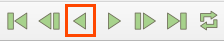

## Tooltip to clipboard support

Hover selection modes (Hover cells on and Hover points on) now support to copy the content of the tooltip to the clipboard by pressing Ctrl+C.

## Zoom to data actions now consider the visibility of the source and blocks

The "Zoom To Data" actions ("Zoom To Data" and "Zoom Closest To Data") now consider the visibility of the source and its blocks. If only some blocks of the source are visible, then the "Zoom To Data" zooms based on only the bounding box of the **visible** blocks, only in builtin and remote rendering mode.

In addition, the "Zoom To" button is now disabled when the active source is not visible.

## MultiBlock Inspector highlight property

A new setting **Select On Click In Multi Block Inspector** has been added to ParaView. Turning off this setting changes the behavior of the *MultiBlock Inspector* (and potentially similar Widgets) so that clicking on a block no longer selects it.

## Setting to reverse mouse wheel zoom direction

You can now change the direction of the mouse wheel for zooming in and out by enabling the **Reverse Mouse Wheel Zoom Direction** checkbox in the Camera settings.

> 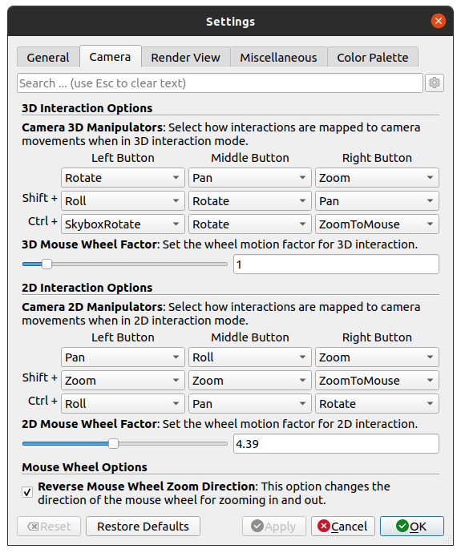

## Mouse Wheel Zooms To Cursor Position setting

You can now use the mouse wheel to zoom in to or out from the projected point under the cursor position without holding down the control key by enabling the **Mouse Wheel Zooms To Cursor** checkbox in the *Settings* dialog.

> 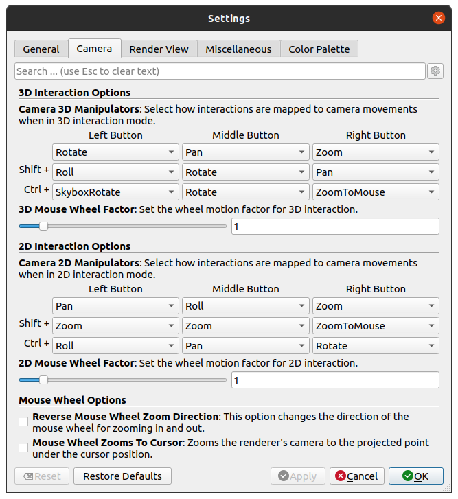

## Memory information in the status bar

ParaView's status bar now displays the memory status of the server process with the highest memory usage in terms of percentage of total memory. This is similar to what is displayed in the *Memory Inspector* but is intended to be more visible to more readily identify when the server is under high load.

> 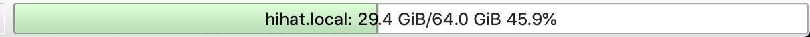

## Button to extract blocks in *MultiBlock Inspector*

The *MultiBlock Inspector* now has a button that adds an **Extract Blocks** filter that is initialized to the blocks selected in the dialog.

> 

## MultiBlock Inspector window title

*Multi-block Inspector* has been renamed  to *MultiBlock Inspector*.

## Colormap editing interaction change

To edit the color of a color transfer function node in the _Color Map Editor_, press the Enter (or Return) key when the node is selected. The previous bug-prone way to edit the node color involved a mouse double click.

## Improved directory mode for save file dialog

When you save files into directories, ParaView presents a much clearer dialog to select the output directory.

When the file dialog is in directory mode:
- The "File name" label has been renamed to "Directory name" and the unnecessary "Files of type" combo box does not appear.
- Although the files are visible, they are neither selectable nor editable. This is useful for when you want to see the saved files in the directory.

## Improvements to Favorites in file dialogs

Some improvements have been made to the favorites list in file open and saving dialogs:

- The "-" button to remove a favorite has been removed because it only removed the current directory and not the selected directory in the favorites list.

- You can remove multiple favorites by selecting multiple directories in the favorites list and using the delete shortcut (Delete key) or right clicking on a selected directory and selecting "Remove from favorites".

- You can now use a new search bar above the list of favorites to filter the listed directories.

## Create folder button removed from open file dialog

When opening input file(s) from paraview file dialog, the "Create a new folder" tool button is now no longer shown.

> 

## Interactive 2D widgets and the equalizer filter

ParaView now has the needed code base to support interactive widgets in context views such as the **Line Chart View**. One of the first filters using this feature is the **Equalizer Filter**.

Here is an example of what you can do using the **Equalizer Filter** in ParaView:

Source data:


After applying the filter:


See the [discourse thread](https://discourse.paraview.org/t/is-there-any-abilities-to-add-a-interactive-widgets-on-linechartview-same-as-3d-widgets-on-renderview/2273) for background on the development of this feature.


# Python scripting improvements

## File globbing utility in ParaView Python scripting

You can now glob file patterns using the `paraview.util` package in Python. The function is called `paraview.util.Glob(path, rootDir = None)`. This can be especially useful in a client/server connection to fetch a list of file sequences available on the server that match a wildcard expression.

As an example of its usage, assume that one holds a the list of files `file0.png`, `file1.png` in the current working directory.

```python
>>> import paraview.util

>>> glob = paraview.util.Glob(dirPath + "file*.png")
>>> print(glob)
```

This script will print

`[file0.png, file1.png]`

Any expression supported by the Python package `fnmatch` is supported.

## Python package version info

The `paraview` package now has a `__version__` attribute that contains the ParaView version that is loaded. In addition `__version_full__` contains the full ParaView version string (including any git information).

## Set compatibility version in Python state files

ParaView now includes the backward compatibility version when writing Python state files (`*.py`).


# Virtual reality improvements

## VR plugin name changes

The OpenVR plugin is now named the XRInterface plugin, and the VRPlugin is now called the CAVEInteraction plugin.

## OpenXR support in the XRInterface plugin

The XRInterface plugin now supports the OpenXR and OpenVR standards on Windows using SteamVR and on linux using the Monado OpenXR runtime. Which runtime to use when the "Send To VR" button is clicked is a selectable.

## Changed default behavior in XRInterface plugin

The starting trigger action when launching XR mode has been changed from **Probe** to **Pick**.

Additionally, the starting orientation of the scene has been changed so that the **View Up** direction is now **+Y**, which is more commonly used e.g. with skyboxes.


## VR movement style in XRInterface plugin

Two movement styles for VR interactions are now available in the VR menu. The first one is named "Flying" and was the default style until now. You can move in the scene according to the direction of the controller (the left one by default) by pushing the joystick up or down. The second one is named "Grounded". It allows you to move on the `XY` (ground) plane using the four directions of the joystick (the left one by default), according to the view direction of the headset. You can also modify the elevation of the scene by pushing the right joystick (by default) up or down.


# Miscellaneous bug fixes


# Catalyst

## Field Data in Catalyst 2

Catalyst now supports field data on meshes. In the conduit node, fields should be defined under the `state/fields` node of the mesh. The name of the sub-node will be the name of the field array. String values and numeric arrays, including [MCArray Blueprint](https://llnl-conduit.readthedocs.io/en/latest/blueprint_mcarray.html), are supported.

## Conduit module has moved to VTK and Catalyst is now an external dependency

The `VTKExtensions/Conduit` module is now part of VTK, as `IO/CatalystConduit` module. The `vtkDataObjectToConduit` converter is integrated into this module instead of its prior `Clients/InSitu` location.

As a side effect, `Catalyst` (our `Conduit` provider) is no more a ThirdParty of ParaView but instead an external dependency of VTK.

The CMake option `PARAVIEW_ENABLE_CATALYST` controls the build of the VTK module and of the ParaView Catalyst implementation (default OFF). A local build of [Catalyst](https://gitlab.kitware.com/paraview/catalyst) should be provided (via `cmake -Dcatalyst_DIR`).

## Enable Catalyst to use Fides Reader

Catalyst can now use the Fides reader, when using the ADIOS2 Inline engine. Documentation for using ParaView Catalyst with the Fides reader is located in the [Fides User Guide](https://fides.readthedocs.io/en/latest/paraview/paraview.html).

## Allows `vtkConduitSource` to output MultiBlock datasets

The `vtkConduitSource` can optionally convert its output to a `vtkMultiBlockDataSet`.

The ParaView Conduit Blueprint protocol now supports an optional `state/multiblock` integer node inside the global or channel nodes. When it exists and set to a integer other than 0, the `vtkConduitSource` is setup to output multiblock.

## catalyst no longer deadlocks if not used on all MPI ranks

A bug that causes a deadlock if catalyst is not used on all MPI ranks has been fixed. This MR fixes the issue: https://gitlab.kitware.com/paraview/paraview/-/issues/21414


## CGNS extractor

ParaView now provides a **CGNS** extractor to save data to CGNS files.

## Python trigger for extractors

Extractors now support a trigger type which allows users to invoke Python scripts to determine if the extractor should be activated or not. This allows for more flexible triggers than the simple time or timestep based triggers supported previously.

## Add Frame Parameters for Save Extracts

The `Save Extracts` dialog now has **Frame Window** and **Frame Stride** properties that allow you to limit the timesteps extracted and select how many frames to skip between each frame. These are global settings that apply to all extractors, and are separate from the **TimeStep** and **TimeValue** trigger properties of individual extractors.

# Cinema

## cinemasci module update

The cinemasci Python module has been updated to commit [e7666713](https://github.com/cinemascience/cinemasci/commit/e7666713).


# Developer notes

## Added a `readerSet` parameter to `pqLoadDataReaction::loadData`

The useful `pqLoadDataReaction::loadData` function now has a `readerSet` parameter to limit the the proposed types of file readers shown to you.

## Freeform text recording in Python traces

ParaView client applications may need to trace actions that do not fit the ParaView pattern of simple function calls or proxy methods. Other patterns are now supported using the new `TraceText` item with the `SM_SCOPED_TRACE` macro. For example:

```
SM_SCOPED_TRACE(TraceText)
  .arg("op = opMgr.createOperation('smtk::session::mesh::Read')\nresult=op.operate()")
  .arg("comment", "Setup SMTK operation and parameters");

```

## `ShowLabel` hint

A `ShowLabel` hint for `StringVectorProperty` elements is now available that makes the associated widget display the `Label` and `Documentation` of the property.

## Coordinate Frame Widget

ParaView now has a widget for manipulating coordinate frames. A coordinate frame is all the information needed to uniquely specify a linear transformation:

* a base point in world coordinates

* three orthonormal vectors defining new coordinate axes in terms of the existing world coordinates.

If you have a group of properties containing 4 double-vectors, you can add `panel_widget="InteractiveFrame"` to the group's XML attributes and it will appear in the properties panel as a `pqCoordinateFramePropertyWidget`.

See [this VTK discourse topic](https://discourse.vtk.org/t/vtkcoordinateframewidget/) for more information about how to use the widget.

## Adding new custom applications examples

New custom applications examples have been added:

- A plugin for `SimpleParaView` as an example of how to include a plugin
- A `Demo2` example that closes the gap between the `Demo1` and `SimpleParaView` examples
- A `Spreadsheet` example

## Deprecated proxies have been deleted

The following deprecated proxies has been deleted:

1) `GlyphLegacy`
2) `Glyph With Custom Source Legacy`
3) `plyreader`
4) `Legacy Resample With Dataset`
5) `UnstructuredGridBaseRepresentation`

The following deprecated proxies will be removed in 5.12:

1) `Extract Level (Legacy)`
2) `Gradient Of Unstructured DataSet`
3) `ProbeLineLegacy`
4) `GradientLegacy`

Finally, `Slice (demand-driven-composite)` has been deprecated and will be removed in 5.13.

## Deprecate `vtkPVGeometryFilter::UseStrips`

The `vtkPVGeometryFilter`'s `SetUseStrips` and related methods are now deprecated. As of VTK 9.1.0, the backing implementation did nothing anyway.

## Example option name

The `PARAVIEW_BUILD_EXAMPLES` variable is now named `PARAVIEW_ENABLE_EXAMPLES` to better indicate that the examples are not directly built.

## PropertyWidgets: Call `placeWidget` with a signal

All the PropertyWidgets that their `placeWidget` depend on the bounds of the datasource, now use `pqActiveObjects::dataUpdated` signal to placeWidget in case the dataset changes (e.g. it's a filter).

Resolution of issue https://gitlab.kitware.com/paraview/paraview/-/issues/20520.

## Improvements to `pqApplyBehavior`

- `pqApplyBehavior` can now be used without registering any `pqPropertiesPanel`.
- `pqApplyBehavior` is now responsible for the auto apply mechanism
- **AutoApply** is now solely controlled using `vtkPVGeneralSettings`
- **AutoApply** can now be used without registering any `pqPropertiesPanel`
- A new method `pqPVApplicationCore::applyPipeline` lets you apply a pipeline without need to use a `pqPropertiesPanel`
- The `QuickLaunch` dialog now supports quick apply by pressing the shift key when selecting a filter or a source to apply

## Dynamic Initialization in plugins

Some plugins need to invoke a function when they are loaded rather than relying on static initialization. Examples of this include:

- calling third-party library initialization methods;
- registering functionality in one plugin that will be used by functions in a separate plugin.

This can be accomplished via the `pqAutoStartInterface` in Qt-based applications or via a Python initializer when building ParaView with Python; however, there was not a way to do this robustly in all build configurations.

Now, the `add_paraview_plugin` macro accepts two new parameters:

+ `INITIALIZERS`, which accepts a list of free functions to invoke when the plugin is loaded; and
+ `EXTRA_INCLUDES`, which accepts a list of header files to include in the plugin's implementation. (This is useful for ensuring the free functions are declared before they are invoked.)

## pqApplicationComponentsInit are allowed in non-static builds

ParaView needs to call `pqApplicationComponentsInit()` to initialize Qt resources only for static builds. However, if client apps want to re-use ParaView Qt resources for their own menus/toolbars, they need to call `pqApplicationComponentsInit()` always, even for shared builds. This is now possible.

## vtkExtractHistogram promoted to VTK

`vtkExtractHistogram` has been moved upstream into the VTK project. Hence it has been removed from the paraview project. The `vtkPExtractHistogram` subclass has been modified to reflect the normalize/accumulate features added to `vtkExtractHistogram`.

## Save scene export settings

ParaView now enables saving custom default settings when exporting scenes. Before, these settings were shown and set using a custom `QDialog`. We substitute it with a `pqProxyWidgetDialog`, which natively provide buttons to save settings as default properties.

## Keyboard shortcuts and property widgets

ParaView now has a singleton object, `pqKeySequences`, that can be used to create and manage Qt shortcuts so that there are no collisions between widgets/actions that both want the same keyboard shortcut.

An example of this is when a property panel might wish to use both a handle widget and a line widget. Each of these registers shortcuts for the P and Ctrl+P/Cmd+P keys. Because multiple widgets registered shortcuts for the same key, Qt never signals *either* widget unambiguously when these keys are pressed.

By registering shortcuts with this class, widgets will have their shortcuts enabled and disabled so that only one is using the shortcut at a time. The user is shown which widgets have shortcuts registered (via a frame highlighted with a thin blue line, the same as the active view's highlighting) and can enable/disable widgets by clicking on the Qt widget's background.

To accomplish the above, several changes to `pqPropertyWidget` and its subclasses as well as to the `pqPointPickingHelper` were required:

- `pqPropertyWidget` inherits `QFrame` instead of `QWidget`. By default, the frame is configured not to render or take any additional space. However, when shortcuts are registered with `pqKeySequences`, a new decorator class named `pqShortcutDecorator` configures the frame to reflect when shortcuts are registered and enabled.

- `pqPointPickingHelper` previously accepted any `QObject` as a parent. However, all occurrences of this class used property widgets as the parent. By forcing parents to be of this type, subclasses of `pqInteractivePropertyWidget` that used the picking helper do not need to manage visibility changes. (Instead `pqShortcutDecorator` enables/disables shortcuts to match visibility changes.) If you use `pqPointPickingHelper` in your code, ensure its parent class is a `pqPropertyWidget` and remove any usage  of the `setShortcutEnabled()` method.

## Tree view header click-to-sort mode changes

A few tree view widgets, like `pqArrayStatusPropertyWidget` and `pqDataAssemblyPropertyWidget` now allow sorting by clicking on the column headers, as well as via the existing triangle menu. This follows standard Qt conventions for sorting tables. Previously clicking the header checked or unchecked all items in the table - this behavior is still available by clicking the checkbox in the header.

## Use `vtkGeometryFilter` for Rendering/ExtractSurface

`vtkPVGeometryFilter` and **Extract Surface** now use `vtkGeometryFilter` instead of `vtkDataSetSurfaceFilter`. Due to this change, the **Use Geometry Filter** flag has been removed. Finally, the **Remove Ghost Interfaces** flag has been added which allows the removal of ghost interfaces when the surface is extracted.

## `vtkCLIOptions::GetExtraArguments` now returns a reference to a vector

Previously, `vtkCLIOptions::GetExtraArguments()` would return a copy of a vector of argument strings. It now returns a `const&` to a vector rather than forcing a copy onto callers.

## ParaViewDeprecation macros

ParaView now has the `vtkParaViewDeprecation.h` header which contains
`PARAVIEW_DEPRECATED_IN_X_Y_Z()` macros to mark APIs as deprecated (where `X`, `Y`, and `Z` are version component numbers).

## `vtkPVConfig.h` deprecation

The `vtkPVConfig.h` header is deprecated. For version information, use `vtkPVVersion.h`. For `PARAVIEW_USE_QTHELP`, use `pqQtConfig.h` from `ParaView::QtCore`. For `PARAVIEW_USE_QTWEBENGINE`, use `pqQtWidgetsConfig.h` from `ParaView::QtWidgets`.
