ParaView 5.12.0 Release Notes
=============================

Major changes made since ParaView 5.11.1 are listed in this document. The full list of issues addressed by this release is available [here](https://gitlab.kitware.com/paraview/paraview/-/issues/?sort=created_date&state=closed&milestone_title=5.12%20%28Summer%202023%29&).

* [New features](#new-features)
* [Rendering enhancements](#rendering-enhancements)
* [Plugin updates](#plugin-updates)
* [Filter changes](#filter-changes)
* [Changes in readers and writers](#changes-in-readers-and-writers)
* [Interface improvements](#interface-improvements)
* [Python scripting improvements](#python-scripting-improvements)
* [Extended reality improvements](#extended-reality-improvements)
* [Miscellaneous bug fixes](#miscellaneous-bug-fixes)
* [Catalyst](#catalyst)
* [Developer notes](#developer-notes)

# New features


## Save/Load Data Locally/Remotely

ParaView can now save files to and load files from either the client file system or the server file system. The following operations support this capability:

1. Save/Load State
2. Save/Load Python State
3. Load Sesame Conversions (Plugin)
4. Save Screenshot
5. Save Animation
6. Save State and Screenshot (Plugin)
7. Save Catalyst State
8. Load Python Scripts as Macros
9. Save/Load Presets and Transfer Functions
10. Save Log
11. Save Console Output
12. Save/Load Expressions
13. Load Python Scripts in Python Shell
14. Save/Load Python Scripts in Python Script Editor


## Translations selector

ParaView now provides the ability to select the interface language from its settings (in the **General** settings tab, **Interface Language** section).

A popup menu gives all the possible languages to load. A restart of ParaView is required to put the change into effect.

Languages are searched from directories specified by the environment variable `PV_TRANSLATIONS_DIR` or in the translation's resource directory. If a language is not available anymore, its name will be followed by `(?)` in the menu.

Qt-provided translations for its standard widgets are also loaded, either from the translations directory of the Qt installation, or from ParaView resource directory.

> 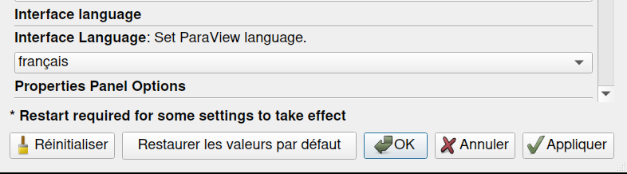
>
> New translations available in settings.


## Import and export animation keyframes

Animations can be exported into a ``.pvkfc`` file format in JSON and reimported. This format covers all keyframe types including property and camera keyframes.

> 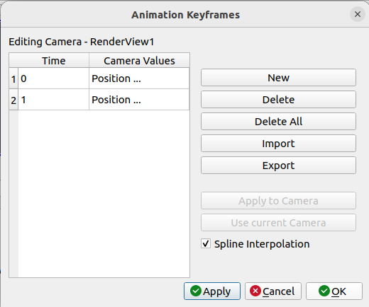
>
> Saving and loading animation keyframes is now possible in ParaView.


## Save screenshots with background threads

Saving screenshots and images in the backgrond can now be done by turning on the property **Save In Background** in the _Save Screenshot Options_ dialog. This feature can dramatically reduce the time it takes to save an animation sequence by using one more more threads to compress and write files. The number of threads can be set in the **General** section of ParaView's _Settings_ dialog. This is an advanced property named **Number Of Callback Threads**.

## Prism Plugin

ParaView has a new plugin named Prism that provides a custom view and representations to visualize Equation of State (EOS) files, such as SESAME, for multi physics simulations.

The purpose of this plugin is to provide a way to understand how simulation data behave in the EOS space, and understand where interesting EOS-behaviors happen in the geometric space. This is done by visualizing the simulation data in a **Render View** using a typical data representation and in the **Prism View** using a Prism representation. The Prism representation of simulation data basically converts all the cells into vertices whose coordinates are defined by the three desired EOS variables. To understand, how those cells/vertices behave in the EOS space, you need to first load material data, such as a SESAME file, into the Prism View. The material data defines the domain of the EOS space in which the simulation data can exist.

## **Protractor** source to measure angles

In the same way you can measure distances using the **Ruler** source, it is now possible to measure angles using the **Protractor** source. Like the **Ruler**, you can snap points to the surface of a mesh. This source offers nice customization options in the display properties.


## Default server path is client current working directory

Previously, the file dialog opened to the current working directory of the server process when opening the file dialog for the first time in client/server mode, which was not very useful.

Now, ParaView will try to open the client's current working directory as a default path for the server when opening the file dialog for the first time. If it does not exist, it will fall back on the previous behavior.

This is very useful when using ParaView in client/server mode on systems where the client and server share a file system.


## Copy and paste filters in the _Pipeline Browser_

New _Copy Pipeline_ and _Paste Pipeline_ options have been added to the _Pipeline Browser_ context and _Edit_ menus, which allows filters to be copied and pasted to other items in the _Pipeline Browser_.

You can select and copy a contiguous section of the pipeline. When pasting the pipeline to another source or filter, ParaView checks that all filters to be pasted are valid for the type of data produced by the filter it is being pasted to.


## Legend Grid Annotation

ParaView has a new annotation widget, called the Legend Grid.

You probably know about the Axes Grid object that displays 3D axes and coordinates around the data. This Legend Grid is the 2D counterpart, and it exists in screen space. The grid is always above the scene and does not move with the camera.

It is available in the _View_ section of the property panel. Due to its screen space position, it only makes sense when the **Camera Parallel Projection** property is on, hence the property is only enabled in that case.

> 
>
> Example of Legend Grid annotation.


## New setting for disabling magnitude computation

You may sometimes want to disable the computation of the magnitude of some data attributes according to the number of components they have. For example the magnitude of 2D data fields may not hold specific meaning for your use cases and disabling them can improve user interface readability as well as performance.

It is now possible to control this behavior in the **Represented Attributes** section of ParaView's _Settings_ dialog.


## Option for box widget to fit to visible data only

The _Box_ widget (used for example in the **Clip** filter) now has the option to reset its bounds to the bounding box of visible data only. You can set this property with a checkbox in the property panel.


## Save and Load PNG with embedded ParaView State as MetaData

ParaView now has an option to embed the ParaView state as metadata when saving a screenshot as `.png`. ParaView can also load a state from a `.png` image that has embedded state as metadata. If a PNG file with embedded state is dragged and dropped on the ParaView application, a dialog will appear asking you want to load the state or just the image.


## Server option to control time interval between timeout command calls

The new `--timeout-command-interval` commandline option allows for a user-defined time interval between consecutive calls of the command set by `--timeout-command`. Previously, the command was called every minute.

## Alembic format option in Export Scene options

A new scene exporter for the Alembic format (the ".abc" file format) has been added as an option in the _File_ .. _Export Scene_ dialog.

The [Alembic file format](https://www.alembic.io/) is used for dynamic scene and complex geometry exchange for 3D modeling packages.

Choosing Alembic format after choosing "Export Scene" will export the current visible scene to an ".abc" file. This includes all visible polygonal geometry, with vertex colors and texture coordinates. If a colormap has been applied, a texture containing the colormap is also saved as a ".png" file. The camera position and orientation is also exported. Blender 3.6 imports these scene files, and other modeling packages like 3D Studio Max and Maya also have Alembic importers.


# Rendering enhancements

## Edge opacity control

A new **Edge Opacity** property has been added to control the opacity of edges in the **Surface With Edges** representation.

> 
>
> New **Edge Opacity** property in the **Surface With Edges** property.

## Feature Edges representation for nonlinear cells fixed

Not all nonlinear cells were properly rendered when the "Feature Edges" was selected. This is now fixed.


## New chart-related settings

New **Charts Default X Axis** and **Charts Hidden Attributes** settings are now available in the _Represented Attributes_ tab of the _Settings_ dialog. With **Charts Default X Axis**, you can change the default X axis to use in chart representation instead of relying on the static list of default X axis. With **Charts Hidden Attributes**, you can specify regex patterns to match array that you do not want display by default in charts.


## New **Image Chart View**

You can now display `vtkImageData` in a new chart view. Just like other chart views, you can set titles, labels, and more. It also supports display of the magnitude array of a 2- or 3-component array.


## New **Logo Source** representation properties

You can now control how your logo's border is rendered.
- You can choose when to render a border (never, always, on hover).
- You can set border thickness and color.

You can now also set a scale that defines height relative to screen size. If set to 1, your logo's height will match your render view's height. The width will be scaled accordingly to preserve the image ratio.

To enable this scaling, you have to first set the interactive scaling to off. When interactive scaling is on (by default), the behavior remains unchanged, which means you can scale it only by grabbing the corners of your logo.

The border also fits the image better now.


## New color map and palette

A new color map named "Fast" has been added. The goal of the new color map is to increase discriminatory ability by adding more colors to the map (more hues) and more brightness changes (value) while staying linear and color blind friendly. Additionally, the default color maps have been reordered to put the most useful ones first.

Also **Warm Gray Background** has been renamed to **Dark Gray Background**, and an new **Warm Gray Background** has been added.


> 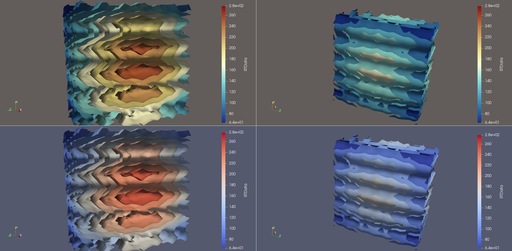
>
> The new default color map and palette background color compared to the current default color map and palette.


## New option to color missing data in partial arrays with a NaN color.

ParaView can now color missing data with a special NaN color instead of the default Solid Color.

> 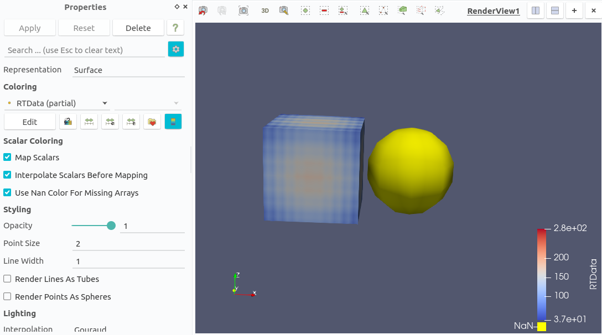
>
> Missing data colored by NaN color.


## Interior faces that are between cells of different order not rendered

### Motivation

Local refinement can produce meshes composed of different cell types and multiple degrees. So far, when two volumetric cells of different order are connected by their corners (for instance, a quadratic hexahedron next to a linear hexahedron), the internal face is rendered.

A new property **Match Boundaries Ignoring Cell Order** has been added to the "Surface" representation. When activated, only the cell corners are used to check if two cells are to be considered adjacent.


## Mouse cursor shape change is now correct in stereo mode

The mouse cursor now changes like expected when ParaView in launched in stereo. For example, the cursor takes the shape of a cross when doing a selection on the render view.


## Import colormaps from VisIt

Added handling of VisIt color tables (\*.ct) to the "Choose preset ... Import" dialog. Discrete colormaps are recognized. Alpha values are present in the input, but are ignored. Color tables from VisIt versions 2 and 3 are supported.


## Widget colors are now linked to the color palette

Linking widget colors to the color pallete allows you to change widget colors in the ParaView _Color Palette_ tab in the _Settings_ dialog. This helps ensure that when the palette swaps the foreground/background colors, as in the White Background palette, the widget edges and features are still visible, e.g., drawn in black. Widgets link to the **Foreground**, **Interactive Widget**, and **Widget** colors. The **Interactive Widget** color is the color used for the widget while you are interacting with it, and the **Widget** color is used to show which parts of the widget can be interacted with. Note that not all widgets use all three colors.


## Improvements of Polar Axes representation

This lists every change made to the **Polar Axes** representation, sorted by their category in the ParaView panel. Also, the representation is now applicable to hyper tree grids.

### Custom Bounds and Range

#### Pole placement

You can now toggle the automatic placement of the pole. When on (by default), the behavior remains unchanged: the pole is placed at the center of the bounding box. When off, pole is placed at the origin. Turning this property off becomes more useful when combined with new automatic parameters (see the "Angles and radii" section below).

### Aspect Control

#### Polar axes

You can now either specify a **Number Of Polar Axes** or a **Delta Range Polar Axes** between them to automatically generate them, similarly to radial axes. If both are specified, it will try to add **Number Of Polar Axes** every **Delta Range**. This means you can have fewer polar axes than specified, if your **Delta Range Polar Axes** is too big, or not enough to fill your arc if your **Delta Range Polar Axes** is too small. By default, **Number Of Polar Axes** is set to 5 and **Delta Range Polar Axes** is set to 0.0, which means it will generate 5 equally spaced polar axes.

#### Radial axes

You can now either specify a **Number Of Radial Axes** or a **Delta Angle Radial Axes** between them to automatically generate these axes. If both are specified, it will try to add **Number Of Radial Axes** every **Delta Angle Radial Axes**. This means you can have fewer radial axes than specified, if your **Delta Angle Radial Axes** is too big, or not enough to fill your arc, if your **Delta Angle Radial Axes** is too small. By default, **Number Of Radial Axes** is set to 0 and **Delta Angle Radial Axes** is set to 45, which means it will generate one radial axis every 45 degrees.

#### Angles and radii

You can toggle the **Custom Angles** property. When on (the default), the behavior remains unchanged: you can specify a minimum and a maximum angle. When off, it will compute these angles relative to the pole position.

You can also toggle the **Custom Min Radius**. When on (default), the behavior remains unchanged: you can specify a minimum radius. When off, it will compute this radius relative to the pole position. Note that maximum radius remains computed in both cases.

#### Polar arc resolution

You can now change polar arc resolution per degree. This sets the number of line drawn per degree (default  0.2), which means one line will be drawn every 5 degrees. If your ratio is different from 1.0, the resolution will depend on it, e.g., if your ratio is set to 2.0, your arcs will be larger so the resolution will be multiplied by 2.0.

### Colors

You can now choose an overall color for the whole Polar Axes when the **Enable Overall Color** property is enabled (by default). When the property is off, you can choose a color per feature as before.

### Title and Labels Control

#### Titles

You can now control title offsets for the polar axis with the **Polar Title Offset** property and the secondary radial axes via the **Radial Title Offset**. These are 2D offsets. Note that the X offsets won't be applied when centered text is selected.

#### Labels

You can now control labels and exponent Y offset.


### Tick Control

#### Arc ticks

You can now easily make major arc ticks and radial axes match. When the **Arc Tick Matches Radial Axes** property is on (default), major arc ticks will match radial axes and minor ones will be the half of a major tick. When Off, you can specify your own **Delta Angle Major** and **Delta Angle
Minor** properties. In both cases, as many ticks as can be fit in the arc will be added.

#### Axis ticks

You can now easily make major axis ticks and polar axes match. When on (default), major axis ticks will match polar axes and minor ones will be the half of a major tick. When off, you can specify your own **Delta Range Major** and **Delta Range Minor**. In both cases, as many ticks as can be fit in the axes will be added.

#### Ticks size

If you don't specify a size for one type of tick, its size will be computed as a ratio of maximum polar radius. You can now specify a value for this ratio.

### Sample images

#### Polar axes with automatic parameters set

> 
* Pole placement off while the sphere is not centered at the origin.
* Custom minimum radius on and custom angles on, so we don't get extra information outside the sphere.
* Arc and axis ticks matches radial and polar axes on.

#### Polar axes with custom parameters set

> 
* Pole placement on while the sphere is not centered at the origin.
* Custom minimum radius on and custom angles on while pole centered, so we get all useful information inside the sphere.
* Arc and axis ticks matches radial and polar axes off, so we can set appropriate delta values.


# Plugin updates

## Plugin Manager: Add confirmation dialog to remove a plugin

The Plugin Manager now prompts you to confirm the removal of a plugin.


## NVIDIA IndeX plugin improvements

### Multi-GPU and cluster rendering available by default

The NVIDIA IndeX plugin now comes with a free evaluation license that enables all features for a limited time, including full scalability to run on multiple NVIDIA GPUs and on a cluster of GPU hosts. NVIDIA IndeX will continue to run after the evaluation period, but with multi-GPU features disabled. Please see the NVIDIA IndeX ParaView Plugin User Guide for details.

### Optimizations for unstructured grids

Generating the on-device acceleration structure used by NVIDIA IndeX for unstructured grid data is significantly faster now, thanks to optimizations that make use of the available GPU hardware resources. This can speed up the time to first rendering with the "NVIDIA IndeX" representation by 2x or more.

### NVIDIA IndeX upgraded to CUDA 12, new driver/GPU requirements

NVIDIA IndeX now uses CUDA 12.3, which has improved support for new GPU architectures.

The minimum NVIDIA driver versions required are 525.60.13 (Linux) and 527.41 (Windows). Recommended driver versions are 545.23.06 (Linux) and 545.84 (Windows) or newer.

CUDA 12 requires an NVIDIA GPU that supports at least CUDA compute capability 5.0, i.e., has "Maxwell" GPU architecture or newer. Support for the older "Kepler" GPU architecture (e.g., NVIDIA Tesla K10, K40, K80) was removed. Information about the compute capability of a specific GPU model can be found on the
[NVIDIA website](https://developer.nvidia.com/cuda-gpus).

### Added support for ARM architecture (aarch64) on Linux

Linux binaries of the NVIDIA IndeX library are now also provided for the ARM architecture (aarch64).

Please see the NVIDIA IndeX ParaView Plugin User Guide for details on how to build ParaView with NVIDIA IndeX on this platform.

### Removed support for POWER9 architecture (ppc64le)

The POWER9 architecture (ppc64le) is no longer supported by the NVIDIA IndeX plugin.

### Additional improvements

- Data that is outside the camera's view frustum will now be imported immediately by the NVIDIA IndeX plugin. Previously, data import could get delayed until the camera was moved, which would temporarily interrupt user interaction.

- The color map for (signed) `char` and `short` data is now applied to the full value range, for consistency with other ParaView representations.

- `signed char` (`VTK_SIGNED_CHAR`) data is supported in addition to `char` (`VTK_CHAR`) and `unsigned char` (`VTK_UNSIGNED_CHAR`) for structured volumes.

- Platform dependent `char` data, which is used by the legacy VTK data format (.vtk) and when loading raw binary data (.raw), is now correctly interpreted as `unsigned char` on aarch64, while it is `signed char` on x86-64. A warning message will be given, recommending to use one of the explicit data types instead of `char`.


## Looking Glass plugin updated

ParaView supports a new Looking Glass device: 8k generation 2.


## CDIReader Plugin minimum CDI version now 2.1.0

The minimum version of CDI to use with the CDIReader plugin has been bumped to 2.1.0.

Linux and macOS continuous integration testers have been added for the CDIReader plugin.


## New BivariateRepresentations plugin

This plugin brings two new representations to ParaView, the Bivariate Noise representation and the Bivariate Texture representation. These representations can be used to visualize 2D and 3D surface data.

The Bivariate Noise representation enables visualizing two point data arrays at the same time. It uses Perlin noise to visualize the values of the 2nd array. The noise is stronger where the values are high. Note that only scalar data can be chosen as noise array.

The Bivariate Texture representation computes 2D textures coordinates from two input arrays, allowing the use of a 2D color texture as a color map. Note that only scalar data can be used for both input arrays to generate texture coordinates. Default 2D textures are shipped with the plugin and are added to ParaView when it is loaded.


## Digital Signal Processing plugin improvements

### Use of `vtkMultiDimensionalArray`

Added `vtkMultiDimensionalArray` to the Digital Signal Processing plugin. For now, this implicit array enables representing 3D arrays with 2D views on it. The motivation is to use this array in the DSP plugin in order to avoid relying on multiblock datasets to represent temporal data at each point of a mesh (output of the **Plot Data Over Time** filter without the option **Only Report Selection Statistics**), that are not scalable in a distributed environment. An example of generation of `vtkMultiDimensionalArray` from temporal data can be found in `TestTemporalDataToMultiDimensionalArray.cxx`.

### **Temporal Multiplexing** filter
The **Temporal Multiplexing** filter creates a `vtkTable` containing such 3D arrays based on a temporal input, where the first dimension is the point/cell index. The `Multi Dimension Browser` filter sets the value for this first dimension, so it changes the point/cell of the output "2D view".

### **Band Filtering** filter

This plugin also has a new **Band Filtering** filter that can be used to perform octave or third octave band filtering from a given input `vtkTable`.

### Spatial iterators

A new `vtkDSPIterator` has been added to iterate over the spatial dimension for spatio-temporal datasets. In particular, this iterator has been designed to work with two types of datasets:

- Multiblock datasets where each block corresponds to a mesh point/cell. Each block contains a `vtkTable` where the tuples correspond to timesteps. Such a structure can be obtained by applying the filter **Plot Data Over Time** with the option **Only Report Selection Statistics** off.

- Table datasets containing multidimensional arrays (see `vtkMultiDimensionalArray`) where the rows correspond to timesteps and a third hidden dimension corresponds to mesh points/cells.

The new iterator is able to traverse these two types of datasets in a transparent way after simply giving a dataset to it as input.

A simple example of a filter using this iterator can be found in the test `TestDSPIteratorIntegration.cxx`.


## Stereo Cursor View plugin

This plugin brings the **Stereo Cursor View**, which is a new render view displaying a 3D Cursor (widget) whose aim is to be displayed in stereo like other actors in the scene. Two types of cursor are exposed: a 3D cross and a sphere.


## Node Editor plugin improvements

The Node Editor plugin now has a few more handy features.

### Saving / Restoring the pipeline layout alongside the state file

When saving a state file with ParaView, the node editor will save another file called `.XXX.pvne`, where `XXX` is the name of the state file without extension. This file contains all necessary information to restore the layout when opening the state file. If the **Auto Layout** option is enabled, no file will be written nor looked for when saving / loading a state file.

### Annotations node

You can now annotate part of your pipeline using the new annotations feature (see screenshot below).

- To create an annotation, select a few filters and hit the `N` key (for **N**ote).
- To select an annotation and make the description visible and editable, Ctrl-Click an annotation node.
- To delete the annotation, hit Ctrl-N when the annotation is selected.

> 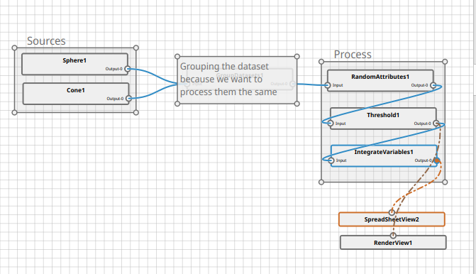
>
> Node Editor annotation example.

### Representation nodes

It's now possible to control the display properties of a representation using the Node Editor. These nodes are only visible when the object itself is visible. They are also hidden if the option **View Nodes** is disabled.

## Fixed Z Ordering Bug With StreamLines Representation

The StreamLinesRepresentation plugin is now capable of rendering streamlines
with correct z-order when there are multiple objects in a render view.


# Filter changes

## **Slice** filter locator is more customizable

You can now customize the **Slice** filter's locator. The **Merge Points** property that toggled between a merging and non-merging point locator. This property has been replaced with a **Locator** property that includes the previous locators in addition to an octree-based point locator.


## **Contour** filter delegates to fast contour filters

**Contour** now delegates to the fast filters that use 2D and 3D flying edges algorithms when **Fast Mode** and **Generate Triangles** is on.


## Improved **Glyph** filter 2D Glyph arrows

New properties have been added to further customize the 2D Glyph simple arrow:
- **Tip Length**: the length of the tip can now be modified
- **Double Pointed**: if on, an arrow tip is added to the opposite side
- **Point Inwards**: the arrow tips point inwards rather than outwards

> 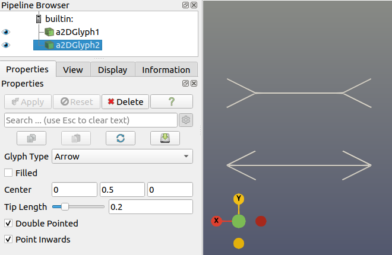
>
> New 2D arrow glyph configuration possibilities.


## **Ghost Cells Generator** works with hyper tree grid data

You can now use the **Ghost Cells Generator** for hyper tree grids.

The hyper tree grid-specific filter **Hyper Tree Grid Ghost Cells Generator** continues to be available as well in.


## Autocomplete in **Python Calculator**

Autocomplete capabilities are now available in the **Python Calculator** expression editor.


# Improved support for field data in **Python Calculator**

In the **Python Calculator**, field data have always been available with the full expression: `inputs[0].FieldData['arrayName']`. Now, you can set the `ArrayAssociation` to `Field Data` to give more options for these kinds of arrays. This has two effects:

* `arrayName` can be used directly as a variable in the expression
* The output array is added to the `FieldData` of the output


## Multiline expression editor in **Python Calculator**

The **Python Calculator** now supports mutliline expressions. The result array is returned using a `return` statement in the multiline expression. The multiline expression editor supports autocomplete and Python syntax highlighting.


## VTK-m accelerated overrides for **Clip**, **Slice** and **Threshold** filters are available

VTK-m accelerated overrides for the **Clip**, **Slice** and **Threshold** filters are available when ParaView is built with the cmake option `VTK_ENABLE_VTKM_OVERRIDES` turned on. The overrides are used when the setting **Use Accelerated Filters** under the _General_ tab in the _Settings_ dialog is on.


## **Result Array Type** property has been added to the **Python Calculator**

Similar to the **Calculator** filter, the **Python Calculator** now has an advanced property to control the type of the result array that is appended to the output dataset. The default type is "Double".


## Introducing **Field Data To Attribute filter**

ParaView now provides a way to efficiently pass single-value field data arrays as arrays of other field associations. This is done at low memory cost by using new implicit array data structures.

Example use case: CFD data consisting of a multiblock dataset where each block is a boundary, and each boundary condition is stored as a single scalar value in a field data array. Before this development, this scalar was mostly not usable for computation in other filters. Converting it to point data, for instance, allows it to be used by filters later in the pipeline.

## New **Point Data Weighing Strategy** option in the **Clean to Grid** filter

When using the **Clean to Grid** filter, you can now choose which strategy to use to collapse your point data.

Previously, when merging duplicate points, the point with the lowest index had its data copied to the merged output point. With this new option, you can now choose between:
* **Take First Point** (for backwards compatibility): where the point with the lowest index in the input gets the ownership of the merged point
* **Average by Number**: where the data on the merged output point is the number average of the input points
* **Average by Spatial Density**: where the merged point data is averaged using a partition of the volumes in the cells attached to each point being merged


## More cell types added to the **Unstructured Cell Types** source

The **Unstructured Cell Types** source can now produce Pixel, Polygon, Bi-Quadratic, Quad Polyhedron, Voxel and Tri-Quadratic Hexahedron cells.


## New **Align Image Origins** filter

When dealing with a collection of image datasets, either in a composite dataset or in a distributed environment, it is not uncommon for each dataset to have its own unique origin such that the extents for each start at 0. However, if the images are parts of a whole, then several filters like **Extract Subset** that simply use extents fail to execute correctly. Such filters require that all parts use the same global origin and set local extents accordingly. This filter can be used to align such image datasets. Essentially, this filter ensures that all image datasets have the same origin and each block's extents are set relative to that origin. This filter requires that all images have the same spacing to function correctly.


## New **Boundary Mesh Quality** filter

The **Boundary Mesh Quality** is a new filter that computes metrics on the boundary faces of a volumetric mesh. The metrics that can be computed on the boundary faces of the mesh and are:

- Distance from cell center to face center.
- Distance from cell center to face's plane.
- Angle of face's plane normal and cell center to face center vector.


## Geometry preview filters **PointSet to Octree Image** and **Octree Image to PointSet**

ParaView now has two new filters named **PointSet To Octree Image** and **Octree Image to PointSet**.

- **PointSet To Octree Image** can be used to convert a point set to an image with a number of points per cell target and an unsigned char octree cell array. Each bit of the unsigned char indicates if the point set had a point close to one of the eight corners of the cell. It can optionally also output a cell array based on an input point array. This array will have one or many components that represent different functions, i.e., last value, min, max, count, sum, or mean.

- **Octree Image to PointSet** can be used to convert an image with an unsigned char octree cell array to a point set. Each bit of the unsigned char indicates if the cell had a point close to one of its eight corners. It can optionally also output a point array based on an input cell array. This array will have one of the components of the input array.


## New **Generate Spatio Temporal Harmonics** filter and source

### Filter: **Generate Spatio Temporal Harmonics**

You can now use a new filter to compute spatio temporal harmonics on each point of your input dataset. This avoids some manual computation through the **Calculator**.

This filter enables you to add multiple harmonics defined by their amplitude, temporal frequency, wave vector, and phase. The sum of them will be computed using the sine function for each point. Note that there is no cosine in this function.

The filter applies only on the current timestep, using the time value in the function.

### Source: **Spatio Temporal Harmonics Uniform Grid**

You can now generate an image data set with harmonics data. This new source allows you to specify the uniform grid extent. It also lets you choose the harmonics you want, the same way as in the filter (it is embedded). Finally, it can generate time steps by specifying time values.

If no harmonic is specified, the source will generate null harmonic values. If no time value is specified, the source will not generate time steps.


> 
>
> Time varying data generated by the **Spatio Temporal Harmonics Uniform Grid** filter.


## New **PCA Normal Estimation** filter

A new filter, **PCA Normal Estimation**, is now available to estimate normals of point data using principal component analysis.


## **Tensor Principal Invariants** and **Yield Criteria** filters

The new **Tensor Principal Invariants** filter computes principal values and vectors from 2D and 3D symmetric tensors (described with arrays containing 3 and 6 components, respectively). The vectors can be scaled with the principal values if needed.

The new **Yield Criteria** filter computes different yield criteria from given 2D or 3D symmetric tensors.

Available yield criteria currently include:

- Tresca criterion
- Von Mises criterion


## New **Volume Of Revolution** filter

The new **Volume Of Revolution** filter rotates a two-dimensional input dataset about an **Axis Direction** and produces an unstructured grid of the swept volume. The **Sweep Angle**, specified in degrees, can be limited to produce a partial sweep about the axis.

> 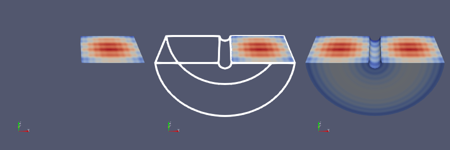
>
> Illustration of the **Volume of Revolution** filter operation.

## **Remove Point Without Cells** option added to the **Clean To Grid** filter

The **Clean To Grid** filter now supports a new option, **Remove Point Without Cells**, that will remove any point that is not part of a cell in the output.


## New **HTG Strategy 3D** property in the **Contour** filter

In case of a hyper tree grid input, the **Contour** filter now exposes the **HTG Strategy 3D** property. It forwards the property to the internal contour filter for hyper tree grids. This property allows better results in the 3D case but is significantly more time consuming.


## **Threshold** component modes

You can now apply the **Threshold** filter on multi-component arrays. When doing so, it is possible to change how the components are handled. You can choose one of the supported **Component Mode** values:

* **Selected**: the Selected Component needs to satisfy the threshold
* **All**: all components need to satisfy the threshold
* **Any**: any component needs to satisfy the threshold

When using the Selected mode, you can either select a specific component, or even the magnitude of the components.

Note that multi-components arrays options are not available with hyper tree grid inputs.


## Memory strategies for **Threshold** filter with hyper tree grid input

Using memory strategies, you can now choose how to describe the output of the **Threshold** filter when its input is a hyper tree grid. This drop down list of options determines how the output hyper tree grid output is represented in memory:

* **MaskInput** (default): shallow copy the input and mask all cells being thresholded

* **Regenerate Trees And Index Fields**: generate a new tree structure but use indexed arrays on the input for cell data

* **New HyperTreeGrid**: construct a new hyper tree grid from scratch representing the minimal threshold of the input


## Hyper Tree Grid filter additions

### **HyperTreeGrid Evaluate Coarse**

This filter enables you to set the calculation method and the default value for different "Average" methods.

The operators available for the different calculation methods are:
* **Don't Change Fast**: does not change coarse value (default), just shallow copy
* **Don't Change**: does not change coarse value but iterates over all cells, just shallow copy
* **Min**: the smallest value of the unmasked child cells
* **Max**: the biggest value of the unmasked child cells
* **Sum**: the sum of the values of the unmasked child cells
* **Average**: the average of the values of the child cells
* **Unmasked Average**: the average of the values of the unmasked child cells
* **Splatting Average**: the splatting average of the values of the child cells
* **Elder Child**: puts the value of the first child (elder child)

The calculation of the average should normally be done by dividing by the number of children which is worth _f^d_, where _f_ is the refinement factor and _d_ the number of spatial dimensions. In the calculation of the mean for splatting, the division involves _f^(d-1)_.

### **HyperTreeGrid Geometry Filter**

You can now use the geometry filter to convert a hyper tree grid to a polydata. The filter was already defined in ParaView but not exposed in any list so it was still inaccessible from the Filters menu.

### **Gradient** for hyper tree grids

#### Unlimited mode

Extend the hyper tree grid version of the gradient filter with a new **Unlimited** mode. In this version, the gradient is computed using unlimited cursors, refining neighboring nodes to have a local computation similar to a regular grid.

In this mode, it is possible to handle extensive attributes so the virtual subdivision reduces their influence.

#### New parameters

**Divergence**, **Vorticity** and **QCriterion** options are now exposed when computing the Gradient of a hyper tree grid. Vector fields are now also supported.

### Minor tweaks

**HyperTreeGrid Cell Centers** now creates vertex cells by default as it is the most common use case.

The **Slice** meta filter now hides properly the "value range" property when applied to a hyper tree grid.

Hyper tree grid-related filters are now named consistently, beginning with "**HyperTreeGrid <filter_name>**".


## **Project Spectrum Magnitude** filter can use octave bands

You can now specify octave bands for automatic frequency range computation for the **Project Spectrum Magnitude** filter. If you select **Frequencies From Octave**, three new options will appear:

- **Base Two Octave**: allows you to specify whether to compute frequencies using base-two or base-ten power. It's an *advanced* parameter.
- **Octave**: allows you to choose which octave band you want to project, in audible spectrum.
- **Octave Subdivision**: allows you to choose which part of the octave you're interested in (e.g. a full octave or a third-octave).

### Examples

* Selecting the **500 Hz** octave with the **Full** octave subdivision and **Base Two** on will result in a frequency range of
  (353.553, 707.107).
* Selecting the **500 Hz** octave with the **Second Third** octave subdivision and **Base Two** off will result in a frequency
  range of (446.684, 562.341).


# Changes in readers and writers


## New `.vtkhdf` extension for VTKHDF files

ParaView now supports and interprets files with `.vtkhdf` extension as VTKHDF files. This convention should be treated as the new standard for VTKHDF files from now on.

Classic `.hdf` extensions will continue to function with the ParaView reader.


## Internal cache and new option to merge parts in the VTKHDF reader

You can now output a partitioned data set instead of polydata or unstructured grid when reading VTKHDF files by deactivating the **Merge Parts** property. This allows you to keep the native partitioning present in the file in the structure of the output data set.

You can also turn on caching for the VTKHDF reader using the **Use Cache** option. This will keep an internal cache of the last data read in the file for individual arrays and use that data instead of rereading from the file at subsequent updates of the reader. This option is best turned on with **Merge Parts** turned off for better memory efficiency.


## New `FDS Reader` for Fire Dynamics Simulator output

You can now read in output from the Fire Dynamics Simulator ([FDS](https://pages.nist.gov/fds-smv/)) into ParaView. The reader is based on reading the `*.smv` meta-data file to orchestrate the reading of all the other files. It supports:

* Grids: reading in the extents of the entire simulation domains
* Devices: reading in data from so called "devices" and representing it as point data
* HRR: reading in globally integrated data as a table
* Slices: subsets of the entire grids with point data on them
* Boundaries: subsets of the grids that represent obstacles or boundaries in the simulation

The output of the reader is a partitioned dataset collection divided into the sections listed above.


## New support for reading STEP and IGES files

ParaView can now read `.step`, `.stp`, and `.iges` files.


## Support for more higher-order cells in files read by IOSS

The IOSS reader did not create arbitrary-order Lagrange cells in all circumstances where it could, nor did it support fixed-order, 7-node triangle that VTK provides. Those issues have been rectified.

The IOSS reader also now supports mixed-order, 12-node wedge elements. These elements have quadratic triangle faces but quadrilaterals with 2 linear sides and are sometimes used to represent material failure along a shared boundary between two tetrahedra, i.e.,
the wedge is assigned a zero or negligible stiffness, allowing the neighboring tetrahedra to move relative to one another without inducing strain.


## Complete implementation of IOSS-based Exodus file writer

**IOSSWriter** is a writer for the Exodus file format that has now been completed that uses the [IOSS library](https://sandialabs.github.io/seacas-docs). The input can be a `vtkPartitionedDataSetCollection`, `vtkPartitionedDataSet`, or `vtkDataSet`. It supports the following entity types: Node/Edge/Face/Element blocks, and Node/Edge/Face/Element/Side sets. If the input of the writer originated from `IOSSReader`, the entity types can be automatically deduced. Otherwise, the **Assembly Name** and **Selectors** can be used to specify which block belongs in which entity type. If no selector has been defined, and the input does not originate from IOSS, then all blocks will be treated as Element Blocks. The arrays (or fields) to be written for each entity type can be specified after **Choose Arrays To Write** has been set to true. A subset of the timesteps to be written can be selected using **Time Step Range** and **Time Step Stride**. Ghost cells can be removed by enabling the **Remove Ghosts** property. If the input has been transformed by a filter, the original ids of blocks can be preserved using **Preserve Original Ids**. The quality assurance and information records can be written by enabling the **Write QA And Information Records** property. Global IDs are created assuming uniqueness for both Node Blocks, i.e. points, and Edge/Face/Element blocks, if they are not present, or invalid. `element_side` is needed for Edge/Face/Element/Side sets. If it is not present, sets will be skipped. If it is present, but invalid, and there were (old) Global IDs that were invalid, then they will be used to re-create `element_side`, otherwise, sets will be skipped. Finally, **IOSSWriter** can now write in parallel.


## New options in IOSSReader

The **IOSSReader** can now merge entity blocks into a single block for the exodus format using the flag **Merge Exodus Entity Blocks** (off by default). This is useful e.g. for cases where the entity blocks just represent different cell types but they actually describe the same block.

In addition, the **IOSSReader** now has a flag **Read All Files To Determine Structure** to read _all_ files to determine the structure of the dataset. When set to true (default), the reader will read all files to determine the structure of the dataset because some files might have certain blocks that other files don't have. Set to false if you are sure that all files have the same structure, i.e., the same blocks and sets. When set to false, the reader will read only the first file to determine the structure, which is significantly faster than reading all files.


## Plugin to load openCFS data in ParaView.

openCFS is an open source academic coupled field FEM simulation and structural optimization tool (opencfs.org).

The data format of openCFS is HDF5-based and has the extensions `.cfs`, `.nmf`, `.nrf`, `.h5ref`.


# VisIt LAMMPS dump reader can now read multiple time steps

The LAMMPS atom dump supports writing out multiple time steps. The reader supports reading these timesteps, but ParaView was only reading the first time step. That limitation has been removed.


## New CONVERGE CFD CGNS reader

A new reader for CGNS files produced by CONVERGE CFD (`.cgns` extension) is now available.

Meshes, boundaries and parcels are read and stored as partitioned datasets in a partitioned dataset collection to manipulate them separately.

## CGNS writer now writes rectilinear grids and image data

The CGNS writer now also writes rectilinear and cartesian grids represented by instances of `vtkRectilinearGrid` and `vtkImageData` respectively, as structured grids.


## **Create Shared Points** property for FidesReader

You can now request the FidesReader to create shared points at the interface between partitions of uniform grids. This option closes the gaps that used to appear when visualizing the output datasets.


## Unncessary quotes for column headers in CSV extracts now removed

ParaView now has an option to specify and enable the use of string delimiter characters. By default, string delimiters are enabled, therefore column headers are surrounded by quotes.


## Improved GmshIO plugin writer support for entities and physical groups

The `vtkGmshWriter` in the `GmshIO` plugin now has support for writing elementary entities and physical group information based on cell arrays.


## NetCDF UGRID Reader

ParaView now provides a new reader to load NetCDF files that follow the [UGRID conventions](https://ugrid-conventions.github.io/ugrid-conventions/).

Only 2D meshes are supported and you can extract points, cells and data arrays associated to them. You can also replace values denoted as "fill values" with NaN.


## openPMD

The openPMD Python module was updated to fix bugs.

Particles and fields ran out-of-sync in animations. The changes ensure that if one of the ports is updated, field (0) or particles (1), the other port is updated to the same time even if no changes in it were requested.


## Support for writing file series JSON meta file

When writing a file series, it is now possible to write a supplementary .series JSON meta file for easier loading afterwards. When using the `File` menu `Save Data...` command, enable the **Write timestep as file-series** option and also enable the **Write Series Meta File** option in the _Configure Writer_ dialog.

# Interface improvements


## New "Toggle file sequence grouping" button to the _Open File_ dialog

A new button has been added to the _Open File_ dialog's top right corner. This button allows to enable/disable the feature that groups sequenced file together. When disabled, files ending in a numeric sequence will no longer be grouped and assumed to be a time series.

- file_1.vtk
- file_2.vtk

When enabled (default), the files above would be grouped into:

- file..vtk

The state of the button is saved in the settings when closing the dialog and ParaView, making it persistent.

> 
>
> New file grouping toggle button.


## _Locations_ list in _Open File_ dialog

A _Locations_ list has been added to the left side of the _Open File_ dialog. It is updated every time the dialog is created with "special" directories, which includes drives. This resolves an issue on Windows, because the _Favorites_ list used to show these special directories, but it is saved in the settings and not updated once created, so new drives like USB keys or newly mapped network drives used to not appear. They now appear in the _Locations_ list.

The _Favorites_ list is now empty by default, since special directories can easily be added from the _Locations_ list.

A "Media" special directory is added on Linux for common directories where USB or other auto-mounted drives are typically located. The "Downloads" special directory is added on Windows, and the method for retrieving special directories is updated. The "Examples" place-holder directory is also added to special directories by default, but can be controlled with a behavior.

A new setting in the IO section of ParaView settings lets you specify a list of labels and environment variables. Each of the environment variable values is looked up, and if it exists, the path it contains is added to the _Locations_ list. If the path does not exist, the warning icon is used. If the environment variable is not set or is empty, the entry is not added to the _Locations_ list.


## File dialog "Look in" combobox is now editable

For easier manipulation and navigation, the "Look in" combobox of the file dialog can now be edited to specify a path manually.

> 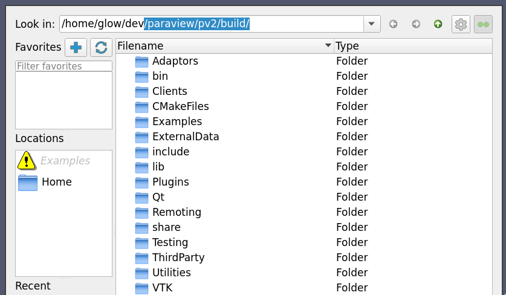
>
> Illustration of editing the "Look in" field.

## Reorganized Color Map Editor

The color map editor panel has been redesigned with a new layout to simplify adjustments to the color and opacity transfer functions for surface and volume rendering.

### Improved color and opacity array selector widgets

Three new array selector widgets appear at the top of the color map editor. The tool buttons on the left of each selector widgets correspond to:
1. Use a separate color map with the currently active filter for the selected array.
2. Use a 2D transfer function whose Y-axis maps to the selected array.
3. Use a separate array to map opacity.

> 
>
> New color array selector widgets in the _Color Map Editor_.

### Improved look and feel of 1D transfer function widget

The 1D opacity function widget now displays a checkered background that can help you better understand the scalar opacity function. A high opacity value is indicated by opaque white shaded region and a low opacity value with a transparent region under the transfer function curve.
|1D Scalar Opacity Function Editor|1D Color Transfer Function Editor|
|-|-|
||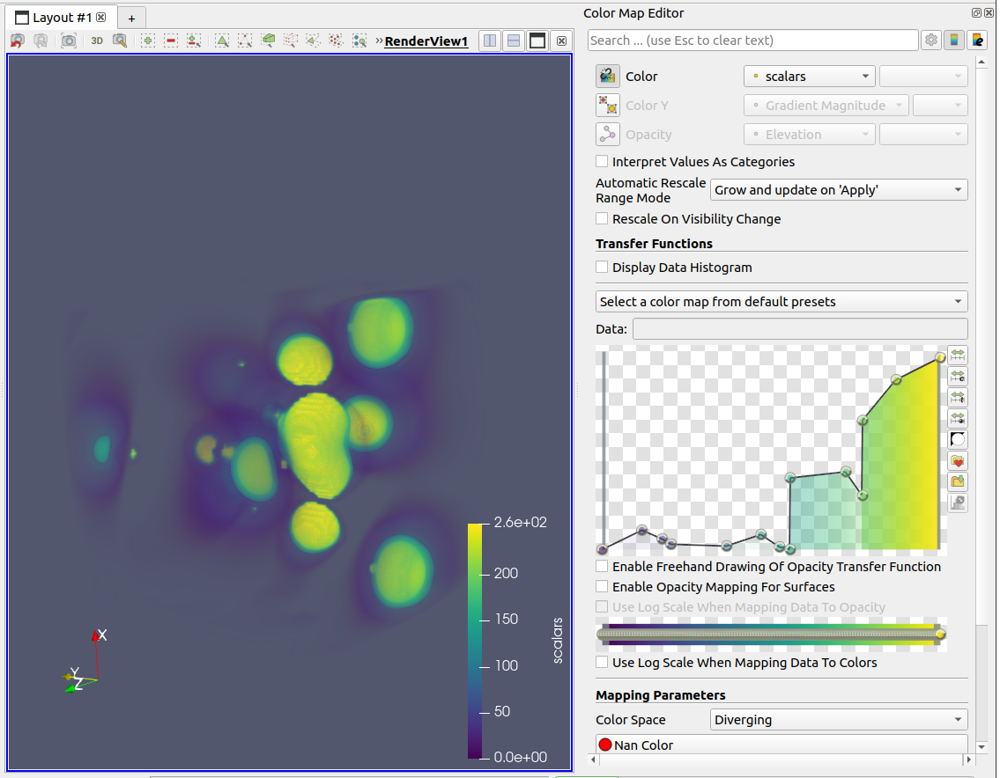|

### Increased size of 2D transfer function widget

The 2D transfer function widget now takes up additional space in the color map editor layout.
This makes the 2D transfer function editor feel roomier than before.

> 
>
> The 2D transfer function editor is has more space.

## Properties search bar results searches more places

The search bar in the _Properties_ panel now includes search in panels for
interactive 3D widgets, like those used for **Clip** and **Slice** so search terms like "Normal" and "Origin" will include those widgets.

## New _Edit Macro_ dialog

A new dialog has been added to edit ParaView macros. It replaces the old submenus from the Macros menu with a new dialog that allows you to add, edit, or remove macros.

> 
>
> The new Edit Macros Dialog.

## **Zoom Closest Offset Ratio** setting

**Zoom Closest Offset Ratio** is a new **RenderView** settings parameter that is used to add a zoom offset when triggering the "Reset Camera Closest" and "Zoom Closest To Data" actions. The default value is 0.9.


## Camera widget view links

You can now link two Render Views to enable one to control the camera of the other through a new widget. You can create this new link in the _Link Manager_ window (under the _Tools_ -> _Manage Links_ menu). The first render view you should select is the one in which you want the camera widget to appear, and the second one should be the render view that you want to control the camera. You can also create it via the _Add Camera Link_ item in the _Tools_ menu or the *Link Camera* (when right clicking on a render view). Note that it will not link cameras of render views when doing so, but only allow you to control a camera in another render view.

The camera widget will let you control the camera position, target, orientation and view angle via various handles. Moving the camera from the second view will automatically update the camera widget, and vice versa.

> 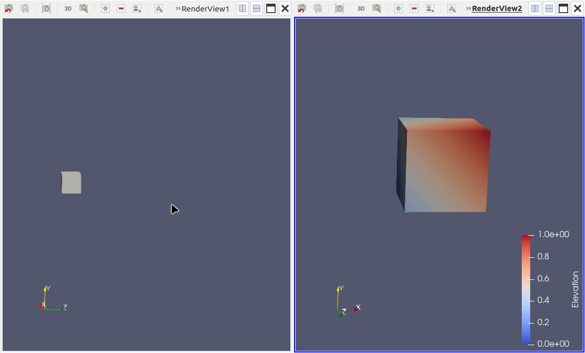
>
> Illustration of using the camera widget view link.

## Selection mechanisms for hyper tree grids now supported

You can now use the selection mechanisms tied to the **Render View** to select parts of hyper tree grid. Individual surface cell picking, "Frustum" cell picking, "Hover Over Cell" tooltips and selection through the "Find Data" panel are now active for hyper tree grds. Selections can also be extracted using the **Extract Selection** filter which should output a masked version of the input hyper tree grid.


## Shader ball preview in the *Material Editor*

The *Material Editor* now has a shader ball to preview the current material. This allows you
to edit materials quickly without having to set them up in the scene, or even to
enable ray tracing on the main render window.

The number of samples used for the shader ball can be customized to get the best
performance / quality ratio.


## Show Assembly structure in _MultiBlock Inspector_

The _MultiBlock Inspector_ now has the option to choose the assembly type to display. If the dataset is a partitioned dataset collection, then the available assembly options are **Assembly** and **Hierarchy**. If
the dataset is a uniform grid or multiblock dataset, then the only available assembly option is **Hierarchy**. The default assembly is **Assembly** if present, otherwise it's **Hierarchy**. Finally, the default has also changed for the _Find Data Panel_, and **Extract Block** properties in the same way.


## New _Clear expression_ button for calculator expression

A _Clear expression_ button has been added to the **Calculator** filter's expression field. When clicked, it will erase all text in the field.


## _Clear selection_ button in charts

A button to clear the active selection from chart views is now available.


## History management available in _ParaView Online Help_ window

You can now navigate through the history of opened documentation pages in the _ParaView Online Help_ window.
Four buttons had been added: **Go backward**, **Go forward**, **Home**, and **Save as home page**.


## Buttons not relevant for the current field association in Spreadsheet Views are not disabled

- The **Cell connectivity** button is now disabled when the field association selected is not "Cell".
- The **Show field data** button is now disabled when the field association selected is "Field Data".


## Setting to limit the available reader list

In the _Settings_ dialog under the _IO_ tab, there is a new _Reader Selection_ list. You can uncheck the box next to any reader you do not want to see listed in the _File -> Open_ dialog. The title bar checkbox will turn the entire list on or off. Any new readers are enabled by default.


## Improved color annotations widget

Global modifications in `pqColorAnnotationsWidget` (visibility and opacity values set in the header) now apply on filtered items only.

Additional improvements :
 - The filtering / sorting section of the the context menu now appears only for filterable / sortable columns.
 - The opacity values of highlighted items are set the same way the visibility states are, that is using the context menu.
 - As the opacity values of highlighted items are set via the context menu, the global opacity dialog does not appear after double-clicking on the table header.


## **Axis Aligned Plane**: normal not editable

Improved the "Axis Aligned Plane" user interface by making its **Normal** text fields not editable if **Always Snap To Nearest Axis** is enabled. The **Normal** values are still displayed though.


## Selection Editor improvements

You can now select for each defined selection registered inside the selection editor a color and visualize it when you click on **Activate Combined Selections**:

> 

You can also apply new annotation filter which associates for each selection a label:

> 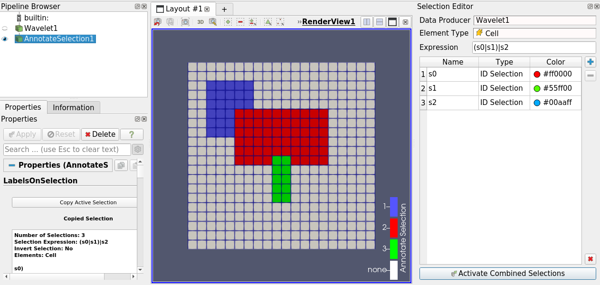


## New real number display settings

Two new real number display settings have been added to control how real numbers are displayed in ParaView's interface.

### Full

A new notation type has been added: "Full". It Always use full notation instead of showing a simplified text. This mode restores the behavior of ParaView 5.7 before the introduction of the real number display setting

> 
>
> Illustration of using the "Full" notation.

### Shortest Accurate Precision

Instead of setting a precision, it is now possible to use the shortest accurate precision, which relies on a Qt mechanism to find such a number representation.

> 
>
> Illustration of using the "Shortest Accurate Precision".


These settings have been mirrored for the **Animation Time Notation** setting as well.


## Introducing the _Time Manager_ panel

In ParaView, you can load and animate temporal datasets. You can also set up an animated scene where analysis and visualization parameters can change at each timestep.

The animation controls used to be split into  the _Animation View_ and the _Time Inspector_. As both have a similar interface and some redundancy, we removed them in favor of the brand new _Time Manager_ panel.

From this unique panel, you can now introspect data times, configure the animation scene timestep list, define a start and end time, and use a stride to quickly navigate through the scene. This is also the place where to configure animation tracks.

This rework was a good opportunity to improve the user experience and to fix several problems, including the time notation settings.

For more informations, see the [official documentation](https://docs.paraview.org/en/latest/UsersGuide/animation.html)


## Set an icon for a Macro

It is now possible to specify an icon for a Python Macro. You just need to provide a `.svg` or a `.png` file with the same name as the macro and add it inside the ParaView configuration `Macros` directory. The icon will be loaded along with the macro. Removing the Macro also deletes the icon file.

> 
>
> Example of an icon associated with a macro.


## _Choose Preset_ dialog fixed on macOS

The _Choose Preset_ dialog no longer gets stuck behind other control panels on macOS.


## Save default values for individual property widgets

In the _Properties_ panel, two icons at the top of each section let you save the current values shown in property widgets as the defaults for the next time this source/filter is created, or reset all values to the application defaults. Now each property widget has a context menu, available by right-clicking on the widget's label, to "Use as Default", or "Reset to Application Default" for just that property. The context menu is not shown if the property cannot take these actions.


## Equalize view size in layouts

ParaView now provides the ability to make the size of all views inside a layout the same.

When using multiples views in the same layout, you can create and manually resize views, while keeping a overall rectangle global shape. However, it may get frustrating to create an equally sized layout manually.

Now you can use the "Equalize Views" action from the "Views" menu to resize width, height or both with the "Horizontally", "Vertically", or "Grid" modes). This is also available in context menu from each _Layout_ tab.

> 
>
> Before rearranging.

> 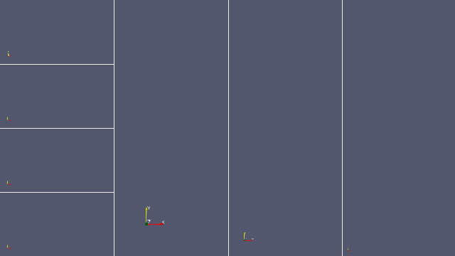
>
> After rearranging.

## Show field data in **SpreadSheet** and _Find Data_ views

A new button in the **SpreadSheet View** and in the _Find Data_ panel enable showing field data associated to points or cells when they are defined by block.

These field data columns are prefixed with "FieldData: ".

> 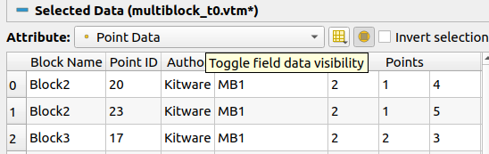
>
> _Find Data_ view showing field data

## _Miscellaneous_ settings reorganization

For clarity sake, some settings in the _Miscellaneous_ tab have been split in two, _IO_ and _Represented Attributes_.

As a user, it means that any settings you put in the _Default reader details_, _Reader Selection_,
_Allowed Readers_ or **Open File** dialog _Location_ variables may be lost on upgrading.

You can either set them again using the settings menu or edit your settings file manually to correct the
settings proxy.


## Support `jpeg` extension for texture files

The `jpeg` extension is now supported for texture files.
## Deprecated Python API removal

Several deprecated Python functions that have been around for a few years are now gone.
This includes:

- `paraview.simple.CreateScalarBar()`, replaced by `paraview.simple.GetScalarBar()`.
- `paraview.simple.WriteAnimation()`, replaced by `paraview.simple.SaveAnimation()`.
- `paraview.simple.WriteImage()`, replaced by `paraview.simple.SaveScreenshot()`.
- `paraview.simple.ImportCinema()`, no longer supported since 5.9.
- `paraview.compatibility.GetVersion().GetVersion()`, because of a float comparison issue.

Other deprecated behaviors have been removed :

- `paraview.compatibility.GetVersion()` cannot be compared with float values anymore.
- In `paraview.simple.CreateView()`, removed support for positional argument `detachedFromLayout`.
- In `paraview.simple.SaveScreenshot()`, removed support for optional argument `ImageQuality`.
- In `paraview.simple.SaveAnimation()`, removed support for optional argument `DisconnectAndSave` and `ImageQuality`.

# Python scripting improvements

## `paraview.inspect` module

There is now a `paraview.inspect` Python module which may be used to query information related to ParaView's version of Python.

```console
$ pvpython -m paraview.inspect
version: 3.11
pythonpath entry: /path/to/some/site-packages
```


## Python state saving improvements

### Python state save animation

Python state now saves the animation state as well, which includes the current animation time but also all the scene properties and even the different animation tracks and keyframes.

### Python state save extract selection

Python state now contains the **Extract Selection** filter.

You can also generate selections in Python scripts that will not appear in the pipeline. Such selections will appear in the state as in this example:

```py
idSelection = CreateSelection(proxyname='IDSelectionSource', registrationName='selection_sources.1', IDs=[0, 7628])
```


## Python Trace default verbosity

In an effort to reduce the length of Python traces, the default tracing behavior has been changed from "Any \*Modified\* Properties" to "Only \*User-Modified\* Properties".


## Rework Python trace and state postamble

When saving a Python trace or a Python state, a postamble is added to help users uses this Python script. It has been improved as a comment with multiple example use cases.

Critically, it replace the previous Python state postamble that actually called `SaveExtracts` when the script was run from `pvpython`, which is not a behavior that is universally wanted.

# Extended reality improvements

## OpenXR remote rendering support in the XR Interface plugin

In the XR Interface plugin, it is now possible to stream the active render window to a remote device with OpenXR. Only a grabbing interaction is available for now. Note that this feature currently only works with the **Hololens 2**.

For more details and build instructions, please see the README.md file in the `Plugins/XRInterface/README.md` directory.


## XR menu interface improvements

Paraview's XR menu interface has been reworked to be more compact, intuitive, and accessible.

### Old interface

> 
>
> The old XR interface.

### New interface

_Properties_, _Information_ and _Display_ tabs have been removed, they can be manipulated from Paraview's desktop interface instead.

The left menu, under the _Pipeline Browser_, has been moved into the new interface, leaving only the "Exit XR" button.

The new interface is organized in four tabs to simplify navigation and also leave enough space for bigger widgets.

Here is a screenshot of each tab of the new menu:

> 
> 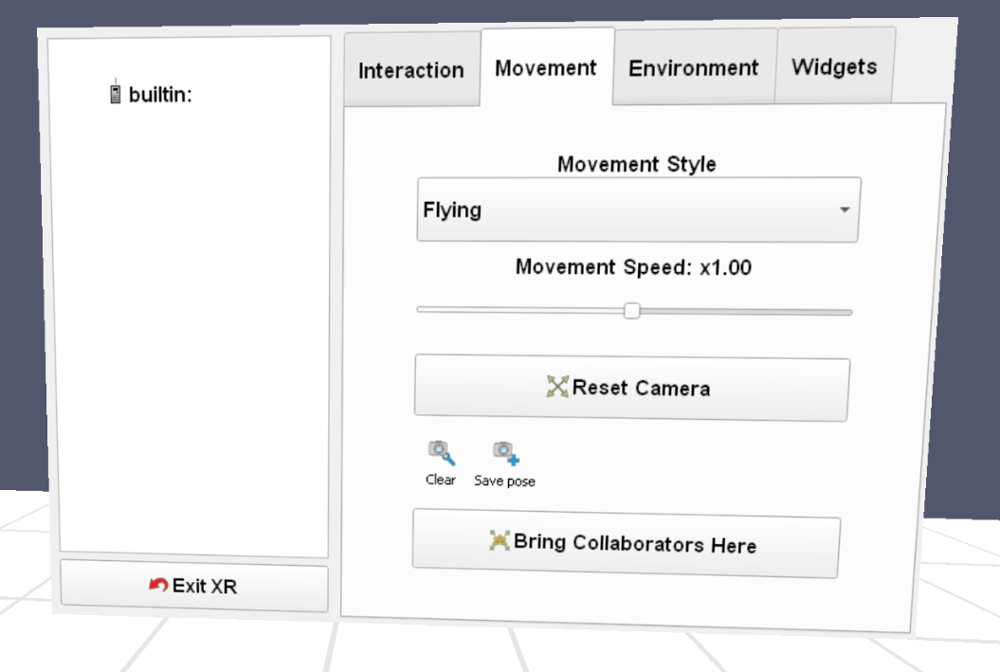
> 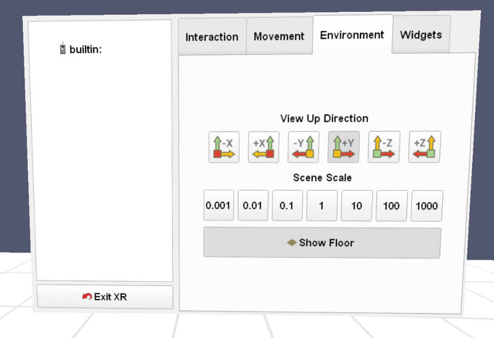
> 

Changes include:
* Checkboxes have been removed, since they were not easy to check in XR, they have been replaced with bigger togglable button
* Most popup menus have been replaced with sliders or other widgets
* Field value-related widgets and animation buttons have been removed
* A new button to hide existing crops has been added

In addition, the _XRInterface_ menu now includes a button to reset the camera. This brings the dataset(s) at the center of the physical world (the space where you can move).

## CMake Options

The XRInterface plugin now only optionally requires OpenVR and OpenXR. Please see `Plugins/XRInterface/README.md` for more information related to building this plugin with these rendering backends.


## CAVEInteraction: customizable Python interactor styles

The CAVEInteraction plugin has been enhanced with a customizable Python interactor style.  If you choose the new interaction type "Python" from the interaction types drop-down list, a file selection widget will appear that lets you choose a Python script file that defines the interaction behavior.

The selected Python script must define a method named `create_interactor_style()` that takes no arguments and returns a Python object implementing the handler methods normally implemented by subclasses of `vtkSMVRInteractorStyleProxy`.

There is an example Python file located at `Examples/VR/CustomizablePythonInteractorStyle.py`


## CAVEInteraction Plugin: Interactor style improvement

The interactor styles defined in the plugin have been converted into ParaView proxies. This change enables the easy addition of properties that affect interactor behavior. Properties added to proxies appear in the ParaView user interface, can be saved to and loaded from state files, and can be manipulated through Python.

# Miscellaneous bug fixes

## Defer default OSPRay materials loading until pathtracing activation

Connecting to a Paraview server with raytracing enabled used to be slow because default OSPRay materials were sent from the client to the server on session startup. Now this long loading time is deferred until OSPRay pathtracing is actually used.


## osmesa static binaries

The official ParaView binaries built with OSMesa using static binaries no longer contains the TTK plugins. This is due to the size of the TTK plugin against a static ParaView coming in around 1.6GB.

## ADIOS2 VTX reader supports non-MPI builds

The ADIOS2 VTX reader can now be built with or without MPI enabled.


# Catalyst


## New documentation site for ParaViewCatalyst

All documentation resources regarding ParaView Catalyst along with a getting started guide are now part of the ParaView documentation website. See the new section [here](https://docs.paraview.org/en/latest/Catalyst/).


## ParaView compatibility versions for Catalyst state

Catalyst Python state files now also includes the compatibility version in the beginning of the state file. Additionally, if `paraview.compatibility` is set and a deprecated proxy, property, or property value needs to be changed, a warning will be printed.


## ParaViewCatalyst Python example added to continuous integration testing

Update the version of `libcatalyst` in ParaView continuous integration testing to bring Python and Fortran wrappings. The new version is used to test `Examples/Catalyst2/PythonFullExample`.


## Fortran Example for Catalyst 2

`Examples/Catalyst2/Fortran90FullExample` provides a full example on how to use the ParaView implementation of the Catalyst API from a Fortran-based simulation.


## **amrmesh** Conduit protocol for Catalyst 2

Support now exists for handling AMR meshes while using the ParaView implementation of Catalyst 2. Users of Catalyst on the simulation side can use `amrmesh` as the protocol string to notify ParaView Catalyst to interpret meshes and build a `vtkOverlappingAMR` object on the VTK side of Catalyst.


## **PlotlyJson** extractor for Line Plots

A new extractor, **Plotly Json**, is now available. It can be used to extract data+style of line plots in a JSON file following the plotly-json [schema](https://plotly.com/chart-studio-help/json-chart-schema/). This allows exporting line plots generated in Catalyst scripts to any library that accepts plotly-json files.


## CatalystBlueprint: improved error reporting

Passing a malformed conduit node to ParaViewCatalyst will now result in a formatted string that indicates which child node has the issue along with any other error message the conduit verification routines return.

Example of a previous error when mistyping `coords` to `coord` in `topologies/mesh/coordset`:
```
(   0.078s) [pvbatch         ]vtkCatalystBlueprint.cx:395    ERR| Conduit Mesh blueprint validate failed!
(   0.078s) [pvbatch         ]   ParaViewCatalyst.cxx:333    ERR| invalid 'catalyst' node passed to 'catalyst_execute'. Execution failed.
```

New Example for the same error:
```
(   0.079s) [pvbatch         ]vtkCatalystBlueprint.cx:394    ERR| Conduit Mesh blueprint validate failed!
(   0.079s) [pvbatch         ]vtkCatalystBlueprint.cx:13     ERR| {
(   0.079s) [pvbatch         ]vtkCatalystBlueprint.cx:13     ERR| .   { topologies
(   0.079s) [pvbatch         ]vtkCatalystBlueprint.cx:13     ERR| .   .   { mesh
(   0.079s) [pvbatch         ]vtkCatalystBlueprint.cx:13     ERR| .   .   .   { coordset
(   0.079s) [pvbatch         ]vtkCatalystBlueprint.cx:13     ERR| .   .   .   } 0.000 s: coordset
(   0.079s) [pvbatch         ]vtkCatalystBlueprint.cx:20     ERR| .   .   .   Errors: 1
(   0.079s) [pvbatch         ]vtkCatalystBlueprint.cx:23     ERR| .   .   .   Error 0 : mesh: reference to non-existent coordset 'coord'
(   0.079s) [pvbatch         ]vtkCatalystBlueprint.cx:13     ERR| .   .   } 0.000 s: mesh
(   0.079s) [pvbatch         ]vtkCatalystBlueprint.cx:13     ERR| .   } 0.000 s: topologies
...
(   0.079s) [pvbatch         ]vtkCatalystBlueprint.cx:13     ERR| } 0.000 s:
(   0.079s) [pvbatch         ]   ParaViewCatalyst.cxx:333    ERR| invalid 'catalyst' node passed to 'catalyst_execute'. Execution failed.
```
# Developer notes

## Translatable string refactor

Most strings that are only displayed in the UI and whoses value are not used for comparison are now framed into the [QObject's tr() method](https://doc.qt.io/qt-5/qobject.html#tr) or [QCoreApplication's translate() method](https://doc.qt.io/qt-6/qcoreapplication.html#translate).

### Proxies translation

Proxies, proxy groups, property labels, Categories, ShowInMenu and entries can now be translated.

### Good practices

Good practices are described in the [Localization page in the Doxygen documentation](https://kitware.github.io/paraview-docs/latest/cxx/LocalizationHowto.html).


## CMake localization system

A translation system has been added to ParaView. It create translations files from source code, UI files and XML files.

It is controlled by two new CMake options:

* `PARAVIEW_BUILD_TRANSLATIONS`: Turn on to generate translation files on build.

* `PARAVIEW_TRANSLATIONS_DIRECTORY`: Path where the translation files will be generated on build.

The ParaView CI generates the files with a dedicated jobs and keeps them as artifacts.


## SPDX Generation in module

ParaView now supports the Software Package Data Exchange (SPDX) standard for communicating software bill of materials (SBOM) information. This standard allows for the accurate identification of software components, explicit mapping of relationships between these components, and the association of security and licensing information with each component.

See [here](https://docs.vtk.org/en/latest/advanced/spdx_and_sbom.html) for more information.

To support the standard, each VTK module may be described by a `.spdx` file. Configuring ParaView with the option `PARAVIEW_GENERATE_SPDX`, set to `ON` enables SPDX generation for each VTK module.

Generated SPDX files are based on the SPDX 2.2 specification and are named after `<ModuleName>.spdx`. The generation of SPDX files is considered experimental and both the VTK Module system API and the `SPDXID` used in the generated files may change.

SPDX information have been added and replace all previous copyright declaration in all ParaView files. Please follow VTK recommendations in that regard.


## Experimental support for Qt6

Experimental support for Qt6 has been added to ParaView. ParaView will find both Qt5 and Qt6 on your system and you can select the version to use using VTK_QT_VERSION CMake option.


## `WarnOnCreate` hint input type and memory conditions

The `WarnOnCreate` hint now supports input type conditions (with a DataTypeDomain syntax) and relative memory conditions. See `ProxyHints.md` in the ParaView repository for the documentation.

The `WarnOnCreate` hint has been added to many filters, which should help users avoid out of memory or swapping issues.

> 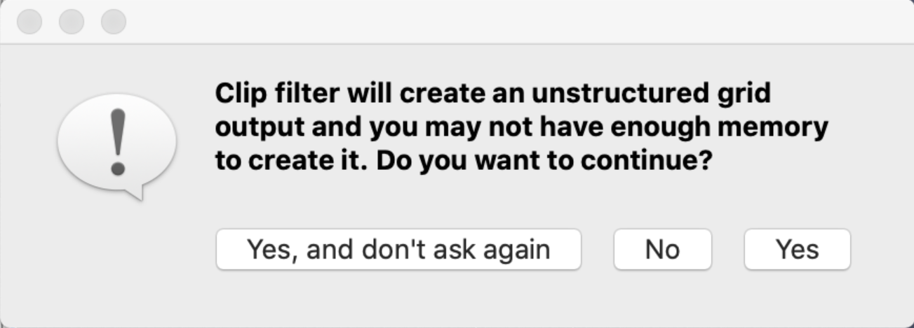
>
> Example of a warning message shown with a `WarnOnCreate` hint.


## Cell Grid Support

### Developer-facing changes

ParaView now includes some basic support for the new `vtkCellGrid` subclass of `vtkDataObject`:

+ It can load JSON-formatted `.dg` files using `vtkCellGridReader`.
+ The `vtkPVDataInformation` and `vtkPVArrayInformation` classes now generate summary information for cell-grid objects and their cell-attributes.
+ Cell grids are renderable via a new representation that includes surface and outline representation-styles.
+ The `Convert to Cell Grid` filter will convert unstructured grids (optionally with special markup data) into cell grids.

### User-facing changes

If you have or create `.dg` files with discontinuous data, you can now load and render them in ParaView.

### Known issues and missing features

+ Choosing components of a cell-attribute to color by does not work.
+ Rendering with an opacity < 1.0 is slow due to forced re-uploads of arrays to
  the GPU each frame.
+ Selection of cell-grid data (blocks, points, cells) is not implemented yet.


## New multi-threaded callback queue

ParaView now instantiates a multi-threaded callback queue per process. It is accessible from `vtkProcessModule::GetCallbackQueue()` and is an instance of `vtkThreadedCallbackQueue`. One can push functions and arguments to this queue and the queue will execute them on the threads that are spawned by the queue in the background.

When saving screenshots and images, you can now use have ParaView use this queue by setting the property `SaveInBackground` of the proxy `SaveScreenshot` to true. Developers should be mindful that when using this feature, reading the screenshot that we are saving in the background needs synchronization so the file cannot be read before it is finished being written. This can be done using the new static function `vtkRemoteWriterHelper::Wait(const std::string& fileName)`. Just provide the file name using either a relative or absolute path, and this function will terminate once the file is written.

The number of threads can be set in the _Settings_ dialog in the _General_ section. This is an advanced property named **NumberOfCallbackThreads**.


## New `AllowRestoreDefaults` hint in `pqScalarValueListPropertyWidget`

A new hint has been added to `pqScalarValueListPropertyWidget`, `AllowRestoreDefaults`. When this hint is added, one can reset a scalar value list property to default value by pressing the new button.

> 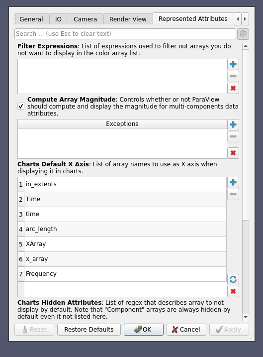


## Fix keyboard focus grabs by property widgets

When a property widget (generally, `pqInteractivePropertyWidget` instances such as plane widgets, coordinate-frame widgets, etc.) registered keyboard shortcuts with a context widget, the context widget would become focused any time the property widget became visible. This was annoying in situations where you were actively pressing keys. For example, you might be using the arrow keys in the _Pipeline Browser_ to switch between pipeline filters when suddenly the keyboard focus switched to the active 3-D view.

This situation occurred because the `pqShortcutDecorator` would always switch the focus to a `pqModalShortcut`'s "context widget" (generally the active render view) whenever the property widget became visible.

Going forward, the focus is not diverted. Instead shortcuts are active for the window, instead of just a widget and its children. `pqPointPickingHelper` was modified to check whether the mouse is inside the target view before acting on a shortcut keypress. When a pipeline object is shown in the _Properties_ panel, or when switching views, keyboard shortcuts are activated for the first item that has them. Otherwise, you must click on the context widget for the shortcuts to be accepted.


## Coordinate-frame property widget user interface

The user interface for the coordinate-frame property widget has been updated to be more compact and more usable.

> 

- What was a large label holding instructions is now a tool-tip.
- The array of large buttons at the bottom is now a drop-down menu of actions at the top center.
- The `pqDoubleLineEdit` widgets no longer cause immediate updates to axis coordinates, as these immediate updates caused other axes to end up pointing in unexpected directions. Also, manually entered values were untouched even though the widget requires unit-length vectors. To get around these problems, there is now a button to the right of each axis you must press to set that axis's coordinates.
- The buttons that commit manual changes to axis coordinates are colored to match the axis colors in the 3D Render View.


## ParaView-based applications: support custom sort method in the spreadsheet

ParaView-based applications can now explicitly specify the order of columns in any SpreadSheet View using `OrderColumnsByList` and `SetOrderedColumnList`.


## New `TimeStepsDomain` for `DoubleVectorProperty`s

A new timesteps domain has been added to fill a double vector property with input timesteps.

It can be used like this:

```
<TimeStepsDomain name = "timesteps">
  <RequiredProperties>
    <Property function = "Input" name = "Input" / >
  </ RequiredProperties>
</ TimeStepsDomain>
```


## `vtkSMDocumentation::GetDescription` now provides a cleaned up string

`vtkSMDocumentation::GetDescription` now provides a cleaned up string, without extra spaces or line endings.


## `DockWidgetCustomProxy` example plugin

A new example plugin, `DockWidgetCustomProxy`, has been added. It demonstrates how to create a custom proxy and instantiates it in a dock widget.


##  Enable hiding cursor in RenderViews

You can now hide the cursor in render views through `pqRenderView` API. You can also use the `HideCursor` dedicated XML hint.

How to use it:

```
    <RenderViewProxy ...>
      ...
      <Hints>
        <HideCursor/>
      </Hints>
    </RenderViewProxy>
```


## Fix and improve label creation for property and proxy name

When no label has been defined for an XML property or proxy, `vtkSMObject::CreatePrettyLabel()` creates a label from its CamelCase name. It was previously done using `vtkSMProperty::CreateNewPrettyLabel()` which is now deprecated.

* The method better splits the name to also split words following multiple uppercase letters.
* Multiple uppercase at the beginning of the name does not create an incorrect space between first and second letter anymore.
* Proxy names are now prettyfied, which was not the case before.


## `ViewLinks`

ParaView is able to link objects and their properties so that modifications made on one are forwarded to the other. However, there were some limitations:
 * `ProxyLink` links any kind of proxies but does not trigger a rendering when used with views.
 * `CameraLink` does trigger rendering but it links only camera properties of RenderView proxies.

`ViewLink` is a new link that bridges this gap: properties of any kind of view (not only the **RenderView**) are linked **and** the views are rendered automatically on changes. A `ViewLink` excludes camera properties. A `CameraLink` is still needed for that.

The Python interface in the `paraview.simple` module is also improved. New link creation functions were added to the API. Creating a link returns its name, so the link can be easily retrieved and removed at a later time.


## Deprecation headers moved

Deprecation headers have been moved from `Remoting/Core` to `Utilities/Versioning` in order to avoid depending on the entire `ParaView::RemotingCore` module each time you need to deprecate code.

Wrong macro definitions have also been fixed that caused `PARAVIEW_VERSION_NUMBER` to not be defined, which led to warnings about code deprecated in the current version to be displayed.


## Fixed a UI glitch when annotation filtering is enabled

When the `pqTabbedMultiViewWidget` has annotation filtering turned on (so only relevant views/layouts are displayed), then it is possible to get into a situation where no layout tabs are visible and no new tab can be created; you are stuck unable to create any views.

We modified the behavior of `pqTabbedMultiViewWidget` to work around this and made it possible to create new views like so:

1. Change `pqTabbedMultiViewWidget::pqInternals::updateVisibleTabs()` to display (rather than hide) tabs with 0 views (i.e., the tabs that are showing a view selector) even if the annotation filters do not apply.
2. Change `pqTabbedMultiViewWidget::createTab(pqServer*)` to call `updateVisibleTabs()` so that a tab index is assigned to a new layout created by clicking on the "+" tab even when annotation filters would normally hide it.
3. Adds an observer to the `QTabWidget::tabBarClicked` signal that calls `pqTabbedMultiViewWidget::createTab()` when only the "+" tab is visible.

With all of these changes, it is possible to create a new view even with only the "+" tab showing. Be aware that if you create a new view by clicking on a view type, then the next time you click the "+" tab, that layout may be hidden (because now it has views that do not match the annotation filter).


## "Solid Color" option disabled for representations that handle it poorly

Previously, when the "Solid Color" option was chosen from the `pqDisplayColorWidget`, the "Slice" representation would print an error and use the active scalars anyway. The "Volume" representation will show an empty visualization.

The `NoSolidColor` hint is provided in the representation XML so that the `pqDisplayColorWidget` will disable the "Solid Color" option when present.


## Configure Proxy `RegistrationName` for pipeline name

When creating a proxy (eg, on loading a file), the pipeline source created used to be named based on the file opened for readers or to the name of the proxy for other proxies. This is not always the best choice, so ParaView now checks for the `RegistrationName` information-only string property in the proxy. If found, the registration name (hence the pipeline name for readers and filters) is the one given by the information-only property. Otherwise, it falls back to the previous logic.


## Dashboard mode support to XML testing utility and file dialog

In ParaView, when playing a test in CTest, an environment variable (`DASHBOARD_TEST_FROM_CTEST`) is defined so that some dialogs and mechanisms are not displayed to shortcut them.

This is very useful but makes it hard to actually test specifically the dialog being shortcut.

This is now possible thanks to the dashboard mode infrastructure provided by QtTesting.

For standard tests, there is no change. The environment variable will be automatically set when playing/recording tests so that ParaView behaves in dashboard mode in that case.

However, when needing to test a dialog that would otherwise not be displayed, then the Record test dialog can be used to disable dashboard mode. ParaView will then behave as if not in dashboard mode, ignoring the `DASHBOARD_TEST_FROM_CTEST` environment variable.

A dedicated event will be recorded in the XML of the test so that when the test is played, dashboard mode
is also deactivated.

FileDialog players/tranlators are now also only enabled when using dashboard mode.

> 

Developer notes:

- `DASHBOARD_TEST_FROM_CTEST` is now set when recording tests using Tools -> Record Test...
- Some Qt dialog changes their behavior when `DASHBOARD_TEST_FROM_CTEST` (already the case before).
- FileDialog QtTesting translator is now only created when `DASHBOARD_TEST_FROM_CTEST` is set.
- QtTesting record dialog now lets us disable/enable dashboard mode (QtTesting) and unset/put the `DASHBOARD_TEST_FROM_CTEST` environment variable (`pqCoreTestUtility`).
- When unchecking/checking, an event (`dashboard_mode`) is recorded in the XML test  (handled by QtTesting).
- When playing a test, either through ctest, `--play-test` or _Tools -> Play Test..._, the `DASHBOARD_TEST_FROM_CTEST` is set automatically.
- When a `dashboard_mode` event happens, the `DASHBOARD_TEST_FROM_CTEST`  is unset/put, changing behavior of ParaView accordingly.

## Incubator modules

Modules under development without a stable API can be added to ParaView as incubator modules. ParaView has an `INCUBATOR` component that may be requested  to gain access to incubator modules. Python bindings for these modules are available under the `paraview.incubator` package.

## Python autocomplete support

Two new interfaces have been created to wrap autocomplete widget capabilities and Python autocomplete.

 - `pqWidgetCompleter` is a general completion interface.
 - `pqPythonCompleter` provides specific mechanisms for Python completers.

## Test timeout adjustment

If you are developing XML tests in ParaView, you can now change the default test timeout by setting a CMake variable which includes the test name to the number of seconds for that test's timeout.

For example, to make the `UndoRedo1.xml` test timeout 300 seconds instead of the default 100 seconds specified in `CTEST_TEST_TIMEOUT`, just add

```cmake
set(UndoRedo1_TIMEOUT 300)
```

somewhere *before* you call a `paraview_add_*_tests()` macro to add the test XML.

## zSpace plugin added to continuous integration testing

The zSpace ParaView plugin does not need to search for zSpace Core compatibility headers and libraries at configuration time anymore (when ZSPACE_USE_COMPAT_SDK is set to ON, which is the default). Since this plugin does not have any compile-time external dependencies, it has been added to continuous integration to test that it builds correctly.

## zSpace plugin rework

Pure VTK classes of the zSpace plugin have been moved to a dedicated VTK module. Now, the plugin only contains the zSpace custom render view and the zSpace manager.

## New zSpace SDK support

Make the zSpace plugin support the newer zSpace SDK (zSpace Core Compatibility API). This API is compatible with all currently supported zSpace hardware models, including the Inspire.

The legacy SDK (zSpace Core API) remains supported as well. The choice of the SDK to use is done during the CMake Configuration step, by setting the ZSPACE_USE_COMPAT_SDK cache variable (true by default).
