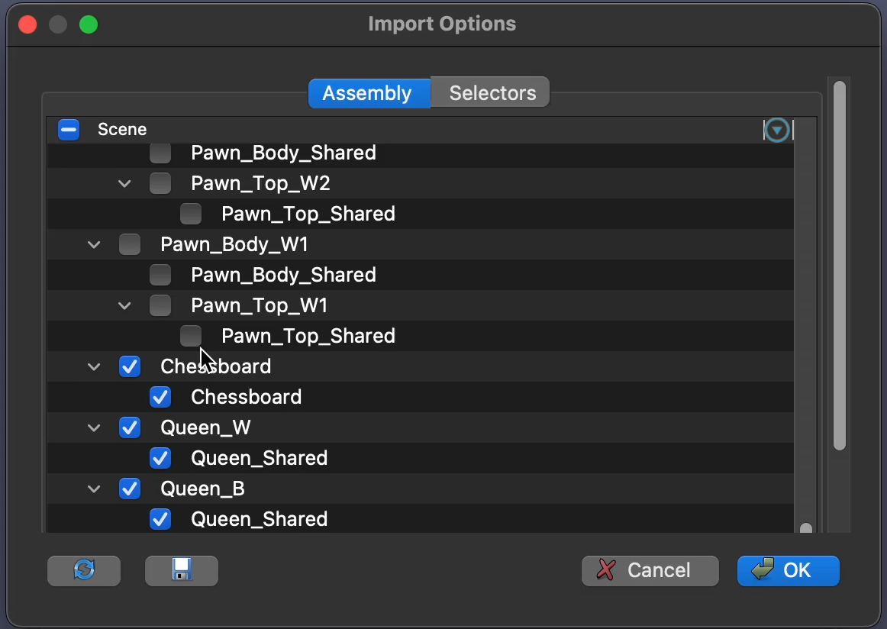
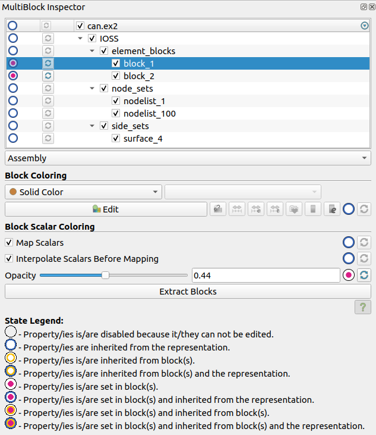
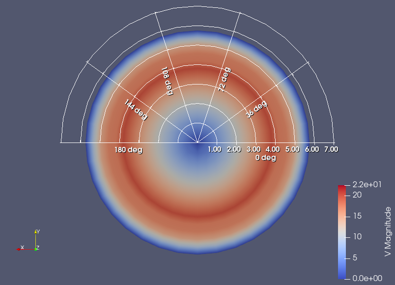
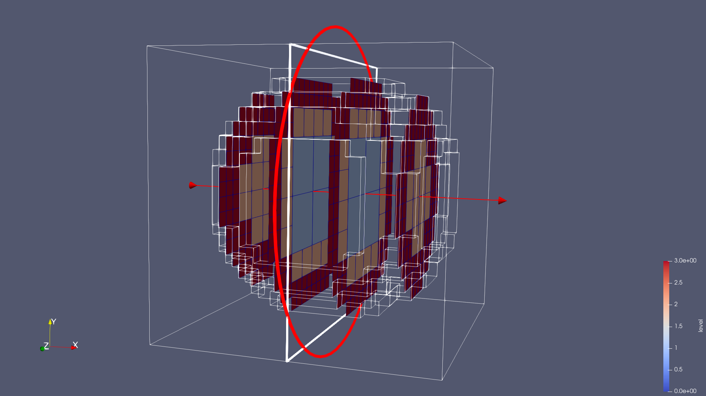
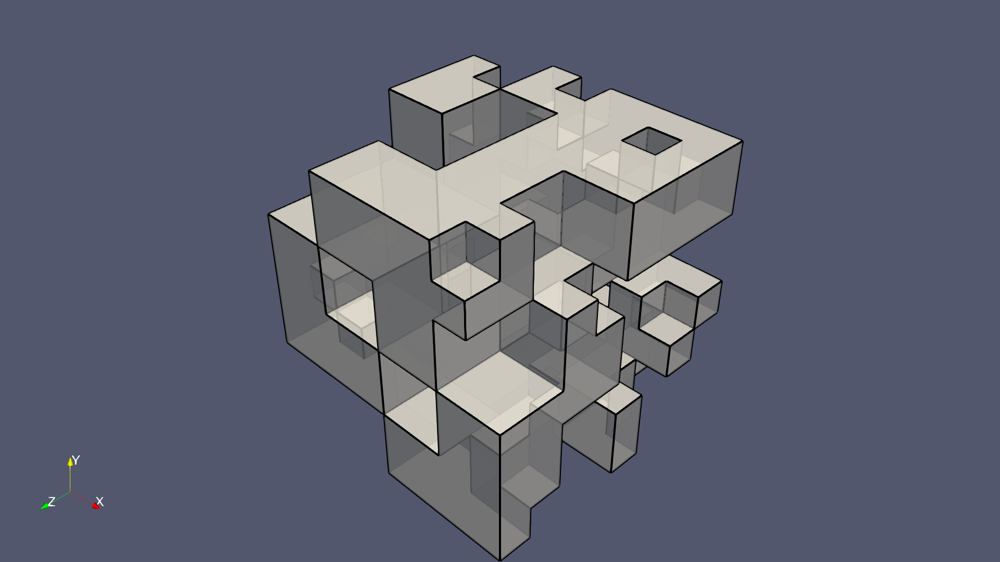
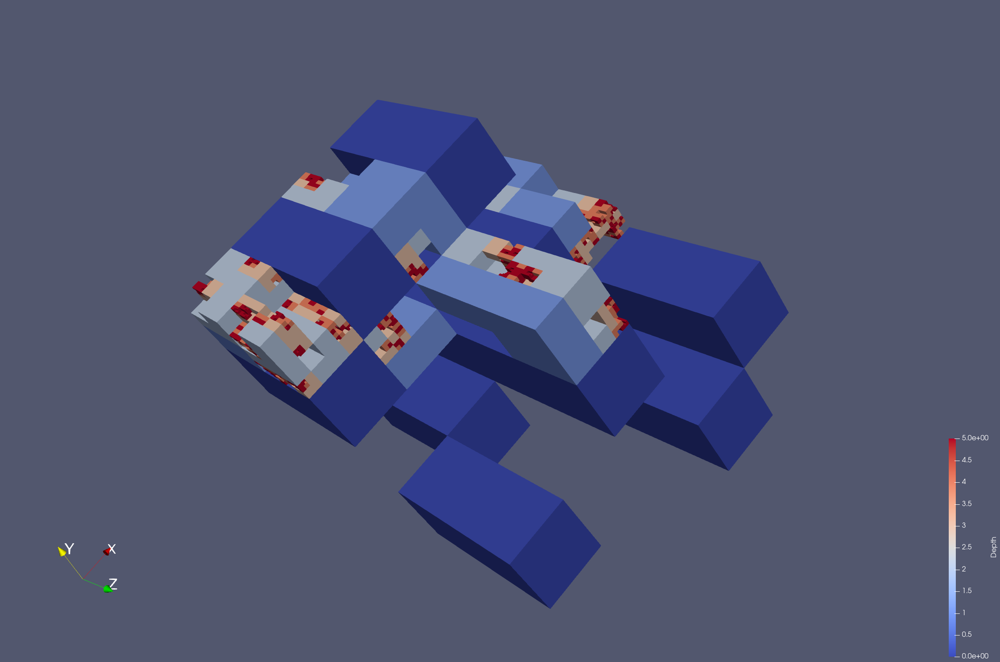
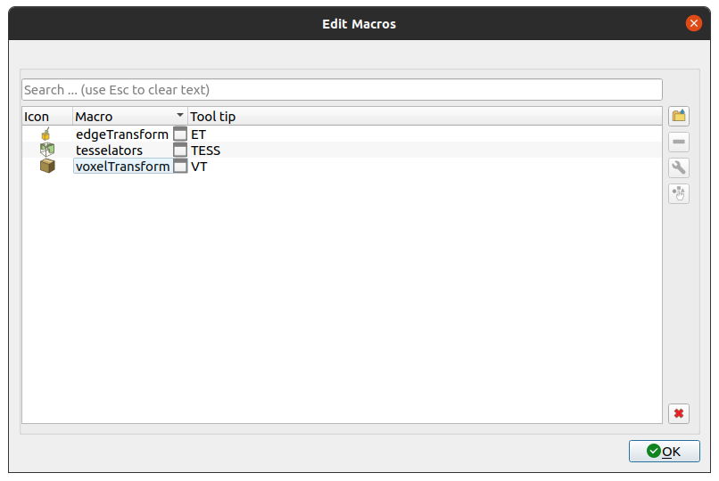
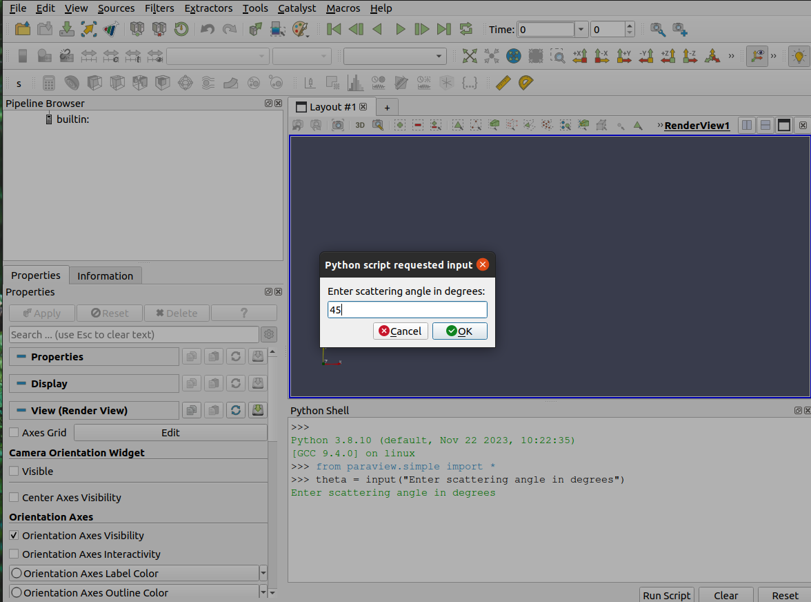

ParaView 5.13.0 Release Notes
=============================

Major changes made since ParaView 5.12.1 are listed in this document. The full list of issues addressed by this release is available [here](https://gitlab.kitware.com/paraview/paraview/-/milestones/25).

* [New features](#new-features)
* [Rendering enhancements](#rendering-enhancements)
* [Plugin updates](#plugin-updates)
* [Filter changes](#filter-changes)
* [Changes in readers and writers](#changes-in-readers-and-writers)
* [Interface improvements](#interface-improvements)
* [Python scripting improvements](#python-scripting-improvements)
* [Web updates](#web-updates)
* [Miscellaneous bug fixes](#miscellaneous-bug-fixes)
* [Catalyst](#catalyst)
* [Developer notes](#developer-notes)

# New features

## GLTF importer

You can now import all or a subset of meshes from a GLTF 2.0 file into ParaView as well as the material properties supported in VTK and textures.

> 
>
> Example of a GLTF scene loaded into and rendered in ParaView.

Use the import options dialog to make a selection of meshes that will be imported.

> 
>
> The GLTF importer's mesh selection dialog.

## New fullscreen mode for active view

The previously supported fullscreen mode sets the tabbed multi-view widget fullscreen, that is, all views are maximized, including separators and decoration.

ParaView now has a new fullscreen mode showing only the current active view in fullscreen (shortcut: Ctrl + F11). The new mode is intended to be closer to a "classical" fullscreen mode.

This is in part motivated by the need of some hardware (like the zSpace Inspire) to have a strict fullscreen mode in order to display the rendered scene correctly.

## Select Blocks Through

ParaView's RenderView now has a new selection action called "Select Blocks Through".
This action allows you to select all blocks that are inside the selected frustum.
This is useful for selecting blocks that are hidden behind other blocks.

## _MultiBlock Inspector_ support for coloring blocks by different arrays

In the previous version of ParaView, _MultiBlock Inspector_ supported changing only the following block properties:

* **Visibility**
* **Color**
* **Opacity**

All properties were previously set through controls in the multiblock tree.

Now, the _MultiBlock Inspector_ supports changing the following the block properties:

* **Visibility** via a column in the multiblock tree
* **Color**
* **Color Array**
* **Use Separate Color Map**
* **Interpolate Scalars Before Mapping**
* **Opacity**
* **Map Scalars**

With the exception of the **Visibility** property, all the properties in the new inspector are set in a small block color property panel below the multiblock tree. The **Visibility** property is set via a checkbox in the multiblock tree.

Each property has a state indicator and can be reset to the default value. All block selectors also have a state and a reset button for all of the properties of a block or parent of blocks.

To change a property of a block/blocks, the select the blocks in the _MultiBlock Inspector_ and then change the desired property in the block color property panel. The change will be applied to all selected blocks.

> 
>
> The revised _MultiBlock Inspector_ enables setting additional per-block properties by controls in the block color property panel.

## VTKHDF file writer

A VTKHDF writer and extractor are now available in ParaView.

Currently, this writer supports writing Unstructured Grid and Polygonal Meshes, with time series support, as well as composite types Partitioned Dataset Collection and Multi-block Dataset, without time series support. This writer can also write compressed data to save storage space.

The VTKHDF exporter writes time-dependent data as file series, not using the time series support in the VTKHDF writer.

## Command-line option to choose `pvserver` socket bind address

Add the `--bind-address` command-line option to `pvserver`. This option allows changing the address bound to the server socket, so that it is not necessarily exposed on all interfaces using `INADDR_ANY` (0.0.0.0).

## Server-only command-line options configuration file

Settings are now supported for `pvserver`, `pvrenderserver` and `pvdataserver`.

These executables parse a file named `ParaViewServer-UserSettings.json` and look for settings named according to `pvserver` command-line connection options.

This file is expected to look like this:

```
{
  "cli-options" :
  {
    "connection" :
    {
      "connect-id" : 17,
      "reverse-connection" : true,
      "client-host" : "bailey"
    }
  }
}
```

The name of the setting is the "long" version of the option, without the two leading dashes.

**only connection options are supported.**


# Rendering enhancements

## Geometry representations can compute surface normals

Geometry representations can now compute surface cell and point normals by enabling the new **Compute Point Normals** property. This can be a convenience to avoid the need to add an **Extract Surface** filter followed by a **Generate Surface Normals** filter. This option is available for the **Surface**, **Surface with Edges**, and the **Surface LIC** representations.

## Faster time to first render with static meshes

ParaView now uses a cache to save time when computing surfaces to display. If the surface mesh is unchanged since the last time it was extracted and caching is enabled, the extraction step simply uses the cached result, saving significant work in the steps leading up to the first render after a change is made.

This feature is not available in distributed execution.

## New **Polar Grid** annotation in **RenderView**s

**RenderView**s now have a new annotation available: the **Polar Grid**.

Similar to the **Polar Axes** already existing the Representation level, the **Polar Grid** can display axes and arcs, annotated with polar coordinates.

Like the **Legend Grid**, this new annotation is drawn in the screen space. Thus, it is only available when **Camera Parallel Projection** is enabled.

> 
>
> Example of a **Polar Grid** annotation

## Python block coloring functionality

ParaView now has new block coloring capabilities thanks to additional block-specific properties and Python functions that apply to representations. New Python functions including `ColorBlocksBy()` and `GetBlockColorTransferFunction()` are also available to script block coloring options. An example can be found
in `Clients/ParaView/Testing/Python/ColorBlockBy.py` test in ParaView's source code.

## Surface representation **Texture Transform** property

The new **Texture Transform** property has been added to translate, rotate, and scale texture coordinates when a texture is applied to an object. Since this transform can flip a texture by using a negative scale factor, the **Flip Textures** property has been deprecated.

## Configurable maximum radius for **Polar Axes**

You can now configure a custom maximum radius for the **Polar Axes**. Note that by default the custom maximum radius is off and therefore it is automatically computed relative to the pole position.

## Constant shading per object feature

Before this feature, you could disable the lighting only for a whole view using the **Light Kit** checkbox inside the **Light Inspector**. This change allows you to disable lighting for a single source with a new display property named **Disable Lighting**.


# Plugin updates

## zSpace Inspire support in ParaView

The zSpace plugin now uses a dedicated render window class to support the specific rendering mode of the latest zSpace hardware. Unlike previous models, the zSpace Inspire does not rely on quad buffering to display stereo content. It uses its dedicated stereo display instead to perform stereo rendering. In order to have a working stereo effect, the current active view should be shown in fullscreen. Note that the zSpace Stereo Core Compatibility API should be used with this display.


# Filter changes

## **Axis-Aligned Slice** filter

The **Axis-Aligned Slice** filter is now available in ParaView.

This filter produces axis-aligned slices of the input data. The output data type is the same as the input, effectively reducing the dimensionality of the input data by one.

For now, this filter supports Hyper-tree Grids and Overlapping AMR Datasets as input data, and **Axis-Aligned plane** as cut function. In the case of Hyper-tree Grids, it also supports producing multiple slices at once.

This filter also supports composite datasets of Hyper-tree Grids. In such cases, it will iterate over each Hyper-tree Grid and generate a new hierarchy with added nodes containing the slices.

Please note that usages of **Axis-Aligned plane** in the **Slice** and **Slice With Plane** filters are deprecated in favor of this new dedicated filter.

> 
>
> Results showing multiple axis-aligned slices from a Hyper-tree Grid.

## **Force Static Mesh** filter

Introduce a new filter, named **Force Static Mesh**, that explicitly advertises that a mesh has not been modified. This information can be exploited by subsequent filters like the **Surface Filter** for performance and memory optimizations.

## **Feature Edges** filter available for Hyper-tree Grids

You can now apply the **Feature Edges** filter in ParaView to Hyper-tree Grids. The **Feature Edges** representation now works correctly with Hyper-tree Grids as well.

> 
>
> **Feature Edges** filter available for Hyper-tree Grids.

## New **Compute Visible Leaves Size** filter for Hyper-tree Grids

A new Hyper-tree Grid utility filter is available: **HyperTreeGrid Visible Leaves Size**. This filter creates two new cell fields:
- `ValidCell` has a (double) value of 1.0 for visible (not ghost, non masked) leaf cells, and 0.0 for the others.
- `CellSize`'s value corresponds to the volume of the cell in 3D, or area in 2D.

## Add Hyper-tree Grid support to various data generation filters

Following data generation filters now support Hyper-tree Grids as input:

- **Point And Cell Ids**
- **Global Point And Cell Ids**
- **Process Ids**
- **Random Attributes**

Note that only cell data can be generated for Hyper-tree Grids.

## Mask generation for the **Hyper Tree Grid (Random)** source

You can now generate a mask for the **Hyper Tree Grid (Random)** source, it can be controlled by the property **Masked Fraction** that controls the spatial proportion of the Hyper-tree Grid that will be masked. This value is a target and the actual masked fraction of the generated Hyper-tree Grid can differ up to an error margin, depending on the number of trees and the branching factor. Which means a masked fraction with a value near 1 can lead to a not completely masked Hyper-tree Grid, since the error margin still applies for this value.

> 
>
> Mask generation for the **Hyper Tree Grid (Random)** source

## Multi-slice support in **Slice** filter for Hyper-tree Grids

The **Slice** filter can now generate mutliple slices at once when the input is a Hyper-tree Grid.

Please note that this feature is not available when the **Axis Aligned Plane** is selected as the cut function, since this option is deprecated in the **Slice** filter.
You can now use the dedicated **Axis-Aligned Slice** filter to do so.

## More ghost-related filters are available for Hyper-tree Grids

The **Extract Ghost Cells** and **Remove Ghost Cells** filters can now be used for Hyper-tree Grids. Note that these filters mask cells and do not impact the number of cells of the input Hyper-tree Grids.

## New **Critical Time** filter

Given an input that changes over time, the `Critical Time` filter generates a new data array containing time step values. These values correspond to the time at which a specified threshold criterion has been met for a given point/cell array (at each point/cell respectively).

To do so, the filter needs to process all available timesteps. The output of the filter is not temporal.

Like in the `Threshold` filter, the threshold criterion can take three forms:

* greater than a particular value
* less than a particular value
* between two values

# New **Temporal Smoothing** filter

ParaView now has a **Temporal Smoothing** filter that smooths point and cell data from a temporal source by averaging the values over a temporal window defined by the filter's **Temporal Window Half Width**.


## Angle-based and custom field strategies for polyline decimation

The **Decimate Polyline** filter now support multiple decimation strategies through a **Decimation Strategy** property:

- `DecimationAngleStrategy`: use the angle between three consecutive points as error metric
- `DecimationDistanceStrategy` (default, identical to previous versions): use the distance between consecutive points as error metric
- `DecimationCustomFieldStrategy`: use values stored in a custom PointData array to compute the error between three consecutive points. The name of this array must be defined using the **Field Name** property.


# Changes in readers and writers

## Add ERF Reader

You can now read ERF HDF5 files into ParaView. The reader supports version 1.2 of the ERF [HDF5 spec](https://myesi.esi-group.com/ERF-HDF5/doc/ERF_HDF5_Specs_1.2.pdf), specifically:

* Reading a selected stage.
* Reading the 'constant' group.
* Reading the 'singlestate' group.

The output of the reader is a Partitioned Dataset Collection composed of multiple Unstructured Grids for the 'constant' or 'singlestate' groups.

## IOSS reader caching option

The IOSS Reader now has a **Caching** property. When enabled, the reader will cache the mesh data in memory across multiple time steps. Previously, when the option was not present, the reader would always cache data, which could lead to excessive memory usage. Now, the default behavior is to not cache.

## Fixes for the **openPMD reader**

### Data layout issues fixed

The openPMD format allows storage of multidimensional arrays (meshes) in either `Fortran` or `C` data orders with arbitrary axis labeling. Based on the data order, it may be necessary to transpose the data so that ParaView can correctly interpret the meshes.

* For `C` data order, the VTK axis ordering is expected to be (x, y, z)
* For `F` data order, the VTK axis ordering is expected to be (z, y, x)

Transposes are necessary if there is a mismatch in the expected axis ordering. This also fixes problems with 1D/2D meshes that require handling the transposes differently than 3D meshes.

### Avoid scaling meshes and particle records when possible

In files with `unitSI` equal to 1.0, avoid scaling meshes. This is often the case for non-floating point records and unintentionally casts their type to double when we mean to stay in integer or unsigned integer (e.g., particle `id`) scales. Thus, this fixes issues with the latter and avoids unnecessary operations on large data sets.

## Cell-centered data support in FDS reader

The FDS reader now correctly supports reading slice and boundaries files (.sf & .bf), for both point and cell-centered data. Before these changes, only point data for slices was correctly parsed.

## Option in the GLTFExporter to avoid saving NaN color in exported color map textures

A new property has been added to the GLTF Exporter. **Save NaN Value** controls whether the exporter should save the NaN color in the exported texture. If enabled, the NaN color is saved as a second row in the color map texture which might affect how the texture is processed by the application that loads it.

## Enable array selection in Fides reader

You can now choose which arrays should be loaded with the **Fides reader**. The arrays available to load must still be specified in the JSON data model file, but you can now enable/disable loading those arrays through the GUI.


# Interface improvements

## Filter renaming

In in effort to improve ParaView's usability, a number of filters have been renamed to be more concise and meaningful. The list of filters whose names have changed is provided below.

| **Previous name** | **New name** |
| ----------------- | ------------ |
| **Ghost Cells Generator** | **Ghost Cells**|
| **Add Field Arrays** | **Field Arrays From File** |
| **Append Arc Length** | **Polyline Length** |
| **Append Location Attributes** | **Coordinates** |
| **Block Scalars** | **Block Ids** |
| **Compute Connected Surface Properties** | **Connected Surface Properties** |
| **Generate Global Ids** | **Global Point And Cell Ids** |
| **Generate Ids** | **Point And Cell Ids** |
| **Generate Process Ids** | **Process Ids** |
| **Generate Spatio Temporal Harmonics** | **Spatio Temporal Harmonics** |
| **Generate Surface Normals** | **Surface Normals** |
| **Generate Surface Tangents** | **Surface Tangents** |
| **Level Scalars (OverlappingAMR)** | **Overlapping AMR Level Ids** |

Searching for the old names will continue to work for ParaView 5.13.0, and full backwards compatibility with state files and Python scripts from versions of ParaView before version 5.13.0 has been provided.

## Filter categories are configurable

The ParaView `Filters` menu organizes filters into a list of categories. Those submenus can now be customized!

Go to the `Tools -> Configure Categories` dialog to create your own tree of categories. There you can create and rename categories, move filters around, set up icons, and event create toolbar from an existing category.

Some predefined categories have a specific meaning (and thus cannot be deleted):

* `Alphabetical` category lists as usual every filter.
* `Miscellaneous` section contains filters that are not part of any other category.
* `Favorites` is now its own category, so you can configure it the same way.

> 
>
> The categories configuration dialog.

## Improved quick launch window

To add filters, sources, and extractors, you can use ParaView's quick launch window (ctrl + space). In this window you can now see the documentation for the selected filter and the requirements on types of input for the selected filter. Moreover, you no longer need to know the filter actual name - the window also suggests filters based on search matches in their documentation.

> 
>
> The quick launch window now presents more information about filters, sources, and extractors.


## Enhanced `Edit Macros` dialog

You can now edit the names and tooltip text of a Python macro in the _Edit Macros_ dialog. You can also open up the Python script associated with a macro in the code editor by clicking on the button at the end of the macro name column.

>
>
> The _Edit Macros_ dialog allows assignment of icons, renaming, and adding tooltip text to macros.

## Icon Browser: add an icon for your macros

ParaView now offers an interface to select an icon for Macro buttons in the user interface. You can import your own image file or reuse one that ParaView already provides. ParaView stores the imported images under a new Icons directory, under your user directory.

> 
>
> The Icon browser dialog.


# Python scripting improvements

## Display the prompt text from Python input function in the input dialog

The prompt text argument of a call to the `input` function from a Python script is now displayed in the dialog that accepts user input. Prior to this change, the argument was only printed to the _Output Messages_ window.

> 
>
> Dialog shown when `input('Enter Scattering Angle in degrees:')` is invoked in Python.

## New `--venv` command-line argument to specify a virtual environment

All ParaView executables have a new `--venv` command-line argument for ParaView builds where Python is enabled. The path supplied for this argument is the path to a virtual environment that will be activated for the Python environment in these programs.

Usage example:

```bash
pvpython --venv=/absolute/path/to/environment -m my_awesome_module
```

where `my_awesome_module` is installed in the Python environment that is loaded.

The virtual environment will be available in **Programmable Source**, **Programmable Filter**, and the _Python Shell_.


# Web updates

## Removed web applications divvy, lite, and visualization

divvy, lite and visualizer are not bundled with ParaView anymore but
distributed as separate web applications from these repositories:

* https://kitware.github.io/divvy/
* https://kitware.github.io/paraview-lite/
* https://kitware.github.io/visualizer/


# Miscellaneous bug fixes

## Handle semicolon and hash characters in the Recent Files menu

ParaView would crash on startup if a file was opened with a semicolon ";" in the filename. The `Recent Files` menu and saved settings uses ";" as a record separator, and hash "#" as a server name indicator. These characters are now encoded in the settings file to avoid incorrect interpretation.

# Catalyst

Updates listed below refer to ParaView's Catalyst 2 implementation.

## Catalyst pipeline selection

Support for which Catalyst pipelines to execute has been added. This includes Python script pipelines as well as precompiled pipelines. The Python script pipelines are configured with:

```
node['catalyst/scripts/aname'] = afile.py
```

where `aname` is the name of the pipeline. Precompiled pipelines are configure with:

```
node["catalyst/pipelines/0/type"] = "io"
node["catalyst/pipelines/0/filename"] = "foo-%04ts.vtpd"
node["catalyst/pipelines/0/channel"] = "input"
```

where `0` is the name of the pipeline.

Pipelines can be selected by listing them under the `catalyst/state/pipelines` node such as

```
node['catalyst/state/pipelines/0'] = 'aname'
```

Note that the value of the node (`aname`) is what matters and not the name of the node (`0`). It is possible to turn off all of the pipelines by making pipelines a leaf node such as:

```
node['catalyst/state/pipelines'] = 0
```

If `catalyst/state/pipelines does not exist`, Catalyst will, by default, execute all pipelines.

## Custom `catalyst_results` in Catalyst scripts

You can now define custom `catalyst_results(info)` functions in Catalyst scripts which will be executed when the simulation calls `catalyst_results`. The Conduit node passed as input to the call from the simulation side is available via `info.catalyst_params`.

## Catalyst direct access to Conduit during execution

The input parameters of `catalyst_execute` are now accessible as a read-only Conduit node inside a catalyst script.  You can now perform any kind of analysis directly on the data passed by the simulation.

## Extractors for Catalyst steering

Catalyst's "steering" capabilities can send data back to the simulation in order to "steer" it. In order to use the steering, the simulation used to send an XML file specifying a `vtkSteeringDataGenerator` proxy and properties to be filled by Paraview Catalyst.

While this still works, we introduce Catalyst **steering extractors**, a new kind of extractor acting as "sinks" in the visualization pipeline. Calling `catalyst_results` from the simulation will trigger these sinks, and their input dataset will be serialized to Conduit's mesh blueprint and sent back to the simulation in the results Conduit node. This special kind of extractor needs to be created in the Catalyst Python pipeline script. They are **not** associated to a trigger and a writer like other extractors are. They are created by the extracts controller but managed externally by the in situ helper.

Example Catalyst pipeline script:

```python
# Data is provided by the simulation.
producer = TrivialProducer(registrationName="grid")

# Perform a reduction on the input data.
sliced = Slice(Input=producer, SliceType="Plane")

# Create a steering extractor from the slice.
steering = CreateExtractor('steering', sliced, registrationName='steered_slice')
```

This script is executed as usual when `catalyst_execute` is called, but the extraction happens only when the simulation calls `catalyst_results`. This feature can be used to perform a reduction on input data, for example, and get the result in the simulation directly.


# Developer notes

## Fix the behavior of vtkCLIOptions::SetStopOnUnrecognizedArgument

`SetStopOnUnrecognizedArgument` was behaving in an inverted way according to its name and documentation. This was fixed and documentation was clarified.

Now, `vtkCLIOptions::SetStopOnUnrecognizedArgument(true)` will indeed stop the parsing on unrecognized arguments.

See https://github.com/CLIUtils/CLI11/issues/1052 for more info.

## Building against external VTK

Support has been added for compiling against and using an external VTK. The version (git hash) of the external VTK has to match the version of the VTK sub-module included in the version of ParaView being compiled. While this is not enforced, it is likely that you would get a compilation error or a crash if you try to use ParaView with a differnet version of VTK than the one it was tested with (the version of the VTK submodule).

This feature is enabled with the `PARAVIEW_USE_EXTERNAL_VTK` CMake option enabled. `VTK_DIR` can be used to specify the location for the config file of the VTK install, such as: `<vtk_install_dir>/lib/cmake/vtk-9.3`.

Depending on what is enabled in ParaView, certain features need to be provided by the external VTK. The features required by ParaView but not provided by the VTK install, would be printed by CMake at configure time in a format that can be copied and pasted in a VTK reconfigure command that would compile those features in VTK.

## Specification of backend when using VTK-m w/ Kokkos

This change propogates build flags from ParaView to VTK and affects how accelerated filters are built using VisKores (previously `VTK-m`). It does away with the requirement of using flags like `PARAVIEW_USE_HIP` when `VTK-m` is built with the necessary Kokkos backend. This also future-proofs the specification for backends. Two new flags are introduced `PARAVIEW_USE_KOKKOS` and `PARAVIEW_KOKKOS_BACKEND` -- the first flag is considered `ON` automatically if the backend flag is provided.

Here is how you can build with different backends

* `PARAVIEW_USE_CUDA` -- use the native CUDA support from VTK-m
* `PARAVIEW_USE_KOKKOS + PARAVIEW_KOKKOS_BACKEND=CUDA` or `PARAVIEW_KOKKOS_BACKEND=CUDA` will use Kokkos with CUDA backend
* `PARAVIEW_USE_KOKKOS + PARAVIEW_KOKKOS_BACKEND=SYCL` or `PARAVIEW_KOKKOS_BACKEND=SYCL` will use Kokkos with SYCL backend
* `PARAVIEW_USE_KOKKOS + PARAVIEW_KOKKOS_BACKEND=HIP` or `PARAVIEW_KOKKOS_BACKEND=HIP` will use Kokkos with HIP backend
* `PARAVIEW_USE_KOKKOS` will use Kokkos with Serial backend

## Proxy deprecation

Full proxy deprecation is now possible, thanks to improvement in the Python backward compatibility module.
(see `_backwardscompatibilityhelper.get_deprecated_proxies()`). This mechanism is useful for renaming proxies, for example.

## Add support of VTK serialization

You can now serialize and deserialize VTK objects using the VTK Object Manager API. You can enable this feature by turning on `PARAVIEW_USE_SERIALIZATION` setting in CMake.

## New mechanism to delay plugin loading

A new mechanism has been added to the plugin configuration files. It is now supported to load plugins only when needed by a proxy. See the specification of this mechanism in the PluginHowTo.md.

## New `WarnOnPropertyChange` string property widget hint

You can now display a warning message box when a `StringVectorProperty` has been changed using a hint. Set the `onlyonce` attribute to only show the message on the first property change. The `Text` tag specifies the message box title and body text.

For example:

```xml
<Hints>
  <WarnOnPropertyChange onlyonce="true">
    <Text title="Warning: Potentially slow operation">
OSPRay pathtracer may need to transfer default materials from client to server. This operation can take a few seconds in client-server mode.
    </Text>
  </WarnOnPropertyChange>
</Hints>
```

## Source code deprecation and removals

### Deprecations new in 5.13

* The class `pqAddToFavoritesReaction` has been deprecated in favor of the new Categories mechanism. See `pqProxyCategory`.
* In `pqCategoryToolbarsBehavior`, the protected `prepareForTest()` slot has been deprecated as it was mostly unused.
* In `pqColorMapEditor`, the protected member function `setDataRepresentation(pqDataRepresentation* repr, bool forceUpdate = false)` has been deprecated in favor of `setRepresentation(pqDataRepresentation* repr, bool forceUpdate = false)` in the same class.
* In `pqDataAssemblyPropertyWidget`, the `selectorColors`, `compositeIndexColors`, `selectorOpacities`, `compositeIndexOpacities` properties and their associated setters (`setSelectorColors()`, `setCompositeIndexColors()`, `setSelectorOpacities()`, and `setCompositeIndexOpacities()`), variant list getters (`selectorColorsAsVariantList`, `compositeIndexColorsAsVariantList`, `selectorOpacitiesAsVariantList`, and `compositeIndexOpacitiesAsVariantList`), and notification signals (`colorsChanged`, and `opacitiesChanged`) are no longer used.
* In `pqLiveSourceBehavior`, the `pause()`, `resume()`, and `isPaused()` static member functions are deprecated in favor of non-static member functions of the same name in `pqLiveSourceManager`.
* The class `pqManageFavoritesReaction` has been deprecated in favor of the new Categories mechanism. See `pqConfigureCategories` instead.
* In `pqProxyGroupMenuManager`, `vtkSMProxy* getPrototype(QAction* action) const` has been deprecated in favor of `static vtkSMProxy* GetProxyPrototype(QAction*)`, `bool hideForTests(const QString&) const` and `void setEnabled(bool)` have been deprecated because they were mostly unused, `void populateFavoritesMenu()`, `void loadFavoritesItems()`, and `QAction* getAddToFavoritesAction(const QString& path)` have been deprecated because favorites are now a category configurable like other categories, and the protected `Enabled` member variable has been deprecated because it is unused.
* The class `pqFavoritesDialog` has been replaced by the new Categories mechanism. See `pqConfigureCategories` instead.
* The class `pqQuickLaunchDialog` has been deprecated. Use `pqQuickLaunchDialogExtended` instead.
* The class `pqWaitCursor` has been deprecated. Use `pqScopedOverrideCursor(Qt::WaitCursor)` instead.
* In `vtkInitializationHelper`, `static bool InitializeMiscellaneous(int type)` has been deprecated. Use `InitializeSettings` and `InitializeOthers` instead.
* In `vtkGeometryRepresentation`, `void SetFlipTextures(bool)` has been deprecated. Use `SetTextureTransform(vtkTransform*)` instead.
* In `vtkPolarAxesRepresentation`, `void SetEnableCustomRadius()` and `bool GetEnableCustomRadius()` have been removed. Use `void SetEnableCustomMinRadius(bool)` and `bool GetEnableCustomMinRadius()` instead.
* In `vtkSMColorMapEditorHelper`, `static vtkSMProxy* GetLUTProxy(vtkSMProxy* proxy, vtkSMProxy* view)` has been deprecated. Use `static vtkSMProxy* GetLookupTable(vtkSMProxy* proxy, vtkSMProxy* view)` instead.
* In `vtkSMPVRepresentationProxy`, `SetLastLUTProxy(vtkSMProxy* proxy)`, `vtkSMProxy* GetLastLUTProxy()`, and `vtkSMProxy* GetLUTProxy(vtkSMProxy* view)` have been deprecated. Use `void SetLastLookupTable(vtkSMProxy* proxy)`, `vtkSMProxy* GetLastLookupTable()`, and `vtkSMProxy* GetLUTProxy(vtkSMProxy* view)`, respectively, instead.
* In the **Slice With Plane** filter (VTK class `vtkPVPlaneCutter`), the "Axis-Aligned" plane cut function is deprecated. Use the **Axis-Aligned Slice** filter (VTK class `vtkAxisAlignedCutter`) instead.
* In `vtkPVGeometryFilter`, the information keys `POINT_OFFSETS()`, `VERTS_OFFSETS()`, `LINES_OFFSETS()`, `POLYS_OFFSETS()`, and `STRIPS_OFFSETS()` have been deprecated. They are not used anymore.

### Removals

* The `SurfaceLIC` plugin has been removed (deprecated in 5.11). The `Surface LIC` representation is still available in ParaView.
* In `pqAnimationManager`, the `beginPlay()` and `endPlay()` argument-less signals have been removed (deprecated in 5.11). Use the variants with `vtkCallback` APIs instead.
* In `pqAnimationManager`, the `onBeginPlay()` and `onEndPlay()` argument-less slots have been removed (deprecated in 5.11). the variants with `vtkCallback` APIs instead.
* In `pqPropertiesPanel`, the `setAutoApply()` and `autoApply()` methods have been removed (deprecated in 5.11). Use the methods on `vtkPVGeneralSettings` instead.
* In `pqPropertiesPanel`, the `setAutoApplyDelay()` and `autoApplyDelay()` methods have been removed (deprecated in 5.11). Use the methods on `pqApplyBehavior` instead.
* `pqVCRController::playing(bool)` signal has been removed (deprecated in 5.11). Use the `::playing(bool, bool)` signal instead.
* In `pqAnimationScene`, the `beginPlay()` and `endPlay()` signals have been removed (deprecated in 5.11). Use the variants with `vtkCallback` APIs instead.
* In `pqRenderView`, the `selectOnSurface()` method has been removed in favor of `selectCellsOnSurface` and `selectFrustum` in favor of `selectFrustumCells` (deprecated in 5.11).
* `pqServerResource::sessionServer()` and `::setSessionServer()` methods have been removed (deprecated in 5.11). Any calls should just be removed and the resource used directly instead.
* Removed `pqTimelineScrollbar` (deprecated in 5.11). Use `pqTimeInspectorWidget` instead.
* Removed `vtkPVPluginsInformation::PluginRequirementsSatisfied()` method (deprecated in 5.11). Use `vtkSMProxyManager::SatisfyPluginRequirements()` instead.
* Removed `vtkPVRenderView` `VolumeAnisotropy` methods (deprecated in 5.11). Use `vtkVolumeProperty`'s `ScatteringAnisotropy` methods instead.
* Removed `vtkPVGeometryFilter` `UseStrips` and `ForceUseStripsOn` methods (deprecated in 5.11).
* In `paraview.simple`, remove the `Show3DWidgets` and `Hide3DWidgets` functions (deprecated in 5.11). Use `ShowInteractiveWidgets` and `HideInteractiveWidgets` instead.

## Plugin CMake API has new `USE_FILE_SETS` option

The `paraview_plugin_build` CMake API now supports the `USE_FILE_SETS` argument to use file sets when building internal modules.

## New example of plugin using Qt on server side, without PV client

Plugins can make use of Qt classes and resources without using ParaView Qt modules. This can be the case for instance in a module using Qt core features. The module should be built even if ParaView was not built with Qt support. This is typically the case on the server side, where the graphical interface is not enabled.

A new plugin example named ServerSideQt now illustrates how to make use of this new capability.

## `vtkPVVersion`

Most of the version macros have been relocated to `vtkPVVersionQuick.h`. The new `PARAVIEW_VERSION_EPOCH` macro is defined as the actual `PARAVIEW_VERSION_PATCH` value for release-track development and a "high" value for future ParaView release development (i.e., the next minor version bump). The actual patch number, and `PARAVIEW_VERSION_FULL` values are available in `vtkPVVersion.h`. A new `PARAVIEW_VERSION_NUMBER_QUICK` macro provides the ParaView version as a comparable value with `PARAVIEW_VERSION_CHECK` using the `PARAVIEW_VERSION_EPOCH` instead of `PARAVIEW_VERSION_PATCH`. The intent is to reduce the rebuild frequency needed for the nightly build version bump for the in-development source.

## `vtkWrapClientServer` warnings

The `vtk_module_wrap_client_server` CMake API now supports adding warning flags when wrapping. Currently supported is `-Wempty` to warn when a wrapping generates no usable code.

## Widget height hints on properties displayed with a `QComboBox`

You can now specify `WidgetHeight` hints on properties that use a `QComboBox` such as `EnumerationDomain`, `ProxyListDomains` or `StringListDomain`. This hint will control the maximum allowed number of items in the combobox before a scroll bar appears.

```xml
    <StringVectorProperty command="" name="...">
        <StringListDomain name="array_list">
        <RequiredProperties>
            <Property function="..." name="..."/>
        </RequiredProperties>
        </StringListDomain>
        <Hints>
            <!-- This tag sets the height of the QComboBox -->
            <WidgetHeight number_of_rows="5" />
        </Hints>
    </StringVectorProperty>
```

## Introducing Emulated Time Algorithm using LiveSources

LiveSource capabilities have been expanded with a new emulated time algorithm.

Once you've inherited your temporal algorithm from `vtkEmulatedTimeAlgorithm`, you can use the LiveSource concept to synchronize the algorithm's timesteps on a "Real Time" interval (in seconds). It will skip frames if the pipeline processing does not keep up.

An example scenario for this algorithm would be to replay a LiveSource stream from a recorded file while maintaining the original conditions and playback speed.

To implement this behavior, inherit your algorithm from `vtkEmulatedTimeAlgorithm` and define the proxy as a LiveSource with the `emulated_time` attribute.
```xml
  <Hints>
    <LiveSource interval="100" emulated_time="1" />
  </Hints>
```

## vtkPVGeometryFilter: Support creating vtkPartitionedDataSetCollection as output

The `vtkPVGeometryFilter` can now produce `vtkPartitionedDataSetCollection` as output. This is useful when the input is a `vtkPartitionedDataSet`, `vtkUniformGridAMR`, or `vtkPartitionedDataSetCollection`.

## Category XML has `hide_for_tests` option removed

The `hide_for_tests` attribute in Category XML is no longer supported.

## Fix the behavior of vtkCLIOptions::SetStopOnUnrecognizedArgument

`SetStopOnUnrecognizedArgument` was behaving in an inverted way according to its name and documentation. This was fixed and documentation was clarified.

Now, `vtkCLIOptions::SetStopOnUnrecognizedArgument(true)` will indeed stop the parsing on unrecognized arguments.

See https://github.com/CLIUtils/CLI11/issues/1052 for more info.
