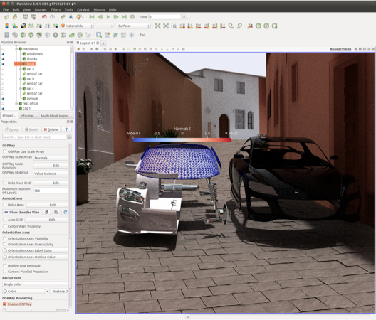
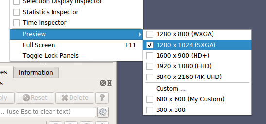
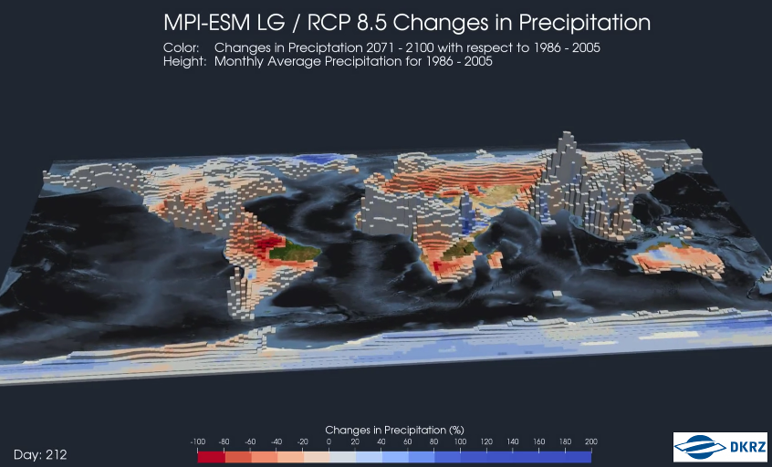
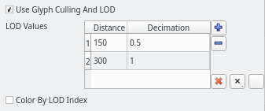
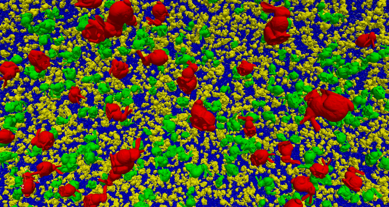
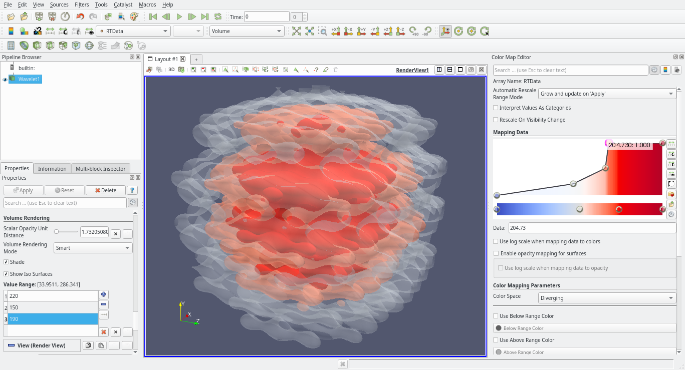
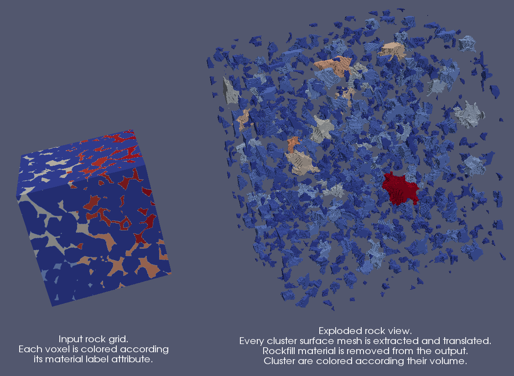
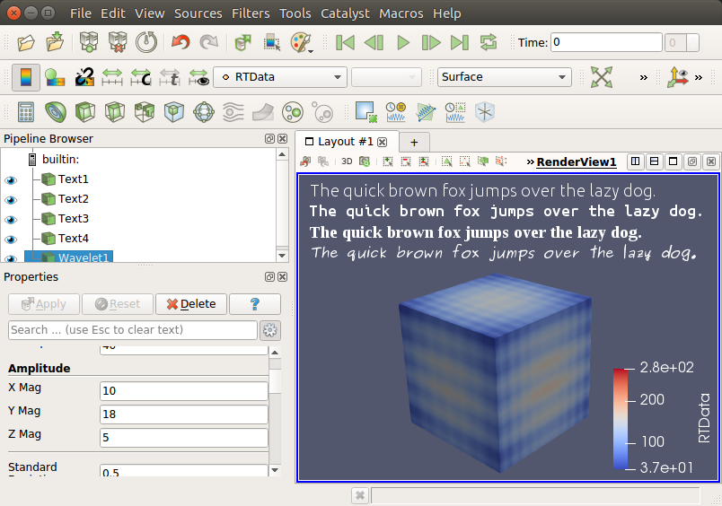

ParaView 5.5.0 Release Notes
============================

The full list of issues addressed by this release is available
[here](https://gitlab.kitware.com/paraview/paraview/-/milestones/7). Major changes
made since ParaView 5.4.1 include the following:

# Rendering Enhancements

## More updates to OSPRay ray traced rendering

ParaView's Ray Traced Rendering capacity continues to evolve. In this release
we've updated to a new version of OSPRay that gives us the ability to directly
volume render Overlapping AMR and Unstructured Grid data in addition to the
Structured Grid that we've had for a couple of releases now. We've also exposed
a path tracing option for surface geometry. What this does is give the capacity
for full photorealism by sampling the scene with many more rays and ray bounces
than before. For this purpose we've added the **Light Inspector** panel in which
you can add, remove and more precisely control an arbitrary number of lights in
the scene. The **Light Inspector's** radius control, which results in soft
shadows with the path tracer, is the only part of the panel that is specific to
OSPRay, the rest is also useful for standard rendering. Also, for the purpose of
photorealism, we've added an ability to import JSON-based OSPRay Material
specification files. Materials are a way to give objects, blocks, or cells
advanced textures and arbitrary appearance properties that make them look like
metal, glass, and other real world effects. Note that many features of the path
tracer (like shadows before and reflections and refractions now) will result in
rendering artifacts in distributed memory parallel runs.

||
|:--:|
| *OSPRay path tracer combined with typical visualization capabilities.* |

## Support for rendering lines as tubes and points as spheres

Using **Render Lines As Tubes** and **Render Points As Spheres** properties in
the **Display** section on the **Properties Panel**, it's now possible to render
lines as 3D tubes and points as 3D spheres.

## Preview mode

To make it easier to generate publication quality images, ParaView has a new
**Preview** mode. **Preview** mode is similar to the **Print Preview** mode
offered by many tools, including your web browser. The idea is to provide a way
to do final visualization setup just prior to saving a screenshot or animation
in a way that minimizes surprise object rescaling in the save image output,
which can happen if the ParaView window  aspect ratio differs from the requested
image resolution aspect ratio. To use **Preview** mode, select a target
resolution from the **View -> Preview** submenu and the active layout will be
resized to match the chosen resolution. If the target resolution is larger than
the space available for the layout tab on your screen, it will be resized to
match the target aspect ratio.

||
|:--:|
| *Preview mode resolution size selection.* |

## Improvements to Eye Dome Lighting with remote rendering.

A number of bugfixes went into the Eye Dome Lighting and IceT layers to allow
this screen-space ambient occlusion algorithm to work on parallel/remote render
servers.

## Embossing plugin

This plugin adds three new representations.

* **BumpMap** : computes on the GPU fake normals based on the gradient
of the selected point data, creating a relief effect.
* **Extrusion (cell mode)** : computes on the GPU an extrusion based on
the value of the cell.
* **Extrusion (point mode)** : computes on the GPU a height field based
on the value of the cell.

||
|:--:|
| *Extrusion map created with the embossing plugin. Data and picture credit: [http://www.dkrz.de/](DKRZ).* |

## Categorical coloration improvements

 * Annotation now always has a color, using a default and by looping when adding
 annotations after the size of the color map.
 * Automatic annotation generation can now be forced over its previous maximum
 (32).
 * The Color Legend is now hidden automatically when the number of annotations
 is bigger than 32.
 * Opacity can now be set globally, on the selected category, or on an
 individual category.

## Depth peeling for volumes

This option is now exposed through settings. Enabling it will include volumes in
the depth-peeling pass to render intermixed volumes with translucent polygons
correctly.

## 3D Glyphs representation culling

It is now possible to enable culling and level of detail (LOD) in the **3D
Glyphs** representation. This enables rendering a higher number of glyphs at
interactive frame rates. When the option is enabled, instances that are not
visible are discarded and not drawn. One can also specify LOD parameters inside
a table. The first table column is the distance after which the LOD is enabled,
the second column is the reduction factor applied to the instance geometry. It
is also possible to display instances in different colors depending on the LOD.
Please note that this feature works only with OpenGL driver >= 4.0.

||
|:--:|
| *3D Glyphs representation option in the user interface.* |

||
|:--:|
| *3D Glyphs rendering 1 million instances of a bunny model.* |

## Horizontal color legend title in vertical orientation mode

As in earlier versions of ParaView, it is again possible to orient the
color legend title horizontally when the color legend is oriented vertically.
By default, the title is rotated 90 degrees counterclockwise and aligned with
the color legend vertically.

## Image volume representation can now render isocontours

Thanks to a recent change in VTK, it is now possible to use the OpenGL-based
volume rendering mapper to display isocontours without precomputing them on the
CPU. This feature is exposed through two new properties on the image volume
representation: **Show IsoSurfaces** to enable the feature, and
**Contour Values** to specify the isocontours values similar to how they are
set in the **Contour** filter.

||
|:--:|
| *Image volume representation isocontours.* |

# New Features

## Adding filters from the Pipeline Browser context menu

It is now possible to create new filters from the **Pipeline Browser**
context menu. Only filters that are applicable to the active source
are shown in the context menu.

## Saved custom camera positions

**Adjust Camera** dialog now allows saving of more than 4 camera positions. The
limit has been extended to 30 positions, with a minimum of 4. You can
add/remove positions within this limit using the **Adjust Camera** dialog's
**Configure...** button.

## Added LZMA compressor and compression level setting for XMLWriter

The LZMA lossless compressor is now available when writing XML data files,
offering a higher compression ratio and higher write time compared with existing
LZ4 and ZLib compressors. A **Compression Level** setting is now available to
fine tune the tradeoff between compressed file size and write time for each
compressor.

## Arbitrary-order Lagrange finite element support

ParaView's XML readers and writers support arbitrary-order Lagrange finite
elements. The **Unstructured Cell Type** source can be used to generate
representative grids with Lagrange elements.

|||
|:--:|
| *An example of a grid with higher-order wedges.* |

## Proxy sources selection order is now respected

Previously, the order of selection of the proxies in the pipeline was not
respected. For instance, selecting a **Box Source** first and then a
**Sphere Source** in the pipeline before applying a **Group DataSets** filter
did not ensure that block 0 would be the box. Selection order is now respected
- note that order was already respected when using the **Change Inputs** dialog.

## Introduce a new plugin called DigitalRockPhysics for rock analysis

This plugin introduces two new filters to help the analysis of digital rock.

* The **Material Cluster Analysis** filter produces a multiblock dataset that
  contains two blocks:

  * A table (block 2) that contains the volume (number of cells of every
    cluster) and barycenter of every cluster (set of connected cells that have
    the same point data material attribute); and,

  * A copy of the input data image (block 1) with new point data arrays that
  correspond to the volume and barycenter of the material cluster it belongs to.

* The **Material Cluster Explode** filter creates an exploded surface mesh of
the clusters (the set of connected cells that have the same material attribute)
described in the input image data.

||
|:--:|
| *Exploded rock view from the DigitalRockPhysics plugin.* |

## Expose vtkMolecule type for Programmable Source and Programmable Filter

We add support for `vtkMolecule` as input/output data type in the Python
**Programmable Source** and **Programmable Filter**. Molecule type is now also
exposed correctly in the **Information Panel**.

## AMReX particles reader

ParaView now supports reading particle data from AMReX plotfiles. The reader
supports both single plotfile or multiple plotfiles that form a time series.

## JSON based new meta file format for series added

`vtkFileSeriesReader` now supports a new meta file format based
on JSON. This format has support for specifying time values.
The format (currently version 1.0) looks like the following

```json
{
  "file-series-version" : "1.0",
  "files" : [
    { "name" : "foo1.vtk", "time" : 0 },
    { "name" : "foo2.vtk", "time" : 5.5 },
    { "name" : "foo3.vtk", "time" : 11.2 }
  ]
}
```

The reader will interpret any files that end with the `.series` extension as a =
meta file. To add support for the meta file for a reader in the readers
description, add the `extension.series` extension to the extension list. For
example, for legacy VTK files, the reader now supports `.vtk` and `.vtk.series`

## GDAL and PDAL Readers

ParaView now supports geospatial ([GDAL](http://www.gdal.org/) Raster and Vector
Reader) and point cloud data ([PDAL](https://www.pdal.io/) Reader). Any dataset
supported by GDAL or PDAL libraries is now supported by ParaView.

||
|:--:|
| *An orthorectified satellite image and a point cloud of Jacksonville, FL, rendered in ParaView.* |

## CGNS library updated to v3.3.1

CGNS library has been updated to version 3.3.1. This version contains a bug fix
that allows loading large files in Windows.

## Orienting by quaternion in 3D Glyph representation

When the **3D Glyph** representation is selected, one can use a data array to
define the orientation of the glyphs. Previously, one had a choice between
direction vector or angles around three axes (both by selecting a 3-components
array). We added a new **Quaternion** mode to specify the orientation through a
4-components point array with quaternions defined in WXYZ format.

## Plotting full dataset over time

A newly added filter **Plot Data Over Time** supports plotting entire datasets,
and not just the selected subset. When in distributed mode, however, the current
implementation show stats for each rank separately. This will be fixed in a
future release to correctly compute distributed statistical summaries.

## Selecting arrays to read in PVD reader

PVD reader (`vtkPVDReader`) now supports selecting which arrays to read. This
can be useful to minimize memory foot print and reduce I/O times when reading
PVD files by skipping arrays that may not be needed.

## Restore user preferences to default

ParaView now supports restoring user preferences to default from the **Edit**
menu. One can optionally generate backup files before restoring user preferences
to default.

## Format-specific options in save animation and screenshot dialogs

Dialogs for save-screenshot and save-animation now show file format-specific
options for quality, compression, etc., rather than a single **Image Quality**
parameter which was internally interpreted differently for each file format.
This allows the user finer controls based on the file format, in addition to
avoiding confusion.

## Support of TrueType font files

It is now possible to display 2D and 3D text with TrueType font files you
provide, and thus use fonts different from the built-in fonts (Arial, Courier,
and Times). This feature is accessible by choosing `File` as the font family
in the **Font Properties** property and then specifying the full path to the
`.ttf` file in the file selection field.

||
|:--:|
| *TrueType fonts can now be used for text.*|

## Upgrade from vtkHyperOctree to vtkHyperTreeGrid

All functionality related to the experimental `vtkHyperOctree` tree-based AMR
implementation has been deprecated in VTK and removed from ParaView. It is being
replaced with the newer `vtkHyperTreeGrid` data structure, which is more
efficient and more expressive than its predecessor. The new `vtkHyperTreeGrid`
is a superset of previous implementation. This ParaView release includes a more
efficient hyper tree grid implementation than in 5.4 along with VTK XML based
IO, a few dedicated filters, and bug fixes.

## Clip filter improvements

Clip filter now can clip away the exact exterior of a box. Note, though, that
this is an expensive operation as it performs six plane clips in order to
provide the exact box clip.

Which portion of the geometry was clipped has been inverted as the default was
confusing for the **Box**, **Sphere**, and **Cylinder**. Now, the clipped
geometry is interior to the clip shape rather than exterior.

## Ghost cell utilities

The **Generate Ghosts Cells** filter was added. It generates a requested level
of ghost cells. The **Remove Ghost Information** filter will remove ghost cells
from datasets.

## Filter changes

Attribute arrays appended with the **Append Attributes** filter are renamed to
accommodate inputs with arrays having the same name.

All filters are now available in the GUI regardless of how many `pvserver`
processes are being used. This will allow filters like **Process Id Scalars**
and **Generate Ghosts Cells** to be easily added with a serial `pvserver`
process with the intent of saving a Python trace, state, or generating a
Catalyst Python script that can be properly used in parallel later on.

Added option to specify array type for **Calculator** filter. This is the
available via the new **Result Array Type** advanced option.

Added the **Cell Size** filter to measure the number of points for vertex or
polyvertex cells, length for 1D cells, area for 2D cells and/or volume for 3D
cells.The sizes are output in separate cell data arrays and you can choose which
arrays to output. The filter also includes an option to sum the size and will
output this in field data arrays.

Added new options for `vtkGradientFilter` for controlling which cells contribute
to the gradient calculation.

## Reader and writer changes

A new GenericIO reader provides support for reading Argonnes National
Laboratory’s GenericIO files produced by the HACC simulation code. It also
allows sampling of the GenericIO files as well as basic filtering operations.

Improved the file series writer to allow specifying min, max and stride for time steps.

Added the ability to read raw images as a time series.

Added option to write out all time steps for **XML PVD Writer** (i.e. `.pvd`
output files).

Added option to output text files as tab-delimited. The file extension for this
is `.tsv`.

# Catalyst

## Created a Catalyst volume rendering edition.

We added a volume rendering edition for Catalyst.

# ParaViewWeb

Several improvements have been made in VTK/ParaView Web to offer better image
delivery performances. We added new controls for the server side to manage image
resolution and framerate while interacting.

The Web applications have also been updated accordingly to leverage those new
capabilities.

ParaView 5.5 bundles the following applications:

* ParaView Visualizer 3.1.0
* ParaView Divvy 1.3.14

# Build and Installation Notes

## Installation tree cleanup

On Unix, ParaView no longer installs its libraries under
`<prefix>/lib/paraview-${paraview-version}`. Instead, it follows the standard
practice of installing them under `<prefix>/lib` directly.

Python packages built by ParaView are now built and installed under
`<prefix>/lib/python-$<python-version>/site-packages` on \*nixes, and
`<prefix>/bin/Lib/site-packages` on Windows. This is consistent with how
Python installs its packages on the two platforms. In macOS app bundle, the
location in unchanged i.e. `<app>/Contents/Python`.

## Plugins build and installation tree cleanup

Plugins are built and installed in self contained directories named same as the
plugin under `PARAVIEW_BUILD_PLUGINS_DIR` and `PARAVIEW_INSTALL_PLUGINS_DIR`.
These are set to `lib/paraview-${paraview-version}/plugins` (`bin/plugins` on
Windows) by default. For macOS app bundles too, while the plugins are installed
under `<app>/Contents/Plugins`, they are now contained in a separate directory
per plugin.

The `.plugins` file has also been moved to `PARAVIEW_BUILD_PLUGINS_DIR` and
`PARAVIEW_INSTALL_PLUGINS_DIR` for builds and installs respectively.

# Developer Notes

## Easier array selection properties

`vtkSIDataArraySelectionProperty` makes it easier to expose array selection
properties for filter/readers that support an API to toggle selection status
using vtkDataArraySelection instance. See `vtkSIDataArraySelectionProperty` docs
for details.

## Promote coprocessing plugin's writers and generator to Catalyst menu

We removed the CoProcessingScriptGenerator plugin and promoted its functions to
mainline ParaView. As before they depend on Python and Qt, but otherwise they
are now always available. With this we removed the plugin's two menus and
moved their contents under the **Catalyst** menu.

## Client server wrapping property

The `ClientServer` wrapping tool now uses the `WRAP_EXCLUDE_PYTHON` property
rather than `WRAP_EXCLUDE`. It also now properly skips classes which cannot
be wrapped with no-op wrappings (rather than failing as before). One
limitation currently is that files with no classes still need to be excluded
since the wrapper does not know what name to use when creating the no-op
function.

## `info` attribute for EnumerationDomain

EnumerationDomain now supports `info` attribute for each of the entries.
If present, the UI will show that text in the combo-box rendered for
the domain to provide you additional tips for the items to choose.

## Adding QToolBar via plugins

ParaView now supports add a QToolBar subclass via the plugin mechanism. In the
past, one had to add actions to a toolbar via a QActionGroup. Now, directly
adding a QToolBar is a supported by using `add_paraview_toolbar` CMake function.

## New proxy hint `WarnOnCreate`

Sources and filters XML now supports an ability to add a warning or
information message for the user to be shown when creating the source
or filter. See `WarnOnCreate` hint for details.
