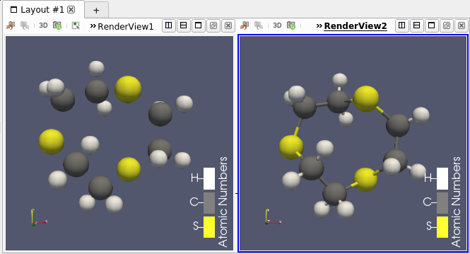
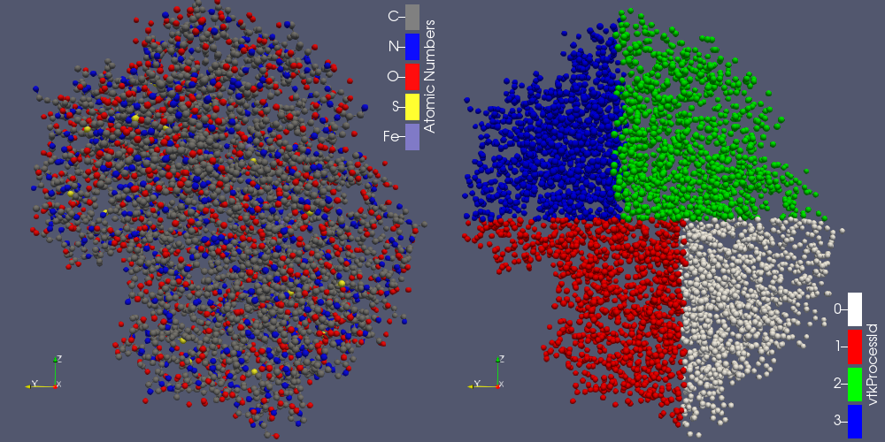
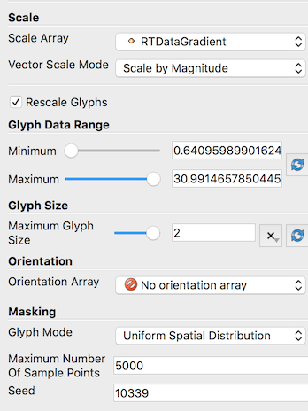
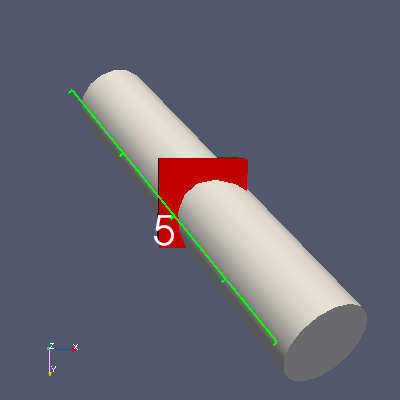
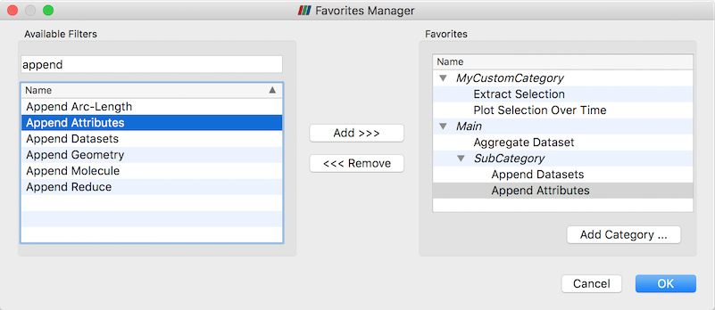
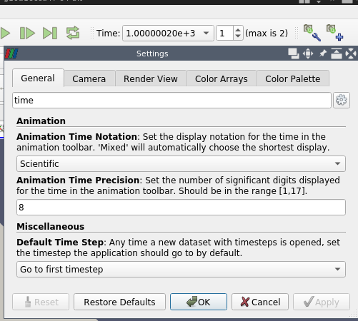
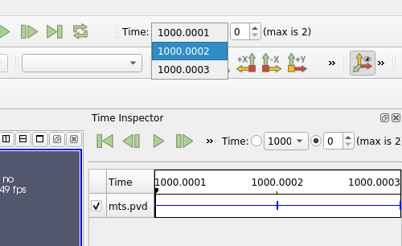
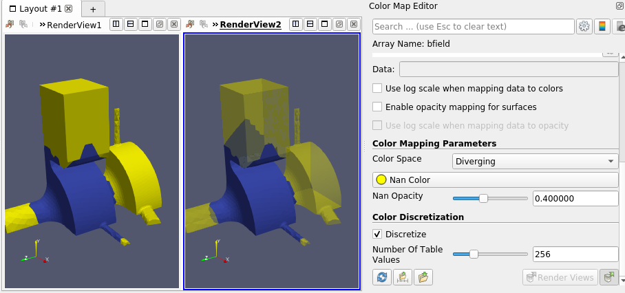
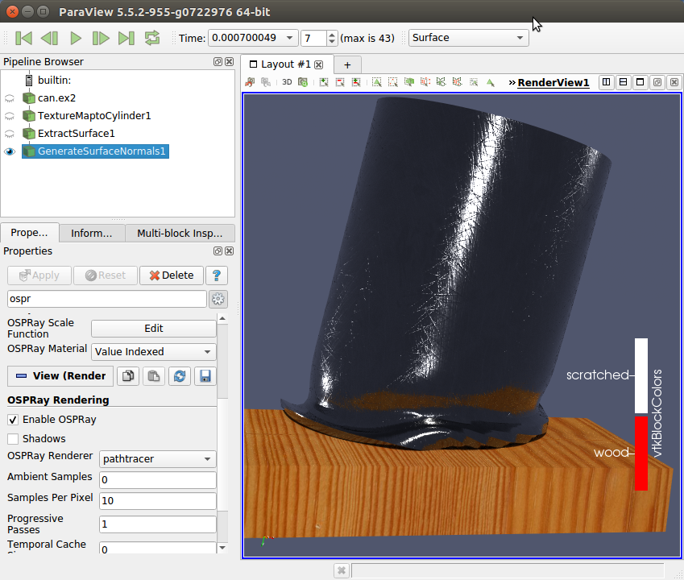

ParaView 5.6.0 Release Notes
============================

Major changes made since ParaView 5.5.2 are listed in this document. The full list of issues addressed by this release is available
[here](https://gitlab.kitware.com/paraview/paraview/-/milestones/8).

# General Notes

## State file compatibility with ParaView 4.2

State files from ParaView 4.1 or earlier are no longer supported. To update state files from ParaView 4.1 or earlier, please use ParaView 5.5, open the state file, then save a new copy of the state file. The saved version will be readable by ParaView 5.6.

# Community

ParaView community support has moved to http://discourse.paraview.org. The archives of the
mailing lists paraview@paraview.org and paraview-developers@paraview.org will be preserved,
but no new emails to these lists will be accepted.

# New Features

## Added a "Reset Display Empty View" setting

Available under the **General** settings tab, the new **Reset Display Empty View** setting
controls whether to reset the camera in a render view when showing a representation in a
previously empty view.

Previously, ParaView always reset the camera in the view. The default setting value keeps
it this way, but it is now possible to disable that behavior to preserve the camera view.

## Annotations automatically initialized when categorical coloring is enabled

ParaView will now attempt to automatically initialize colors and annotations when the
**Interpret Values as Categories** setting is enabled for a color map. It will determine the
categories from the currently selected source in the **Pipeline Browser**. If unsuccessful,
ParaView will report an error.

## Connection server timeout

A control for setting the timeout to use when connecting to a server has been added
to the **Choose Server Configuration** dialog. In Python, a timeout parameter has been added
as an optional parameter to the different `Connect` methods.

# Filter changes

## Improved ability to add Python-based algorithms via plugins

Support for developing filters, readers, writers in Python and distributing them
as plugins has been improved. `paraview.util.vtkAlgorithm` module provides
decorators to expose `VTKPythonAlgorithmBase`-based VTK algorithms in ParaView.
A Python module that provides such decorated algorithms can now be directly loaded
in ParaView as plugins.

## Added molecule filters

Several filters that involve Molecule data sets have been added:
  - a simple bond perceiver (that also operates in parallel) (**Compute Molecule Bonds**)
  - a converter from point set to Molecule data set (**Convert Into Molecule**)
  - a converter from Molecule to Polygonal Mesh (**Molecule To Lines**)
  - a filter to append one or more molecules into a single one (**Append Molecule**)

||
|:--:|
| *A molecule (left) and the same with computed bonds (right).* |

## Added point distribution filter

To complement the new Molecule data set filters, ParaView now has a filter named
**Distribute Points** that distributes point sets over MPI processes.

||
|:--:|
| *A molecule (left) distributed over 4 processes (right, colored by process Id).* |

## Revised Glyph filter

The **Glyph** filter has been revised with more meaningful properties, and a streamlined
user interface. Care has been taken to provide backwards compatibility for state files
saved from and Python scripts developed for ParaView versions 4.2 and later.

||
|:--:|
| *The improved user interface of the Glyph filter.* |

## AMR Slice Filter Fixed

* A bug that resulted in incorrect slices has been fixed.
* The user interface has been simplified.

## Ghost Cells Generator fixes

The **Ghost Cells Generator** filter was fixed to work in non-MPI builds, and a bug
for bad partitions was corrected.

## Moment invariants

Added moment invariants filters from the VTK remote module. These filters are
available only if the CMake option `Module_vtkFiltersMomentInvariants` is enabled
when configuring ParaView. The filters available are **Compute Moments**,
**Parallel Compute Moments**, and **Moment Invariants**.

The theory and the algorithm are described in [Roxana Bujack and
Hans Hagen: "Moment Invariants for Multi-Dimensional Data"](http://www.informatik.uni-leipzig.de/~bujack/2017TensorDagstuhl.pdf)

Developed by Roxana Bujack and Karen Tsai at Los Alamos National Laboratory.

## Aggregate Dataset filter handles regular grid data sets

The **Aggregate Dataset** filter now works with image data, rectilinear grids, and
structured grids whereas before it only worked with polydata and unstructured grids.

## Extracting solid geometry from CTH files

The **Extract CTH Parts** has been augmented with an option that enables extraction
of CTH parts as 3D cells, not just 2D contours.

## Bounding Ruler can now measure axes along oriented bounding boxes

In addition to measuring the X, Y, or Z axis of the axis-aligned bounding box
of a data set, the **Bounding Ruler** filter can now measure the Major, Medium,
and Minor axes of the data set's oriented bounding box. These axes are new options
in the **Axis** property of the **Bounding Ruler** filter. As an example, one
can use ParaView's selection capabilities to extract two points of interest and
then apply the **Bounding Ruler** with the **Axis** property set to
**Oriented Bounding Box Major Axis** to measure how the distance between these
points changes over time. [Read more...](https://blog.kitware.com/measuring-oriented-bounding-box-axes-paraview/)

One caveat to these options is that all the points in a distributed data set need to
be copied to a single rank to compute the oriented bounding box. When used in a parallel
server setting, this may be slow or lead to memory exhaustion if the data set does
not fit onto one rank.

||
|:--:|
| *Measuring the length of a rotated cylinder object along its oriented bounding box major axis.* |

## MooseXfemClip Plugin

The **MooseXfemClip** filter has been added as a plugin to aid in the
visualization of results produced using the XFEM module in the
[MOOSE framework](http://www.mooseframework.org) developed at Idaho
National Laboratory.

The MOOSE XFEM implementation uses a phantom node approach to represent
discontinuities in finite element solutions, which results in overlapping
finite elements. The **MooseXfemClip** filter clips off the non-physical
portions of the overlapping elements, allowing correct visualization of the discontinuous fields produced by this method.

# Readers, writers, and sources

## MultiBlock Reader Variable Selection

The multiblock file reader now reports the available point, cell, and field attributes of the dataset, and supports selective loading of them based on user selection.

## Series file (.series) format supports more file formats

JSON description files for time series can now be written for these additional file formats:

vtm, vtmb, vthb, vth, vtp, vtt, vtu, vti, vtk, vts, vtr, pvtp, pvtu, pvtt, pvti,
pvts, pvtr, pvtk, ply, stl

The name of the series file must follow the format \<filename\>.\<format\>.series,
e.g., `images.vti.series`. More information about the content of the file can be
found [here](https://gitlab.kitware.com/paraview/paraview/-/blob/v5.5.0/Documentation/release/ParaView-5.5.0.md).

## Tecplot reader

The Tecplot reader was improved to handle the ZONETYPE parameter.

## SEG-Y reader

A reader for 2.5D and 3D SEG-Y data files is now available. [Read more...](https://blog.kitware.com/new-segy-reader/)

## MotionFX CFG files readers

ParaView includes a reader to read MotionFX CFG files that describe various types
of motions on STL geometries. The reader can animate the geometries as described in the CFG file without having to re-read the geometry files on each timestep.

## Gmsh Reader Plugin

ParaView has a reader for visualization of high-order polynomial solutions in
the Gmsh format.

## Wavefront OBJ reader

The Wavefront OBJ reader retains OBJ groups as GroupIds for faces (similar to STL solid-labelling).
This allows extraction of sub-geometries based on their group.

## Wavefront OBJ writer

It is now possible to save PolyData meshes to the OBJ file format.
The written files contain geometry including lines, triangles and polygons.
If present, normals and texture coordinates on points are also written.

## CGNS writer added

A CGNS Writer has been added that supports writing structured, unstructured and polygonal datasets, and multi-block datasets thereof.

## HyperTreeGrid source

A new source for generating random `vtkHyperTreeGrid` structures has been added under `Sources` -> `Hyper Tree Grid (Random)`. It supports deterministic seeding and MPI-parallel execution.

The XML writer for `vtkHyperTreeGrids` now properly outputs appended data arrays.

Several of the `vtkHyperTreeGrid` filters were exposed, including:

- **Plane Cutter**
- **Depth Limiter**
- **Cell Centers**
- **Axis Reflection**
- **Axis Cut**
- **Axis Clip**

## Live Programmable Source

To support use cases where one wants to develop a programmable source that is
automatically *refreshed* periodically, we have added
**Live Programmable Source**. With this source, one can provide a
Python script for **CheckNeedsUpdateScript** that can indicate that the source
may have new data and hence should be updated. The ParaView client application
can periodically check such sources and update them, if needed.

## Fast Uniform Grid source

To enable testing ParaView with large image data sets, the **Fast Uniform Grid**
image data source as been added. This source generates point data fields with simple, fast-to-compute functions.

## Test data source for plotting global variables

Added a Python plugin that acts as a test data source for data sets with global
temporal data made for testing the ParaView module "Plot Global Temporal Data".
The plugin creates a MultiBlockDataSet with a dummy uniform grid (vtkImageData).
Multiple global data arrays are added based on provided input parameters:
- Number of time steps in the temporal data.
- Number of global data arrays.
- A value offset that shifts the origin of all generated data arrays.

# Interface Improvements

## Python Shell and Output Window respect font size setting

The size of the font in the Python Shell and Output Window now follow the **Font Size** setting under the **General** settings tab in the **Settings** dialog.

## Customizable shortcuts

ParaView now provides customizable keyboard shortcuts for menu items. Shortcuts
can be set through a dialog box accessed from the `Tools` -> `Customize Shortcuts...` menu item.

## Custom Viewpoints Toolbar

Controls for managing custom viewpoints have been improved. These controls
are accessible by clicking the **Configure...** button in the
**Adjust Camera** dialog. A toolbar with buttons for each custom viewpoint
provides fast access to custom viewpoints.

## Favorites for filters

Favorites for filters are a set of custom menu items intended to provide
fast access to often-used filters. The **Favorites Manager** enables creation
and arranging bookmarks under an arbitrary number of levels of custom categories.
Favorites are accessible under the **Filters** menu. In addition, the pipeline
context menu contains an **Add current filter** menu item as a convenience.

||
|:--:|
| *The new Favorites Manager.* |

## Improved widgets used to view and edit real-number properties

New application settings `Real Number Displayed Notation`
and `Real Number Displayed Precision` enable control of how real-number properties
are displayed in the ParaView client user interface. These settings control how the
property values are displayed, but the actual property values are stored in full
precision. Regardless of the real number display settings, the full precision text
is displayed when editing the property.

## Improved time display options

A new feature adds an **Animation Time Notation** setting offering the options
**Scientific**, **Fixed**, or **Mixed**, and an **Animation Time Precision** controlling
the number of significant digits displayed. The **Time** display is automatically
updated when settings (precision or notation) change.

||
|:--:|
| *Time display settings allows to choose notation and precision.* |

## Faster precise time selection

When the animation mode is set to **Snap to timesteps** in the **Animation View**,
the available times in the **Current Time Controls** are available in a popup menu,
so switching to a specific time is easier and faster.

||
|:--:|
| *The drop list provides an easy access to specific time.* |

## Redo command keyboard shortcut changed from Ctrl-R to Ctrl-Y

Ctrl-Y (or Command-Y on macOS) is a common keyboard shortcut for the redo command in many
applications, so we have made it the same in ParaView. In addition, we added a keyboard
shortcut (Ctrl-R or Command-R on macOS) for the **Reset Session** command to the `Edit`
menu entry.

## Zoom in and out buttons in the Adjust Camera dialog box

The **Adjust Camera** dialog now includes buttons labeled "Zoom In" and "Zoom Out"
for manipulating the camera zoom level. The zoom factor can be set to control how
much zooming in or out is done.

## Changes to the Choose Preset dialog

The **Choose Preset** dialog now has 16 default color maps and an advanced button that,
when clicked, displays the full list. Limiting the number of color maps displayed by
default aims to avoid presentation of an overwhelming number of colors in the full list
and to encourage use of color maps with good perceptual properties. It is also possible
to promote non-default color maps to default status by clicking the
**Show current preset in default mode** checkbox on the right side of the dialog box. [Read more...](https://blog.kitware.com/introducing-the-new-paraview-colormap-preset-dialog/).

## Group source generators by category

The source generators in the **Source** menu have been organized into **Annotation**,
**Data Objects**, **Geometric Shapes**, and **Measurement Tools** categories. All sources
are available in the **Alphabetical** category.

## Selection in the Point Gaussian representation

Points selection now works with the **Point Gaussian** representation.

## Optional rescaling of log plots with negative data values

When creating a 2D plot of data and enabling log scaling on the left or right axis, a warning
would appear if the plotted data had negative values explaining that the log of a negative
value is undefined. ParaView now has an application setting to bypass the negative log axis
warning by instead clipping the axis range to show only log-scaled positive values when
log scaling is active.

## zSpace support

zSpace devices are now configurable through a zSpace configuration file (.pvx). Examples of
.pvx files are now located in the `Examples/VR` directory in the ParaView source directory.
Additionally, camera angles have been synchronized between the Paraview client and zSpace
screens.

# Rendering Enhancements

## Feature Edges representation

Added a representation called **Feature Edges** to show the interesting edges
of a data source, e.g., the cylindrical outline of a cylinder rather than the
bounding box outline. [Read more...](https://blog.kitware.com/new-in-paraview-feature-edges-representation/)

## NaN color opacity

* The color for NaN (Not a Number) values has now an opacity property.

||
|:--:|
| *Datasets with NaN values (in yellow). Opacity can be specified (right).* |

## OSPRay version update

ParaView 5.6 updates its version of OSPRay to 1.6.1 and includes a number of
OSPRay-related fixes and improvements. These include better memory management,
more volume rendering controls and unstructured cell types, direct isosurface
volume rendering, and new path tracer materials like the principled material
as exemplified with the "scratched" sample material.

||
|:--:|
| *OSPRay-rendered surfaces with new materials.* |

## NVIDIA IndeX plugin 2.2

**Structured Volume Grids:**

* New render engine provides optimized memory usage and faster initialization times.
* Added Catalyst support for In-Situ visualizations.
* Added support for all ParaView's playback modes when using time series datasets.
* Added support for interactive changes of scalar values/properties.
* Added support to render volume combined geometry in cluster mode.
* Added support for datasets with signed types sint8 and sint16.

**Unstructured Volume Grids:**

*   New Visual Elements presets: Iso-Surface, Depth Enhancement and Edge Enhancement.
*   Added support for interactive changes of scalar values/properties.

**Common:**

*   Added support for orthographic projection camera.
*   Added support for logarithmic scale in colormaps when mapping data to colors.
*   Improved profiling log: HW/SW information and detailed performance values.

## Improve support of dependent components for volume representation

When volume representation is selected and **Map Scalars** and selected data
array has 2 or 4 components, a new property called **Multiple Components Mapping**
is available.

When this new feature is enabled:
* For a two-components array, the first component is mapped to the color, the
  second component is mapped to the opacity.
* For a four-components array, the first, second and third components are used
  as RGB values and the fourth component is mapped to the opacity.

Note that:
* this feature is only available when **MapScalars** is *ON* ;
* this feature forces **Use Separate Color Map** ;
* it scales the color and the opacity range with the correct component.

## Slice representation lighting is turned off

Lighting on the **Slice** representation had the undesirable effect of
darkening the slice with the default light, which is off center with
respect to the view and focal points. We assume the common use case
for this representation is to view the data as directly as possible to
match colors on the slice with colors in the color legend. To better
support this use case, lighting is disabled for this representation.

## Min/Max lines in Quartile Chart View

It is now possible to show min and max lines in **Quartile Chart View**
in addition to the average and median curves when plotting summaries
for a dataset or extracted selection over time.

## Add a Shader Replacements property to the Geometry representation

This new property allows customization of the OpenGL shaders used for rendering
by providing some replacement strings for the shader produced by VTK.
The replacements are prescribed through a JSON string like this:

```json
[
  {
    "type": "fragment",
    "original": "//VTK::Light::Impl",
    "replacement": "gl_FragData[0]=vec4(1.0,0.0,0.0,1.0);\n"
  },
  // other replacements can follow
]
```

In the user interface, the property is represented with a custom widget that enables
loading JSON from a file and saving its path as a preset. With this widget it is
possible to select a preset replacements file, remove a preset from the list, and edit
the content of the JSON string.

# Miscellaneous bug fixes

## macOS server configuration fetching fixed

 Fixed a bug found in the 5.5 release wherein fetching server configurations would
 silently fail and another where mac clients built with OSPRay (like the official release
 binaries produced by Kitware) could not connect to servers built without OSPRay.

## Color map range rescaling fix

Fixed an issue with the color map range getting automatically rescaled when it should
not have been (this affected Catalyst as well).

## Temporal Parallelism Script Generator

Updated the **Temporal Parallelism Script Generator** plugin to produce valid
ParaView Python scripts.

## Gradient filter

The gradient calculation for the 3D Lagrange cells has been fixed.

## MPI4PY

A MPI4PY issue with SGI's MPT MPI library has been resolved.

## Pass Arrays filter

The **Pass Arrays** filter now properly deals with ghost information.

## Point selection and hovering fixed in Slice view

A bug with point selection and the **Hover Points** selection mode has been fixed for the
**Slice** view.

## Hover Points and Hover Cells tooltip

The tooltip that appears when in **Hover Points** or **Hover Cells** selection mode is
now placed correctly on the screen for systems with HiDPI displays.

## Python 3.7.1 now supported

Some changes were made to support building with Python 3.7.1. Note that 3.7.0 is known
to not work.

# Developer Notes

## Optionally use QWebEngine for help

The CMake option `PARAVIEW_USE_QTWEBKIT`, which did not work with
Qt5 since WebKit was deprecated/removed, has been replaced with a new option
`PARAVIEW_USE_QTWEBENGINE` which uses Qt's WebEngine (the library that replaced
WebKit).

# Catalyst

## New Catalyst Script Definition and Export

There is a new streamlined process for defining and exporting
Catalyst scripts. The **Catalyst Export Inspector** panel is the new
place to define everything you want Catalyst to eventually export.
Your choices are saveable in ParaView state files and match the
normal user interface for exporting data files and screenshots. There
are some new options too, including choices to export Cinema Spec D tables
and to place all Catalyst output inside a specific directory. To
export the Catalyst Script you've defined, use the new **Export
Catalyst Script** option.

Both entry points are under the **Catalyst** menu. The original
**Export State** wizard and **Data Extract Writers** controls are still
there, too, but they are deprecated and will be removed soon.

## --live option

The ParaView client now has a `--live=<port>` option to automatically connect to a
Catalyst-enabled simulation that is expecting a **Live** connection.

## Simulating a Catalyst run

The example Python script `Examples/Catalyst/SampleScripts/filedriver.py` has been
added. It can be used with `pvbatch` to emulate running a Catalyst-enabled simulation
by reading in files and running Catalyst Python scripts. The script is documented on
how to use it.

## New output options

Generated Catalyst scripts now have the option to:

* start Catalyst output after a requested time step (while also forcing output at the very first time step to verify Catalyst output);
* output only requested arrays based on what arrays are read in when generating the Catalyst Python script;
* automatically handle the Catalyst adaptor channel names.
