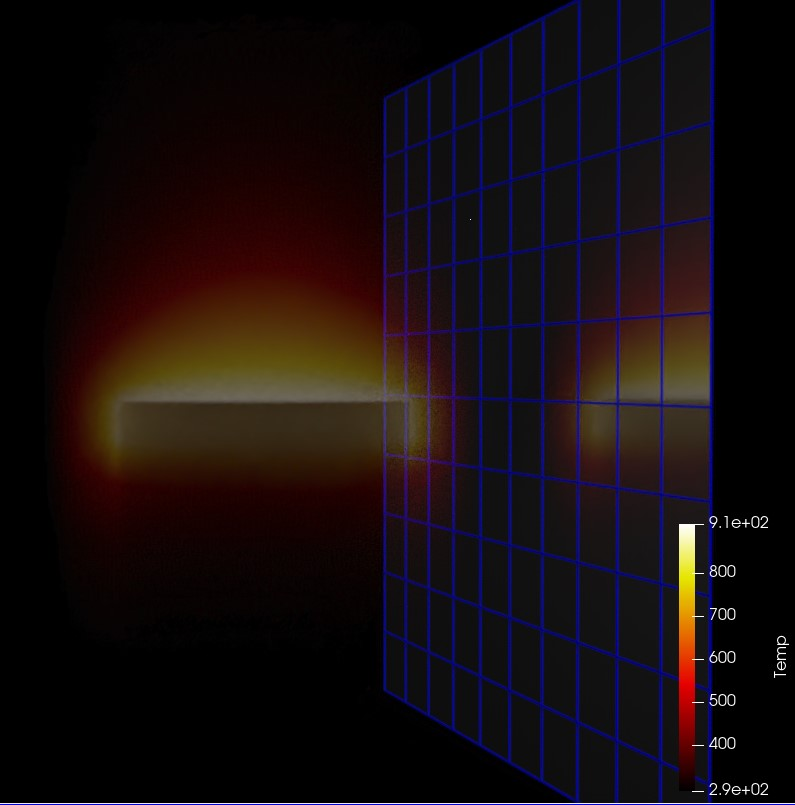
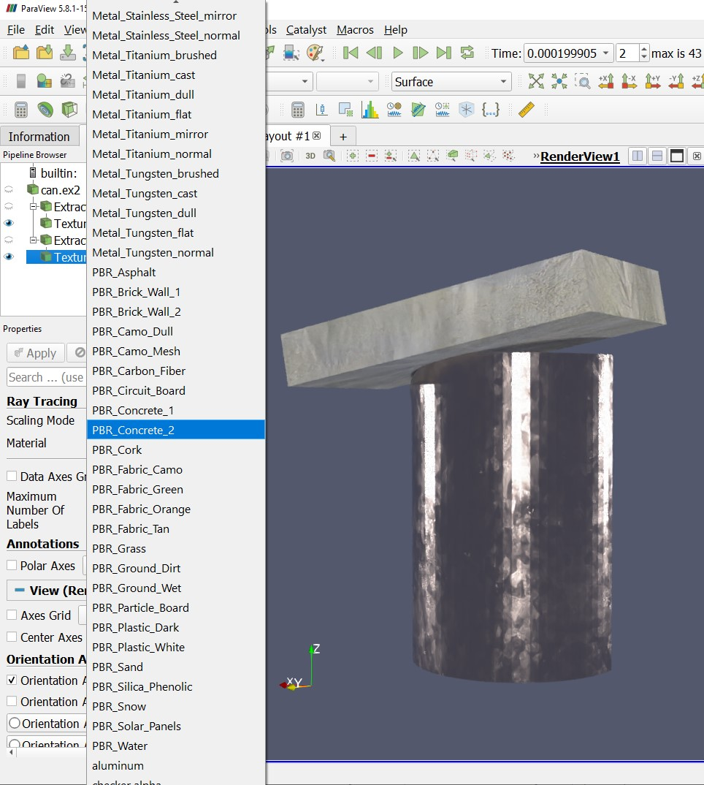
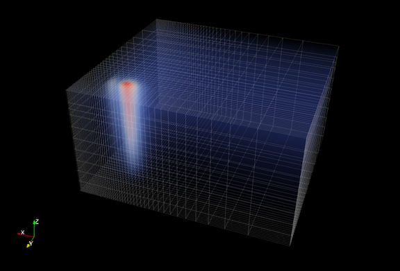
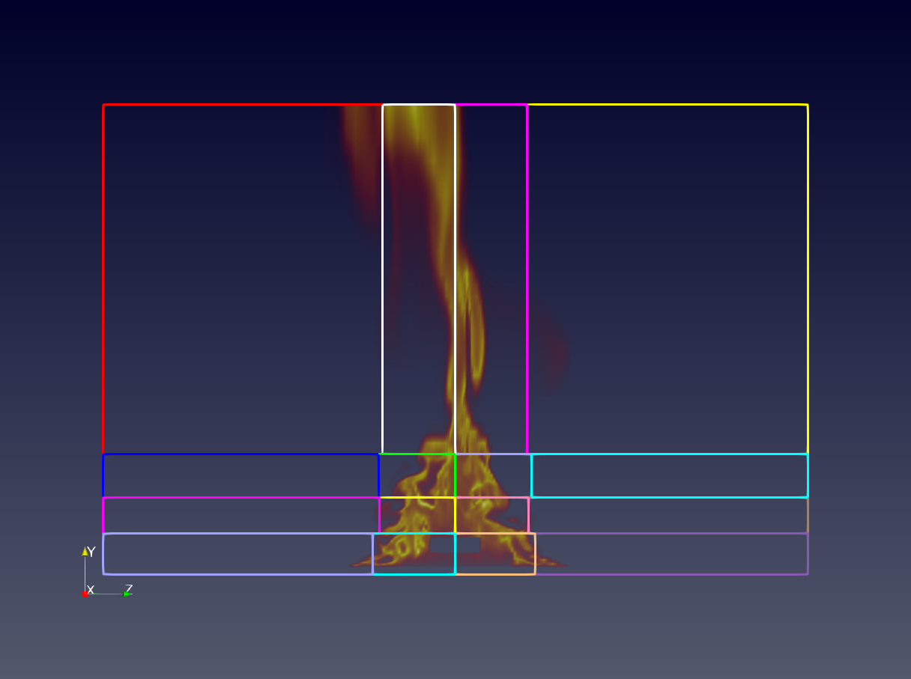
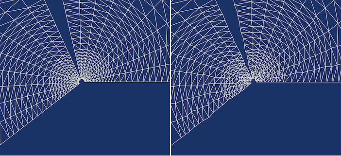
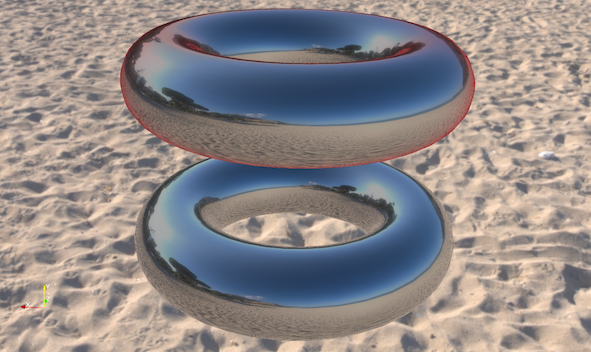
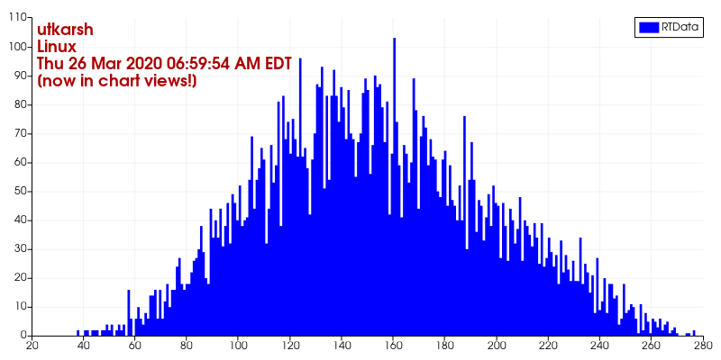
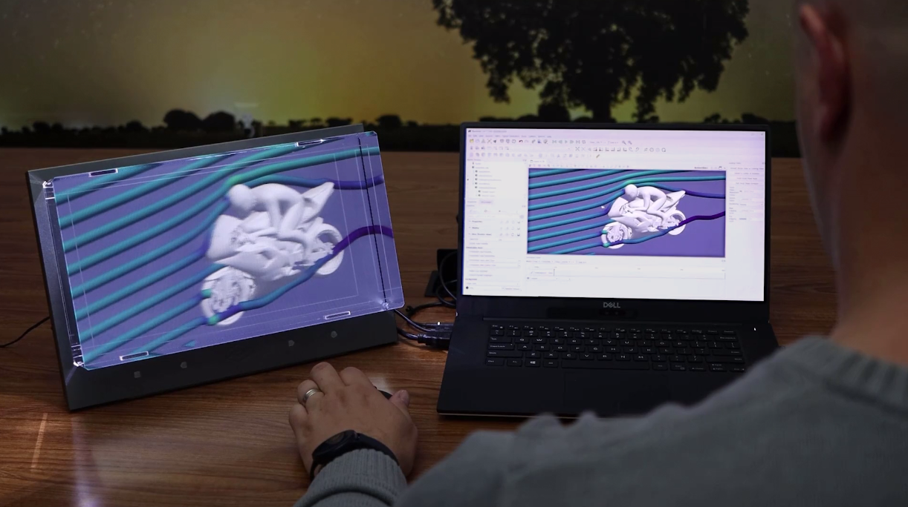
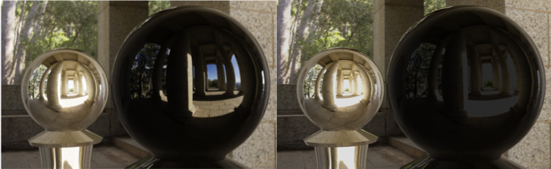
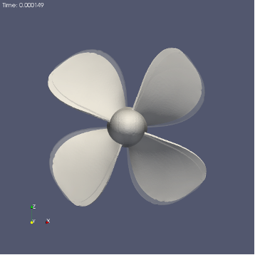

ParaView 5.9.0 Release Notes
============================

Major changes made since ParaView 5.8.0 are listed in this document. The full list of issues addressed by this release is available
[here](https://gitlab.kitware.com/paraview/paraview/-/milestones/14).

* [New features](#new-features)
* [Rendering enhancements](#rendering-enhancements)
* [Plugin updates](#plugin-updates)
* [Filter changes](#filter-changes)
* [Readers, writers, and filters changes](#readers-writers-and-filters-changes)
* [Interface improvements](#interface-improvements)
* [Python scripting improvements](#python-scripting-improvements)
* [Miscellaneous bug fixes](#miscellaneous-bug-fixes)
* [Catalyst](#catalyst)
* [Cinema](#cinema)
* [Developer notes](#developer-notes)

# New features

## Extractors

To save images or data from ParaView, one typically uses **File > Save Data** or **File > Save Screenshot**. With this release, we introduce a new pipeline object, called **Extractor**, to enable saving data and image extracts from the pipeline. This has evolved from the **Extracts Inspector** that was introduced in earlier versions and which has now been entirely removed. Instead of using a separate control panel to define parameters for extracts, one now simply uses the **Properties** panel the same way it is used to change properties on readers and filters.

Refer the [ParaView Guide](https://docs.paraview.org/en/latest/UsersGuide/savingResults.html#extractors)
for details on how to use these extractors.

The design discussion for this feature is available at [ParaView Discourse](https://discourse.paraview.org/t/extracts-exports-and-catalyst-python-scripts/4569).

## Choosing `DISPLAY` or EGL device using command-line arguments

When multiple GPUs are available on a system, you must set either the `DISPLAY` environment variable or the EGL device index for each ParaView rank correctly to ensure that a rank uses a specific GPU. To make this easier, we now have two new command-line arguments added to `pvserver`, `pvrendering` and `pvbatch` executables.

`--displays=` can be used to specify a comma-separated list of available
display names, for example:

    > .. pvserver --displays=:0,:1,:2
    > .. pvserver --displays=host1:0,host2:0

For EGL, these can be EGL device index, e.g.

    > .. pvserver --displays=0,1

These displays (or devices) are then assigned to each of the ranks in a round-robin fashion. Thus, if there are 5 ranks and 2 displays, the displays are assigned as `0, 1, 0, 1, 0` sequentially for the 5 ranks.

`--displays-assignment-mode=` argument can be used to customize this default assignment mode to use a contiguous assigment instead. Accepted values are 'contiguous' and 'round-robin'. If contiguous mode is used for the 5 ranks and 2 displays example, the displays are assigned as `0, 0, 0, 1, 1`.

## Launcher arguments for using mesa

On linux, `paraview_mesa` launcher has now been removed. ParaView binaries now respect command-line arguments instead to indicate if Mesa3D libraries should be loaded for software rendering, instead of using OpenGL libraries available on your system. Pass `--mesa` with optional `--backend [swr|llvm]` to any of the ParaView executables to request Mesa3D-based rendering with appropriate backend.

## Using MPICH ABI compatible implementation

ParaView binaries can now be used on linux systems with MPICH ABI compatible MPI implementation. Compatible MPI implementations are listed [here](https://wiki.mpich.org/mpich/index.php/ABI_Compatibility_Initiative). To use system MPI implementation instead of the one packaged with ParaView, pass `--system-mpi` command line argument to any of the ParaView executables.

## Python2 no longer supported

ParaView no longer supports Python2. Python2 reached its end-of-life on 1
January 2020 and its final release occurred in April 2020. If Python2 support
is still required, please use ParaView 5.8 or an earlier release.

## Fast preselection

A fast preselection option is available in the render view settings. When enabled, the preselection reuses visible geometry to display preselection. This is a lot faster than interactive selection extraction, especially for big datasets. The drawback is that preselection behaves slightly differently with translucent geometries (only visible faces of the cells are selected) and high order cells (all subdivisions are visible).

# Rendering enhancements

## Ray tracing updates

ParaView 5.9’s version of Intel OSPRay has been updated from 1.8 to 2.4 and NVIDIA’s visRTX has been updated accordingly. OSPRay version 2 consolidates volume sampling responsibilities to the new OpenVKL thread and SIMD accelerated “volume kernel library” library. The most visible change to ParaView users from this upgrade is the addition of volume rendering to the OSPRay path tracer backend. In a path tracing context, volumes can emit and receive lighting effects to and from the rest of the scene. This can bring about a new level of realism when used carefully.

>
>
>`Example dataset volume rendered in OSPRay path tracer and a mirror wall

The second most visible ray tracing update in ParaView 5.9 is likely the inclusion of Marston Conti’s expanded set of path tracer materials.

>
>
> Example dataset with concrete and cast chromium materials.

There are smaller but still notable ray tracing updates and bug fixes in this release as well.
*	`vtkMolecule` data from, for example, protein data bank (.pdb) files, are now drawn.
*	The ray caster now supports gradient backgrounds, path tracer now supports backplate and environmental backgrounds (independently or simultaneously).
*	Streamlines and line segments generally are smoother and have rounded ends.
*	There are two new sizing modes that exactly control the size of implicitly rendered spheres (for points) and cylinders (for lines). Choose “All Exact” to make the “Point Size” or “Line Width” be the world space radius or “Each Exact” to take radii from a designated point aligned array. “All Approximate” and “Each Scaled” are the legacy behaviors where the radius depends on object bounds or maps a point aligned array though a transfer function.
*	Kitware’s 5.9 Linux ParaView binaries now include OSPRay’s module_mpi which supports image space parallelism over cluster nodes to accelerate ray traced rendering of moderately sized scenes. To use it spawn one ParaView and any number of ospray_module_workers in a heterogenous MPI run, supplying the ParaView rank with `OSPRAY_LOAD_MODULES=mpi` and `OSPRAY_DEVICE=mpiOffload` environment variables. OSPRay render times will be sped up roughly in proportion to the number of workers when rendering is a bottleneck.

## NVIDIA IndeX plugin improvements

>
>
> Unstructured grid rendered with NVIDIA IndeX in ParaView. Dataset courtesy DKRZ German Climate Research Center.

### Unstructured grids

The NVIDIA IndeX plugin is now more efficient when loading and rendering large unstructured grids, thanks to an optimized data subdivision that does not require any manual configuration.

The unstructured grid renderer in NVIDIA IndeX has been made more robust when handling grids with degenerate cells or topology issues.

Support for rendering unstructured grids with per-cell attributes (scalars) was also added.

### Structured grids

When rendering structured grids on multiple ranks with the NVIDIA IndeX plugin, ParaView now uses significantly less main memory than before.

### Multi-GPU rendering

The GPUs used by NVIDIA IndeX are now decoupled from those assigned to ParaView ranks. This means all available GPUs will be utilized for rendering, independent of the number of ranks. Running ParaView on multiple ranks is still beneficial, however, for accelerating data loading and processing, as well as for other rendering modes.

Please note that multi-GPU support requires the Cluster Edition of the NVIDIA IndeX plugin.

### POWER9 support

The NVIDIA IndeX library is now also provided for the POWER9 architecture (ppc64le), enabling users to build and run ParaView with the NVIDIA IndeX plugin on that platform. On POWER9, the plugin automatically comes with all features of the Cluster Edition, supporting multi-GPU and multi-node use cases out of the box.

### Stability fixes and usability improvements

The plugin will no longer try to initialize CUDA on a ParaView client that is connected to a remote `pvserver`. This previously caused errors when CUDA was not available on the client.

If ParaView is running on multiple ranks, the plugin requires IceT compositing to be disabled by you. It will now inform you if IceT has yet not been disabled in that case.

When running on multiple ranks and loading a dataset using a file reader that does not support parallel I/O (such as the legacy VTK reader), ParaView will load all data on a single rank. If this happens, the plugin will now inform you that only a single rank will be used for rendering with NVIDIA IndeX and recommend switching to a file format that has a parallel reader.

Enabling the "NVIDIA IndeX" representation for multiple visible datasets is now handled more consistently: The plugin will only render the visible dataset that was added last (i.e., the last entry shown in the Pipeline Browser) and print a warning informing you about this. Several issues when switching between
datasets by toggling their visibility were resolved.

Logging of errors and warnings for error conditions and unsupported use cases was improved.

## Volume rendering of rectilinear grids

ParaView's "GPU Based" volume renderer can now do direct volume rendering of rectilinear grids.

>

## Volume rendering with blanking of uniform grids

ParaView now supports direct volume rendering with blanking of uniform grids. This means uniform grids with ghost cells/points will now behave as expected with the GPU volume mapper.

>

## Volume rendering multiblock datasets with 3D uniform grids

If a multiblock dataset has blocks of only 3D uniform grids such as `vtkImageData` or `vtkUniformGrid`, such a dataset can now be volume rendered. In distributed environments, it is assumed that blocks are distributed among ranks in such a fashion that a sorting order can be deduced between the ranks by using the local data bounds, i.e., bounds do not overlap between ranks.

>
>
>Volume rendering of multiblock datasets with non-overlapping uniform grids.

## Volume rendering with a separate opacity array

The **Volume** representation has a new option for specifying that a separate array should be used for opacity mapping. Additionally, options for choosing the opacity array and component (or vector magnitude) to use for opacity mapping have also been provided.

This option is available when using the "Projected tetra" or "Resample to Image" volume rendering modes for unstructured grids and when using the "Smart" and "GPU Based" volume rendering modes for regular grids (image data, uniform grids, and rectilinear grids).

## Custom opacity array ranges

When volume rendering is used and the **Use Separate Opacity Array** option is enabled, it is now possible to set a custom range for the scalar opacity function that is separate from the range used for the color transfer function.

>

## Improvements to ordered compositing

Ordered compositing is used whenever ParaView is rendering translucent geometry or volumetric data in parallel. For ordered compositing, the data in the scene needs to be redistributed across all rendering ranks to ensure the ranks has non-overlapping datasets with other ranks. The data redistribution code has been revamped. It now internally uses the `vtkRedistributeDataSet` filter. This greatly improves performance when volume rendering unstructured grids in parallel. The code is also much simpler. However, this introduces non-backwards compatible API changes that may impact certain custom representations. Please refer to the [MajorAPIChanges](../../Utilities/Doxygen/pages/MajorAPIChanges.md) document for details.

## Opacity Editor Freehand Drawing

Adds a checkbox to the color opacity editor to enable freehand drawing mode. When checked, you can draw the opacity function with the mouse instead of placing points one by one.

## Faithful rendering of meshes with significantly different cell sizes

In some domains, it is typical to have cell sizes that vary by orders of magnitude in size. These meshes need special handling to render properly on graphics hardware that have limited floating-point precision. ParaView 5.9 provides coordinate scaling options to more faithfully render these meshes. A new property named **Coordinate Shift Scale Method** for mesh representations provides different options for when ParaView should shift and scale coordinate values to make better use of available floating-point range. By default, a single shift and scale is computed based on the mesh's bounding box. "Auto Shift Scale" is a good option for most meshes. "Near Focal Plane Shift Scale" and "Focal Point Shift Scale" will recompute the shift and scale based on the camera settings, which provides for the most faithful rendering of visible cells at the cost of occasional coordinate re-transformation and transfer to the graphics card.
>
>
> Zoomed view of a mesh region with very small coordinate values.  "Focal Point Shift Scale" method (left) fixes rendering problems with floating-point precision compared to the "Auto Shift Scale" coordinate rescaling method (right).

## vtkPVSliceMapper handles oriented images

The display of axis-aligned slices from a volume image will respected the direction matrix set in `vtkImageData` datasets, such as those output by [3D Slicer](https://slicer.org).

# Tone mapping and screen space ambient occlusion

Tone mapping is useful to display correctly HDR images and is configurable in the render view settings panel. Screen space ambient occlusion (SSAO) takes into account object self-shadowing for lighting calculations. You can enable and configure the tone mapping and SSAO in the view settings in the *Properties* panel.

>
>
> Screen space ambient occlusion (left) vs. standard rendering (right).

## Edge Tint in physically-based rendering

You can now select the tint of the edges of the material when selecting "PBR" interpolation under the **Lighting** section in the *Properties* panel. Theh edge tint will affect the reflected color at grazing angles for metals only when environment lighting is enabled.

>
>
> Red edge tint (top) and default (bottom).

## Rendering array selection

It is now possible to select the arrays used for texture mapping ("TCoords"), smooth shading ("Normals") and normal mapping ("Tangents") instead of using the default ones. The arrays can be selected under the **Lighting** property group of the representation (available in advanced properties).

## Showing text in chart views

You can now use sources like **Text**, **Time Annotation** and filters like **Environment Annotation** to show text in chart views. Previously, such sources and filters could only be used with **Render View** and other 3D views.

>

## Presets for chart series colors

Previously, series colors could only be modified manually. Categorical color map presets are now available for plot series. Presets can be applied, modified and saved the same way color maps for surfaces can be created and saved. Optionally, legends can also be saved and loaded.

When loading a preset, colors and legend are set corresponding to the series name when possible.

# Filter changes

## Adaptive resample to image

ParaView now has the ability to adaptively resample to a collection of `vtkImageData` using the **Adaptive Resample to Image** filter. The filter builds a *kd*-tree approximately load balancing the input data points across the requested number of blocks (or ranks) and the resamples the region defined by each of the *kd*-tree leaves to a vtkImageData.

# Plugin updates

## New Looking Glass plugin

ParaView now comes with a plugin that enables the display of a 3D render view on holographic displays from [Looking Glass Factory](https://lookingglassfactory.com/). For details on how to use the plugin, see this [announcement](https://blog.kitware.com/vtk-holographic-display/).

>

## New Geographical Map Plugin

This release (available in source code only) introduces a new plugin that allows geographical map fetch from two different providers: *Google Maps* and *MapQuest*.

To fetch the image, the add a new source called **GeoMapFetcher**. This source can be configured to fetch a map with a specific coordinate center and a zoom level. The dimension of the image can be specified as well and the output is a 2D image positioned correctly in latitude and longitude.

A filter called `vtkGeoMapConvertFilter` is provided to convert this image to a structured grid with a different projection supported by PROJ library.

## New VRPlugin interactor styles

Two new interactor styles have been added to the VR plugin:

* `Stylus`: Use the position of the stylus to apply translation and rotation to the camera.
* `Move point`: Use a tracker to intuitively move a 3D point in camera space.

Both are well suited for some devices which take benefit from a stylus, such as a zSpace display.

## zSpace plugin

A new Windows only plugin named 'zSpace' has been added. It adds a new view named 'zSpaceView' that lets you interact with a zSpace device directly. This device is designed to work with Crystal Eyes stereo mode, in full screen or in a CAVE display.

## glTF 2.O reader available without a plugin

ParaView can now load glTF 2.0 files without having to build and load the glTF plugin.

## ParFlow plugin

The ParFlow plugin now uses VTK's [explicit structured grid](https://blog.kitware.com/introducing-explicit-structured-grids-in-vtk-and-paraview/) data format to represent the subsurface simulation domain when terrain deflection is turned on (i.e., when deforming the grid by elevation). This increases memory usage but provides visualizations more useful in geology where discontinuities are often present.

# Readers, writers, and filters changes

## HDR reader

ParaView now supports the reading of Radiance HDR (High Dynamic Range) files with a `.hdr` extension. HDR images are stored with 32 bits per channel. HDR files can be opened directly in the pipeline browser, or as a background texture that can be used in PBR shading and OSPRay pathtracer. These 32-bit background textures can greatly improve the contrast in the rendering.

>

## New CONVERGE CFD post reader

A reader for CONVERGE CFD post files has been added. This reader reads files containing meshes, surfaces, and parcels. Each stream in a file is read as a top-level block and meshes, surfaces, and parcels are datasets under each stream block.

Cell data arrays associated with mesh cells and point data arrays associated with parcels can be individually selected for reading.

Time series are supported. The reader assumes a time series is defined in a sequence of files that follow the naming convention

`<prefix><zero-padded index>[_][<time>].h5`

where the prefix is determined from the FileName property passed to the reader. The underscore and time elements are optional. The time value associated with each file is read from metadata in the file.

## Velodyne AMR Reader

Paraview now has the ability to read AMR files written by Velodyne. The reader classes were added in VTK and VTK was updated here to reflect it. Velodyne is a multi-physics code written by Corvid Technologies. It is a coupled Lagrangian-Eularian code where the Euler equations are solved using AMR. The resulting *.xamr files can be larger than 40GB. This reader was designed to read these files efficiently.
>
>
>Example visualization of warhead detonation made possible with the Velodyne AMR reader.

## Fides Reader for ADIOS2 files/streams

You can now read ADIOS2 files or data streams using [Fides](https://fides.readthedocs.io/en/latest/index.html). Fides converts the ADIOS2 data to a VTK-m dataset and the vtkFidesReader creates partitioned datasets that contain either native VTK datasets or VTK-m datasets.

To read data and correctly map it to VTK-m data structures, Fides requires data model description written in JSON.

When using the Fides reader in ParaView, the data model is automatically generated based on some metadata stored in ADIOS attributes (see the [Fides documentation](https://fides.readthedocs.io/en/latest/components/components.html#data-model-generation) for details).

## CSVExporter formatting and precision option

CSVExporter now has formatting and precision options to control the way the outputs strings are generated in the .csv file

## Save left and right eye images and animations in one go

**Save Animation Options** and **Save Screenshot Options** now support a stereo mode called **Both Eyes**. When chosen, ParaView will save images (or videos) for the left and right eye. The left-eye output files are suffixed with `_left` while the ones for the right-eye are suffixed with `_right`.

# Time data array selection in XML readers

You can now select a custom time data array when reading XML files. If "None" is selected, then no data is read to produce the time sequence, and a sequence of positive integer values starting at zero is used instead.

## Changes to CGNS reader API

In ParaView 5.5, the CGNS reader API was changed to add support for a more extensive mechanism to select which zones to load from the file. This mechanism had several issues:

* It impacted performance severely when loading files with large number of zones.

* The API made it tricky to use the VTK reader with users often reporting blocks being read incorrectly.

With this release, we have removed those changes and instead gone back to the simpler base-name and family-name based selection. This does mean, however, that Python and PVSM state files using CGNS reader generated using earlier versions may not load faithfully and will require manual updates to the reader properties.

## Overlapping Cells Detector filter

`Overlapping Cells Detector` is a new filter that exposes the cells overlapping other cells inside the same input. The output of this filter features the cell data array `NumberOfCollisionsPerCell`, which counts the number of cells overlapping a given cell.

## Convert polyhedral cells filter

A new filter is added to convert polyhedral cells. If a polyhedron is in fact a tetrahedron, prism, wedge or hexahedron it is converted to that cell type. The same for polygonal cells, if it is possible to convert to triangle or quad.

## Deflect normals filter

A new filter is available for deflecting dataset normals using a vector field. This filter is useful for visualizing a vector field using surface shading while using coloring for another scalar field. If the dataset does not have normals, one can specify a constant direction.

## Vary radius by vector norm in Tube filter

We added a new option in the tube filter. One can now make the radii of the tubes vary in function of an input vector norm. In order to do so, "Vary Radius" must be set to "By Vector Norm".

## Programmable Annotation filter

A new filter named **Programmable Annotation** has been added. It is similar to the **Programmable Filter** but the output is shown as a 2D text.

# Interface improvements

## Color map groups

Color maps have been organized into groups based on their type. The groups are:

* Linear - color maps that vary with approximate perceptual linearity from one end to the other
* Diverging - color maps that vary from the center to either end to indicate directional change from a reference value
* Rainbow - a set of rainbow color maps (not recommended)
* Isoluminant - color maps that have colors with perceptually uniform luminance to minimize distortion of surface shape perception
* Structured - color maps with distinct regions to group ranges of data values

The previously available groups "Default" (recommended) and "All" are still available and remain unchanged.

Some redundant color maps have been removed, including:

* "coolwarm" - use "Cool to Warm" instead
* "CIELab_blue2red" - use "CIELab Blue to Red" instead
* "gray_Matlab" - use "Grayscale" instead
* "rainbow" - use "Blue to Red Rainbow" instead
* "Red to Blue Rainbow" - use "Blue to Red Rainbow" instead and reverse it

## Log Viewer window

We added a new *Log Viewer* window to ParaView. This window enables creation of individual log viewers for ParaView processes in the possible configurations in which ParaView can be run (client with built-in server, client with remote server, client with remote data server and remote render server). For configurations where server components run as MPI jobs, a log created in this viewer is restricted to one rank in the parallel run.

An arbitrary number of log viewers can be created and destroyed. The logging level that controls the verbosity of the log can be changed dynamically on each ParaView process independently.

For more details, please see the blog post about this feature: [ParaView's Advanced Logging User Interface](https://blog.kitware.com/paraviews-advanced-logging-user-interface/).

## Improvements to spreadsheet view for multi-block datasets

Spreadsheet view now shows names of blocks when showing composite datasets in a separate column. This makes it easier to know which row corresponds to which block.

Partial arrays, which are arrays that are not present on all blocks, are now supported. If an array is absent on some of the blocks, the corresponding cell will be shown as empty. Previously, such partial arrays were not shown at all in the view.

>

## About Dialog improvements

We introduced several improvements to the *About* dialog:

 * The version of VTK is now printed - it prints the full git tag if available.
 * A "Save to File..." and "Copy to Clipboard" button have been added to export the information.

## Added a bug report link in help menu

You can now report a bug by clicking the link "Bug Report" in the Help menu. This link will open your default web browser and go to the [GitLab issues page](https://gitlab.kitware.com/paraview/paraview/-/issues) to report a new issue. Information such as ParaView version, OS name and VTK version are pre-filled inside the description of the issue.

## Limiting camera panning to one axis

When panning an object in RenderViews, you can limit panning to the X or Y axes by pressing the `x` or `y` key, respectively.

# Python scripting improvements

## Command-line arguments and ParaView python executables

A standard Python executable has several command-line options arguments that often used when running Python scripts. ParaView's Python executables like `pvbatch` and `pvpython` are often used to run ParaView Python scripts. Traditionally, however, these ParaView Python executables have provided no means of passing arguments to the Python interpreter itself. We address this issue with these changes.

Now, both `pvpython` and `pvbatch` pass all unknown arguments to the Python interpreter. Thus, to simply run the demo script from the `paraview.demos.demo1` module, one can do the following:

```bash
> ./bin/pvpython -m paraview.demos.demo1

```

You can also explicitly pass all subsequent arguments to the Python interpreter using the `--` separator.

For example:

```bash
# here, --help is parsed and interpreted by ParaView
> ./bin/pvpython --help

  --connect-id=opt  Set the ID of the server and client to make sure they match.
                    0 is reserved to imply none specified.
  --cslog=opt  ClientServerStream log file.
  ...

# here, --help is instead processed by the Python interpreter used by ParaView
> ./bin/pvpython -- --help
usage: ./bin/pvpython [option] ... [-c cmd | -m mod | file | -] [arg] ...
Options and arguments (and corresponding environment variables):
-b     : issue warnings about str(bytes_instance), str(bytearray_instance)
         and comparing bytes/bytearray with str. (-bb: issue errors)
...

```

## Executing Python packages in a zip archive

Python supports the ability to execute a Python package similar to standard `.py` script. A `__main__.py` file inside the package is treated as the entry point for such an invocation.

It's not uncommon to bundle a Python package (or module) in a zip archive. To import a package inside a zip archive, the standard approach is to add the zip archive to the Python module search path (i.e. `sys.path`) and then import the package using its name.

To make this process a little easier, ParaView's Python executables, i.e., `pvbatch` and `pvpython` now support passing a zip archive on the command line instead of a `.py` script. In that case, these executables will internally add the zip archive to the Python module search path `sys.path` and attempt to load the package with same name as the zip archive (without the extension).

For example:

```
> pvpython /tmp/sample.zip
```

This is same as the following:

```
> export PYTHONPATH=/tmp/sample.zip:$PYTHONPATH
> pvpython -m sample
```


## Python state file fixes

Custom names for pipeline objects are now recorded in the Python state file.

Image names and other filenames, used for background images, and during
tracing of the `SaveData` and `ExportView` commands, are now escaped properly
on Windows so backslashes in the path no longer cause parse errors.

## Python trace without rendering components

Python trace generation is an often-used capability to understand how to script ParaView pipelines using Python. These traces, however, can get quite verbose. If you are not interested in the rendering parts of the script and are only using the trace to setup the data processing pipeline, it is handy to not include any code for the rendering components in the generated trace to minimize its complexity. To support that, we have added an ability to skip all rendering components including views, representations, color transfer functions, scalar bar, etc., when generating Python trace or saving Python state files. A checkbox, **Skip Rendering Components**, is now available on the Python trace (or state) options dialog that you can check to skip all rendering components.

## Easy access to settings from Python

New functions `GetSettingsProxy()` and `GetAllSettings()` in the `paraview.simple` module have been added to access and change settings.

## Python logging integration

The `logging` Python standard library module provides an event logging system for applications and libraries to use. ParaView (using VTK's `vtkLogger`) has its own logging mechanism. We have now made it possible to integrate the two by forwarding log messages generated in Python APIs using the `logging` standard module to ParaView's `vtkLogger` based logging framework to be logged with other application generated log messages.

`paraview.logger` is a standard `logging.Logger` object with handlers setup to forward messages to `vtkLogger`. Scripts can directly access and use this `paraview.logger` or use legacy functions like `paraview.print_error`, `paraview.print_warning`, etc. These legacy calls simply point to the corresonding methods on the `paraview.logger` object.

# Miscellaneous bug fixes

## Preview mode and text scaling

2D text and other annotations are rendered faithfully in preview mode.

## Text Source font size now fixed

The **Text Source** text in a RenderView is no longer scaled when the size of the RenderView changes.

## Color Palette and state files

Color palettes are now saved and restored from PVSM state files. This ensures that properties like background color get preserved correctly in state files.

## `Search in item list` action added to Edit menu

The `Search in item list` pop-up is now accessible through the Edit menu. This allows customization of the shortcut used to trigger the pop-up. As its default value, `Ctrl+F` was conflicting with `Camera Redo`, this last one was changed to `Ctrl+G`.

## Added "is NaN" query in *Find Data* dialog

A new option to select points and cells based on NaN values in the queried array has been added to the *Find Data* dialog.

# Default port for render servers changed

Changed default value in the GUI for the port used to connect to a `pvrenderserver` to 22221.

# Catalyst

## Rethinking Catalyst

Since Catalyst was first developed several years ago, it has become widely used by several simulation codes for in situ analysis and visualization. Since its introduction. the in situ data processing landscape has also changed quite a bit. To benefit from some of the research and development in the scientific computing work and make it easier to incorporate ParaView for in situ data processing and visualization in simulation code, we have redesigned the Catalyst API from the ground up. This release includes what can be considered a preview release of this new work.

ParaView's in situ components are now comprised of the following:

* A new C-API, called [Catalyst API](https://gitlab.kitware.com/paraview/catalyst) that simulations use to invoke Catalyst and describe simulation data structures. The API uses [Conduit](https://llnl-conduit.readthedocs.io/en/latest/index.html) for describing data and meta-data.

* A lightweight stub implementation of this API that simulations can use for building. This simplifies the development process since one does not need a SDK deployment for ParaView or build ParaView from source when adding Catalyst to simulations.

* A ParaView-specific implementation of the Catalyst API, now referred to as ParaView-Catalyst, that can be used instead of the stub implementation to use ParaView for in situ processing. This implementation can be easily swapped in place of the the stub implementation at load-time.

It must be noted that **Legacy Catalyst APIs are still supported** in this version and will continue to be supported until further notice.

## Improved Python-based Catalyst pipeline scripts

We have completely refactored the Python scripts intended for in situ with Catalyst. While the older forms of the Catalyst Python scripts are still supported, the new version supports several new capabilities that make it easier to develop and debug. The ParaView GUI now exports only these newer Catalyst Python scripts. Some of the highlights include, ability to use zipped archives, consistency with ParaView batch scripts, ability to launch Catalyst scripts with `pvbatch`.

## Catalyst Intel® Optane™ Persistent Memory update

Legacy Catalyst scripts in ParaView 5.9 gained experimental support for new temporal processing of simulation generated data. Now simulation outputs/Catalyst inputs can be marked as temporal sources and given a fixed size caching window. Temporal filters, for example **Temporal Statistics** and **Temporal Interpolator**, will then function within a Catalyst run. With careful scripting, after the fact "ex post facto" triggers can be applied that react to events and take into account information from earlier simulation timesteps. The size of the cache (and potentially any `vtkDataObject`) can even exceed DRAM capacity, into the file system for example or more efficiently into Optane™ App Direct spaces if one builds in ParaView’s new optional dependency on the [memkind](http://memkind.github.io/memkind/) library. For details see the `TemporalCacheExample` in the source code, the memkind VTK level tests, and catch the [related lightning talk](https://sc20.supercomputing.org/presentation/?id=ws_isav104&sess=sess213) at the ISAV workshop at IEEE SC 20 for details.

>
>
> OpenFOAM propeller tutorial, interpolated toward the next timestep for smoother animation via in situ temporal caching.

## Simple Python-based simulation for Catalyst tests / demos

We have added a new Python demo called `wavelet_miniapp`. This is simple demo miniapp that can be used as the simulation code or driver to tests certain Catalyst python scripts. The simulation generates an image dataset using the same data producer as the "Wavelet" source in ParaView.

To get all support options, launched this demo as follows using either `pvbatch` or `pvpython`

```
> pvbatch -m paraview.demos.wavelet_miniapp --help
```

## Improvements to ParaView Live

There have been several improvements to the code that sets up connections between simulation processes and ParaView (or pvserver) processes when using Live.

* When using ParaView in built-in mode (i.e., without `pvserver`) as the Live viewer, you no longer need to create an SSH tunnel for the chosen Catalyst port + 1 (default: 22223). We now reuse the socket connection between the Catalyst root node and ParaView for transferring data.

* In configurations with multiple ranks for simulation (Catalyst) and ParaView (`pvserver`), each Catalyst satellite rank connects to every ParaView satellite rank using sockets. Previously, the port these connections are made on was hard-coded to be a fixed offset from the user-selected Live connection port. That is no longer the case. Each ParaView satellite process now picks any available port thus avoiding port conflicts on shared systems.

## ParaView Catalyst Live python API

ParaView now provides a python API to create live visualizations with Catalyst. The new `live` module includes the following functions:

* `ConnectToCatalyst` to initiate communication with a running Catalyst server.
* `ExtractCatalystData` to extract data from catalyst to client.
* `PauseCatalyst` to pause the simulation.
* `ProcessServerNotifications` to look for catalyst notifications.

You can find an example of these functions in use in ParaView sources `Examples/PythonClient/catalystLiveVisualizer.py`

# Cinema

## Changes to Cinema support

Extractors introduced in this release also impact support for generation of Cinema databases.
the Cinema Science project has undergone several changes over the years with latest specification called Spec D, or just Cinema specification for short. In this release, we simplify the ability to export Cinema specification by integrating it with extractors.

Image Extractors such as PNG, JPEG now support generation of images from multiple camera angles in addition the one used during the visualization setup. By setting the **Camera Mode** to **Phi-Theta** on the **Properties** panel for the extractor, you can make the extractor save out multiple images per timestep, each done from a different camera position along a sphere centered at the focal point with a radius set to the focal length.

Tools provided by the Cinema Science project are intended to be used to explore artifacts produced by analysis apps like ParaView. To use those tools, you have to generate a summary database for all generated extracts. To generate this summary, simply check **Generate Cinema Specification** checkbox either when using **Save Extracts** to generate extracts immediately in application or when using **Save Catalyst State** to generate extracts in situ.

The Cinema Science project is developing a new format for defining a composable image set. This will support the ability to recolor rendering results and combine multiple layers. Support for these composable-image-sets (CIS) will be added in the future as a new type of Image Extractor.

Also removed in this release is the ability to import Cinema databases. The importer was designed for legacy Cinema specifications and hence removed.

# Developer notes

## Minimum CMake version

CMake 3.12 is now required to build ParaView.

## Minimum Qt version

Qt 5.12 is now the minimum supported version required to build ParaView.

## Proxy XML toposort

Proxy XML files are now sorted in module dependency order before collating into a ServerManager target. This allows Proxy entries to depend on each other properly.

## Autoload plugin options

`PARAVIEW_PLUGIN_AUTOLOAD_<PLUGIN>` options have been made available once again.

## Plugin RPATH entries are improved

By default, `paraview_plugin_build(ADD_INSTALL_RPATHS)` is now `ON` if not specified. This ensures that installed plugins can load modules beside them properly out of the box.

## vtkStdString removal

Usage of `vtkStdString` inside of ParaView itself has been minimized. Some usages are still around either for infrastructure reasons or VTK API reasons.
