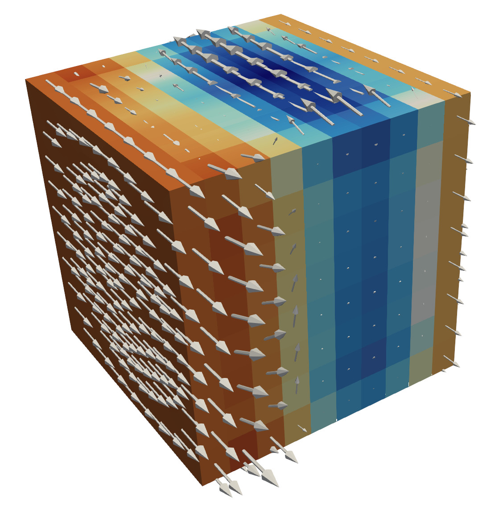
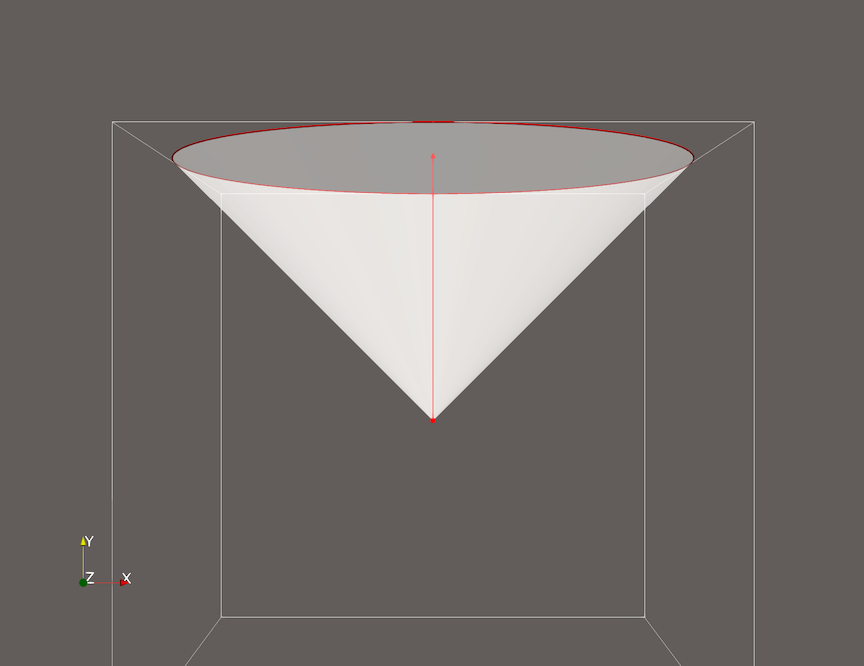
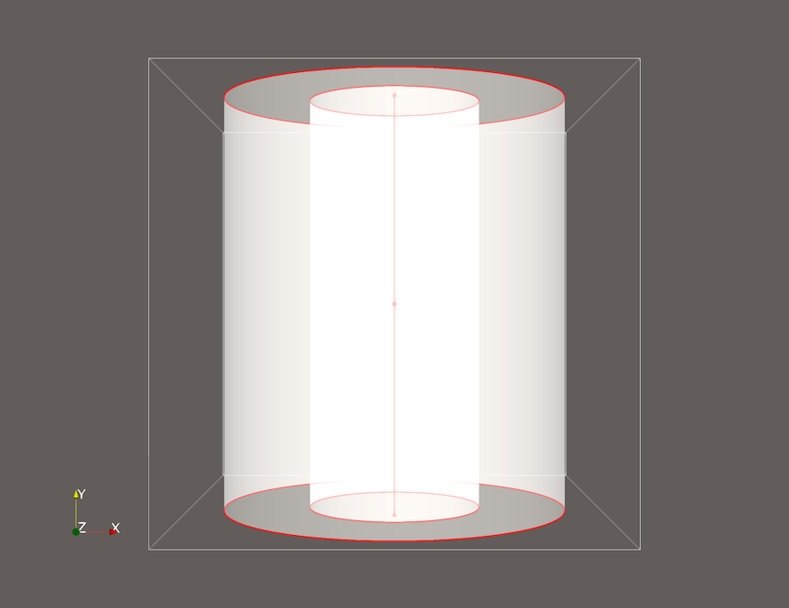
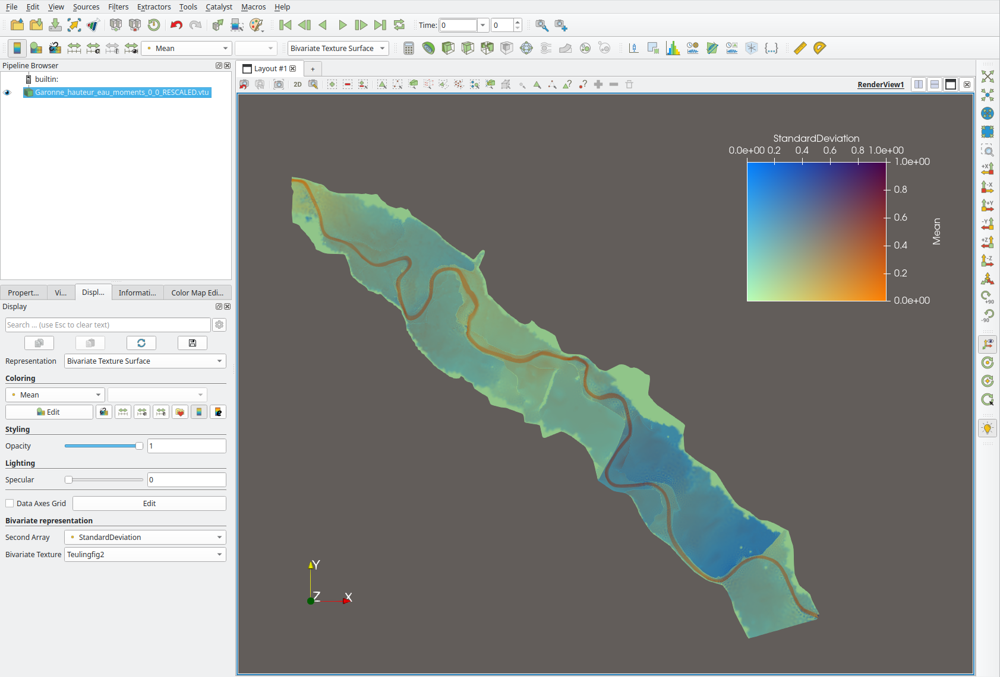
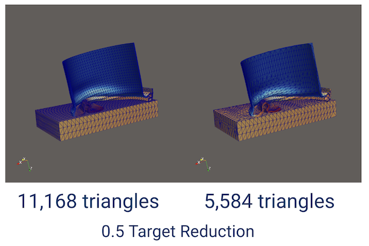
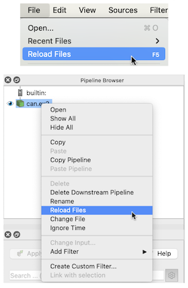
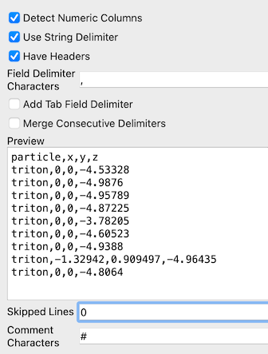
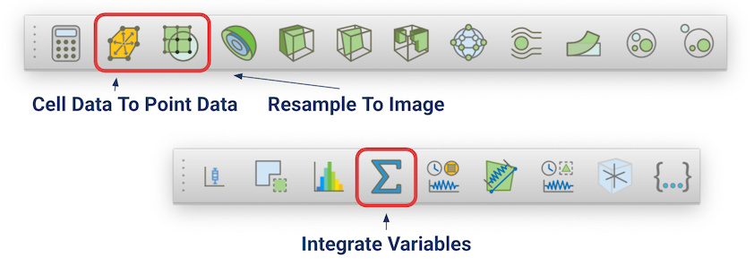
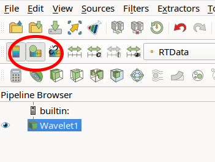

ParaView 6.0.0 Release Notes
============================

Major changes made in this version of ParaView are listed in this document. The full list of changes in this release is available
[here](https://gitlab.kitware.com/paraview/paraview/=/milestones/28).

* [New features](#new-features)
* [Rendering enhancements](#rendering-enhancements)
* [Plugin updates](#plugin-updates)
* [Filter changes](#filter-changes)
* [Changes in readers and writers](#changes-in-readers-and-writers)
* [Interface improvements](#interface-improvements)
* [Virtual reality enhancements](#virtual-reality-enhancements)
* [Python scripting improvements](#python-scripting-improvements)
* [Miscellaneous bug fixes](#miscellaneous-bug-fixes)
* [Catalyst](#catalyst)
* [Developer notes](#developer-notes)

New features
============

## Default Background and Color Map have changed.

The default background has changed from "BlueGrayBackground" to "WarmGrayBackground". The default color map has changed from "Cool to Warm" to "Fast".

> 
>
> The new color map and background color in ParaView.

For more information about this major change, please see the blog post [New Default Colormap and Background in the next version of ParaView](https://www.kitware.com/new-default-colormap-and-background-in-next-paraview-release/).


## Runtime selection between headless, offscreen, and onscreen rendering modes

The ParaView command-line executables `pvserver`, `pvpython` and `pvbatch` now support all three modes of rendering - headless, offscreen, and onscreen in one build. The rendering backend is automatically selected at runtime based upon the system capabilities such as availability of an X server or EGL drivers.

Use the new `--opengl-window-backend` command-line option to specify the OpenGL window backend used in these applications. Supported values are: 'GLX', 'EGL', 'OSMesa', and 'Win32'. If not specified, the default backend is used. The default backend is determined by the build configuration and the hardware configuration of the machine automatically.

 You can also force use of a specific backend by setting the environment variable `VTK_DEFAULT_OPENGL_WINDOW` to any of these values:

1. `vtkOSOpenGLRenderWindow` for software headless rendering with OSMesa on Linux and Windows.
2. `vtkEGLRenderWindow` for hardware accelerated headless rendering on Linux.
3. `vtkXOpenGLRenderWindow` for non-headless rendering on Linux.
4. `vtkWin32OpenGLRenderWindow` for non-headless rendering on Windows.

Note: the `--opengl-window-backend` command-line option and environment variable `VTK_DEFAULT_OPENGL_WINDOW` are not supported in the ParaView GUI client.

## Improved Cell Grid support

Cell grids – which are an extensible new type of data in VTK  and ParaView – now have an IOSS-based reader, hardware selection, CPU- and GPU-based interpolation using the same source code, and several new and improved filters.

The example rendering below shows how discontinuities at cell boundaries are allowed while simultaneously supporting spatial variation within each cell (unlike traditional VTK cell-data). You can see both smooth and sharp variations in [this example mesh](https://www.paraview.org/files/ExternalData/SHA512/4f4fa78c414c8093721a9ff2dea1c4d7fb6fbf1e67c960edc76160544338650f5cd513231b6bd5aba2e80be68f5832eeff555c0df59279856be1dc6bb64de90a), colored by the Z component of the magnetic field variable (`FACE_COEFF_B_Field`) at time-step 2.

> 
>
> Cell grid showing off discontinuities.

The arrow glyphs show the overall magnetic field directions. The field itself is stored as a single coefficient per hexahedral face with a vector-valued Thomas-Raviart basis function. This, too, was previously unsupported by VTK.

To read more about these changes, please see [this topic](https://discourse.vtk.org/t/new-vtkcellgrid-functionality/14640) on VTK's discourse forum.


## **Auto Save State** state files

ParaView has a new **Auto Save State** feature.

With the **Auto Save State** setting enabled, a state file will be written at each significant change in ParaView. This includes any pipeline modification or rendering property modification.

This feature can be enabled in the settings `Edit -> Settings...` panel. It is off by default. You can also choose the state file format, .py (Python) or .pvsm (ParaView XML) and its location.


## **Preserve Property Values** setting

ParaView already let you set custom default properties values from the dedicated button in the properties panel. With the **Preserve Property Values** setting, this can be done automatically after each modification. It applies to every filter, source, reader and extractor and will occur right after clicking on **Apply**. The next time you create a filter, it will come with your last configuration.


## Default save/load state file format selection

You can now choose a new property in the settings to set PVSM (XML state file) or .py (Python state file) as the default save/load state file format.


## Default property values

Some new options for resetting property values to custom defaults have been added to ParaView. These options are available in the context menu seen when you right-click (or ctrl-left-click) on a property label in the _Properties Panel_.

### "Reset to User Settings" menu item

A new "Reset to User Settings" menu option lets you reset the property value to your own custom default after manually changing it.

### Restore defaults without automatic updating

You can choose the "Reset to Application Default" on the  _Properties Panel_ before hitting the "Apply" button for the first time, and doing so does not automatically cause the source to be updated. You fully control when apply occurs and can manually modify any restored values before commiting them with the "Apply" button.


## New "Rescale to visible range" behavior in _Automatic Rescale Range Mode_

Paraview now provides two new options in the _Color Map Editor_ in the **Automatic Rescale Range Mode** property, **Rescale to visible data range on 'Apply'** and **Rescale to visible data range every timestep**. Each option enables updating the color map data range from only visible data in the render view.


## New Frustum, Cone, and Annulus widgets

The **Clip** and **Slice** filters now provide new **Frustum**, **Cone**, and **Annulus** clip/slice types.

The **Frustum** cut method represents a 4-sided frustum, i.e., a pyramid with the top truncated perpendicularly to its axis, and infinite towards its far plane direction. You can manipulate the frustum in the view using the dedicated widget to control its position, orientation, vertical/horizontal angles and the position of its near plane.

> 
>
> Screenshot of the Frustum widget in ParaView.

The **Cone** is a one-sided infinite cone, parameterized by an axis and the angle between the sides of the cone and its axis, and an origin point. You can manipulate the widget through controls similars to the cylinder widget controls.

> 
>
> Screenshot of the Cone widget in ParaView.

The **Annulus**  represents two co-axial cylinders, infinite in both direction. You can manipulate the annulus in the view using the dedicated widget to control its axis, position, and inner/outer radii.

> 
>
> Screenshot of the Annulus widget in ParaView.

Rendering enhancements
======================

## Window backend information in _About_ dialog

You can now see the OpenGL window backend in use by the ParaView server in the _About_ dialog under the entries "Window Backend" and "Supported Headless Backends". An example configuration is shown below.

> 
>
> Example of ParaView's _About_ window showing "Window Backend" "EGL" and "Supported Headless Backends" of "EGL OSMesa".

## New bivariate texture scalar bar

A dedicated 2D scalar bar has been added to the Bivariate Texture Representation. This 2D scalar bar allows you to visualize annotations (titles, ticks and labels) associated with the bivariate texture colors. Unlike the standard scalar bar, this 2D scalar bar does not have an orientation, and it is not attached to a lookup table (transfer function) but to the representation itself. However they have numerous properties in common, as text font, border, background, and so on.

> 
>
> Screenshot of the Textured Scalar Bar in ParaView


## New preset colormaps derived from Fast colormap

Two new preset colormaps, "Fast (Blues)" and "Fast (Reds)" have been added that extract the respective halves of the "Fast" colormap. These colormaps may be useful for creating plots of values that are known to be either all-positive (e.g., von Mises stress) or all-negative values (e.g., change in temperature for a cooling object), while retaining visual consistency with the "Fast" colormap. You can find these colormaps in the "Linear" preset list.

> 
>
> New colormaps, each derived from one side of the Fast color map.


Plugin updates
==============

## New XArrayCFReader plugin

This is a Python-only plugin based on `xarray_support.vtkXArrayCFReader`. It uses readers in XArray to read data so it enables formats not previously available in ParaView such as zarr and grib. Once data is in memory it is passed (using zero copy when possible) to the **NetCDF CFReader** to parse and create a dataset.

Please see the blog post [Bridging Data and Visualization: Interactive Scientific Exploration with VTK-Xarray Interoperability](https://www.kitware.com/bridging-data-and-visualization-interactive-scientific-exploration-with-vtk-xarray-interoperability/) for more details.

## NVIDIA IndeX plugin improvements

NVIDIA IndeX now uses CUDA 12.8, which has native support for the NVIDIA Blackwell GPU architecture.

The minimum NVIDIA driver versions required are 525.60.13 (Linux) and 528.33 (Windows). Recommended driver versions are 570.33 (Linux) and 570.84 (Windows) or newer.

Also required is an NVIDIA GPU that supports at least CUDA compute capability 5.0, i.e., Maxwell GPU architecture or newer.
To find out the compute capability of a specific GPU, see the [NVIDIA website](https://developer.nvidia.com/cuda-gpus).


## Plugin versions and descriptions can be read from plugin configuration file

ParaView is now able to read plugin versions and descriptions from plugin
configuration files directly, which means that the plugin version and its description are now visible in the plugin manager without loading the plugin.


Filter changes
==============

## New **Axis-Aligned Reflect** filter

A new **Axis-Aligned Reflect** filter is now available in Paraview. This filter reflects the input dataset across the specified plane. It operates on any type of dataset or Hyper TreeGrid and produces a Partitioned DataSet Collection containing partitions of the same type as the input. If the **Copy Input** property is enabled, the reflection and the input is copied to the output.


## New **Axis-Aligned Transform** filter

The new **Axis-Aligned Transform** filter is now available in Paraview. This filter applies an axis-constrained affine transformation to the input dataset (translation, scaling, rotation). The main benefit of this filter over the standard transform filter is to handle Hyper TreeGrids and to preserve the input type.


## New **Cell Quality** filter

ParaView now offers a new filter, **Cell Quality**, that allows you to compute a given cell quality metric on all cells contained in a dataset.

Some metrics and cell types are not yet supported, but you can set a default value for such cases with these properties:

- **UndefinedQuality** : for undefined measure, default is -1.
- **UnsupportedGeometry** : for unsupported cell type, default is -2.


## New **Feature Edges Region Ids** filter

The **Feature Edges Region Ids** filter is now available. It generates a cell array to identify region of a polygonal (surface) mesh. A region is a portion of the surface where two adjacent cells have a relative angle less than a given threshold.

You can view **Feature Edges Region Ids** like a variant of the **Connectivity** filter, using an angle criteria like the **Feature Edges** filter.

> 
>
> Superposition of Regions coloration and Feature Edges of a surface


## New **Explode Data Set** filter

The new **Explode Data Set** filter enables creation of a composite data
based on a CellData array values. Typically, this can be material ids, like groups in OBJ files, or other kind of region ids, such as those that can be generated by the **Connectivity** or the **Feature Edges Region Ids** filters.

> 
>
> Using **Explode Data Set** after a **Feature Edges Region Ids**


## New **Quadric Decimation** filter

The **Quadric Decimation** filter is now available. This filter let's you reduce the number of triangles in a triangulated mesh while preserving the shape of the mesh as much as possible. Set the targeted number of triangles reduction ratio to control the extent of the decimation. While the previous **Decimation** Filter uses a vertex decimation approach with re-triangulation, the **Quadric Decimation** Filter uses edge collapses which tends to produce higher-quality results.

> 
>
> Example of **Quadric Decimation** filter with 0.5 target reduction that cuts the number of triangles in half.


## Append filters have been multithreaded and performance improved

The **Append Datasets** and **Append PolyData** filters have been re-writen and multithreaded, and their performance has been significantly improved. **Merge Blocks** which uses **Append Datasets** internally has also been improved.


## **Extract Surface** and **Surface Representation** have improved performance with polyhedron cells

**Extract Surface** and **Surface Representation** (which uses **Extract Surface** internally) used to extract the whole cell when getting faces from polyhedron cells. Now, it accesses only the faces to efficiently extract the polyhedron faces-related information.


## New **Gaussian Integration Strategy** in **Integrate Variables**

ParaView now provides two strategies for the **Integrate Variables** filter. The original strategy is now called **Linear Strategy** and the new **Gaussian Strategy** is now available. This enables the proper computation of degenerate linear cells (e.g. with non-planar faces) and opens the way to high-order cell integration.


## New **Cell Generation Mode** in the **PCA Normal Estimation** filter

The **PCA Normal Estimation** filter now supports choosing whether the output polydata contains no cells (output may not appear in a render view in that case), a single poly vertex cell, or as many vertex cells as there are points.


## Deprecated filter **Process Id Scalars** removed

**Process Id Scalars** is now removed from Paraview. Please use **Process Ids** instead.

## **HyperTreeGrid Ghost Cells Generator** deprecated

Deprecation of the **HyperTreeGrid Ghost Cells Generator** filter, as the **Ghost Cells** filter already supports Hyper TreeGrids. You can use **Ghost Cells** for Hyper TreeGrids, DataSets, or Composite DataSets.


## Add HyperTreeGrid support for **Feature Edges** filter

You can now use **Feature Edges** for any PolyData or HyperTreeGrid,so **HyperTreeGrid Feature Edges** is deprecated.


## Add HTG support for Cell Centers

Hyper TreeGrids are now supported by the **Cell Centers** filter.

You can now use **Cell Centers** for any DataSet or Hyper TreeGrid.
**HyperTreeGrid Cell Centers** is therefore deprecated.


## **HyperTreeGrid Source** can create masked cells.

You can now use the **HyperTreeGrid Source** to create distributed Hyper Tree Grids with masked cells.


Changes in readers and writers
==============================

## Reload files now reloads all files

The `Files -> Reload Files` menu item now reloads all readers, not just the active reader selected in the _Pipeline Browser_. You can still reload only files for a chosen reader in the _Pipeline Browser_ by acessing the `Release Files` menu item in the context menu accessed by right-clicking or control-left-clicking the reader source.

> 
>
> The `Reload Files` item in the `File` menu (top) and `Reload Files` item in the _Pipeline Browser_ context menu (bottom).


## New EnSight Gold readers

ParaView has a completely rewritten **EnSight Gold Combined Reader** and **EnSight SOS Gold Reader**. These were rewritten to be easier to maintain and to find and fix bugs in the old reader. It also includes some additional features that the old reader lacked:
- You can select which parts to load, similar to selecting which arrays to load
- Static geometry is cached
- It produces Partitioned DataSet Collection as output


## New reader for the DOD HPCMP CREATE-AV AVMesh file format

AVMesh files produced by HPCMP CREATE-AV software can now be read by ParaView. The AVMesh file format extension is ".avm".


## VTKHDF Reader supports HyperTree Grids

ParaView can now open HyperTreeGrid datasets using the [VTKHDF format](https://docs.vtk.org/en/latest/design_documents/VTKFileFormats.html#hypertreegrid). These files support temporal data and can be read in parallel.


## VTKHDF Reader "Merge Parts" option removed

The **Merge Parts** option was removed from the VTKHDF Reader. You should manually create a **Merge Blocks** filter if a non-partitioned data type is required.


## OpenFOAM Reader has a new option to load restart files (filename ending with `_0`)

The `OpenFOAM` reader can now read result files which filename ends with `_0` by disabling the **Ignore Restart Files**. Previously, these files were ignored because "restart files" use the same naming pattern. The reader still ignores these files by default to keep previous behavior.


## OpenFOAM Reader multithreaded reading of case files

The `OpenFOAM` reader now supports multithreaded reading of OpenFOAM case files. This feature is on by default, and it can be disabled by turning on the **Sequential Processing** option. It can be useful to enable when reading large case files that are stored on a network drive. If the case file is stored on a local drive, it may be better to keep this feature off. An additional property, **Read All Files To Determine Structure** has been added, which enables reading only the `proc0` directory to determine the structure of the case file and broadcasting it to all processors. This property is off by default, because there is no such guarantee that the `proc0` directory contains all the necessary information to determine the structure of the full set of data files. Finally, the default value of property **Create Cell To Point** data has been changed to off.


## Delimited Text Reader improvements

The **Delimited Text Reader** (aka CSV reader) has new properties:

* A textual **Preview** of the first lines of the selected file. This is useful to be able to configure the reader before the first _Apply_ button press.
* The first **Skipped Records** of the file are not parsed. This is useful as some file formats may contain nonstandard header lines. See for instance the [gslib](http://www.gslib.com/gslib_help/format.html) format.
* First of **Comments Characters** found mark the end of the data for the current line: following characters are considered as comments and thus are not parsed.

> 
>
> Screenshow of new properties and preview in the **Delimited Text** reader.

The reader also benefits from different performance improvements that make it run faster and require less memory during file parsing.


## New **Load Surfaces** option in CGNS reader

You can now read surface (2D) elements stored in CGNS files as `Element_t` nodes. This allows reading of arbitrary surfaces saved in the file that are not associated to a boundary condition `BC_t` node.


## Zone section selection in FLUENT Reader

You can now select the zone sections you wish to load when reading a FLUENT file. The output multiblock dataset will contain only the selected zones.

Keep in mind that all intermediate structures are cached by default to avoid re-parsing the file when the zone selections change. If you wish to avoid caching to lower memory usage at the expense of increased IO performance, you can set the **Cache Data** property to false.

Because of zone sections interdependency in the FLUENT format, some unselected zone sections may still need to be read from the file, even if they are not part of the output multiblock dataset.

The general file parsing logic is:
- If any cell zone is enabled, the whole file needs to be read
- Otherwise, only the necessary zones are read (nodes, faces, data arrays, ...)

As a result, unselecting a zone will not always improve the file reading time, but it will lower the output's size.


## Reading file series of LAMMPS Dump files

LAMMPS Dump files are sometimes written as a series of files (one file per
timestep) and sometimes as restarts (multiple files each containing
multiple timesteps). Reading a time series of Dump files is now supported.


## Get time from VisIt readers for single time step

This gets the proper time values when reading a time series of files, but each file defines the proper simulation time. Previously, any time values were ignored and the file index was used for the time. Now, a time value can be read from a single file to get the appropriate simulation time.


## Spy Plot Reader **Down Convert Volume Fraction** property is respected

 A [bug](https://gitlab.kitware.com/paraview/paraview/-/issues/22571) that made the Spy Plot Reader always down convert volume fraction arrays has been fixed. Now the **Down Convert Volume Fraction** property setting is respected correctly.


## IOSSWriter is the new default Exodus writer

The **IOSSWriter** introduced in ParaView 5.12 is now the default Exodus writer in ParaView. The old **ExodusIIWriter** is now available as **LegacyExodusIIWriter** once you load the **LegacyExodusWriter** plugin. In addition, the **IOSSWriter** now supports the following extensions: `.g`, `.e`, `.ex2`, `.ex2v2`, `.gen`, `.exoII`, `.exoii`, and `.exo`.


## New Fides Writer

A new **Fides Writer** that uses the Fides library to write data to ADIOS2 BP files is now available in ParaView. This initial version only provides support for the BP engines (SST support is in progress). When writing the data, Fides will also write the schema as an attribute in the BP file,
so the data can be read back in to ParaView with the **Fides Reader**.


## New options in the VTK.JS Exporter

New options have been added to the VTK.JS scene exporter.

* You can choose whether to also create a standalone Glance viewer embedding the scene. The HTML template can now be retrieved automatically from the ParaView share directory from the install folder.
* You can disable network access from Glance, to make the page independent from external servers.
* You can now choose the arrays exported for each source dataset in the VTK.JS/Glance exporter. This enables lighter exports containing only the required datasets.


Interface improvements
======================

## Polar axes properties renamed

Several properties of the **Polar Axes** have been renamed:

| **Previous name** | **New name** |
| ----------------- | ------------ |
| **Number Of Polar Axes** | **Number Of Arcs**|
| **Delta Range Polar Axes** | **Delta Range Arcs**|
| **Radial Title Visibility** | **Radial Label Visibility**|
| **Radial Title Format** | **Radial Label Format**|
| **Radial Title Location** | **Radial Label Location**|
| **Radial Title Offset** | **Radial Label Offset**|
| **Polar Ticks Visibility** | **All Ticks Visibility**|

Full backwards compatibility with ParaView state files and Python scripts from versions created by ParaView versions before 6.0.0 is maintained.


## Multi-block visibility selection in HyperTreeGrid surface representation

The HTG surface representation now supports toggling individual block visibility in the _MultiBlock Inspector_.


## **HyperTreeGrid Visible Leaves Size** was renamed to **HyperTreeGrid Generate Fields**

Expanded **HyperTreeGrid Visible Leaves Size** to allow new fields to be computed. The filter has been renamed **HyperTreeGrid Generate Fields** and **HyperTree Grid Visible Leaves Size** is now deprecated.

New fields available:
 - "CellCenter" (cell data)
 - "TotalVisibleVolume" (field data)

Any field can be turned off, and their name can be modified.

## _Time Manager_ defaults to one frame

In the past, ParaView used to always set a default number of frames set to 10. This created an issue when trying to save animation/extracts with an object that doesn't have time information. Now the default number of frames is set to 1, which is more appropriate for such cases. If you want to create an animation with more frames, you can change the number of frames in the _Time Manager_ panel.


## Time controls allow changing play direction while playing

Previously, reversing an animation required stopping the playback and
then changing the play direction. Now, you can change the play direction while already playing without needing to stop the animation first.


## _Common_ and _Data Analysis_ toolbar updates

* The _Common_ toolbar has gained buttons for **Cell Data To Point Data** and **Resample To Image**, but **Extract Grid** has been removed.

* The _Data Analysis_ toolbar now has **Integrate Attributes**.

> 
>
> New buttons have been added to the _Common_ and _Data Analysis_ toolbars.


## _Color Map Editor_ button is now toggleable

The toolbar button to show the _Colormap Editor_ panel is now toggleable, i.e., it can show and now hide the _Color Map Editor_.

> 
>
> The _Color Map Editor_ toolbar button can now be toggled to show or hide the _Color Map Editor_.


## ParaView Example Visualizations updated

Thumbnails for existing example visualizations have been updated with the new default color map and background. In addition, three new examples have been added:

* Rectilinear grid with timesteps
* Unstructured grid in parallel files with two timesteps
* Mandelbrot source showing different color maps

## New menu item to unlink a camera

A new menu item "Unlink Camera" is available in the context menu obtained by by right-clicking (ctrl-left-clicking) in a RenderView. When selected, this item will remove all camera links associated with the view.


## SSH client option support

Clients may now inject options into the SSH client command by setting the `PARAVIEW_SSH_OPTIONS` environment variable.

## SSHCommand support random port forwarding port

SSHCommand port forwarding mechanism has been improved to now support random port forwarding port, thanks to the new `PV_SSH_PF_SERVER_PORT` variable.

Example syntax for a reverse connection server with a random forwarded port between 8080 and 88888:

```xml
<Server name="case18" resource="csrc://gateway:11115">
  <CommandStartup>
    <Options>
      <Option name="PV_SSH_PF_SERVER_PORT" label="Forwarding Port" readonly="true">
        <Range type="int" min="8080" max="8888" default="random" />
      </Option>
    </Options>
    <SSHCommand exec="/path/to/submit_script_pvserver.sh" delay="5">
      <SSHConfig user="user">
        <Terminal/>
        <PortForwarding/>
      </SSHConfig>
      <Arguments>
        <Argument value="--reverse-connection"/>
        <Argument value="--client-host=gateway"/>
        <Argument value="--server-port=$PV_SERVER_PORT$"/>
      </Arguments>
    </SSHCommand>
  </CommandStartup>
</Server>
```

## User interface settings are now unversioned

ParaView no longer uses versioned user interface settings files, which means it is no longer necessary to copy over the user interface settings when updating ParaView versions. The file is named `ParaView.ini` and can be found in standard user configuration file storage locations.

## Site settings for user interface settings

ParaView now supports a site settings file for user interface settings. It uses the same syntax and has the same purpose as the `.ini` file that can be found under the standard user configuration. It stores settings for which windows are open and their geometry on the screen. This site settings file is used as fallback.

The paths searched are relative to the ParaView installation and depends on
the operating system:
- the exectutable directory
- the <install> dir: the executable dir or its parent if executable is under a "bin" dir.
- "<install>/lib" "<install>/share/paraview-<version>"
- macOS specific:
--  package <root>: "<install>/../../.."
-- "lib", "lib-paraview-<version>", "Support" as <root> subdirs.

## Override property visibility

ParaView property visibility is either "default" (always visible), "advanced" (when an advanced button is toggled on) or "never". You can now override those with a simple `PropertyPanelVisibilities.json` JSON-formatted configuration file, placed under a standard ParaView configuration directory.

The JSON should be a collection of objects per proxy group, containing one object per proxy, itself having a list of properties and their desired visibilities.

Example of PropertyPanelVisibilities.json
```json
{
  "annotations" :
  {
    "GridAxes3DActor" :
    {
      "XTitle" : "advanced"
    }
  },
  "sources" :
  {
    "SphereSource" :
    {
      "StartTheta" : "default",
      "StartPhi" : "never"
    }
  }
}
```

Virtual reality enhancements
============================

## Collaboration in CAVEs

ParaView's CAVEInteraction plugin now supports basic collaboration features.
If you build ParaView with the CAVEInteraction plugin and collaboration
enabled, the plugin's _CAVE Interaction Manager_ includes new controls in the user interface allowing you to configure your connection to the collaboration server.  It also allows you to manage the mapping between events you have configured and your avatar's
head and hands.

Using this new feature, you can collaborate with people in other CAVE systems,
as well as with people using the XRInterface plugin.


## Expose physical coordinate system

This change provides a new **Physical To World Matrix** property on render views. This is used in some common representations when the new **Coordinate System** property is set to physical coordinates instead of the default world coordinates.


## Coverable CAVE (pvserver) windows

Adds a new attribute, `Coverable`, available to set on `Machine` elements in a `.pvx` file.  When the attribute is set to 1, the associated `pvserver` window will be manageable by the windowing system.  This allows other windows to cover it, and provides a taskbar item which can be used to bring the `pvserver` window back to the front.

This functionality is only available for the X windows implementation. A warning will be printed on non-X windows systems.


Python scripting improvements
=============================

## Improvements to autocomplete in _Python Shell_

ParaView's _Python Shell_ previously had basic autocomplete support that worked to complete the names of sources/filters/readers/writers, attributes of existing sources/filters/readers/writers, or names of free functions such as `SaveScreenshot` when calling them.

Now, autocomplete works in additional cases, including:

- Autocompleting property names inside a source/filter creation call - `s = Sphere(registra<TAB>` autocompletes to `s = Sphere(registrationName`

- Autocompleting keyword arguments in free function call - `Connect(ds_<TAB>` brings up a combobox with autocomplete choices `ds_host` and `ds_port`

- Multiple argument autocompletion - the first and subsequent arguments can be autocompleted, with two exceptions: 1). when a function call is not part of an assignment, and 2). when a named argument is assigned a value with a decimal/period. These exceptions are limitations of the current implementation rather than fundamental limitations of autocomplete support in Python.


## Reduce verbosity in ParaView Python state files

Python state files will now be less verbose. The new approach records only properties that are used in the visualization instead of all modified properties of a proxy.

To use the previous verbosity level choose "any *modified* properties" in the **Properties to Trace on Create** property of the Python  _Trace Options_ dialog.

For example, in ParaView 5.13.0 the saved state of a **Clip** filter will look like this:

```python
clip = Clip(Input=unstructured_grid)
clip.ClipType='Plane'
clip.HyperTreeGridClipper='Plane'
clip.Scalars=['POINTS', 'RTData']
clip.Value=170.39517211914062
```

The new aprroach takes advantage from the fact that the default value of **Clip** is a **Plane** and that for a clip that uses a plane on an unstructured grid all the other properties are not used

```python
clip = Clip(Input=unstructured_grid)
```

Similarly for representations
```python
wavelet1Display.Representation = 'Outline'
wavelet1Display.ColorArrayName = ['POINTS', '']
wavelet1Display.SelectNormalArray = 'None'
wavelet1Display.SelectTangentArray = 'None'
wavelet1Display.SelectTCoordArray = 'None'
wavelet1Display.TextureTransform = 'Transform2'
wavelet1Display.OSPRayScaleArray = 'RTData'
wavelet1Display.OSPRayScaleFunction = 'Piecewise Function'
wavelet1Display.Assembly = ''
wavelet1Display.SelectedBlockSelectors = ['']
wavelet1Display.SelectOrientationVectors = 'None'
wavelet1Display.ScaleFactor = 2.0
wavelet1Display.SelectScaleArray = 'RTData'
wavelet1Display.GlyphType = 'Arrow'
wavelet1Display.GlyphTableIndexArray = 'RTData'
wavelet1Display.GaussianRadius = 0.1
wavelet1Display.SetScaleArray = ['POINTS', 'RTData']
wavelet1Display.ScaleTransferFunction = 'Piecewise Function'
wavelet1Display.OpacityArray = ['POINTS', 'RTData']
wavelet1Display.OpacityTransferFunction = 'Piecewise Function'
wavelet1Display.DataAxesGrid = 'Grid Axes Representation'
wavelet1Display.PolarAxes = 'Polar Axes Representation'
wavelet1Display.ScalarOpacityUnitDistance = 1.7320508075688774
wavelet1Display.OpacityArrayName = ['POINTS', 'RTData']
wavelet1Display.ColorArray2Name = ['POINTS', 'RTData']
wavelet1Display.IsosurfaceValues = [157.0909652709961]
wavelet1Display.SliceFunction = 'Plane'
wavelet1Display.Slice = 10
wavelet1Display.SelectInputVectors = [None, '']
wavelet1Display.WriteLog = '
```

We now have

```python
wavelet1Display.Set(
    Representation='Outline',
    ColorArrayName=['POINTS', ''],
    SelectNormalArray='None',
    SelectTangentArray='None',
    SelectTCoordArray='None',
    Assembly='',
    SelectedBlockSelectors=[''],
)
```

In addition, defaults for proxy properties are now tracked so that they may be excluded from Python state files when the Python trace is set to record only modified properties.

For a simple example that contains a **Wavelet**, **Contour**, and a couple of extractors, the Python state file size was reduced from 215 lines to 199 lines. For example, the code initializing the `renderView` was changed from this:

```python
renderView1.Set(
    AxesGrid='Grid Axes 3D Actor',
    StereoType=0,
    CameraPosition=[0.0, -0.3340263366699219, 66.1845775207595],
    CameraFocalPoint=[0.0, -0.3340263366699219, 0.0],
    CameraFocalDisk=1.0,
    CameraParallelScale=17.129829154436734,
    LegendGrid='Legend Grid Actor',
    PolarGrid='Polar Grid Actor',
)
```

to this (three default proxy properties were removed):

```python
renderView1.Set(
    StereoType=0,
    CameraPosition=[0.0, -0.3340263366699219, 66.1845775207595],
    CameraFocalPoint=[0.0, -0.3340263366699219, 0.0],
    CameraFocalDisk=1.0,
    CameraParallelScale=17.129829154436734,
)
```

Several other default proxy properties were likewise removed from
other functions. For example, `PointMergeMethod='Uniform Binning'`
was removed from the contour settings, the following were all
removed from the geometry representation:

```python
    TextureTransform='Transform2',
    OSPRayScaleFunction='Piecewise Function',
    GlyphType='Arrow',
    ScaleTransferFunction='Piecewise Function',
    OpacityTransferFunction='Piecewise Function',
    DataAxesGrid='Grid Axes Representation',
    PolarAxes='Polar Axes Representation',
```

And `Trigger = 'Time Step'` was removed from the extractors.

Finally, 2D transfer functions would always appear in Python trace or Python state files that included rendering components, even when the 2D transfer functions were not used at all. The recent changes to proxy property defaults, however, allow us to also remove 2D transfer functions when they are unmodified/unused.

Now, 2D transfer functions are no longer present in the state file if they are unmodified. The following are examples of lines that are removed:

```python
# get 2D transfer function for 'RTData'
rTDataTF2D = GetTransferFunction2D('RTData')
```

And in the setter for the lookup table:

```python
    TransferFunction2D=rTDataTF2D,
```

Those lines of code were unnecessary because the `TransferFunction2D` for the lookup table was already set to that exact same object.

## Simplify RGBPoints in Python state files

Many colormaps include a large number of RGBPoints. For example, "Viridis" and "Inferno" both contain around 250 points. Previously, all of the RGBPoints would be explicitly written out to Python state files. This could be overwhelming for state files. For example, it may have looked like this:

```python
# get color transfer function/color map for 'RTData'
rTDataLUT = GetColorTransferFunction('RTData')
rTDataLUT.Set(
    RGBPoints=[
        # scalar, red, green, blue
        40.0, 0.267004, 0.004874, 0.329415,
        40.86284, 0.26851, 0.009605, 0.335427,
        # ...  ~250 lines
    ],
    # ...
)
```

Now, while saving the Python state file, we check to see if we can generate the RGB points automatically by using a preset name and a range of values. If we can generate the RGB points automatically, we call the function to do so instead of explicitly listing all RGB points. Thus, that section of the state file now looks like the following:

```python
# get color transfer function/color map for 'RTData'
rTDataLUT = GetColorTransferFunction('RTData')
rTDataLUT.Set(
    RGBPoints=GenerateRGBPoints(
        preset_name='Viridis (matplotlib)',
        range_min=40.0,
        range_max=260.0,
    ),
    # ...
)
```

This is much more user-friendly, since you have the opportunity to see and manually edit the minimum and maximum of the range. It is also significantly less verbose than writing out all of the points.

While saving the state file, if we cannot generate the RGB points automatically (this could happen, for example, if you manually modify one or more of the points), then we default to the old behavior of writing out all of the points explicitly.


## New Python package `paraview.info`

ParaView has now a new python module `info` that allows you to get diagnostic
information about the current build.

You can access it via `pvbatch`:

```
pvbatch -m paraview.info
```

To get output as json use
```
pvbatch -m paraview.info --json
```

In `pvpython` (or a catalyst script) you can now do

```
>>> from paraview.info import print_env
>>> print_env()
```

Sample output:
```
ParaView Version           5.13.2
VTK Version                9.4.1-1738-gcd19f92852
Python Library Path        /usr/lib/python3.10
Python Library Version     3.10.12 (main, Feb  4 2025, 14:57:36) [GCC 11.4.0]
Python Numpy Support       True
Python Numpy Version       1.21.5
Python Matplotlib Support  False
Python Matplotlib Version
MPI Enabled                True
--MPI Rank/Size            0/1
Disable Registry           False
SMP Backend                Sequential
SMP Max Number of Threads  1
OpenGL Vendor              Intel
OpenGL Version             4.6 (Core Profile) Mesa 23.2.1-1ubuntu3.1~22.04.3
OpenGL Renderer            Mesa Intel(R) UHD Graphics (TGL GT1)
```


## Replace `vtkMultiBlockDataGroupFilter` with generic `vtkGroupDataSetsFilter` as PostGatherHelper in `servermanager.Fetch`

`servermanager.Fetch` now uses generic `vtkGroupDataSetsFilter` instead of `vtkMultiBlockDataGroupFilter` as the `PostGatherHelper` for its reduction filter in case of composite input. Therefore, `Fetch` now works with `vtkPartitionedDataSetCollection` and `vtkPartitionedDataSet` inputs.


## paraview.servermanager.options.satelite deprecation

* The `paraview.servermanager.options.satelite` option has been renamed to
`satellite` to fix the typo.


## CAVE configuration details available to client

In CAVE mode,` pvservers` are normally provided the path to a .pvx file to read that contains the geometry of each display as well as the physical coordinates of the screen corners of each display.

This change makes those values available to the client via new API on the render view proxy.  Clients can query whether or not the system is in CAVE mode (the rest of the API methods will complain if not in CAVE mode), as well as query the number of displays.  For each display the client can ask for the geometry and screen corners.

Example:

```python
>>> from paraview.simple import *
>>> rv = GetActiveView()
>>> rv.GetIsInCAVE()
True
>>> rv.GetHasCorners(0)
True
>>> rv.GetLowerLeft(0)
vtkmodules.vtkCommonMath.vtkTuple_IdLi3EE([-1.13, -0.635, 1.04])
>>> rv.GetLowerRight(0)
vtkmodules.vtkCommonMath.vtkTuple_IdLi3EE([-1.13, -0.635, -1.22])
>>> rv.GetUpperRight(0)
vtkmodules.vtkCommonMath.vtkTuple_IdLi3EE([-1.13, 0.635, -1.22])
>>> rv.GetGeometry(0)
vtkmodules.vtkCommonMath.vtkTuple_IiLi4EE([60, 1200, 640, 360])
```


## Refactoring of `simple.py`

Over time the `paraview.simple` module grew to contain many functions over many lines of code. It was time to rework its structure to promote clarity and enable a deprecation path while empowering developers to create new and better helper functions.

The new structure breaks the single `simple.py` file into a package split into a set of submodules with common responsibilities. Deprecated methods are centralized within their own file for easy eventual removal.

This change also exposes a new set of methods (`Set`, `Rename`) on proxies directly to streamline their usage.

The code block below capture the usage of those new methods:

```python
from paraview.simple import *

cone_proxy = Cone()

# Update several properties at once
cone_proxy.Set(
    Radius=2,
    Center=(0,1,2),
    Height=5,
    # Below kwarg will print a warning
    # as the `Hello` property does not exist
    # for the `Cone` proxy
    Hello="World",
)

# Update source name in the GUI pipeline
cone_proxy.Rename("My Super Cone")
```

Note that `from paraview.simple import *` works as before to import all functions in the `paraview.simple` package.


Miscellaneous bug fixes
=======================

## Avoid deadlock in _Output Messages_ window

There were conditions that under some circumstances would cause deadlock when a message was written to the output. The problem was that the _Output Messages_ window's display text method would first lock a mutex and then send some Qt signals to handle the message. However, it was possible for one of the slots attached to the signal to send its own message. In one particular case, this happened when the dock for the output messages was shown. That would cause the display text method to be reentrant. When it tried to grab the mutex again, it would lock because it already locked the mutex higher up the stack.


## Fix in Embossing Representation plugin: shader undeclared uniform and invalid OpenGL enum

When using embossing representation plugin, some errors occurred on the OpenGL level.

1. Shader generation fix: ParaView used to throw an error message when the **Extrusion Surface** representation was used without lighting on (e.g. disabling light kit). This error message is now prevented.

2. OpenGL error fix: when the **Extrusion Surface** or **Bump Mapped Surface** was used with `vtkIdType` data, an error used to show up because the type was unknown. ParaView still does not support `vtkIdType` data in this plugin, but it is now properly handled, preventing low level errors from OpenGL.


Catalyst
==========

## Additional paths to Python libraries in ParaViewCatalyst Blueprint can be defined

The `initialize` protocol of ParaView-Catalyst Blueprint has now a new optional entry `catalyst/python_path`.

`catalyst/python_path` allows to add a list of paths to be added in the `PYTHONPATH` on the Python interpreter that executes the catalyst python script. `catalyst/python_path` should be given as a single string. Multiple paths should be separated with the system path separator, i.e., `:` for
Unix and `;` for Windows.


## Catalyst field metadata example

Catalyst 2's `CxxPolygonal` example has been renamed to `CxxPolygonalWithAttributes` to showcase how to use VTK specific array attributes within Catalyst.

When defining fields in a Conduit tree, it is often useful to include metadata about the fields that can be interpreted by VTK, and used appropriately. To that end, we have added a new node to the Conduit tree that can be used to store metadata about the fields in the tree. This node is called `state/metadata/vtk_fields`.

Each child of the `state/metadata/vtk_fields` node has a name that corresponds to a field in the tree. The number of children of the `state/metadata/vtk_fields` node need not match the number of `fields` in the tree since not every field needs to have metadata.

The current metadata that can be stored for each field is:

1. `attribute_type`: It is a string and represents the attribute type of a field that, so that VTK can use an attribute array, such as `GlobalIds`. The values uses are the entries of `vtkDataSetAttributes::AttributeTypes` + `Ghosts`.
   The complete list of values is:
   - `Scalars`
   - `Vectors`
   - `Normals`
   - `TCoords`
   - `Tensors`
   - `GlobalIds`
   - `PedigreeIds`
   - `EdgeFlag`
   - `Tangents`
   - `RationalWeights`
   - `HigherOrderDegrees`
   - `ProcessIds`
   - `Ghosts`

2. `values_to_replace` and `replacement_values`: These two are vectors of values that be used to replace specific values in the field. This is useful when the field has some values that are not valid for VTK. For example,   the `vtkGhostType` array uses specific values that other ghost cell generator algorithms may not use. In this case, the `values_to_replace` would be the values that need to be replaced, and the `replacement_values` would be the values that should replace them. The two vectors should have the same length.

Example:

```cpp
conduit_cpp::Node mesh;
CreateUniformMesh(3, 3, 3, mesh);

std::vector<int> cellGhosts(8, 0);
cellGhosts[2] = 1;

conduit_cpp::Node resCellFields = mesh["fields/other_ghosts"];
resCellFields["association"] = "element";
resCellFields["topology"] = "mesh";
resCellFields["volume_dependent"] = "false";
resCellFields["values"] = cellGhosts;

std::vector<int> cellGhostValuesToReplace(1, 1);
std::vector<int> cellGhostReplacementValues(1, vtkDataSetAttributes::HIDDENCELL);

std::vector<int> cellGhostsMetaData(1, 1);
conduit_cpp::Node ghostMetaData = mesh["state/metadata/vtk_fields/other_ghosts"];
ghostMetaData["attribute_type"] = "Ghosts";
ghostMetaData["values_to_replace"] = cellGhostValuesToReplace;
ghostMetaData["replacement_values"] = cellGhostReplacementValues;
```

Lastly, the usage of `ascent_ghosts` has been deprecated and should be replaced with the new `state/metadata/vtk_fields` node, as shown above.


Developer notes
===============

## C++17 is now required for ParaView

ParaView now permits C++17 language features and hence requires C++17 compiler support. The minimum required compiler versions have been updated as well.

* Updates minimum required compilers:
    * gcc 8.0 from 4.8
    * LLVM Clang 5.0 from 3.3
    * Apple Clang 10.0 from 7.0
    * MSVC 2017 from 2015
    * Intel ICC 19.0 from 14.0
    * IBM XL 17.1 from 16.1

## ParaView's new image testing framework

### Overview

ParaView's image testing framework has been enhanced to incorporate the Structural Similarity Index (SSIM) metric on the Lab color space. This contribution provides an opt-in feature to ensure that as a project that is using VTK, it does encounter broken tests when updating.

### SSIM Metric

#### Definition

The Structural Similarity Index (SSIM) is a metric introduced in the paper titled "Image Quality Assessment: From Error Visibility to Structural Similarity" by Wang et al. It measures the "structural correlation" between two images, providing a comprehensive evaluation of their similarity.

#### Computation

In this implementation, SSIM is computed per pixel around a patch in the Lab color space. The Lab color space is chosen for its perceptual uniformity, ensuring that differences in color are consistent with human perception.

The SSIM metric produces a value between 0 and 1, where 1 indicates perfect structural similarity between the images, and 0 indicates no similarity.

#### Domain of Output

The output of SSIM metric ranges from 0 to 1, where 1 indicates perfect similarity, and 0 indicates no similarity.

#### Integration

You can enable this feature by defining the CMake variable `DEFAULT_USE_SSIM_IMAGE_COMP` as true. When turned on, SSIM will be used by default.

#### Configuration

There are three ways to use the SSIM metric when setting a test:

##### `TIGHT_VALID` (Default)

* Uses Euclidean metrics (L2 and 2-Wasserstein) on each channel.
* Computes the maximum discrepancy (from 0 to 1).
* Recommended for images sensitive to outliers.
* Default threshold is around 0.05.

##### `LOOSE_VALID`

* Uses both Manhattan distance and Earth-mover's distance on each channel.
* Less sensitive to outliers.
* Suitable for images dependent on graphics drivers or containing text.
* Default threshold is recommended.

##### `LEGACY_VALID`

* Uses the old metric (not recommended).
* For compatibility with previous testing methods.

##### XML Example:

```cmake
set(Test1_METHOD TIGHT_VALID) # Default
set(Test2_METHOD LOOSE_VALID)
set(Test3_METHOD LEGACY_VALID)
```

##### CXX Example:

```cmake
vtk_add_test_cxx(Test1.cxx,TIGHT_VALID) # Default
vtk_add_test_cxx(Test2.cxx,LOOSE_VALID)
vtk_add_test_cxx(Test3.cxx,LEGACY_VALID)
```

##### Python Example:

```cmake
paraview_add_test_python(Test1.py,TIGHT_VALID) # Default
paraview_add_test_python(Test2.py,LOOSE_VALID)
paraview_add_test_python(Test3.py,LEGACY_VALID)
```

#### Manual Configuration

Set `VTK_TESTING_IMAGE_COMPARE_METHOD` to one of the following values: `TIGHT_VALID`, `LOOSE_VALID`, or `LEGACY_VALID`.

#### Migration

It is advised to migrate to the new SSIM metric within a reasonable time frame. The new metric is more selective and results in fewer false negatives compared to the legacy method.


## Standard Paths

The new `vtkPVStandardPaths` groups methods to get the standard paths an application may want to use. This includes system directories, install directories and user directories. They of course depend on the operating system.

On linux and macOS, it tries to match the [XDG specifications](https://specifications.freedesktop.org/basedir=spec/0.8).

Some environment variables may modify the behavior: those defined by XDG when relevant. On windows `APPDATA` is used to get the User directory.

## `vtkSMSettings` priorities update

Some `vtkSMSettings` API ask for a priority as a numeric value.

We added `GetUserPriority()`, used as default, for the writeable settings. This is the highest priority used in ParaView. We also added `GetApplicationPriority()` to put all ParaView-defined settings (*aka* site-settings) under the same priority, lower than `GetUserPriority()`.

Those replace hard-coded values. If you define custom settings priority, please base them on this new API.

## `vtkPVGeneralSettings` breaking changes

The `vtkPVGeneralSettings` class was updated to limit its dependency to other
modules at the strict minimum. During this work, its members were moved from `protected` to `private`. Please use the getters and setters instead.

## Warning prevention due to VTK MPI size check fix

Some changes were made in ParaView to prevent warning messages when using the application with MPI:

1. VTK MPI has been reworked to fix a potential freeze of the application when using ParaView with MPI. The new fix can throw a warning if some functions are not used properly.

2. Some minor refactoring were made to improve memory management.

## Fix adding `PARAVIEW_PLUGIN_LOADER_PATHS` to `vtkPVPluginLoader` definitions

Adding `PARAVIEW_PLUGIN_LOADER_PATHS` to compile definitions for `vtkPVPluginLoader` is fixed to stop removing `BUILD_SHARED_LIBS` definitions.

## `vtkPVPlane` deprecation

`vtkPlane` in VTK now supports **Axis Aligned** and **Offset** properties. Therefore, `vtkPVPlane` is now deprecated. Please note that the protected members of `vtkPVPlane` have been modified without deprecation, which may have an impact if you were inheriting from that class. Please inherit from `vtkPlane` instead.

## Improved `vtkPVArrayInformation::CopyFromArray()` performances

Added two new `vtkPVArrayInformation::CopyFromArray(vtkAbstractArray*)` and `vtkPVArrayInformation::CopyFromArray(vtkFieldData*, int)` overloads, and deprecated the existing `vtkPVArrayInformation::CopyFromArray(vtkAbstractArray*, vtkFieldData*)`.

This change makes the distinction explicit. This allows us to make sure to *not* repeatedly loop over the field data's arrays using costly string comparisons. This results in notable performance improvements during ParaView's pipeline updates for dataset with a large number of arrays.

### New behavior for custom property panel visibilities

ParaView has a new behavior, `pqPropertyPanelVisibilitiesBehavior` that can be instantiated to enable the feature. Upon creation, it will read the configuration JSON file, and it will be consulted in every proxy registration. To properly work, this behavior needs to be created before any `pqProxyWidget`, as only further widget creation will be affected by it.

## New **LiveSource** `refresh_on_interaction` attribute

A new boolean attribute `refresh_on_interaction` has been added. It allows live sources to be refreshed upon user interaction. The default value is false (current behavior).

Keep in mind that enabling this option could complicate interactions with large data sets.

```xml
    <SourceProxy ...>
      ...
      <Hints>
        <LiveSource interval="50" refresh_on_interaction="1" />
      </Hints>
    </SourceProxy>
```

## Alternative to Qt's `xmlpatterns`

The `ParaViewClient` APIs now support using (and prefer) `xsltproc` if available. This allows documentation generation to be supported with Qt6, which does not provide an `xmlpatterns` executable.


## Expose ParaView QCH file location in CMake configuration

ParaView's cmake configuration exposes a new variable `ParaView_QCH_FILES` that stores the location of ParaView .qch help files. It is useful for a ParaView-based applications that wish to include ParaView's documentation.


## Custom ApplicationCore class for ParaView-based applications

ParaView-based application can already specify a `MAIN_WINDOW_CLASS`
in `paraview_client_add` CMake function. This is in fact the main point of a those kind of applications.

You can now also specify a `APPLICATION_CORE_CLASS`, that should subclass
the `pqPVApplicationCore` default class.

It is useful to control core features at creation, before the end of the initialization. An example is deciding to use or not use the application version in the settings filename (see `pqApplicationCore::useVersionedSettings`).


## Convert Array Association

A filter may require an input array associated with a specific attribute
type (mainly Points or Cells). ParaView provides a global setting to automatically move arrays to the required association. This applies to every filter.

It is now possible to specify this behavior per filter in the XML configuration with the attribute `auto_convert_association="1"` in the `InputArrayDomain`.

The conversion is done if either the global settings is true or the filter property is set to "1".

The **Contour** filter uses this feature.

Note: With automatic array conversion, more arrays are available.
This may change the default array picked by the downstream filter.


## CAVE: Fix valuator role bindings

Calling `GetValuatorRole(eventName)` has never worked because valuator events are configured with a single id, which is the index of a single channel of valuator data. However, valuator events are delivered with all ids/indices of valuator as a single event.

Since the relationship between roles and valuator events isn't one-to-one, the `GetValuatorRole` method has been removed. Now `vtkSMVRInteractorStyleProxy` provides a method to get the id/index associated with given a role name.

## Source code deprecations and removals

### Deprecations new in 6.0

* The class `vtkCPMappedVectorArrayTemplate` has been deprecated. Please use the `SetArray` functionality of `vtkAOSDataArrayTemplate` instead.
* In `pqReloadFilesReaction`, the static member function `bool pqReloadFilesReaction::reload()` has been deprecated. Use `reloadSources()` instead.
* In `pqServerConfiguration`, the function `QString portForwardingLocalPort() const` has been deprecated. Use `int localPortForwardingPort() const` instead.
* In `vtkSMAnimationScene`, the member function `static void SetGlobalUseGeometryCache(bool)` has been deprecated in favor of `vtkPVGeneralSettings::SetCacheGeometryForAnimation(bool)`, and the member function `static bool GetGlobalUseGeometryCache()` has been deprecated in favor of `bool vtkPVGeneralSettings::GetCacheGeometryForAnimation()`.
* In `vtkPVArrayInformation`, member function `void CopyFromArray(vtkAbstractArray*, vtkFieldData*)` has been deprecated. Use `CopyFromArray(vtkAbstractArray*)` or `CopyFromArray(vtkFieldData*, int)` overloads instead.
* In `vtkPVPluginLoader`, the member function `bool LoadDelayedLoadPlugin(const std::string&, const std::vector<std::string>&, const std::string&)` has been removed in favor of overloaded member functions of the same name with version and description arguments.
* In `vtkPVPluginTracker`, member function `unsigned int RegisterAvailablePlugin(const char*)` has been deprecated. Use `LoadPluginConfigurationXML(const char*, bool)` instead.
* In `vtkPVXYChartView` the static member variable `IgnoreNegativeLogAxisWarning` and its accessors `static void SetIgnoreNegativeLogAxisWarning(bool val)` and `static bool GetIgnoreNegativeLogAxisWarning()` have been deprecated. Use `void vtkPVGeneralSettings::SetIgnoreNegativeLogAxisWarning(bool)` and `bool vtkPVGeneralSettings::GetIgnoreNegativeLogAxisWarning()` instead.
* In `vtkSMChartSeriesSelectionDomain`, the member functions `static void SetLoadNoChartVariables(bool)` has been deprecated in favor of `vtkPVGeneralSettings::SetLoadNoChartVariables(bool)` and `static bool GetLoadNoChartVariables()` has been deprecated in favor of `bool vtkPVGeneralSettings::GetLoadNoChartVariables()`.
* In `vtkSMParaViewPipelineControllerWithRendering`, member function `static void SetHideScalarBarOnHide(bool)` has been deprecated. Use `vtkPVGeneralSettings::SetScalarBarMode(AUTOMATICALLY_HIDE_SCALAR_BARS)` instead. `static void SetInheritRepresentationProperties(bool)` has been deprecated in favor of `vtkPVGeneralSettings::SetInheritRepresentationProperties(bool)`, and `static bool GetInheritRepresentationProperties()` has been deprecated in favor of `bool vtkPVGeneralSettings::GetInheritRepresentationProperties()`.
* In `vtkPVGhostCellsGenerator`, member function `int GhostCellsGeneratorUsingSuperclassInstance(vtkInformation*, vtkInformationVector**, vtkInformationVector*)` has been deprecated. Use `int GhostCellsGeneratorUsingSuperclassInstance(vtkDataObject*, vtkDataObject*)` instead.
* Class `vtkPVPlane` has been deprecated. Use `vtkPlane` instead.
* In the Python `paraview` module, function `satelite()` has been deprecated. Use `satellite()` instead.

### Removals

* Class `pvPVAnimationWidget` has been removed. Use `pqTimeManagerWidget` instead.
* Class `pqResetScalarRangeReaction` and its associated `.ui` file has been removed. Use `pqRescaleScalarRangeReaction` instead.
* Class `pqTimeInspsectorWidget` and its associated `.ui` file have been removed. Use `pqTimeManagerWidget` instead.
* In `pqAnimationTimeWidget`, public slots `void setNotation(RealNumberNotation)` and `void setPrecision(int)` have been removed. Global settings for these properties are now used.
* Class `pqAnimationTimeWidget` has been removed. Use `pqTimeManagerWidget` instead.
* In `pqHelpWindow`, public slot `virtual void showHomePage(const QString&)` has been removed. Use `setNameSpace(const QString&)` and `showHomePage()` functions instead.
* In `pqHelpWindowWebEngine`, member function `static pqWebView* newInstance(QHelpEngine*, QWidget*)` has been removed. Use `pqWebView* newInstance(QHelpEngine*, pqHelpWindow*)` instead.
* Class `pqRescaleRange` has been removed. Use `pqRescaleScalarRangeToCustomDialog` instead.
* In `pqScalarValueListPropertyWidget`, public member function `void setLabels(std::vector<const char*>&)` has been removed. Use `void setLabels(const std::vector<std::string>& labels)` instead.
* In `pqAnnotationsModel`, the unused member variable `QIcon MissingColorIcon` has been removed.
* In `pqFileDialogFavoriteModel`, removed member variable `static bool AddExamplesInFavorites`. Use `pqFileDialogLocationModel::AddExamplesInLocations` instead.
* In `pqFileDialogModel`, member function `void setCurrentPath(const QString&, bool)` has been removed. Use `setGroupFiles(bool)` and `setCurrentPath(path)` instead.
* In `pqPythonMacroSupervisor`, member function `static void removeStoredMacro(const QString&)` has been removed in favor of `hideFile()`. Member function `static QStringList getSupportedIconFormats()` has been removed in favor of `pqIconListModel::getSupportedIconFormats()`.
* Classes `pqAnimationKeyFrame`, `pqAnimationModel`,  `pqAnimationTrack`, and `pqAnimationWidget` have been removed. See `pqTimeManagerWidget` for the new design.
* In `pqDoubleLineEdit`, member function `static QString formatDouble(double, QTextStream::RealNumberNotation, int)` has been removed. Use `pqDoubleLineEdit::formatDouble(double, pqDoubleLineEdit::RealNumberNotation, int)` instead. `static QString formatDoubleUsingGlobalPrecisionAndNotation(double)` has been removed - use `pqCoreUtilities::formatNumber(double)` instead. `void setAlwaysUseFullPrecision(bool)` has been removed - use `pqDoubleLineEdit::setNotation(pqDoubleLineEdit::FullNotation)` instead.
* In `vtkCompositeAnimationPlayer`, `void SetDuration(int)` has been removed. Use `SetStride(int)` and `vtkSequenceAnimationPlayer` instead.
* Class `vtkRealtimeAnimationPlayer` has been removed. Use `vtkSequenceAnimationPlayer` instead.
* In `vtkSMAnimationScene`, member function `void SetDuration(int)` has been removed. Use `SetStride(int)` instead.
* Classes `vtkPVOptions`, `vtkPVOptionsXMLParser`, `vtkCommandOptions`, and `vtkCommandOptionsXMLParser` have been removed. Use `vtkCLIOptions` instead.
* In `vtkSMParaViewPipelineController` and `vtkSMParaViewPipelineControllerWithRendering`, member function `virtual void DoMaterialSetup(vtkSMProxy*)` has been removed. Material setup is now handled by the **RenderView** proxy on raytracing backend update.
* In `vtkSMProperty`, member function `static const char* CreateNewPrettyLabel(const char*)` has been removed. Use `vtkSMObject::CreatePrettyLabel(const std::string&)` instead.
* In `vtkPVGeneralSettings`, member functions `void SetConsoleFontSize(int)` and `int GetConsoleFontSize()` has no effect and have been removed.
* In `vtkChartRepresentation`, `vtkPVContextView`,  `vtkPVParallelCoordinatesRepresentation`, and `vtkXYChartRepresentation`, member function `virtual bool Export(vtkCSVExporter*)` has been removed. Use `Export(vtkAbstractChartExporter*)` instead.
* In `vtkPVRepresentedArrayListSettings`, member functions `virtual void SetNumberOfExcludedNameFilters(int)`, `virtual int GetNumberOfExcludedNameFilters()`, `virtual void SetExcludedNameFilter(int, const char*)`, `virtual const char* GetExcludedNameFilter(int)`, and `vtkStringArray* GetAllNameFilters()` have been removed. Use member functions of the same name in class `vtkPVIOSettings` instead.
* In `vtkPolarAxesRepresentation`, member function `virtual void SetNumberOfPolarAxisTicks(int)` has been removed. Set `SetDeltaRangeMajor(double)` instead or enable `AxisTickMatchesPolarAxes`. Member function `virtual void SetAutoSubdividePolarAxis(bool)` has also been removed. Set `SetDeltaRangePolarAxes(double)` instead.
* In `vtkSMChartSeriesListDomain`, member function `static const char** GetKnownSeriesNames()` has been removed. Use `vtkPVRepresentedArrayListSettings::GetAllChartsDefaultXAxis()` instead.
* In `vtkSMChartSeriesSelectionDomain`, member function `static void AddSeriesVisibilityDefault(const char*, bool)` has been removed. Use `vtkPVRepresentedArrayListSettings::SetChartsHiddenAttributes()` instead.
* In `vtkSMPVRepresentationProxy`, member functions `static bool GetUsingScalarColoring(vtkSMProxy*)` and `static void SetupLookupTable(vtkSMProxy*)` have been removed. Use static functions from `vtkSMColorMapEditorHelper` instead.
* In `vtkPVMetaSliceDataSet`, member function `void SetMergePoints(bool)` was removed. Use `SetLocator(vtkIncrementalPointLocator*)` instead.
* Files `_colorMaps.py` and `lookuptable.py` have been removed as they were no longer used.
* In `paraview/coprocessing.py`, function `CoProcessor.CreateWriter` has been removed - use `CoProcessor.RegisterWriter` instead. Function `CoProcessor.CreateView` is deprecated - use `CoProcessor.RegisterView` instead.
* In Python class `paraview.servermanager.DataInformation`, the `Update()` method has been removed as it is no longer necessary because it is called automatically when any value from the data information object is retrieved.
* In Python class `paraview.servermanager.ParaViewLoader`, method `LoadXML(xmlstring)` has been removed. Use `LoadPlugin()` instead. In this same class, method `updateModules(m=None)` has been removed since it is no longer necessary.
* In `paraview.simple`, function `GetLookupTableForArray(arrayname, num_components, **params)` has been removed. Use `GetColorTransferFunction()` instead.

* Filters that have been removed and their suggested replacements:

  * **Slice (demand-driven-composite)**. Replace with **Slice**.
  * **Extract Block (Legacy)**. Replace with **Extract Block**.
  * **Extract Level (Legacy)**. Replace with **Extract Block**.
  * **Gradient Of Unstructured DataSet**. Replace with **Gradient**.
  * **Gradient Legacy**. Replace with **Gradient**.
  * **Probe Line Legacy**. Replace with **Probe Line**.
  * **AMR CutPlane**. Replace with **Slice With Plane** filter.
