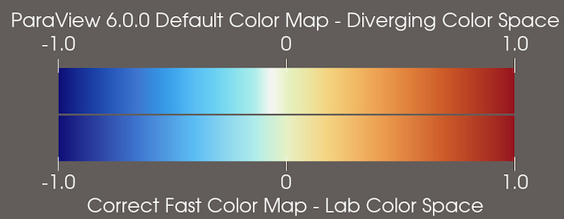
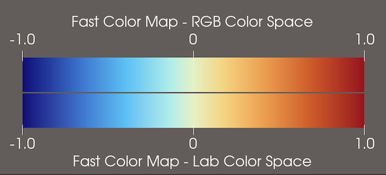
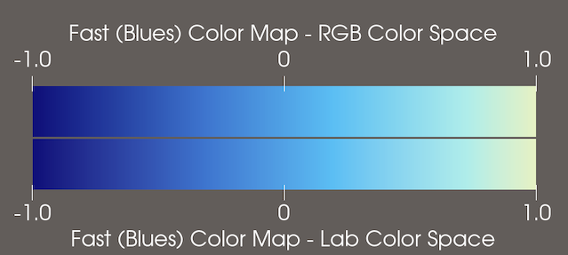

ParaView 6.0.1 Release Notes
============================

Bug fixes made since ParaView 6.0.0 are listed below:

## Faulty default color map in ParaView 6.0.0 fixed

The "Fast" color map, which is the new default in ParaView 6.0.0, was not correctly defined in the ParaView 6.0.0 release. Its color space was set to "Diverging" rather than "Lab". As a result, the central lightest point in the color map was shifted to the left of center and was too bright.

> 
>
> Comparison of incorrect "Fast" color map in ParaView 6.0.0 (upper legend) vs. corrected "Fast" color map in ParaView 6.0.1 (lower legend).

The "Fast" color map has been corrected in ParaView 6.0.1. **If you need to produce images with the same color map as ParaView 6.0.0, you can either**:

* Choose the color map preset named "ParaView 6.0.0 Default".
* Use the default color map in ParaView 6.0.1 and change the **Color Space** property in the _Color Map Editor_ to "Diverging".

In addition, the "Fast", "Fast (Reds)", and "Fast (Blues)" color map presets were set to have the color space "RGB" instead of "Lab". Fortunately, the differences between these color maps interpolated through "RGB" and "Lab" spaces respectively is not perceptually noticable in any of them, though there are slight RGB color differences.

> 
>
> Comparison of "Fast" color map in RGB color space (ParaView 6.0.0 preset, upper legend) vs. Lab color space (ParaView 6.0.1 preset, lower legend).

> 
>
> Comparison of "Fast (Reds)" color map in RGB color space (ParaView 6.0.0 preset, upper legend) vs. Lab color space (ParaView 6.0.1 preset, lower legend).

> 
>
> Comparison of "Fast (Blues)" color map in RGB color space (ParaView 6.0.0 preset, upper legend) vs. Lab color space (ParaView 6.0.1 preset, lower legend).

## Interface improvements

* Fixed problem where the _Adjust Camera_ dialog could be opened only once during a ParaView session. ([details](https://gitlab.kitware.com/paraview/paraview/-/merge_requests/7440))

* Avoid "Missing 'LookupTable' property" warning when opening SpreadSheet view. ([details](https://gitlab.kitware.com/paraview/paraview/-/merge_requests/7443))

* Fixed crash on rescale to data range over all timesteps. ([details](https://gitlab.kitware.com/paraview/paraview/-/merge_requests/7406))

* Pick center now works correctly when picking vertices. If on pick an intersection is expected but none is found, snap to the closest mesh point. ([details](https://gitlab.kitware.com/paraview/paraview/-/merge_requests/7413))

## Rendering

* Extra lines rendered in **Surfaces With Edges** representation on Apply Silicon chips are no longer rendered ([details](https://gitlab.kitware.com/paraview/paraview/-/issues/22636))

* Default background color with OSPRay path tracer and **Background Mode** "Environment" has been updated to the new Warm Gray default in ParaView 6.0.0. ([details](https://gitlab.kitware.com/paraview/paraview/-/merge_requests/7476))

* Removed warning about OSPRayMaterial property not being found when enabling ray tracing. ([details](https://gitlab.kitware.com/paraview/paraview/-/merge_requests/7414))

* Fixed black screen that could result under certain conditions. ([details](https://gitlab.kitware.com/paraview/paraview/-/issues/23077))

## Readers

* The SPCTH Spy Plot Reader could crash in MacOS binaries available at www.paraview.org. These binaries are now compiled with XCode 16.4, which resolve a compiler bug that was leading to the crash. ([details](https://gitlab.kitware.com/paraview/paraview/-/issues/22826))

## Filters

* **Append Geometry** filter cell connectivity has been fixed when appending polygons. ([details](https://gitlab.kitware.com/vtk/vtk/-/merge_requests/12235))

* **Quadric Decimation** no longer crashes when processing degenerate cells. ([details](https://gitlab.kitware.com/vtk/vtk/-/merge_requests/12307))

* The **Tetrahedralize** filter no longer gives incorrect results due to uninitialized memory reads. ([details](https://gitlab.kitware.com/vtk/vtk/-/merge_requests/12365))

## Catalyst

* ParaViewCatalyst: Ensure catalyst node is set. ([details](https://gitlab.kitware.com/paraview/paraview/-/merge_requests/7454))

## Python

* When using the _Python Shell_, fixed errors and potential crash with tab autocomplete. ([details](https://gitlab.kitware.com/paraview/paraview/-/merge_requests/7479))

* Close all tabs when exiting the Python Editor. ([details](https://gitlab.kitware.com/paraview/paraview/-/merge_requests/7395))

* `--venv` option now takes effect before Python plugins are automatically loaded using the environment variable `PV_PLUGIN_PATH`, making it possible to use external Python packages in such plugins. ([details](https://gitlab.kitware.com/paraview/paraview/-/merge_requests/7460))

* Fixed a crash when loading a Python state file with the "all properties" field on. ([details](https://gitlab.kitware.com/paraview/paraview/-/merge_requests/7426))

* Updated link to Python documentation in Python traces generated by ParaView. ([details](https://gitlab.kitware.com/paraview/paraview/-/merge_requests/7450))

## Build

* Fixed macOS install on case-sensitive filesystem ([details](https://gitlab.kitware.com/paraview/paraview/-/merge_requests/7457))

* viskores: fixed vtkmConfigFilters.h include conditon ([details](https://gitlab.kitware.com/paraview/paraview/-/merge_requests/7435))

* Fixed clang warning -Wdangling-assignment-gsl ([details](https://gitlab.kitware.com/paraview/paraview/-/merge_requests/7404/))

* Fixed issue with Intel Classic Compiler version 2023.2 incorrectly handling short loops in a way that could cause a crash. ([details](https://gitlab.kitware.com/vtk/vtk/-/merge_requests/12366))
