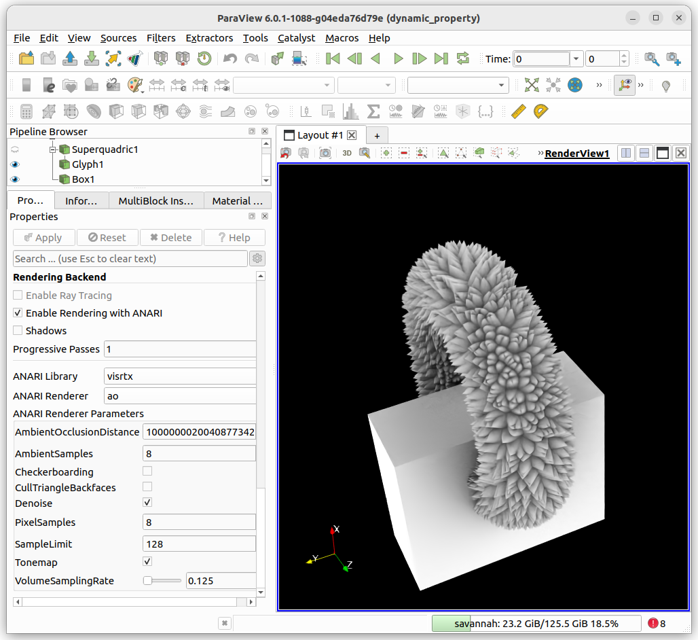
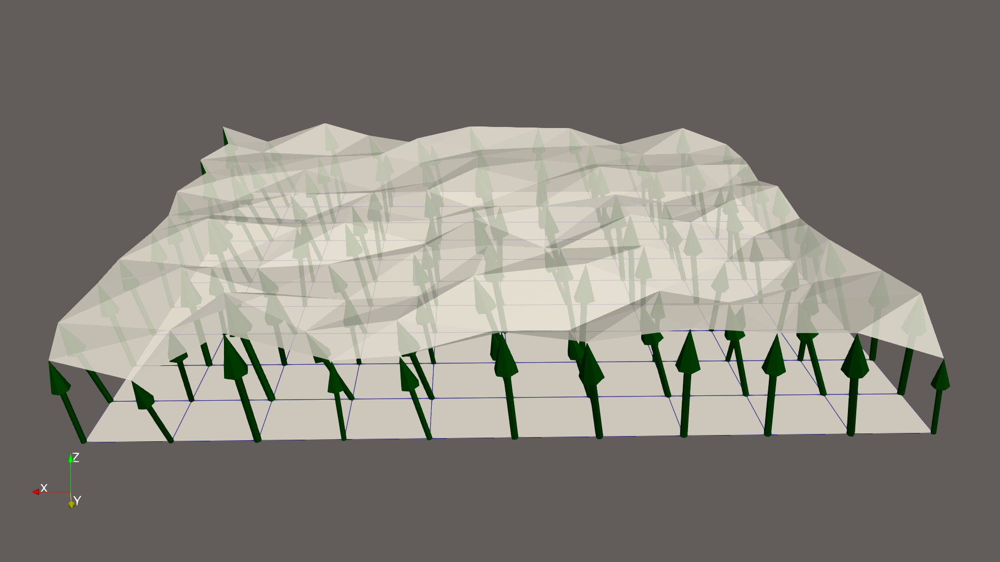
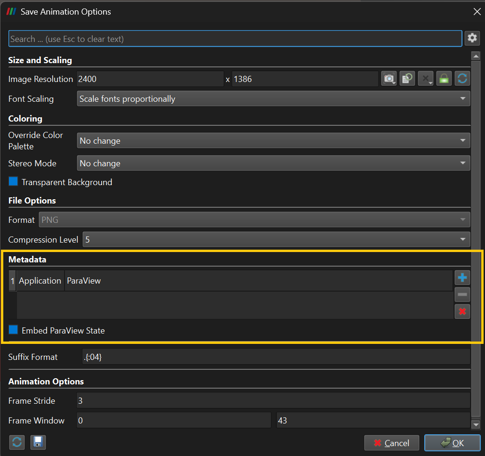
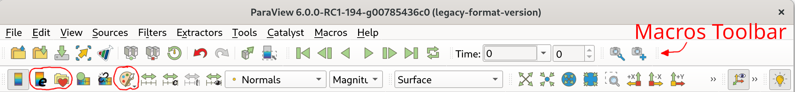
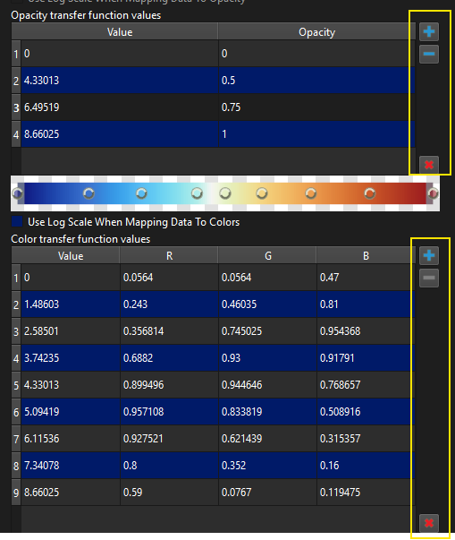
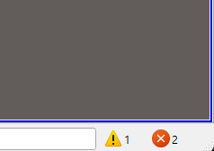
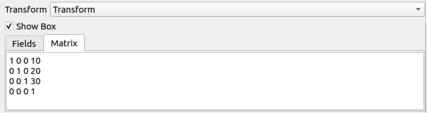

ParaView 6.1.0 Release Notes
=============================

Major changes made since ParaView 6.0.1 are described in this document. The full list of issues addressed by this release is available [here](https://gitlab.kitware.com/paraview/paraview/-/milestones/30).

* [New features](#new-features)
* [Rendering enhancements](#rendering-enhancements)
* [Plugin updates](#plugin-updates)
* [Filter changes](#filter-changes)
* [Changes in readers and writers](#changes-in-readers-and-writers)
* [Interface improvements](#interface-improvements)
* [Python scripting improvements](#python-scripting-improvements)
* [Virtual reality](#virtual-reality)
* [Catalyst](#catalyst)
* [Developer notes](#developer-notes)

# New features

## Introducing ANARI rendering integration in ParaView

This change introduces ANARI rendering in ParaView and a dynamic properties feature used to generate a user interface based on a JSON properties description generated by each ANARI renderer.

> 
>
> ANARI rendering in ParaView.

The current integration uses a simple approach to delegate ray-traced rendering to ANARI. The _Properties_ panel presents you with a choice between the original **Enable Ray Tracing** (with OSPRay) and **Enable Rendering with ANARI**.

When that option is checked, the panel presents a list of options dynamically generated for each renderer including:

- ANARI Library: A choice between "visrtx", "helide", and "environment". The
last option uses the library set using the environment variable `ANARI_LIBRARY`.
- Renderers: These depend on the library chosen. For example, the following renderers are available when using the VisRTX library:
    - "default": The default renderer for the ANARI library.
    - "ao": The "ao" (Ambient occlusion) renderer.
    - "dpt": The "dpt" (Directional path tracing) renderer.
    - "debug": The debug renderer
- Additional properties: these depend on the renderer chosen.


## USD scene exporter

A USD scene exporter is now available in ParaView. It exports the following:

* Surface polygonal geometry including point normals if available, cell normals otherwise.
* Color mapped surfaces through export of color map textures and texture coordinates on surfaces.
* Directional lights.
* The current camera, including position and direction. Field of view is hard-coded for now.
* Actor transforms.
* Solid colored surfaces, including their color and physically-based rendering (PBR) properties supported by the USD format when PBR is enabled.
* All surfaces from composite poly data.

The USD scene exporter does not export:

* Surfaces displayed by representations **Feature Edges**, **Outline**, **Point Gaussian**, **Points**, **Surface LIC**, or **Wireframe**. Edges in the **Surface with Edges** representation are also not exported because the USD format does not support vertex or line cells.
* **Volume** representations.
* 3D widgets that are subclasses of `vtkWidgetRepresentation`. These are usually temporary widgets and not important parts of a scene.
* Color legends.
* Grid or Data Axes.
* Annotations that are not part of the 3D scene, e.g. any of the annotation sources or filters or the **Text** source.


## Selections are now saved and loaded from .pvsm and python state files

Selections are now saved and loaded from both .pvsm and Python state files. This includes all types of selections (ID, frustum, blocks, and so on).


## Rectilinear Grid Support for Adaptive Mesh Refinement (AMR) data

OverlappingAMR and NonOverlappingAMR now can be made of rectilinear grids. The XML reader and writer of .vth/.vthb files support them and they can be displayed in ParaView like any AMR data.


## Improved plotting of Partitioned Dataset Collections in chart representations

For Partitioned Dataset Collections and Multi-block Datasets, chart representations can now display all selected blocks (as chosen in the _MultiBlock Inspector_) as a single chart entity such as a line or box plot rather than generating a separate entity for each block. This behavior is controlled by the new **Array Selection Mode** property, which can be set to **Merged Blocks** (new default) or **Individual Blocks** (previous behavior). With this improvement, you no longer need to manually select every block and enable each block array individually — a process that was especially cumbersome when working with hundreds or thousands of blocks that each contain multiple arrays.

> 
>
> Data from multiple blocks in composite datasets are now merged together by default to simplify plotting.

In addition, ParaView's many chart-related representations now directly support Partitioned Dataset Collections with Partitioned Datasets, as well as Multi-block Datasets with Multi-Piece Datasets. A notable UI update is the relocation of the **Composite DataSet Index** control to the _MultiBlock Inspector_. This change was made to enable block selection for Partitioned Dataset Collection and to unify the block selection workflow across the **Render View** and **Spreadsheet View**. The **Composite DataSet Index** property has been replaced by new **Assembly** and **Block Selectors** properties, with backward compatibility maintained.

> 
>
> The _MultiBlock Inspector_ is now used to control which blocks' data are plotted in chart representations.


## Statistical analysis refactor

To work around several shortcomings of the existing statistics filters in VTK and ParaView, we have refactored the filters. The new capabilities are not identical to the old; in some ways there is less functionality because rare use cases are not supported, but in many ways the functionality is more useful. These are discussed below in detail.

### Filters affected by these changes

The filters impacted by these changes are **Contingency Statistics**, **Descriptive Statistics**, **K Means**, **ExtractStatisticalModelTables**, and **Order Statistics**.

### Filter inputs and outputs

Statistics filters previously used multiblock datasets to handle composite input data and produced composite output models. This was problematic when the newer partitioned dataset collection was introduced: since statistical models were each themselves multiblock datasets of tables, it became difficult to understand which portions of a hierarchy corresponded
to the input data and which were portions of the output model-table hierarchy.

Now, statistics filters:

+ Use Partitioned Dataset Collections to handle input composite data.

+ Produce a new data type as output: a statistical model (which internally holds tables but does not behave as composite data).

+ Hold information about the algorithm which produced the model tables so that the underlying statistical algorithm can be recreated in order to further assess data or aggregate models.

These changes make organization of models much simpler to process.

### Models of composite data

Statistics filters previously operated on composite data by producing a statistical model for each block. This caused issues when some ranks did not have any data present and when input data was split into multiple pieces for parallel processing (since pieces do not usually correspond to a relevant partition of the data for analysis purposes). For example, computing descriptive statistics on the `can.e.4.X` test data with 8 ranks would hang because the reader does not produce 8 pieces. This same filter run on 4 ranks would succeed but not be useful because each piece had its own model for fields such as acceleration or displacement rather than a single model for each material.

Now, you may select whether composite data yields a single model for the entire data object or a model per data-assembly node. Pieces inside a Partitioned Dataset always have their statistical models merged into a single model for the entire partition.

### Simplified operation

Previously, each statistical analysis filter provided multiple operational capabilities that had to be selected (learn and derive a model (i.e., train), train on a subset, assess data with an existing model, or train and assess the same data).

Now, we aim to provide a separate filter for creating models, a separate filter for assessing data, and a separate filter for merging models of the same type. This release of ParaView does not provide all of the above, but does include simplified model generation.

The statistics filters that produce models no longer accept an input model; they only accept data from which to produce samples for constructing a model. To our knowledge, this feature (merging new data into an existing model from an upstream filter) was not used and complicated construction of pipelines for simpler use cases.

In the future, we intend to add support for merging statistical models as a filter unto itself.

Assessing data in the face of models is not currently supported. This will be addressed in the future by providing a separate filter to perform assessment of data. (The filter will fail if the input data does not have fields required by the statistical model to perform the assessment.)


# Rendering enhancements


## Improved geometry representation level-of-detail computation behavior

The level-of-detail (LOD) computation is now performed once when the data from the pipeline is updated. Moreover, resizing the window does not trigger the LOD to be computed again, which fixes potential crashes when big dataset are loaded.


## New "Ignore Display Transform Scale" option for display scaling in **Data Axes Grid**

**Data Axes Grid** now has an **Ignore Display Transform Scale** option to bypass the scaling transformation specified in the display options. When activated, the model will be scaled, but the tick values of the **Data Axes Grid** will still show the non-scaled dimensions.


## matplotlib colors maps now defined correctly in CIELAB color space

Several monotonic colormaps imported from matplotlib were using the diverging color space for their interpolation. This was wrong as these colormaps are not diverging, but rather monotonic. They are now properly interpolated in the CIELAB colorspace.

There are enough control points to make the interpolation generally unimportant, so backwards compatibility concerns are few with this change.


## Annotations Grid improvements

Some changes have been made to various annotation grids in ParaView.

### **Polar Axes** data representation

The **Transform** property has better consistency:
* The **Transform** property now can consider custom bounds, not only input data bounds.
* A new **Pole Position** property has been added to define the pole position, and the **Translation** property is no longer used to determine it.

When the minimum and maximum angles should be computed (**Custom Angles** off), we have different cases regarding the pole position:
* when the pole is inside the bounds, this leads to a 0-360 degrees polar axes.
* when the pole is outside the bounds, angles are computed to exactly cover the bounds.
* when the pole is on a boundary, ParaView now does the actual computation, too.

Finally, different UI parts are now grouped with related properties.

### **Polar Grid** and **Legend Grid** view annotations

The **Polar Grid** and **Legend Grid** annotations are only meaningful when the render view has **Parallel Projection** enabled. Turning **Parallel Projection** off now hides these annotations.


## Skybox backgrounds can now be rotated

Skybox backgrounds now support rotations, which are also applied to the environment lighting of the objects in the scene. The rotation can be set in the background properties when using a skybox background, using three angles in degrees.


# Plugin updates

## New ONNX plugin

ParaView now has an ONNX plugin to compute inference from an ONNX model, thanks to the **ONNX Predict** filter.

ONNX is a community project supported by the Linux Foundation, working toward interoperability of AI tools (see https://onnx.ai/about.html for more information). Further details are available in the article [Enhance your ParaView and VTK pipelines with Artificial Neural Networks](https://www.kitware.com/enhance-your-paraview-and-vtk-pipelines-with-artificial-neural-networks/).

## CFSReader plugin UI fix for modal or harmonic results

The slider to select the frequency step now allows selection of the first step with index 0. The display of the current step value has been moved to the location of the frequency step selector for improved readability.

## Command-line option to load XML and Python plugins

The `paraview` `--plugins` command-line argument to specify plugin names
can now be used to load XML and Python plugins. For each searched directory, the search procedure looks in order for a library (`.dll` or `.so`), a Python (`.py`) file, and finally an XML (`.xml`) file. The first match is used.

## Plugin pre-load check

ParaView plugins can now specify a function that can be called to determine whether it should not be loaded under certain conditions, e.g., some resources are missing.

A new example has also been added to show how to use this feature. This example is in the ParaView source code repository in `Examples/Plugins/OnLoadCheckCallback/`.

# Filter changes

## **Clip** filter can compute exact box clips of all types

Until now, the **Clip** filter supported exact box clipping only if the **Invert** property was on. Now, **Clip** supports exact box clipping even when **Invert** is off.


## New **Points Matching Transform** filter and an Interactive Four Lines widget

The **Points Matching Transform** filter transforms any Point Set (Polygon Mesh, Unstructured Grid, etc.) by specifying four pairs of points in space to define a transformation from the source points to the target points.

To interact with this filter, a new **InteractiveFourLines** widget has been introduced to control the source and the target points of each line. The GUI component of the widget has a button to switch the source point and the target point of a line.


## **Plot Global Variables Over Time** is able to process empty composite datasets

The **Plot Global Variables Over Time** filter now correctly supports processing empty composite data sets such as Multi-block Datasets and Partitioned Dataset Collections.


## New capabilities in **Extrusion Surface** representation

The **Extrusion Surface** representation can now process 3-component vector arrays as input data. If such an input is selected, it will be treated as a displacement on the GPU (see figure below).

A property named **Recalculate Normals** has also been added that enables recomputation of the surface normals after the extrusion to prevent bad visual results due to the warping of the surface.

> 
>
> The **Extrusion Surface** representation warps a surface according to a 3-component vector array represented here by arrow glyphs.

## **Calculator** filter enables easy definition of multi-component arrays of arbitrary size

The **Calculator** filter now supports user-defined multi-component arrays of arbitrary size using syntax of the form `{x, y, z, ...}` (no text can come before or after the curly braces in such expressions). The number of comma-separated elements inside the braces determines the number of components in the resulting array.

## **Calculator** filter additions

The constants `pi` and `inf` are now available to use in **Calculator** filter expressions. All calculator buttons now have a tooltip.


## Filter for data read by the new EAM Data Reader

**EAM Project To Sphere** is a new filter that projects latitude/longitude data onto a 3D sphere for globe visualization with optional vertical exaggeration.


## **Ghost Cells** now supports null partitions on distributed composite HyperTree Grids

When running a `pvserver` on multiple processes with MPI, the **Ghost Cells** filter now supports having a process that has a null partition/block when others have HyperTree Grids.


## **Resample To HyperTreeGrid** filter support cell data and improve UI

The **Resample To HyperTreeGrid** filter now supports subdivisions using a criterion based on cell data values.

In addition, the user interface for this filter was improved. The properties **No Empty Cells**, **Interpolation Method**, **Minimum Number Of Points In Subtree** and **Extrapolate Point Data** options has been moved to advanced panel. Furthermore, similar parameters are grouped together and the threshold selection for subdivision is now similar to the **Threshold** filter.

Lastly, the selection of arrays to interpolate was removed. If an interpolation method is set, all arrays of the same type (point or cell) as the subdivision array are now interpolated.


## **Point Dataset Interpolator** properties for passing data

The properties **Pass Point Arrays**, **Pass Cell Arrays**, and **Pass Field Arrays** of **Point Dataset Interpolator** filter are available as advanced properties.


## **Extract Cells By Type** filter shows only cells available in input

The **Cell Types** property from the **Extract Cells By Type** filter now only shows the cell types available in its input data to make it easier to select which cells to pass through to the output.


## New **Redistribute HyperTreeGrid** filter

You can use the new **Redistribute HyperTreeGrid** filter to rebalance trees between distributed ParaView processes.


## **Mesh Quality** has non-linear cells support

The **Mesh Quality** filter has been updated to expose `Verdict` metrics for non-linear cells. The metrics available are:

1. `Quadratic Triangle`: AREA, DISTORTION, NORMALIZED_INRADIUS, SCALED_JACOBIAN
2. `Bi-Quadratic Triangle`: AREA, DISTORTION
3. `Quadratic Quad`: AREA, DISTORTION
4. `Bi-Quadratic Quad`: AREA, DISTORTION
5. `Quadratic Tetra`:  DISTORTION, EQUIVOLUME_SKEW, INRADIUS, JACOBIAN, MEAN_RATIO, NORMALIZED_INRADIUS,
   SCALED_JACOBIAN, VOLUME
6. `Quadratic Hexahedron`: DISTORTION, VOLUME
7. `Tri-Quadratic Hexahedron`: DISTORTION, JACOBIAN, VOLUME

Additionally, the INRADIUS metric was added also for `Tetra`.

Moreover, because the point order of `Wedge` is different between ParaView/VTK and Verdict, the **Mesh Quality** filter was updated to reorder the points of the `Wedge` before computing any metric.

Also, the **Cell Size** filter has been updated to use all the area/volume functions defined in **Mesh Quality** for the supported cell types, including the non-linear cells mentioned above.


## **Cell Quality** bug fix for three metrics

A bug has been fixed in the **Cell Quality** filter where the metrics RELATIVE_SIZE_SQUARED, SHAPE_AND_SIZE, and SHEAR_AND_SIZE were always generating 0. Correct metrics are now computed.


## **Stream Tracer With Custom Source** now supports cell data

Previously, the **Stream Tracer With Custom Source** filter could not be applied to a data set with velocity vectors in a cell-associated data array. Now it can be applied to such datasets without resorting to expensive interpolation from cell data to point data.


# Changes in readers and writers


## Add Data Origin property to PNG Reader

The PNG reader has a new property called **Data Origin**. This 3D coordinate describes the position of the first pixel in the image, thus allowing you to position PNG images in 3D space.


## EAM reader for E3SM data

ParaView now includes a Python-based EAM Data Reader for visualizing E3SM/EAM (Energy Exascale Earth System Model / E3SM Atmosphere Model) atmospheric data stored in NetCDF format.

This multi-output reader producing separate outputs for:
- 2D surface variables as a quad mesh
- 3D middle layer (lev) variables as a hexahedral volume mesh
- 3D interface layer (ilev) variables as a hexahedral volume mesh

The 3D outputs are converted to volumetric data directly in the reader, producing hexahedral cells that span adjacent vertical levels. This enables immediate volume rendering without requiring additional filters. Time series data and automatic detection of hybrid sigma-pressure coordinates are supported.


## New **Apply Offset** option in PDAL reader

The PDAL reader now has an **Apply Offset** property. When enabled, offsets detected in LAS/LAZ metadata are applied to point coordinates when they are read.

> 
>
> Screenshot of PDAL reader properties, including the new **Apply Offset** property.


## CDI reader improvements

### Usability with large sets of files

The CDI reader was unusable when reading time series data because it was loading all files all at once. By enabling CDI's lazy load feature, it is now possible to work with large datasets.

In one case, loading a set of 50 files (8 timesteps each) used to take about 15 minutes. Now it takes about 12 seconds.

### Handling of longitude coordinates

Longitude coordinates are now normalized in the interval [-pi, pi].

### Array selections in file series

The status of arrays in the **Array Selection** property is preserved when loading file series.


## Fixed crash with SILO reader

The SILO reader was experiencing a crash when compiled with the latest version
of the SILO library (4.11). This was caused by a metadata load that failed to
capture variable names that were later expected to be found. The appropriate
metadata is now loaded.


## Writer selection when multiple writers share the same extension

Previously, when multiple writers supported the same file extension, ParaView would always select the first available writer, regardless of your explicit choice in the _Save File_ dialog. This would cause, for example, the **IOSS Exodus File** writer to be used instead of the **Exodus II File** writer, even when **Exodus II File** was explicitly selected in the _Files of type_ popup menu.

Additionally, an issue has been fixed where **Exodus II File** writer was
not being instantiated properly, preventing it from being used even when selected.


## IOSSReader has **Group Alphabetic Vector Field Components** and **Global Fields** properties

The **IOSSReader** used to have a property **Read Global Fields** to control whether all global fields available in the file would be read. This property has been deprecated in favor of a more flexible approach using **Global Fields** to enable selection of specific global fields to read. This is particularly useful when dealing with datasets with a large number of global fields, only a subset of which you want to load, improving performance and reducing memory usage.

Using the new option **Group Alphabetic Vector Field Components** you can now control whether the **IOSSReader** groups alphabetic vector field components, such as `vel_x`, `vel_y`, `vel_z` into a single vector field, such as `vel`, something which was always done before.

The **IOSSReader**'s **Read All Files To Determine Structure** property is now off by default. This change improves performance in the most common cases, and you will still be notified if the flag needs to be turned on because changes in the mesh topology over time are determined to exist.

Lastly, **IOSSReader** has a new property named **Catalyst Conduit Channel Name** for selecting the Catalyst Conduit channel when reading Catalyst data streams.


## XML UniformGrid AMR reader reads all levels by default

The XML UniformGrid AMR Reader previously read only the first level of the AMR through the property **Default Number Of Levels** default value of 1. It now reads all levels as the default value of this property is now 0.

This is a change of behavior and considered a bugfix as previous behavior was incorrect, but it may result in unexpected results for anyone relying on this previous behavior.


## PNG writer property reorganization

When saving PNG files, the **Embed ParaView State** property is now grouped together with the **MetaData** property that enables specifying key-value pairs for storing additional information in the PNG files.

> 
>
> Metadata-related properties are now organized within a _Metadata_ section in the _Save Animation Options_ dialog when saving PNG files.

## Update the VisIt bridge readers

The VisIt bridge now uses readers from a recent release of VisIt (3.4.2). It had previously been several years since ParaView was updated with the latest reader code from VisIt. This update captures any bug fixes as well as consolidating any build changes imported from the external repository.


## openPMD improvements

The **openPMD** mesh in-voxel shift (`MeshComponent::position`) is now taken into account. For vector/tensor fields, the shift of the first component is applied for all components.


# Interface improvements

## Load State Button in the _Main Controls_ toolbar

The _Main Controls_ toolbar now has a _Load State_ button that lets you quickly load saved states of their projects.

> 
>
> The _Main Controls_ toolbar has a button to load ParaView state files.


## _Load State_ dialog prevents loading PNG images without embedded state

In the _Load State_ dialog, PNG files without state can no longer be selected.


## `PARAVIEW_LOG_FILE` environment variable

Additional log files to be generated can now be listed with the `PARAVIEW_LOG_FILE` environment variable. Settings for this environment variable are the same as for the `-l` or `--log` command-line options and have the same effect.


## Update timesteps in _Current Time_ toolbar only when needed

The UI element that lists available timesteps in the _Current Time Controls_ toolbar (`pqAnimationTimeWidget`) now repopulates the timesteps combo box only when needed. This change improves ParaView's performance and responsiveness when working with datasets with thousands of timesteps.


## Improved performance of _MultiBlock Inspector_

Performance has been substantially improved in the _MultiBlock Inspector_ when showing composite datasets with thousands of blocks.


## File dialogs allow case-insensitive extension matching

ParaView's file dialog has been enhanced to support case-insensitive matching of file extensions. Previously, files with extensions that did not match the capitalization specified by readers in ParaView would not be available to read, which was an excessive and unintended restriction.


# Abort button available for builtin (local) servers

You can now use the abort button to cancel long-running operations in ParaView. The abort button becomes active whenever the progress bar displays ongoing activity. This feature is currently available only when ParaView is connected to a *builtin* server - aborting filters in *remote* sessions is not available.


## Color toolbar reorganization

The _Main Controls_ toolbar's palette chooser has been moved to the _Active Variable Controls_ toolbar. In addition, two new buttons have been added to the _Active Variable Controls_ toolbar to 1). enable editing the scalar bar properties (label text size, font, etc.) and 2). choose a preset colormap.

> 
>
> The new _Active Variable Controls_ toolbar layout with additions circled in red.

The _Macros_ toolbar has been moved to the top row to make space for the increased size of the color toolbar.


## Load favorites from local servers

ParaView now provides a way to load all favorites directory paths accessible from any local server. This option can be enabled with the **Load All Favorites** in the _General_ section in the ParaView's settings.


## **Show Save State On Exit** setting can be cancelled

When the **Show Save State On Exit** setting is enabled and you exit ParaView, you are now able to choose different options for how to proceed:

 - "Save" - choose file path, save the state, and exit
 - "Don't Save" / "Discard" - close without saving
 - "Cancel" - cancel the program exit and go back to the application without saving the state file


## "Change File..." option in the edit menu

In the _Edit_ menu, ParaView now has a "Change File..." option to change the path of the file read by a reader source selected in the _Pipeline Browser_.


## New controls to insert and remove rows in the color opacity table in the _Color Map Editor_

The ParaView color opacity editor now has controls to add or remove rows from the color and opacity tables.

1. Clicking on the '+' button inserts a new row after the selected row with the values initialized to mid-point of the values in the selected row and the next row.
2. The '-' button is used to remove all selected rows.
3. The 'x' button clears the table. Note that removal of the first and last values is not allowed to avoid accidental creation of invalid color maps.

> 
>
> Insert and remove rows in color opacity tables


## Display indicators for warnings and errors in the status bar

ParaView now shows indicators for warnings and errors in the right side of the status bar.
> 
>
> Warning and error indicators in the status bar.

You can click on either of the indicator icons to bring up the _Output Messages_ window to read full details from the warning or error message.


## Box widget now has a Matrix tab with live synchronization

In the ParaView GUI, the Box widget used in some filters now provides a dedicated _Matrix_ tab to directly input or edit 4×4 matrices. The existing field-based editor (**Position**/**Rotation**/**Scale**) remains under the _Fields_ tab, and values in each tab are synchronized in both directions.

> 
>
> The new _Matrix_ tab and editor.


## Proper sort of numerical columns in table properties

 Numerical values in tables that are displayed for some properties are now sorted by numerical value, instead of the less useful alphabetical sort (e.g., where `100` would be listed before `4`).

The impacted properties are those like the **Sets** properties of the **IOSS** reader (known as **Array Selection** properties). They are displayed as a 2-column table, with one column being a numerical identifier.


## **Spline Source** points table change in reset behavior

The button that removed all points in the **Spline Source**'s points property table now instead resets the list of points to the two default points. The tooltip has been changed accordingly from "Remove all points" to "Reset Points".


## SpreadSheetView disable sorting of non-numeric columns

**SpreadSheetView** does not show sorting controls for columns of non-numeric values because sorting them is not currently supported.


## Change in server `--timeout-command` execution when using MPI

When running `pvserver` with MPI, the command specified by the command-line  option `--timeout-command` now runs only on the first rank.


# Python scripting improvements

## New `current_time` variable in **Python Calculator** and **Python Annotation**

The `current_time` variable contains the current time in ParaView's time controls. This is the same value as the _Current Time_ field in the ParaView GUI's _Information_ panel. In contrast to the `time_value` (`t_value`) variable already defined, which refers to the current time value of the data source, the `current_time` value refers to the global current time value set for all of ParaView. Unlike `time_value` and `time_index` (`t_index`), the `current_time` value is always available in the **Python Calculator** and **Python Annotation** filters.


## `pvbatch` saves data from all timesteps in symmetric mode

`pvbatch` mode now correctly exports data from all timesteps when saving an animation in symmetric mode (i.e., `pvbatch --symmetric`).


## Changes in _Time Manager_ are recorded in Python traces

The _TimeManager_ widget now traces the **Number of Frames** and **Stride** property values when they are changed in the ParaView GUI.


## Old Sphinx version support removed

Support for Sphinx 4 for documentation generation has been removed.


# Virtual reality


## New First Person Camera interactor style in CAVE plugin

**First Person Camera** is a new interaction style that binds the mouse and the keyboard to enable movement like a first person flight by changing the view direction of the camera with the mouse and by using four keys of the keyboard to move it in the space. To function correctly, the controlled proxy must be a Render View and since it only controls the camera, there is no controlled property to set. The input device must return the absolute position of the mouse on the screen as valuators, one for X position and one for Y position (a `vrpn_Mouse` for example with VRPN). In the CAVE, this interaction style won't have any effect unless the off-axis projection is turned off in the CAVE configuration.


## New Joystick Camera interactor style in CAVE plugin

**Joystick Camera** is a new interaction style that binds a controller to enable movement of the camera with the joysticks. The input device must contain two joysticks with valuators going from -1 to 1 in X and Y to function correctly (a  `vrpn_Joylin` or a `vrpn_Joywin32` for example with VRPN). In the CAVE, this interaction style won't have any effect unless the off-axis projection is turned off in the  CAVE configuration.


## `UseOffAxisProjection` configuration in .pvx files

The .pvx configuration file format for CAVE systems now supports the **UseOffAxisProjection** property for the camera. It is enabled by default and it can be disabled with `<UseOffAxisProjection Value="false" />`.


## World **Scale Factor** setting in _CAVE Interaction Manager_

You can now set a world **Scaling Factor** property in the _CAVE Interaction Manager_ panel, and it is immediately applied to the `ModelTransformMatrix` (aka `NavigationMatrix`). This new UI field also reflects any scaling done by other interactor styles, thanks to a new navigation event observer that extracts the scale from the `ModelTransformMatrix`, so that the UI always reflects the correct current scale.

In your interactor styles you can now make use of new static convenience methods that have been added to `vtkSMVRInteractorStyleProxy` to support extracting/updating the scale factor from/to the `ModelTransformMatrix`.

You can also experiment with this new scaling functionality using a new custom Python interactor style that performs scaling, `SimpleScalingInteractor.py`. This new interactor style allows you to observe and verify the connection between scaling with an interactor style and scaling with the panel UI element.


## Improvement to collaboration between head-mounted and CAVE displays

Collaborators using the XRInterface plugin now send their avatar up vector based on their own navigation. For example, using the in-world ParaView menu to select camera presets results in navigation, and previously this caused collaborators to see your avatars head suddenly appear at a 90 or 180 angle to its torso. Now, your avatars head and torso always appear in proper alignment.

To go along with this change, the CAVEInteraction plugin no longer has a field to allow specifying the default avatar up vector for new avatars coming into the session, since this is now controlled on the sending side.


## CAVEInteraction plugin UI improvements

Several improvements have been made to the _CAVE Interaction Manager_ panel.

The list edit control under "VR Connections" in the _CAVE Interaction Manager_ panel took up too much space, given that the vast majority of use cases will define only one or two connections. As a result, this field has been fixed in size at the height needed to display 2.5 list items, making it clear if you need to scroll to see more items. Similarly, the "Interactions" list edit has been fixed in size at the height needed to display 4.5 items. The entire configuration panel is now resizable and lives within a scroll area, so that even when quite small, all the contents are reachable.

The regular expression for connection address validation has been updated several times in the past to be more inclusive of characters that might appear in an address, yet there were still issues with legitimate characters not being allowed in the field. To accommodate any host name, the validation of that field has simply been removed.

Navigation is now shared by default by people using the CAVEInteraction plugin who join a collaboration session, though this behavior can be disabled using the same checkbox as before.


## CAVEInteraction plugin per-display hiding of 2D overlays

You can now configure any display in your CAVE to show or hide the typical
2D overlays seen on ParaView's desktop.  This includes things like the scalar bar and rendering annotations.

By default all displays will show 2D overlays. To disable them on any display,
simply add a `Show2DOverlays="0"` attribute to any `Machine` element in the .pvx file defining the displays in the CAVE system.


## Deprecate "process" in .pvx files

The "process" argument is now deprecated in .pvx files and support for it will be removed in a later release.

Examples have been updated accordingly.

A trivial .pvx file looks like this:

```xml
<?xml version="1.0" ?>
<pvx>
  <Machine Name="localhost"
           Environment="DISPLAY=:0"
           Geometry="300x300+300+0"/>
</pvx>
```


## CAVEInteraction plugin interactor styles

The CAVE interactor styles are now much more performant, usable, and functional.

### Performance improvements

You can now run multiple interactor styles at the same time with far better performance, as all interactor styles included with ParaView (both Python and C++) have been updated to defer as much computation as possible to the `Update()` method, rather than doing computation in the event handling methods.

To learn about the key details of the plugin event loop that make this a sensible practice, as well as find out about other best practices for writing interactor styles, see the new guide `Incubator/CAVEInteraction/README.md`.

### Usability improvements

You can now more readily experiment with interactor styles, as each style has been given a "Reset" functionality. This allows you to reset the scene and any objects properties to their original values, in case you fly too far away or get turned upside down or faced away from your data.

Interactor styles have been catalogued and renamed to match their functionality. See the new `Incubator/CAVEInteraction/README.md` for a brief discussion of the features and corresponding nomenclature of the built-in interactor styles.

Additionally, you can now hover over each style in the combo box and see a tooltip describing the behavior and requirements of each interactor style.

## Functionality improvements

You can now be more confident that interactor styles work properly, especially when used in conjunction with each other, as all interactor styles have been thoroughly tested and had bugs fixed. Many interactor styles did not properly account for the fact that other styles might already have updated the `ModelTransformMatrix`, and these have all been fixed. To read more about best practices for writing interoperable interactor styles, see the
new `Incubator/CAVEInteraction/README.md`.

## CAVEInteraction has per-connection transforms

Whenever you add or edit a connection from the CAVE configuration panel, you can now also view and update the transform associated with the connection. The transform is a 4x4 homogeneous matrix used to pre-multiply all tracker matrices coming from the connection before they are delivered to the interactor styles. These transforms are also saved to and loaded from state along with the rest of the panel configuration elements.


# Catalyst

## Multimesh protocol now supported in Catalyst-ParaView steering extractors

You can now use composite structures as input for Catalyst-ParaView steering extractors.

Conduit nodes returned as `catalyst_results` for steering by ParaView now correctly follow the Blueprint mesh/multimesh formalism. In practice, this means that all channels store their data in a "data" group, which was not the case previously.

# Developer notes

## Removals in ParaView 6.1

* In `pqAddToFavoritesReaction`, the constructor `pqAddToFavoritesReaction(QAction* parent, QVector<QString>& filters)` has been removed. Favorites are now integrated into Categories, and should be initialized from a `pqProxyCategory` instead.
* In `pqCategoryToolbarsBehavior`, the slot `void prepareForTest()` was removed as it was unused.
* In `pqColorMapEditor`, the slot `void setDataRepresentation(pqDataRepresentation* repr, bool forceUpdate = false)` was removed. Use `setRepresentation()` instead.
* In `pqDataAssemblyPropertyWidget`, the properties `selectorColors`, `compositeIndexColors`, `selectorOpacities`, and `compositeIndexOpacities` and their associated accessors and signals have been removed.
* In `pqLiveSourceBehavior`, the static member functions `void pause()`, `void resume()`, and `bool isPaused()` have been removed. Use functions of the same name in `pqLiveSourceManager` instead.
* Class `pqManageFavoritesReaction` has been removed. Favorites should be replaced by Categories configuration. See pqConfigureCategories instead.
* In `pqProxyGroupMenuManager`, `vtkSMProxy* getPrototype(QAction* action) const` has been removed in favor of `static vtkSMProxy* GetProxyPrototype(QAction*)`, `bool hideForTests(const QString&) const` and `void setEnabled(bool)` have been removed because they were mostly unused, `void populateFavoritesMenu()`, `void loadFavoritesItems()`, and `QAction* getAddToFavoritesAction(const QString& path)` have been removed because favorites are now a category configurable like other categories, and the protected `Enabled` member variable has been removed because it is unused.
* Class `pqFavoritesDialog` and its associated Qt `.ui` file have been deleted.
* Class `pqQuickLaunchDialog` has been removed. Please use `pqQuickLaunchDialogExtended` instead.
* Class `pqWaitCursor` has been removed. Please use `pqScopedOverrideCursor(Qt::WaitCursor)` instead.
* In `vtkSMAnimationScene`, member function `void SetDuration(int)` has been removed. Use `SetStride(int)` instead.
* In `vtkInitializationHelper`,
  * Member function `static bool InitializeMiscellaneous(int)` has been removed. Use `InitializeSettings()` and `InitializeOthers()` instead.
  * Member function `static std::string GetUserSettingsDirectory()` has been removed. Use `vtkPVStandardPaths::GetUserSettingsDirectory()` instead.
  * Member function `static std::string GetUserSettingsFilePath()` has has been removed. Use `vtkPVStandardPaths::GetUserSettingsFilePath()` instead.
* In `vtkGeometryRepresentation`, member function `virtual void SetFlipTextures(bool)` has been removed. Use `SetTextureTransform()` instead to flip a texture.
* In `vtkPolarAxesRepresentation`, accessors for `EnableCustomRadius` have been removed. Use accessors for `EnableCustomMinRadius` instead.
* In `vtkSMColorMapEditorHelper`, member function `static vtkSMProxy* GetLUTProxy(vtkSMProxy*, vtkSMProxy*)` has been removed and replaced with `GetLookupTable(vtkSMProxy*, vtkSMProxy*)`.
* In `vtkSMPVRepresentationProxy`,
  * Member function `void SetLastLUTProxy(vtkSMProxy*)` has been removed and replaced with `SetLastLookupTable(vtkSMProxy*)`.
  * Member function `vtkSMProxy* GetLastLUTProxy()` has been removed and replaced with `vtkSMProxy* GetLastLookupTable()`.
  * Member function `vtkSMProxy* GetLUTProxy(vtkSMProxy*)` has been removed and replaced with `vtkSMProxy* GetLookupTable()` instead.
* In `vtkPVGeometryFilter`, the following information keys have been removed because they were not used:
  * `static vtkInformationIntegerVectorKey* POINT_OFFSETS(`)
  * `static vtkInformationIntegerVectorKey* VERTS_OFFSETS(`)
  * `static vtkInformationIntegerVectorKey* LINES_OFFSETS(`)
  * `static vtkInformationIntegerVectorKey* POLYS_OFFSETS(`)
  * `static vtkInformationIntegerVectorKey* STRIPS_OFFSETS()`.

  Also in `vtkPVGeometryFilter`, member function `void CleanupOutputData(vtkPolyData* , int)` has been replaced with `void CleanupOutputData(vtkPolyData*)`, and member function `void ExecuteCellNormals(vtkPolyData* output, int doCommunicate)` has been replaced with `void ExecuteNormalsComputation(vtkPolyData*)`.

A number of filter proxies have been removed and replaced:
* **AppendArcLength** replaced by **PolyLineLength**
* **GenerateIds** replaced by **PointAndCellIds**
* **PolyDataTanges** replaced by **SurfaceTangents**
* **AppendLocationAttributes** replaced by **Coordinates**
* **BlockIdScalars** replace by **BlockIds**
* **OverlappingLevelId Scalars** replaced by **OverlappingAMRLevelIds**
* **GenerateSpatioTemporalHarmonics** replaced by **SpatioTemporalHarmonics**
* **PolyDataNormals** replaced by **SurfaceNormals**
* **ComputeConnectedSurfaceProperties** replaced by **ConnectedSurfaceProperties**
* **GenerateProcessIds** replaced by **ProcessIds**
* **GhostCellsGenerator** replaced by **GhostCells**
* **GenerateGlobalIds** replaced by **GlobalPointAndCellIds**
* **AddFieldArrays** replaced by **FieldArrayFromFile**


## Unsafe C/C++ from/to string functions have been replaced

ParaView has been using a set of either unsafe or slow C/C++ functions to convert numbers to strings and vice versa. The exhaustive list of functions is given below. All of them have been replaced with safer and faster alternatives provided by `scnlib`, `fmt`, and `fast_float` libraries and exposed though the `vtk::` namespace.

C/C++ has the following functions to convert one/many `char`s or `string`s to a number.

1. `atof`, `atoi`, `atol`, `atoll`
2. `std::stof`, `std::stod`, `std::stold`, `std::stoi`, `std::stol`, `std::stoll`, `std::stoul`, `std::stoull`
3. `std::strtof`, `std::strtod`, `std::strtold`, `std::strtol`, `std::strtoll`/`_strtoi64`, `std::strtoul`, `std::strtoull`
4. `sscanf`, `sscanf_s`, `vsscanf`, `vsscanf_s`
5. `std::from_chars` (This is slow because it does not use `fast_float` for conversion.

These functions have been replaced by:

1. `vtk::from_chars`, `vtk::scan_int`, `vtk::scan_value`, where one number needed to be converted
2. `vtk::scan`, where one/many numbers needed to be converted (optionally with a specific format)

C/C++ has the following functions to scan one/many numbers from stdin or a file:

1. `scanf`, `scanf_s`, `vscanf`, `vscanf_s`,
2. `fscanf`, `fscanf_s`, `vfscanf`, `vfscanf_s`

These functions have been replaced by:

1. `vtk::scan_value`, where one number needed to be converted
2. `vtk::input`, `vtk::scan`, where one/many numbers needed to be converted (optionally with a specific format)

C/C++ has the following functions to convert one/many numbers to a `char` or `string`.

1. `itoa`/`_itoa`, `ltoa`/`_ltoa`, `lltoa`/`_i64toa`, `ultoa`/`_ultoa`, `ulltoa`/`_ulltoa`/`_ui64toa`
2. `sprintf`, `sprintf_s`, `vsprintf`, `vsprintf_s`
3. `snprintf`, `snprintf_s`, `vsnprintf`, `vsnprintf_s`
4. `strftime`
5. `std::to_chars`, `std::to_string`

These functions have been replaced by:

1. `vtk::to_chars` or `vtk::to_string`, if one number needed to be converted
2. `vtk::format`, `vtk::format_to`, or `vtk::format_to_n`, if one/many numbers needed to be converted with a specific format

C/C++ has the following functions to print one/many numbers to stdout or a file:

1. `printf`, `printf_s`, `vprintf`, `vprintf_s`
2. `fprintf`, `fprintf_s`, `vfprintf`, `vfprintf_s`,

These functions have been replaced by:

1. `vtk::print`, `vtk::println`

It should also be noted that the following functions (including subclasses that use them) need to be provided with strings that use the `std::format` style format instead of the `printf` style format:

1. `void vtkAnnotateGlobalDataFilter::SetFormat(const char* formatArg)`
2. `void vtkCGNSWriter::SetFileNameSuffix(const char* suffix)`
3. `void vtkContext2DScalarBarActor::SetRangeLabelFormat(const char* formatArg)`
4. `void vtkCSVWriter::SetFileNameSuffix(const char* suffix)`
5. `void vtkFileSeriesWriter::SetFileNameSuffix(const char* suffix)`
6. `void vtkParallelSerialWriter::SetFileNameSuffix(const char* suffix)`
7. `void vtkParticlePipeline::SetFilename(const char* filename)`
8. `void SceneImageWriterImageSeries::SetSuffixFormat(const char* suffix)`
9. `void vtkStringList::AddFormattedString(const char* EventString, T&&... args)`

Finally, the following string properties now use the std::format style format instead of the printf one:

1. `ScalarBarActor.LabelFormat`
2. `ScalarBarActor.RangeLabelFormat`
3. `TexturedScalarBarActor.LabelFormat`
4. `TexturedScalarBarActor.RangeLabelFormat`
5. `RulerSourceRepresentation.LabelFormat`
6. `ProtractorRepresentation.LabelFormat`
7. `ExodusIIReaderCore.FilePattern`
8. `PNGWriter.FilePattern`
9. `TIFFWriter.FilePattern`
10. `JPEGWriter.FilePattern`
11. `PolarAxesRepresentation.PolarLabelFormat`
12. `DateToNumeric.DateFormat`
13. `XYChartViewBase.TooltipLabelFormat`
14. `JPEG.SuffixFormat`
15. `PNG.SuffixFormat`
16. `TIFF.SuffixFormat`
17. `BPM.SuffixFormat`
18. `FileSeriesWriter.FileNameSuffix`
19. `FileSeriesWriterComposite.FileNameSuffix`
20. `ParallelFileSeriesWriter.FileNameSuffix`
21. `ParallelSerialWriter.FileNameSuffix`
22. `CGNSWriter.FileNameSuffix`
23. `CSVWriter.FileNameSuffix`


## Changing reader file now keeps its proxy's name if it was renamed

Upon changing a reader proxy's file name property, if the name of its proxy is not the name of the previous file (i.e. the user renamed the proxy), the proxy's name is no longer modified.


## New PARAVIEW_VERSION_SHORT macro

The `vtkPVVersionQuick.h` header now provides a `PARAVIEW_VERSION_SHORT` symbol which is the `MAJOR.MINOR` as a string literal.


## InteractiveBox widget matrix editor
Transformation properties defined in server manager XML should continue to use `panel_widget="InteractiveBox"`. For the _Matrix_ tab to appear in the UI, the proxy must have properties named `Position`, `Rotation`, and `Scale`. The matrix values and `Position`, `Rotation`, and `Scale` are kept synchronized.


## `pqFileDialog` changes

A small backwards-incompatible change has been made in `pqFileDialog::pqFileDialogFavoriteModelFileInfo` to be able to store the Origin. It's necessary as we want to be able to modify an existing favorite from where it's located even when **Load All Favorites** setting is enabled.


## Building with ANARI

To access, enable the CMake configure time option `PARAVIEW_ENABLE_RAYTRACING`
and `PARAVIEW_ENABLE_ANARI`. That would automatically enable the `vtkRenderingRayTracing` and `vtkRenderingAnari` modules.


## Using ONNX

To use ONNX with a local build of Paraview, you will have to install an ONNX runtime for C++ API https://onnxruntime.ai/

Note that due to some issue in the ONNX CMake integration with ONNX runtime 1.22.0 on linux you will need to:
- create a "lib64" link to the "lib" directory next to it. <https://github.com/microsoft/onnxruntime/issues/25242>
- move the lib/*.h files under an "onnxruntime" subdirectory (to create)
  <https://github.com/microsoft/onnxruntime/issues/25279>


## Cleanup of `vtkCaveSynchronizedRenderers`

The `vtkCaveSynchronizedRenderers` class has been cleaned up. The function `ComputeCamera()` has been deprecated in favor of `InitializeCamera()` and the following protected members are now private:

 - `double EyeSeparation;`
 - `int NumberOfDisplays;`
 - `double** Displays;`
 - `double DisplayOrigin[3];`
 - `double DisplayX[3];`
 - `double DisplayY[3];`
 - `int once;`
