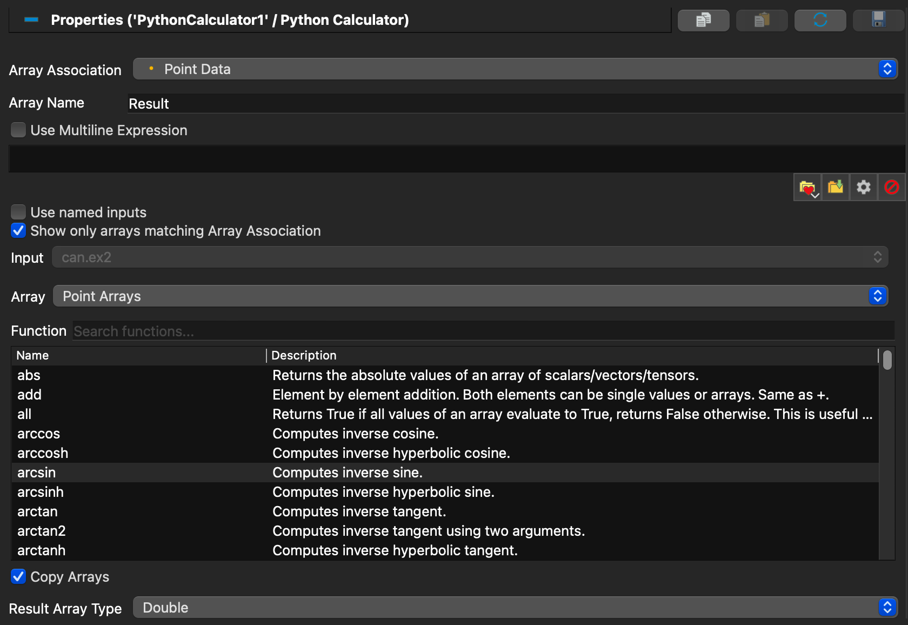
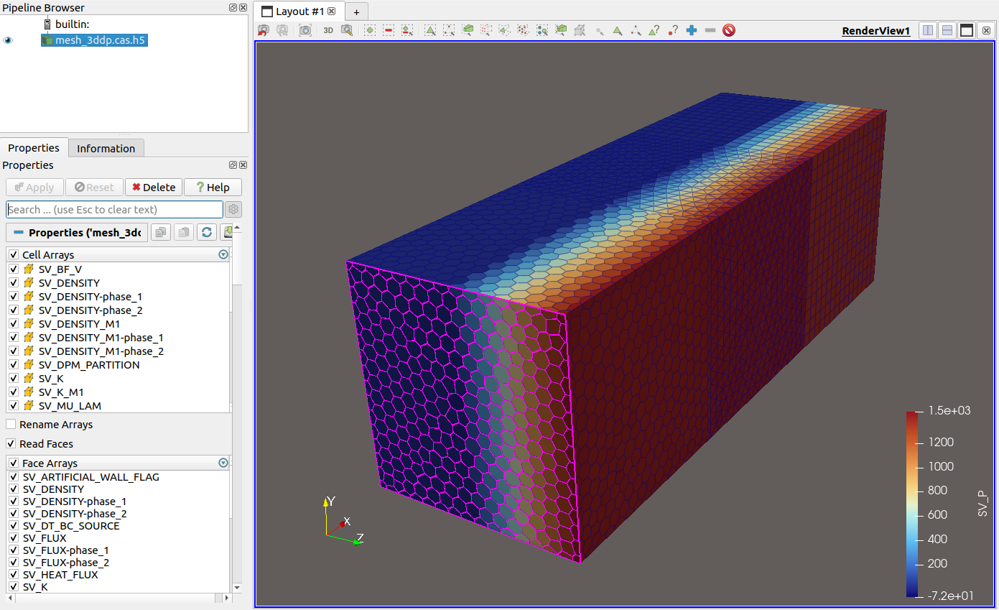
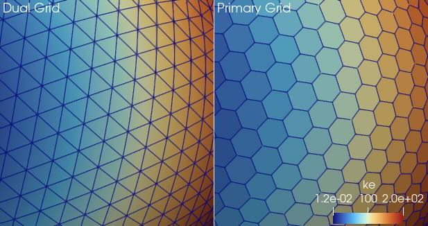
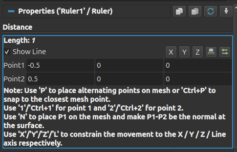
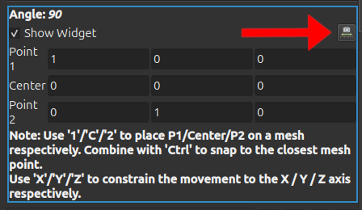
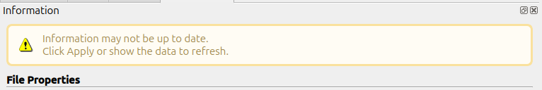

# ParaView 6.2.0 Release Notes

* [Notable additions](#notable-additions)
* [Rendering improvements](#rendering-improvements)
* [Plugin updates](#plugin-updates)
* [Filter changes](#filter-changes)
* [Changes in readers and writers](#changes-in-readers-and-writers)
* [Interface improvements](#interface-improvements)
* [Python scripting improvements](#python-scripting-improvements)
* [Virtual reality](#virtual-reality)
* [Catalyst](#catalyst)
* [Developer notes](#developer-notes)

# Notable additions

## Performance optimizations for static meshes over time

ParaView has been sped up significantly in some filters when applied to static meshes. Static meshes are meshes whose topology and point locations do not change over time, but whose data arrays may change.

- **Append DataSets**
- **Append Geometry**
- **Clip**
- **Slice**
- **Slice with Plane**
- **Transform**

To benefit from these improvements, data must be read by a compatible reader that marks the mesh as static over time. For now, only the VTKHDF reader does this. If you know that your data is actually static, but not read as such (i.e., it was read from a format that is not VTKHDF) you can enforce the behavior with the **Force Static Mesh** filter.

Note that the speedups are most significant with Unstructured Grids.

For early benchmarks, please see this [blog post](https://www.kitware.com/staticmeshplugin/)

## Improved CellGrid support in the _Information_ panel, _SpreadSheet View_, and _Render View_

### _Information_ panel

The _Information_ panel now correctly displays attribute types from CellGrid datasets. When a CellGrid is selected, the arrays table gains two extra columns: **Polynomial Order** and **Degrees of Freedom**, giving you quick insight into the mathematical structure of each CellGrid array without leaving the panel.

Because CellGrids may have multiple types of cells, each of which may use a different polynomial function space and basis for a given attribute, the _Information_ panel reports a range of **Polynomial Order**.

Note that for continuous fields (i.e., those sharing **Degrees of Freedom** through connectivity entries), **Degrees of Freedom** shared by cells of different type will be over-reported. An example of this would be a set of quadrilaterals and triangles that share a boundary; coefficient values on the shared boundary will be double-counted. The only way to fix this would consume significant amounts of memory.

### _SpreadSheet View_

The _SpreadSheet View_ now correctly populates the attribute-type selector with the attribute types that are actually present in CellGrid datasets. The selector is driven dynamically by the data information of the active source, so only valid choices are shown.

### _Render View_ representations

CellGrid datasets now have a richer set of representations to choose from in the _Render View_:

* **Surface With Edges** – renders the CellGrid surfaces with their cell edges drawn on top.
* **Surface With Edges And Vertices** – like **Surface With Edges** but also shows the corner vertices.
* **All Edges** – renders every edge of every cell, useful for inspecting the full wire-frame structure.
* **All Corners** – renders every corner point of every cell.

The default representation for CellGrid data has also been changed from **Next Lowest Dimension** to **Surfaces of Inputs**, which produces the most natural-looking result out of the box. The **Sides To Show** property is no longer exposed in the _Properties_ panel as it is an internal implementation detail. Backward compatibility is preserved: Python scripts that were written against ParaView 6.1 will automatically restore the old default when loaded.

## Animated export of the _SpreadSheet View_

ParaView now supports animated export of a _SpreadSheet View_, from the `File -> Export Scene` menu, thanks to the new **Write Time Steps** option. This creates one file per exported timestep, and features **Stride** and **Frame Window** properties to control which timesteps are exported.

## Alembic and USD scene export of a _Render View_ over time

In the same way ParaView can export a _SpreadSheet View_ over time to `.csv` files, ParaView now supports exporting timesteps from a _Render View_ to Alembic (`.abc`) and OpenUSD (`.usd`, `.usda`, and `usdc`) file formats through the `File -> Export Scene` menu. Time is exported when the new **Write Timesteps** option is enabled in the exporter. **Stride** and **Frame Window** properties control which timesteps are exported. This feature creates one Alembic or OpenUSD file and a set of supporting files (texture images) per exported timestep.

## Easier use of **Python Calculator**

### Use source names from _Pipeline Browser_

It is now possible to use the names from the _Pipeline Browser_ (aka "RegisteredNames") to retrieve the inputs instead of using their index in the **Expression** of **Python Calculator**. For example : `Sphere2` or `inputs["Sphere2"]` instead of using `inputs[1]`.

### Easier expression writing

The **Python Calculator** panel now provides helpers to build expressions so you don't need to memorize the syntax.

- **Input**: selects which connected input to browse arrays from. Disabled when only one input is connected. When **Use named inputs** is checked, generated accessors use the dataset name (e.g. `inputs["Sphere"].PointData["Velocity"]`) instead of numeric indexing (e.g. `inputs[0].PointData["Velocity"]`).
- **Array**: lists arrays from the selected input, optionally filtered to the current **Array Association**. Clicking
  inserts the appropriate accessor at the cursor.
- **Function**: searchable list of Python functions available in the calculator's namespace, with a one-line summary
  per entry. Hovering shows the full documentation. Double-clicking inserts `function()` at the cursor with the cursor
  placed between the parentheses.

The default **Array Name** is now `Result` (capitalized), consistent with the regular **Calculator** filter.

> 
>
> The _Properties_ panel for the **Python Calculator** showing the **Input**, **Array**, and **Function** pickers.

# Rendering improvements

## Point data read from VRML files is now mapped to RGBA values

The VRML Reader now produces a "VRMLColor" point data array with raw RGBA values if the imported VRML file has an active scalar variable and lookup table. Previously, the VRML reader always assigned the solid color assigned to the object to every point, limiting the coloring of imported geometry to solid colors only.

# Plugin updates

## New DPvtkReader plugin

Distributed Parallel Visualization with Zlib compression ([DPvz](https://github.com/sandialabs/dpvz)) is a library that reads a file format where data is stored in a parallel, time-dependent format. DPvtk, a thin layer on top of DPvz, stores VTK files as data, with multiple files written per timestep and per rank. ParaView now includes a DPvtkReader plugin with the **DPvtk MultiBlock Data Reader**, which reads a Multi-block Dataset XML file (`.vtm`) and the partition VTK XML files (`.vti`, `.vtr`, etc.) stored inside a DPvtk file. DPvtk files use the `.dpvtk` extension.

## OpenStreetMap support in the GeographicalMap plugin

You can now fetch OpenStreetMap (OSM) basemaps with the GeographicalMap plugin. In **Bounding Box** mode, the filter assembles a tile mosaic covering the requested latitude/longitude extent and georeferences the result using exact OSM tile edges, producing correct origin and spacing in degrees. The **Zoom** and **Center** mode preserves the previous single-tile behavior, and an attribution overlay is added to comply with OSM usage policy.

## zSpace macro button mapping

The zSpace plugin now has global settings giving the ability to map a custom Python macro to the stylus buttons.

# Filter changes

## New **Target Process** property in the **Aggregate Dataset** filter

The **Aggregate Dataset** filter has a new property called **Target Process**. This property allows you to specify the process on which the dataset will be aggregated. The options are:

* _Root Process_: data from all processes is aggregated to the root process of the (sub)controller. This ensures consistent aggregation across timesteps even when point counts change over time.
* _Process With Most Points_ (default): data from all processes is aggregated to the process that currently has the most points, minimizing the amount of data sent over the network. Note that if the process with the most points changes over time, the aggregation target may vary across timesteps.

## New **Image Binary Threshold** filter

ParaView now has an image filter called **Image Binary Threshold**. This filter gives the ability to replace image values based on 2 thresholds:
* Any values outside of the thresholds will be replaced by the **Out Value** property. Likewise, any values inside the thresholds range will be replaced by the **In Value** property.
* One can specify whether the **Out Value** or **In Value** has an effect of the filter output by checking **Replace Out** or **Replace In** respectively.

## New **Snapping Radius** property in the **Resample With Dataset** filter

The **Resample With Dataset** filter now has a **Snapping Radius** property. When **Snap To Cell With Closest Point** is enabled, points of the destination mesh that do not fall inside any source cell snap to the nearest source cell whose closest point lies within **Snapping Radius**, rather than being left without resampled values.

**Snapping Radius** is editable only when **Snap To Cell With Closest Point** is enabled; otherwise it is disabled. It is also disabled when **Compute Tolerance** is enabled, because the radius is then computed automatically and the value is ignored.

## Added the possibility to use implicit arrays in **Ghost Cells**, **Append Datasets**, and **Append Geometry**

It is now possible to enable generation of implicit arrays in the following filters:

* **Ghost Cells**
* **Append Datasets**
* **Append Geometry**

Using implicit array improves the execution time of the filter and reduces the memory consumption of the output. However, accessing arrays can be slower. Implicit arrays are disabled by default.

## Composite Dataset support in the **Resample To Hyper Tree Grid** filter

If a Composite Dataset is given in input, The **Resample to Hyper Tree Grid** filter now copies its structure in the output and resamples each dataset of the composite input to an hyper tree grid.

## Replaced **Interpolator Type** with configurable cell locators in stream and particle tracing filters

ParaView provides the following stream/particle tracing filters to interpolate velocity fields: **Evenly Spaced Streamlines 2D**, **Particle Path**, **Particle Tracer**, **Streak Line**, **Stream Tracer**, **Stream Tracer With Custom Source** and the legacy **Legacy Particle Path** and **Legacy Streak Line** filters.

Previously, these filters used the **Interpolator Type** property, which was restricted to the following options:

* _Interpolator with Point Locator_
* _Interpolator with Cell Locator_

This configuration was not flexible as it did not allow the use of other **cell locators**. To resolve this, the **Jump And Walk Cell Locator** was created to provide "Point Locator" style performance within a cell locator framework. The legacy **Interpolator Type** integer property has been replaced by a configurable **Cell Locator** property.

This change enables you to choose and configure any cell locator from the `cell_locators` proxy group. The verbatim list of available locators is:

* **Cell Locator**
* **Tree Cell Locator**
* **OBB Tree Cell Locator**
* **Static Cell Locator**
* **Jump And Walk Cell Locator**
* **BSP Tree Cell Locator**

For backwards compatibility, the values of the legacy **Interpolator Type** property from older state files and Python scripts are automatically replaced using the new **Cell Locator** property using the following mapping:

* _Interpolator with Point Locator_ $\rightarrow$ **Jump And Walk Cell Locator**
* _Interpolator with Cell Locator_ $\rightarrow$ **Static Cell Locator**

## Improved **Descriptive Statistics** filter

There are two major improvements to the **Descriptive Statistics** filter:

1. For Partitioned DataSet Collections, ParaView now supports generating either global statistical models (the previous behavior and current default) or per-assembly-node statistical models.

2. Tables are produced differently. Instead of two tables (one for learned and one for derived statistics), a single table is produced—which is much easier to read in the _SpreadSheet View_. Tables are also not repeated when data is distributed across multiple processes.

> 
> 
>
> Now it is possible to have statistical models computed for each assembly-tree node in partitioned dataset collections. Note that in the first case, the single model has cardinality (i.e., number of observations) 10088 while in the second, the two models produce smaller individual cardinalities that sum to 10088.

## Added the ability for **Explode Data Set** to name output parts from FieldData

When its new **Use Names From Array** property is on, the **Explode Data Set** filter will look in the input FieldData for a **Partitions Names** array containing the names to use for the output partitions. This array should be ordered as **Partitions Values**, listing the expected values for the **Scalars** cell array.

If the mapping fails (scalar not present in **Partitions Values** or index not found in **Partitions Names**) the automatic name is used (scalar array name suffixed with the partition index)

## **HyperTreeGrid (Random)** source rework

The **HyperTreeGrid (Random)** test source is now faster, and produces a consistent result when run in serial and in parallel, with or without masks.

# Changes in readers and writers

## Block selection support in the **XML Partitioned Dataset Collection Reader** and **XML MultiBlock Data Reader**

The **XML Partitioned Dataset Collection Reader** and **XML MultiBlock Data Reader** readers now support selection of blocks to load. This allows you to specify which blocks of the dataset to read, which can be useful for large datasets where you only need to load a subset of the data.

## Face support in the **Fluent CFF Case Reader**

You can now read face information from FLUENT CFF files.

> 
>
> Face selection after reading Fluent CFF file.

## Primary grid reading from MPAS files

The **MPAS Reader** now can read the primary grid from MPAS files. MPAS files provide the connectivity for two complementary grids. The first "primary" grid is formed as the Voronoi diagram of points on the globe. It consists primarily of hexagons and pentagons on the surface. The second "dual" grid is formed as the Delaunay triangulation of these points on the globe. As the names would imply, the grids are duals of each other with the cells of the primary corresponding to points of the dual and vice versa.



Although the simulation operates mostly on the primary grid, the MPAS reader loaded the dual grid. This is because on the dual grid most results data are on the points, so they get interpolated well and when in multilayer view the surface triangles are extruded into well-supported wedge shapes.

However, you may sometimes need to see the primary grid. The shape of the original cells can be important and the data values can get "smeared." Thus, the MPAS reader now has a **Use Primary Grid** option that allows you to see the original primary grid. Multilayers are also supported by extruding general polygons into polyhedra cell types.

That said, loading the dual grid (**Use Primary Grid** off) is still the default, which maintains backward compatibility with the previous behavior. The identification of fields as either point or cell is still based on the dual grid. This is a little confusing as when turning on the primary grid selected point fields show up as cell fields.

## The openPMD Reader gained support for `thetaMode`

The **openPMD Reader** now understands the `thetaMode` (aka "RZ+") decomposition of meshes.

## VTKHDF Reader

A couple improvements have been made to the VTKHDF Reader

### Ability to select field data arrays to read

You can now select which field data arrays to read in the _Properties_ panel. This used to be possible only for point and cell arrays.

### Piece distribution selection for distributed reads

When reading partitioned VTKHDF data in parallel, you can now choose how blocks are allocated to processes. The _Block_ mode will allocate partitions by block to each `pvserver` process, and _Interleave_ will allocate using a round-robin algorithm.

## VTKHDF Writer: support for new types

ParaView can now write HyperTree Grid, Structured Grid, Rectilinear Grid and Image datasets to disk in VTKHDF format. HyperTree Grids can be written in parallel.

## Parallel XML HyperTreeGrid (.phtg) writer and reader deprecated

The `.phtg` format had issues and inconsistent results in parallel. Consequently, the writer, reader and extractor are now deprecated.

Use  the VTKHDF format instead, which supports parallel decomposition of HyperTreeGrid properly.

# Interface improvements

## No more overlapping labels in the color legend

In some cases, labels in ParaView's color legends could end up overlapping and become illegible. Overlapping labels are now prevented by default, but if the removal is too agressive the previous behavior can be restored by enabling the **AllowOverlappingLabels** property in the _Edig Color Legend Properties_ dialog.

## New vertical labels option in the color legend

You can enable vertical labels via the option in the color legend editor.

> 

## **Show Block Name** option in _Chart View_ for composite datasets

It is now possible to hide block names in a _Chart View_ for composite datasets with the _Individual Block_ array option by unchecking the **Show Block Name** checkbox (checked by default).

## Bigger and bolder fonts in axis annotations

Axis annotation default text is now size 14 (up from 12) and bold in the **Data Axes Grid**, **Axes Grid**, **Polar Axes**, and **Polar Grid** axis annotations.

> 
> 
>
> Comparison of new larger (14pt) and **bold** axis text to text with the previous settings.

Python scripts with backwards compatibility version set prior to ParaView 6.2 will use the previous default font size (12pt) and style (non-bold) when an axis is created. ParaView `.pvsm` state files from previous ParaView versions store the font size and style explicitly.

## Added a "Reposition to view" action for the **Ruler** and **Protractor** sources

The user interfaces for **Ruler** and **Protractor** sources have been improved:
- A new button _Reposition to View_ is now available for the **Ruler** and the **Protractor**. You can now move these measuring tools towards the camera view automatically by clicking on this button.
- Control buttons are now at the top of the **Ruler** properties.

> 
> 
>
> Interface improvements in the **Ruler** and **Protractor** sources.

## Added a label to indicate fields to hide in the **Represented Attributes** section of the _Settings_ window

It is now possible to create a list of arrays to hide on the tooltip info when using **Hover Points On** and **Hover Cells On** features. The "special" fields can be hidden ("Id", "Block", "Type", "Coords") as well as any point/cell data array name. This list is configured with the new **Fields to hide (on hover)** property.

## Added an out-of-date label to the _Information_ panel

The _Information_ panel now displays a label if the information data on this panel is outdated.

> 
>
> Outdated information indicator in the _Information_ panel

## Copy tables to the clipboard

ParaView shows different properties as a table, like **Isosurfaces** property in the **Contour** filter or the color transfer function values (**RGB Points**). You can now copy their content to the clipboard, using the standard shortcut (usually `Ctrl+C`).

> 
>
> Right, copy table rows. Left, paste them in another software

## `File -> Export Scene` menu entries have been merged

ParaView used to have two similar menu items: `File -> Export Scene` and `File -> Export Animated Scene`. They are now merged into the single `File -> Export Scene` entry. To write an animated scene, please enable the new **Write timesteps as file-series** option if available in the exporter you have selected.

## Improved abort mechanism

ParaView's _Abort_ button is now only enabled after apply is pressed instead of whenever a progress event is received, improving stability. In addition, the _Abort_ button now works in client/server and client/server/render mode.

Please note that the abort function is not available when connected to a remote server running on multiple ranks.

## More descriptive display names for _Time Manager_ camera animations

Camera animations will now include the mode ("Follow Path", "Follow Data", or "Interpolate Cameras") in the display name.

## Ray tracing options user interface improvement

Checkboxes named **Enable Ray Tracing** and **Enable Rendering with ANARI** are now shown only if ParaView is built and shipped with those options enabled.

## View property **WindowResizeNonInteractiveRenderDelay** removed

The property **WindowResizeNonInteractiveRenderDelay**, which set the time in seconds before doing a full-resolution render after the last `WindowResize` event has been removed. Now, the view does a full-resolution render when resizing a window.

## Group file sequences containing scientific notation

Multiple files in the same directory with the naming pattern `<name>_<index>_<scientific notation>.<extension>` will now be recognized as a time series and grouped together in ParaView's file dialogs. The integer in the `<index>` position will be used to determine the timestep of each file.

# Python scripting improvements

## Added camera link support to Python state files

Camera links can now be saved in Python state files and therefore recovered when such a file is loaded. The state file uses the `AddCameraLink` Python function to keep track of a link.

## Copy/paste of properties now recorded in the Python Trace

Objects are now correctly updated when using the `Copy` function with Python scripting. Addtionally, the use of the _Copy_/_Paste_ buttons from the _Properties_ panel is now included in Python traces.

## Save a Python state file while tracing

ParaView now has the ability to save a Python state file while Python tracing is active. Saving a state file will not be recorded in the output trace.

## Select by block in Python

It is now possible to select points/cells from a block of a Composite Dataset with Python with the function `SelectBlocks(BlockSelector, Source, FieldType, Modifier)`

## Selecting by `vtkIdType` array with Python

It is now possible to select by point/cell data (on a vtkIdTypeArray) with Python with the functions `SelectPointsDataByArrayValue(ArrayName, IdValue, Source, Modifier)` and `SelectCellsDataByArrayValue(ArrayName, IdValue, Source, Modifier)`

# Virtual reality

## Improved CAVE stereo configuration

You can now specify simply "Left" or "Right" as the desired stereo type for paraview or pvserver processes, allowing ParaView to be run in CAVES where displays are dedicated to one eye. While you can still specify stereo type on the command line, you can now also provide them on a per-machine basis in your `.pvx` file. Like other `.pvx` file configuration, this information is also available to you from the client side (e.g. in Python scripts).

Additionally, you no longer need to specify any stereo type on the client just because you want stereo on the servers. If you don't specify anything on the client, a stereo type will be chosen that is compatible with what you have selected on the server side.

Looking at the stereo options in the view _Properties_ panel, you will now notice a new server stereo type option "Original Configuration", which sets each process back to initially configured (via CLI or `.pvx`) values.

## Added CAVE support for independent viewers

ParaView running in CAVEs now supports multiple simultaneous head-tracked users. Via the `.pvx` configuration file, you can specify a `ViewerId` attribute for each `Machine` element. Via new render view proxy properties, you can specify eye transform matrices and eye separation values for any number of users. You can use the CAVE configuration panel to adjust the eye separations for each user.

### Configuration using .pvx

The simplest way to add multiple users is just to add a `ViewerId` attribute to each `Machine` element. Viewer ids must include only and all values between 0 and the number of viewers minus 1. You can associate a single viewer id with any number of `Machine` elements.

You can also configure unique eye separations for each viewer by adding an `IndependentViewers` section to your `.pvx` file, see `Examples/CAVE/twoViewers.pvx` for an example.

### Configuring eye separation using the user interface

The `Track` interactor style proxy now works with any number of independent viewers and is also easier to use. When you select the `Track` style interactor style proxy from the dropdown menu, you now only need to select the correct _Render View_ proxy, as the property is no longer configurable. When you add the `Track` interactor style, the plugin queries the server for the number of independent viewers and dynamically creates named `Tracker` roles for the correct number of viewers, at which point you can map your VRPN/VRUI events to those roles using the familiar dialog.

Furthermore, when you select the `Track` style proxy, you should see a new `EyeSeparation` property, allowing you to adjust the default (i.e. from `.pvx` or state file) eye separations for each viewer.

## Save **First Person Camera** controller parameters in VR state files

The parameters of the **First Person Camera** controller (such as **Mouse Sensitivity X/Y**, **Invert X/Y**, **Move Speed Forward/Right** and **Up Axis**) are now saved in the `.pvvr` file when saving and restoring a VR State.

## Improved the **Joystick Camera** controller in the CAVEInteraction plugin

It is now possible to invert the forward/backward and left/right movements for the **Joystick Camera** controller in the CAVEInteraction plugin.

It is also possible to control how joystick sensitivity is mapped to speed. Higher values increase the precision near the center, so the speed difference between pushing the joystick slightly and pushing it all the way will be big. At lower values, this difference will be smaller. At 0, the speed will always be constant as soon as we move the joystick in one direction.

Please note that changing this parameter doesn't increase the max speed when we push the joystick all the way : this is handled by the **Move Camera Sensitivity**. Instead, the larger the parameter is, the lower the speed will be when we push the joystick slightly.

Finally, it is now possible to accelerate the movement speed when pressing a button. The multiplier of the movement speed can be set with a parameter.

The parameters of the **Joystick Camera** controller (such as **Move Camera Sensitivity**, **Invert X/Y**, **Fast Movement Multiplier**, **Up Axis**, etc.) are now saved in the `.pvvr` file when saving and restoring VR State.

# Catalyst

## Dynamic pipeline registration via state/pipelines

ParaView Catalyst now supports registering analysis pipelines at execution time, in addition to the existing init-time `catalyst/scripts` registration. This allows adaptors to add pipelines after `catalyst_initialize` without re-initializing the framework.

At `catalyst_execute` time, each child of `catalyst/state/pipelines` may be either:

- a string, naming an already-registered pipeline to execute (existing behavior), or
- an object `{name, filename, [args]}`, registering the pipeline on-the-fly if not already known, then executing it.

Example execute parameters (YAML presentation of the Conduit node):

```yaml
catalyst:
  state:
    timestep: 100
    time: 0.5
    pipelines:
      - "existing_pipe"           # already registered, select to run
      - name: "slice1"            # new dynamic registration
        filename: "slice.py"
        args:
          - "--x_cut=0.25"
      - name: "slice2"            # another instance of slice.py
        filename: "slice.py"
        args:
          - "--x_cut=0.75"
```

Arguments set at registration time are routed per-instance via `get_args()` in the script, so multiple parameterized instances of the same script each receive their own arguments without cross-contamination.

Name is identity: an object-form entry referencing an already-registered name is treated as selection only. If its filename or arguments differ from the existing registration, a `WARNING` is logged and the existing registration is retained. To use different values, register under a new name. Arguments are not mutable across executes; use `state/parameters` or steerable parameters for runtime updates.

The object form dispatches on the `type` field (default `script`):

- `type: "script"` (or absent): Python script pipeline, schema `{name, filename, [args]}` where `filename` is the .py script path. Requires Python support; if not enabled, the entry is ignored with a warning.
- `type: "io"`: C++ pre-compiled file-writer pipeline, schema `{name, type, filename, channel}` where `filename` is the output path and `channel` selects which mesh to write. The actual writer is chosen by extension via `vtkSMWriterFactory` (XML VTK formats, legacy VTK, CGNS, Exodus, IOSS, image formats, etc.). No Python dependency.
- Unsupported types are rejected by the blueprint verifier.

This mirrors the init-time split between `catalyst/scripts` (Python) and `catalyst/pipelines` (C++ pre-compiled), unified under a single dynamic registration path.

A dict-form entry registers and executes the pipeline in the same `catalyst_execute` call. There is currently no way to register without also executing this turn; if that is needed, register on the first execute call where the pipeline should run.

This is a ParaView-side behavior extension to the Catalyst Conduit protocol. The Catalyst C API is unchanged.

# Developer notes

## New MultiOutputPortReader example plugin

A new example plugin (`Examples/Plugins/MultiOutputPortReader`) demonstrates how to create a reader with multiple output ports that supports file series via `vtkFileSeriesReader`. This serves as a reference for plugin developers who need time series support with multi-output-port readers.

## New `RepositionToView` proxy hint for use with `InteractiveLine` panel widgets

A new `RepositionToView` proxy hint can be used with `InteractiveLine` panel widgets. This new hint adds an action of repositioning the line source relative to the current view. This can be added to proxy hints and will have an effect only if this proxy has a group containing an `InteractiveLine` panel widget.

## `vtkDataAssembly` added support for `.` in assembly node names

`vtkDataAssembly` now supports `.` in assembly node name.

This slightly changes the behavior of the **Group DataSet** filter which used to generate node names without a `.`, now it contains a `.`.

This can break existing state files or Python scripts that use a selector property such as **Extract Block** filter.

## Merged the `vtkSession` and `vtkPVSession` classes

`vtkSession` and `vtkPVSession` classes are now merged to resolve naming conflicts in the install tree caused by the introduction of a new `vtkSession` header in VTK.

In that context, a deprecated `vtkSession` class is provided for backwards compatibility and the `vtkSessionIterator` class is deprecated in favor of `vtkPVSessionIterator` to maintain consistency.

## Prefixed interaction style extension classes with `PV`

VTK class names in the InteractionStyle extensions have been prefixed with `PV` to avoid naming conflicts.

The following classes have been renamed:
* `vtkCameraManipulator` -> `vtkPVCameraManipulator`
* `vtkTrackballPan` -> `vtkPVTrackballPanAxisConstrained` (because `vtkPVTrackballPan` was already used for a different class)

This is an unavoidable breaking change for developers who have been using these classes in their code, but it should not affect direct users of ParaView. It was necessry since VTK is now providing its own `vtkCameraManipulator` class, which is intended to be a replacement for `vtkPVCameraManipulator` in the future. The new VTK class is not a subclass of `vtkPVCameraManipulator`, so the two classes will need to co-exist for some time. The `PV` prefix makes it clear which class is which and avoids naming conflicts.

## Replaced most `GetVoidPointer()` function usages in `vtkAbstractArray`

`vtkAbstractArray::GetVoidPointer()` is a function that returns a raw pointer to the underlying data of a VTK array. This function was added in VTK's early days when it only supported `vtkAOSDataArrayTemplate` arrays. Since then, VTK has added support for multiple other array types, either explicit (e.g., `vtkSOADataArrayTemplate`, `vtkScaledSOADataArrayTemplate`, etc.) or implicit (e.g., `vtkAffineArray`, `vtkConstantArray`, etc.). These array types don't store their data in a contiguous block of memory, so using `GetVoidPointer()` triggers duplication of data in an internal `vtkAOSDataArrayTemplate` array so that a valid data pointer can be returned, which leads to memory usage increase and unnecessary copying overhead.

In an attempt to modernize ParaView and reduce unnecessary data duplication and copying overhead, ~94% (73/78) of the `GetVoidPointer()` usages have been removed using one of the following techniques:

* If array is `vtkAOSDataArrayTemplate`, use `GetPointer()` instead of `GetVoidPointer()`.
* If array is `vtkDataArray` and all tuples need to be filled, use `Fill` instead of `memset()` with
   `GetVoidPointer()`.
* If array is `vtkAbstractArray` and some tuples need to be copied, use `InsertTuples*()` methods instead of
   `GetVoidPointer()` and `memcpy()`.
* If array is `vtkDataArray` and access to the tuples/values is needed, use `vtkArrayDispatch` and
   `vtk::DataArray(Value/Tuple)Range()`, instead of `vtkTemplateMacro` with `GetVoidPointer()`.

Moreover, the remaining 5 `GetVoidPointer()` usages have been marked as _safe_ using the `clang-tidy` lint `(bugprone-unsafe-functions)` when one of the following conditions is met:

* If array is `vtkDataArray`, but using `HasStandardMemoryLayout`, it has been verified that it actually is `vtkAOSDataArrayTemplate`, then `GetVoidPointer()` is _safe_ to use. This usually happens when the array was created using `vtkDataArray::CreateDataArray()` or `vtkAbstractArray::CreateArray()` by passing a standard VTK data type.
* If array is `vtkDataArray`, the data type is NOT known, but raw pointer to data is absolutely needed, use `auto aos = array->ToAOSDataArray()`, and then use `aos->GetVoidPointer()`, which is _safe_. Be aware that this may lead to data duplication if the array is not `vtkAOSDataArrayTemplate`.

Finally, `vtkAbstractArray::GetVoidPointer()` and `vtkDataArray::GetVoidPointer()` have been marked as an _unsafe_ function using `clang-tidy`, and its usage will be warned as such, unless explicitly marked as _safe_ using the `(bugprone-unsafe-functions)` lint. Marking such usages as _safe_ should only be done when `GetVoidPointer()` is indeed safe to use, meaning it satisfies one of the conditions mentioned above.

## Removal of header used by removed OpenVR plugin

`pqOpenVRHidingDecorator.h` has been removed as the class is never used and its `.cxx` file does not exist.

## Reworked Ray Tracing and ANARI CMake logic

`PARAVIEW_ENABLE_ANARI` is now independent from `PARAVIEW_ENABLE_RAYTRACING`. Therefore, `PARAVIEW_ENABLE_ANARI` can now be turned `ON` to run ParaView only with ANARI rendering capabilities.

## Changes to `vtkResampleToHyperTreeGrid`

In `vtkResampleToHyperTreeGrid.h` :
- The following struct have been moved from `protected` visibility to `private` : `GridElement`, `PriorityQueueElement`
- The following methods have been moved from `protected` visibility to `private` : `ProcessTrees`, `GenerateTrees`, `IndexToMultiResGridCoordinates`, `IndexToGridCoordinates`, `MultiResGridCoordinatesToIndex`, `GridCoordinatesToIndex`, `BroadcastHyperTreeOwnership`, `RecursivelyFillGaps`, `ExtrapolateValuesOnGaps`, `RecursivelyFillPriorityQueue`, `SubdivideLeaves`, `CreateGridOfMultiResolutionGrids`, `IntersectedVolume`
- The following variables have been moved from `protected` visibility to `private` : `BranchFactor`, `Dimensions`, `MaxDepth`, `Progress`, `Mask`, `CellDims`, `NumberOfChildren`, `NumberOfLeavesInSubtreeField`, `NumberOfPointsInSubtreeField`, `MinimumNumberOfPointsInSubtree`, `MaxResolutionPerTree`, `Extrapolate`, `NoEmptyCells`, `ResolutionPerTree`, `Diagonal`, `GridOfMultiResolutionGrids`, `Bounds`, `LocalHyperTreeBoundingBox`, `Controller`
- The following variables have been removed : `MaxCache`, `MinCache`, `InputDataArrayNames`
In `vtkResampleToHyperTreeGrid.h` and `vtkResampleToHyperTreeGrid.cxx` :
- The following variables have been renamed and moved from `protected` visibility to `private` : `Min` in `LowerThreshold`, `Max` in `UpperThreshold`, `InRange` in `InvertRange` (and its role has been inverted), `ArrayMeasurement` in `SubdivisionMethod`, `ArrayMeasurementDisplay` in `InterpolationMethod`, `InputPointDataArrays` in `InputArrays`, `ArrayMeasurements` in `ArrayValuesAccumulators`

## Abort feature implementation details

 - The "Abort" feature can be enabled at the source proxy level and is activated for any `vtkSMSourceProxy` working with a `vtkSISourceProxy`.
 - `vtkPVProgressHandler` is responsible for the client/server synchronization.

## New configuration option `PARAVIEW_BUILD_EDITION_STRICT`

ParaView now provides the configuration option `PARAVIEW_BUILD_EDITION_STRICT` to control the strictness of the VTK modules excluded by ParaView build edition.

By setting `PARAVIEW_BUILD_EDITION_STRICT=OFF` or configuring with `PARAVIEW_USE_EXTERNAL_VTK` any additional VTK module may be enabled for any `PARAVIEW_BUILD_EDITION`.

This feature enables building ParaView with any VTK the meets the minimum required modules for the configured build edition.

## `IsGlobal` flag in `vtkPVArrayInformation`

`vtkPVArrayInformation` gains an `IsGlobal` flag to identify arrays living in root-level composite field data, used by **Python Calculator** to generate correct accessors for global arrays.

## Improvments to `vtkPVPostFilter`

`vtkPVPostFilter`, the hidden filter responsible for converting and extracting data between filters, is now able to execute only when needed, resulting in reduced execution time when using filters like **Contour** or **Threshold** when data conversion is enabled but not needed.

In that context, the following protected methods have been removed:

* `vtkPVPostFilter::DoAnyNeededConversions`
* `vtkPVPostFilter::CellDataToPointData`
* `vtkPVPostFilter::PointDataToCellData`
* `vtkPVPostFilter::ExtractComponent`

## Window resizing-related methods deprecated

* Public method **SetResizingWindow** in **vtkSMRenderViewProxy** has been deprecated.
* Protected method **SetResizingWindow** in **vtkSMViewProxyInteractorHelper** has been removed.
* Protected variable **EndWindowResizeTimerId** in **vtkSMViewProxyInteractorHelper** has been removed.

## vtkPVPlaneCutter API break

The `AMRAxisAlignedPlaneCutter` and `HTGAxisAlignedPlaneCutter` protected members were removed because they are not used anymore.

## `vtkFileSeriesReader` supports multi-output-port readers

`vtkFileSeriesReader` now automatically detects and matches the output port count of its internal reader. This enables file series support for readers with multiple output ports without requiring subclassing.
