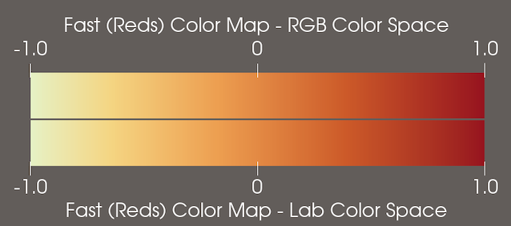

## Faulty default color map in ParaView 6.0.0 fixed

The "Fast" color map, which is the new default in ParaView 6, was not correctly defined in the ParaView 6.0.0 release. Its color space was set to "Diverging" rather than "Lab". As a result, the central lightest point in the color map was shifted to the left of center and was too bright.

> 
>
> Incorrect "Fast" color map in ParaView 6.0.0 vs. corrected "Fast" color map in ParaView 6.0.1.

The "Fast" color map has been corrected in ParaView 6.0.1. If you need to produce images with the same color map as ParaView 6.0.0, you can either:

* Choose the color map preset named "ParaView 6.0.0 Default".
* Use the default color map in ParaView 6.0.1 and change the **Color Space** property in the _Color Map Editor_ to "Diverging".

In addition, the "Fast", "Fast (Reds)", and "Fast (Blues)" color map presets were set to have the color space "RGB" instead of "Lab". Fortunately, the differences between these color maps interpolated through "RGB" and "Lab" spaces respectively is not perceptually noticable in any of them, though there are slight RGB color differences.

> 
>
> "Fast" color map in RGB color space (ParaView 6.0.0 preset) vs. Lab color space (ParaView 6.0.1 preset).

> 
>
> "Fast (Reds)" color map in RGB color space (ParaView 6.0.0 preset) vs. Lab color space (ParaView 6.0.1 preset).

> 
>
> "Fast (Blues)" color map in RGB color space (ParaView 6.0.0 preset) vs. Lab color space (ParaView 6.0.1 preset).
