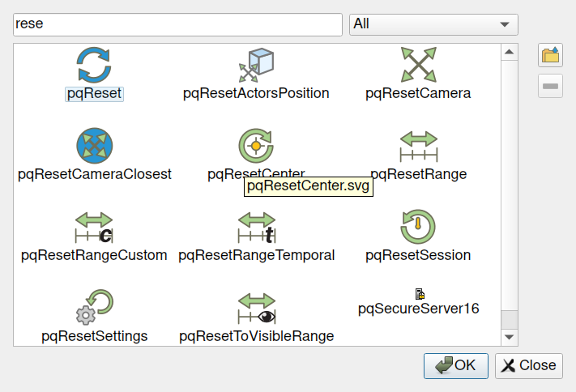

## Icon Browser: add icon for your macros

ParaView now offers an interface to select an icon for Macro buttons in the user interface.
You can import your own image or reuse one provided by ParaView.
ParaView stores the imported images under a new Icons directory, under your user directory.

> 
>
> The Icon browser dialog
