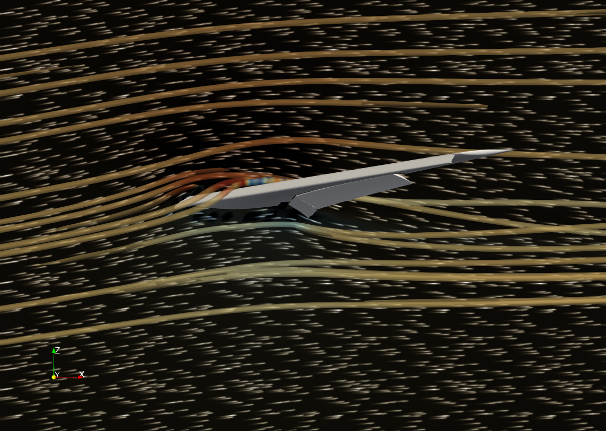

## Add Oriented LIC option to Surface LIC representation

The **Surface LIC** (line integral convolution) representation now provides an **Oriented LIC** property. When enabled, the sign of the vector field is used to orient the LIC pattern, giving it a directional, arrow-like appearance instead of the default symmetric streak pattern. This makes it easier to see flow direction, not just flow lines, directly in the Surface LIC rendering.

>
> Airflow past a wing shown with streamlines and oriented LIC rendering
