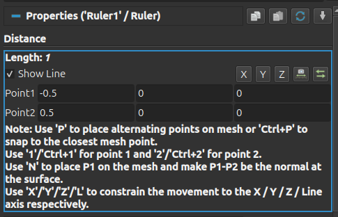
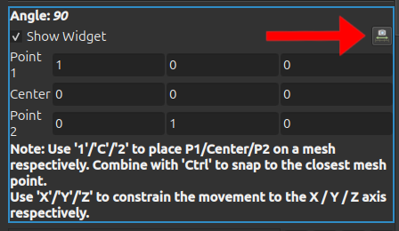

## Add "Reposition to view" action for the **Ruler** and **Protractor** source

The **Ruler** and **Protractor** sources UI have been improved:
- A new button _Reposition to View_ is now available for the **Ruler** and the **Protractor**. You can now move these measuring tools towards the camera view automatically by clicking on this button.
- Control buttons are now at the top of the Ruler properties.

> 
> 
>
> UI improvements of the **Ruler** and **Protractor** sources.
