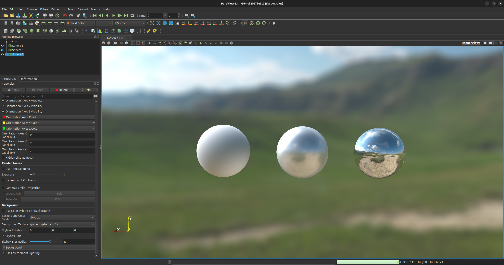

## Add ability to blur the skybox

ParaView now gives the ability to blur the background if the skybox is used.

### Use skybox blur

In the **Background** properties, select "Skybox" for the **Background Color Mode**. The image can be blurred by checking the **Skybox Blur** property. The amount of blur can then be changed by setting the **Skybox Blur Radius** property.

*Skybox blur example.*
