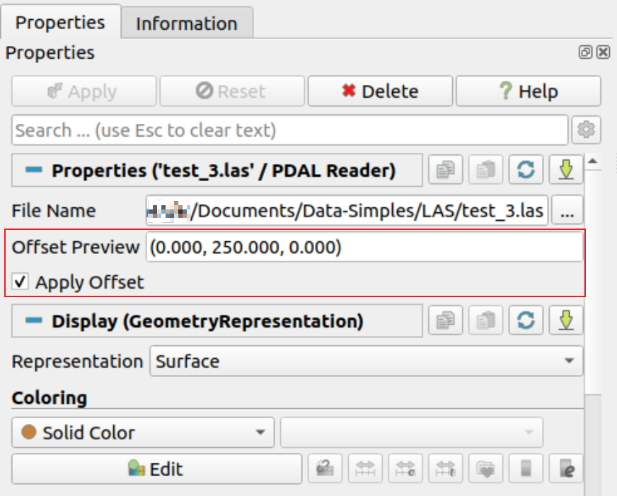

## Add Apply Offset option in vtkPDALReader

`vtkPDALReader` now exposes an **Apply Offset** property in ParaView.
When enabled, offsets detected in LAS/LAZ metadata are applied to point coordinates on read.

