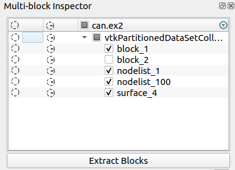

## Add Extract Blocks Button to Multi-Block Inspector

`Multi-Block Inspector` now has a button to extract the selected blocks.

This MR resolves issue https://gitlab.kitware.com/paraview/paraview/-/issues/20636.
