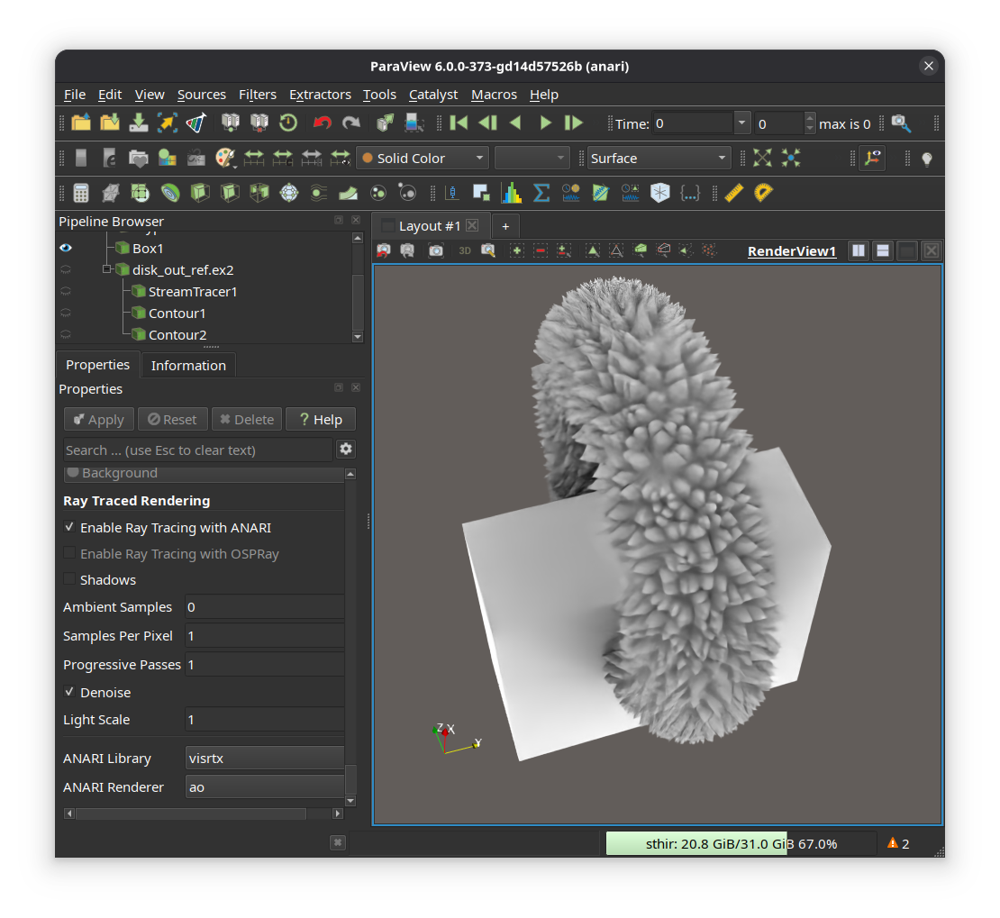

## Introducing ANARI rendering integration in ParaView

This change introduces ANARI rendering in ParaView via pre-defined ANARI renderer properties.

To access, enable the CMake configure time option `PARAVIEW_ENABLE_RAYTRACING`.
That would automatically enable the `vtkRenderingRayTracing` and
`vtkRenderingAnari` modules.

The current integration uses a simple approach to delegate ray-traced rendering
to ANARI. The `Properties Panel` presents the user with a choice between the
original `Enable Ray tracing` (with OSPRay) and `Enable Ray tracing with ANARI`.

When that option is checked, the panel presents the user with a list of
pre-defined options including:

- ANARI Library: A choice between `visrtx`, `helide`, and `environment`. The
last option uses the library set using the environment variable
`ANARI_LIBRARY`.
- Renderer Sub-Type: Choose between the following sub-types for rendering with
ANARI.
    - `default`: The default sub-type for the ANARI library.
    - `ao`: The `ao` (Ambient occlusion) sub-type for the ANARI library.
    - `dpt`: The `dpt` (Directional path tracing) sub-type for the ANARI
    library. Sub-types are limited to the visrtx renderer at this time.
- Denoise: Controls whether to denoise images.
- Samples Per Pixel: The number of samples per pixel to use for ray tracing.
- Ambient Samples: The number of ambient samples to use for ray tracing.
- Light Scale: A scale parameter for all lights in the view.

While the current ANARI integration is limited to static properties, there are
plans to support dynamic properties as well as additional renderer sub-types in
the future.
