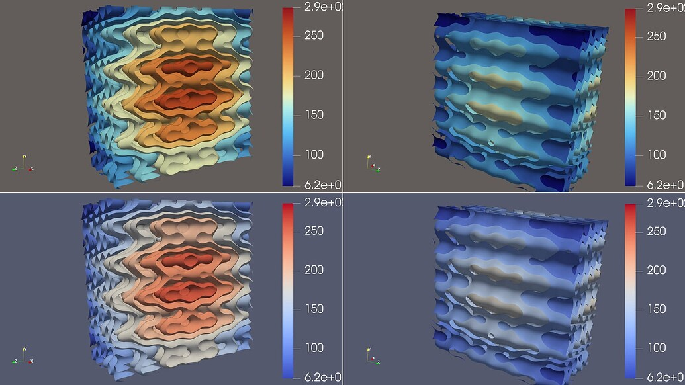

## Change Default Background and Color Map to WarmGrayBackground and Fast, respectively

The default background has changed from "BlueGrayBackground" to "WarmGrayBackground".
The default color map has changed from "Cool to Warm" to "Fast".

> 
