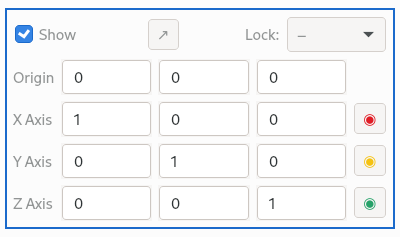

## Coordinate-frame property widget user interface

The Qt user interface for the coordinate-frame property widget
has been updated to be more compact and more usable.

+ What was a large label holding instructions is now a tool-tip.
+ The array of large buttons at the bottom is now a drop-down menu
  of actions at the top-center.
+ The pqDoubleLineEdit widgets no longer cause immediate updates to
  axis coordinates, as these immediate updates caused other axes to
  end up pointing in unexpected directions. Also, manually-entered
  values were untouched even though the widget requires unit-length
  vectors. To get around these problems, there is now a button to
  the right of each axis you must press to set that axis's coordinates.
+ The buttons which commit manual changes to axis coordinates are
  colored to match the axis colors in the 3-D render-view.
