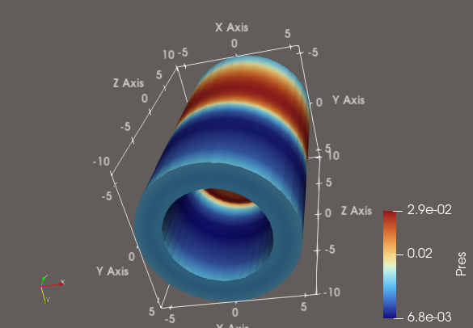
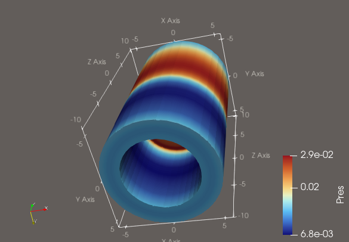

## Bigger and bolder fonts in axis annotations

Axis annotation default text is now size 14 and bold in the **Data Axes Grid**, **Axes Grid**, **Polar Axes**, and **Polar Grid** axis annotations.

> 
> 
>
> Comparison of new larger (14pt) and **bold** axis text to text with the previous settings.

Python scripts with backwards compatibility version set prior to ParaView 6.2 will use the previous default font size (12pt) and style (non-bold) when an axis is created. ParaView .pvsm state files from previous ParaView versions store the font size and style explicitly.
