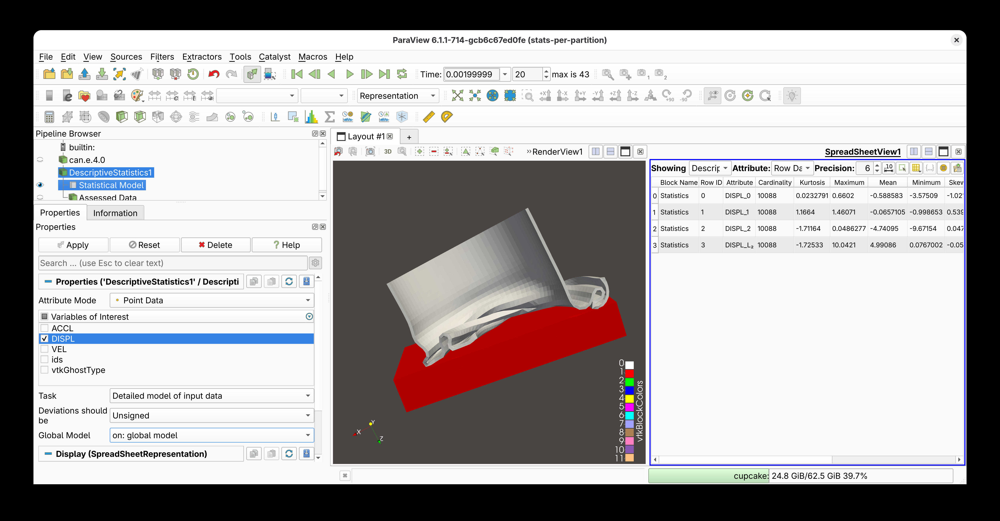
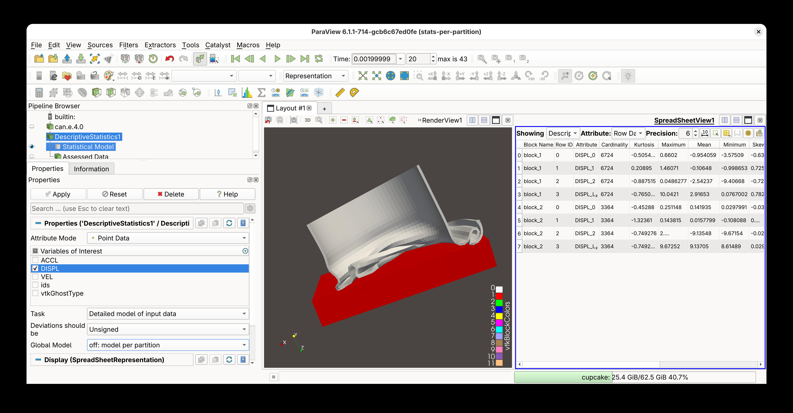

# Improved Descriptive Statistics

There are two major improvements to descriptive statistics:

1. For partitioned dataset collections, ParaView now supports generating either global
   statistical models (the previous behavior and current default) or per-assembly-node
   statistical models.

2. Tables are produced differently. Instead of two tables (one for learned and one for
   derived statistics), a single table is produced—which is much easier to read in the
   spreadsheet view.
   Tables are also not repeated when data is distributed across multiple processes.

> 
> 
>
> Now it is possible to have statistical models computed for each assembly-tree
> node in partitioned dataset collections. Note that in the first case, the single
> model has cardinality (i.e., number of observations) 10088 while in the second,
> the two models produce smaller individual cardinalities that sum to 10088.
