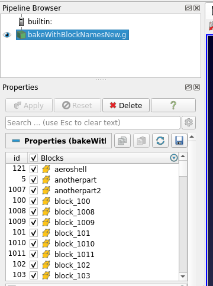

### IOSS: show exodus block ids in Properties panel

Exodus files have block/set ids, in addition to optional custom names. When
these custom names were present, it was not clear to the user which name
corresponded to which id in the file. To help with this, IOSS reader now shows
block/set ids in the Blocks/Sets selection widgets shown on the Properties
panel.

