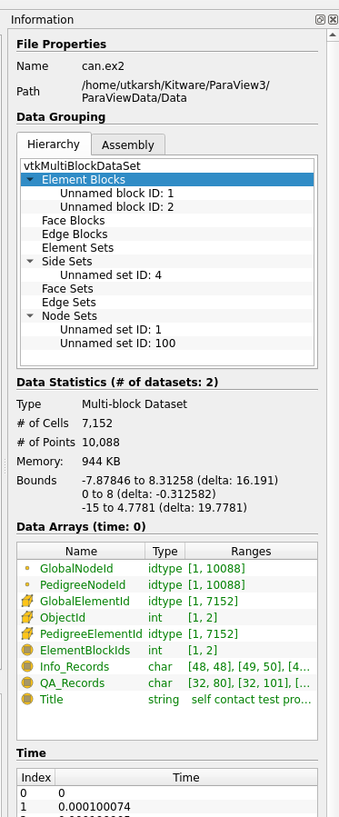

## Information Panel

The **Information Panel** has been redesigned to improve the way information is
presented to the users. Besides general layout improvements that make the panel
more compact and consistent with other panels, the changes are as follows:

* When showing composite datasets, one can view information specific to a subtree by
  selecting that subtree in the panel. However, if the data changes, for
  example, due to animation, the selection was lost making it tedious to monitor
  data information changes for a specific subtree. This has been fixed.

* All numbers now use locale specific formatting. For example, for US-EN based
  locale, large number are formatting by placing commas. Memory used is shown in
  KB, MB, or GB as appropriate.

>
