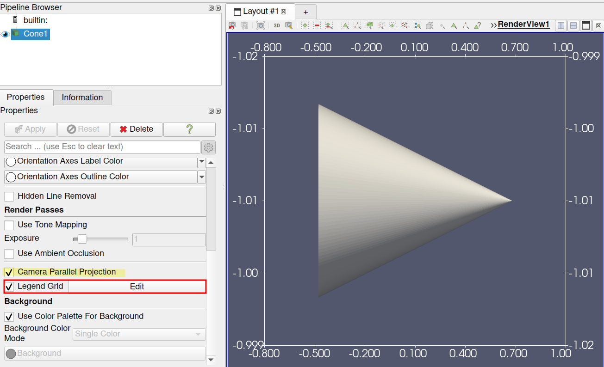

## Legend Grid Annotation

ParaView has a new annotation widget, called the `Legend Grid`.

You probably know about the `Axes Grid` object, that display
3D axes and coordinates around the data.
This `Legend Grid` is the 2D counterpart, and live in the screen space.
The grid is always above the scene and does not move with the camera.

It is available in the `View` section of the property panel.
Due to its screen space position, it only makes sense when
the `Camera Parallel Projection` is on. Thus, the property
can be enabled only in that case.

