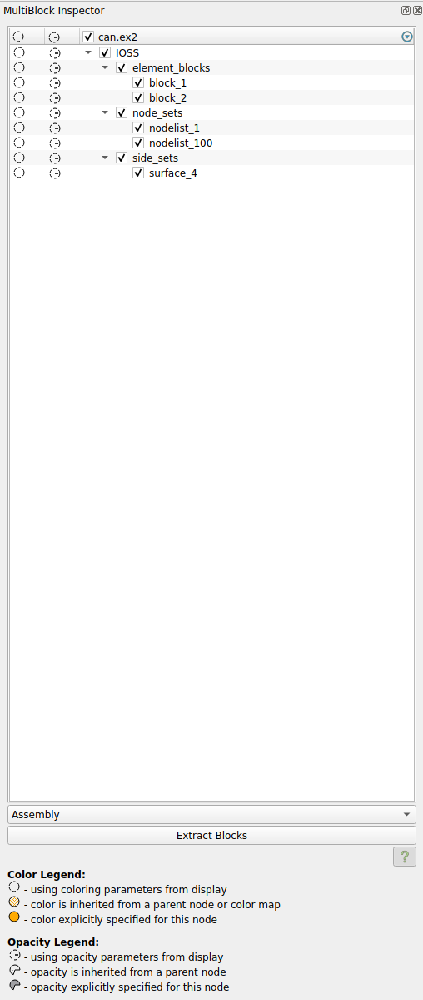
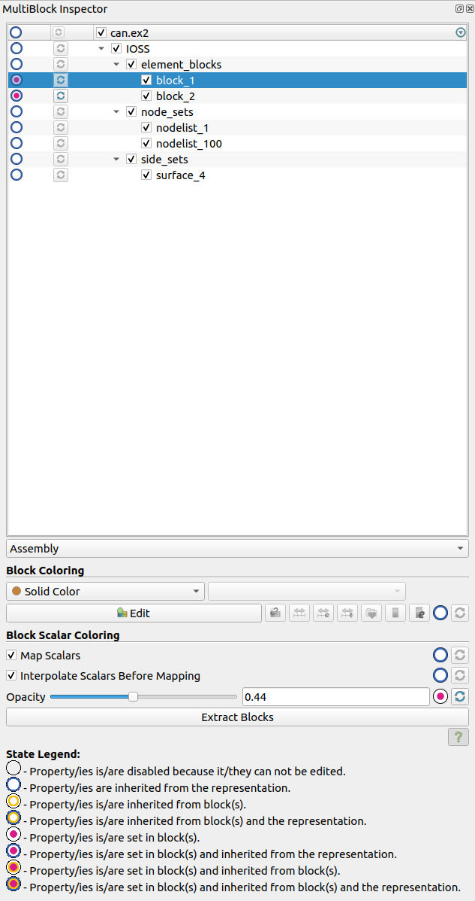

## MultiBlockInspector: Refactoring to support coloring blocks by array

The old `MultiBlockInspector` used to support changing the following block properties

1. visibility (as a column in the inspector)
2. color (as a column in the inspector)
3. opacity (as a column in the inspector)

For each property, it has a column in the inspector.

The new `MultiBlockInspector` supports changing the following the block properties:

1. visibility (as a column in the inspector)
2. color (as part of the block color property widget)
3. color array (as part of the block color property widget)
4. use separate color map (as part of the block color property widget)
5. interpolate scalars before mapping (as part of the block color properties widget)
6. opacity (as part of the block color properties widget)
7. map scalars (as part of the block color properties widget)

Each property has a state and can be reset to the default value.
Also all block selectors have a state and a reset button for all of the properties (as a column in the inspector).

To change a property of a block/blocks, the user select the blocks in the multiblock inspector and then change the
desired property. The change is applied to all selected blocks.

