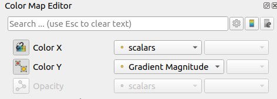
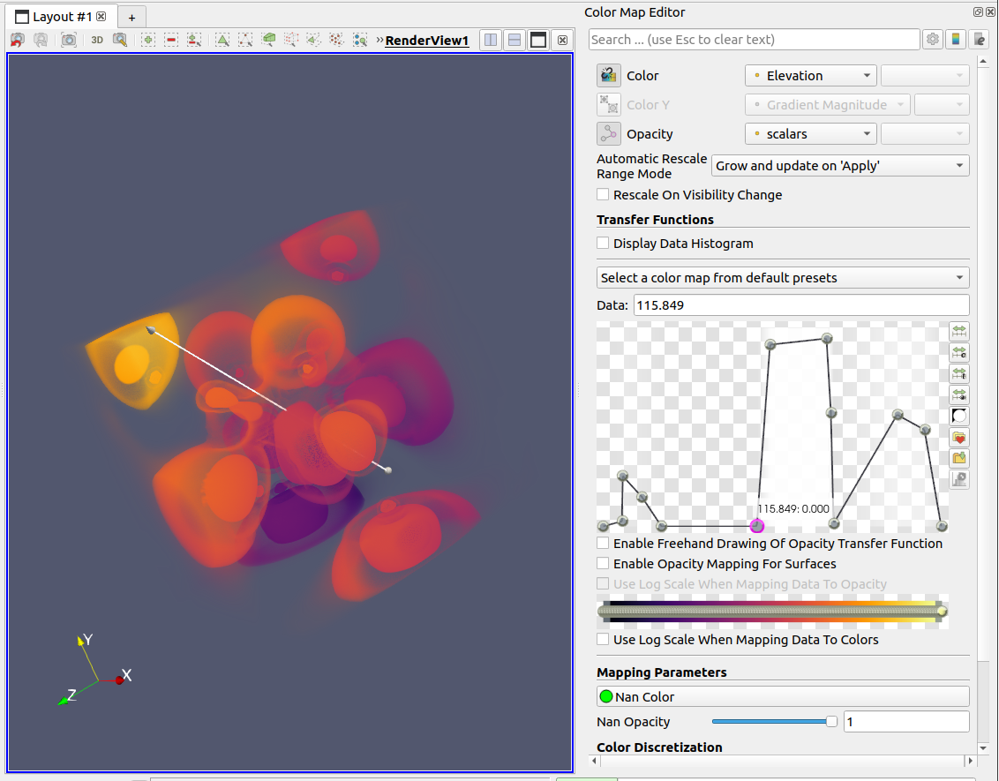
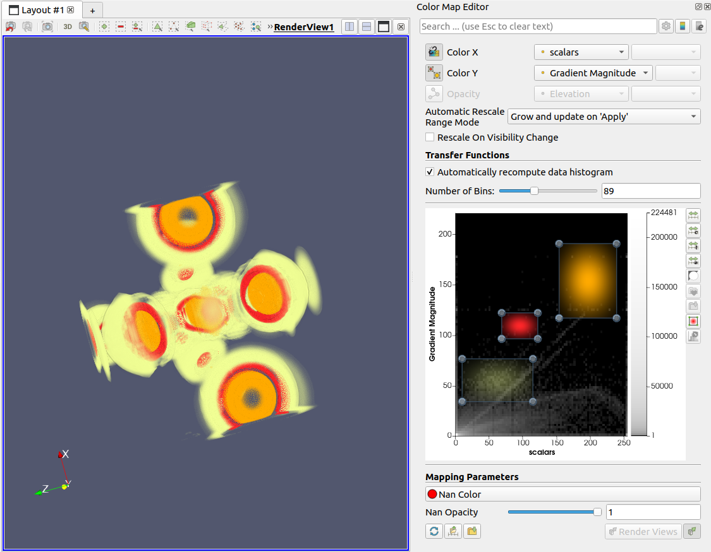

## Reorganized Color-Opacity Editor UI

The color map editor panel has been redesigned with a new layout to simplify
adjustments to the color, opacity transfer functions for surface and volume
rendering.

### Improved Color, Opacity Array Selector Widgets

Three new array selector widgets appear at the top of the color map editor.
The tool buttons on the left of each selector widgets correspond to
1. Use a separate color map with the currently active filter for the selected array.
2. Use a 2D transfer function whose Y-axis maps to the selected array.
3. Use a separate array to map opacity.

### Improved Look And Feel Of 1D Transfer Function Widget

The 1D opacity function widget now displays a checkered background
that can help you better understand the scalar opacity function. A high opacity
value is indicated by opaque white shaded region and a low opacity value
with a transperent region under the transfer function curve.
|1D Scalar Opacity Function Editor|1D Color Transfer Function Editor|
|-|-|
|||

### Increased Size Of 2D Transfer Function Widget

The 2D transfer function widget now takes up additional space in the color map editor layout.
This makes the 2D T.F editor feel roomier than before.

