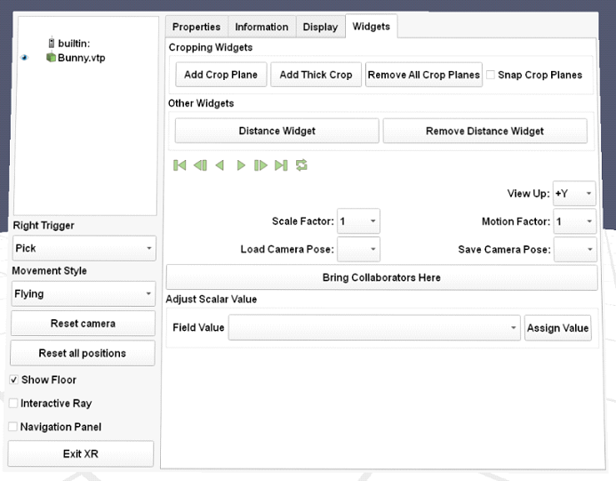
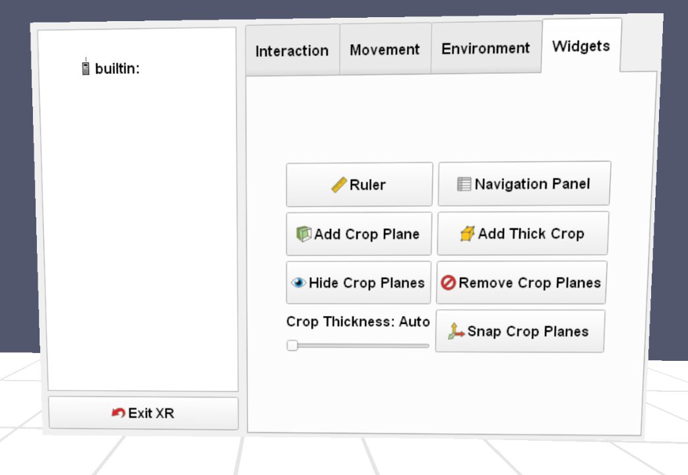

## Rework XR menu interface

Paraview XR menu interface has been reworked to be more compact, intuitive and accessible!

### Old interface

### New interface

"Properties", "Information" and "Display" tabs have been removed, they can be manipulated from Paraview desktop interface instead.

The left menu, under the pipeline browser, has been moved into the new interface, leaving only the "Exit XR" button.

The new interface is organized in 4 tabs to simplify navigation and also leave enough space for bigger widgets.

Here is a screenshot of each tab of the new menu:

Changes include:
* There are no longer check boxes, since they were not easy to check in XR, they have been replaced with bigger togglable button
* Most combo boxes have been replaced with sliders or other widgets
* Field value related widgets and animation buttons have been removed
* A new button to hide existing crops has been added
