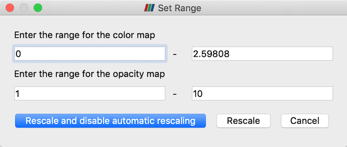

## Setting custom opacity array ranges

When volume rendering and enabling the **Use Separate Opacity Array** option,
it is now possible to set a custom range for the scalar opacity function that
is separate from the range used for the color transfer function.

