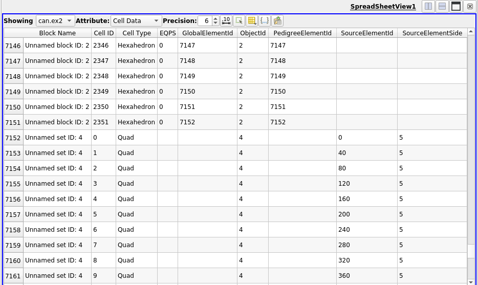

# Improvements to spreadsheet view for multi-block datasets

Spreadsheet view now shows names of blocks when showing
composite datasets in a separate column. This makes it easier to know
which row corresponds to which block.

Paritial arrays i.e. arrays not present on all blocks are now supported. If an
array is absent on some of the blocks, the correspoding cell will be shown as
empty. Previously, such paritial arrays were not shown at all in the view.

