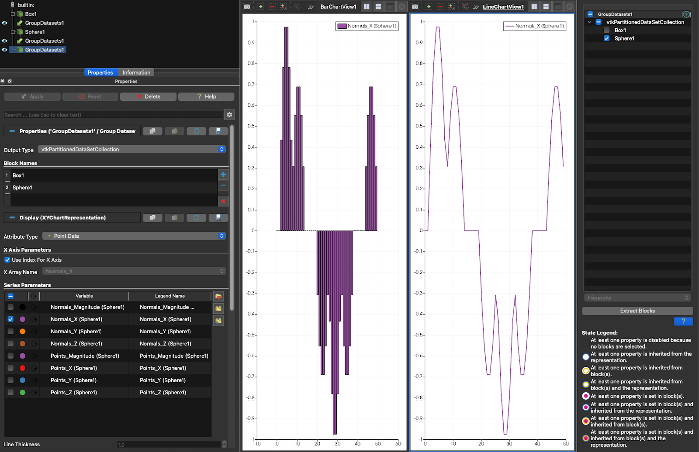

## Support vtkPartitionedDataSetCollections in chart representations

ParaView has the following list of chart related representations that are based on the vtkChartRepresentation class and
its subclasses.

1. XYChartRepresentationsBase/XYChartRepresentations
2. XYPointRepresentation
3. XYBarRepresentation
4. QuartileChartRepresentation
5. ParallelCoordinatesRepresentation
6. ImageChartRepresentation
7. BoxChartRepresentation
8. PlotMatrixRepresentation
9. BagPlotMatrixRepresentation
10. XYBagChartRepresentation
11. XYFunctionalBagChartRepresentation

In this work, the necessary code changes have been implemented to support `vtkPartitionedDataSetCollection` with
`vtkPartitionedDataSet`, as well as `vtkMultiBlockDataSet` with `vtkMultiPieceDataSet`. A notable UI update is the
relocation of the `CompositeDataSetIndex` control to the `Multiblock Inspector`. This change was made to enable block
selection for `vtkPartitionedDataSetCollection` and to unify the block selection workflow across the `Render View` and
`Spreadsheet View`. The `CompositeDataSetIndex` property has been replaced by the `Assembly` and `BlockSelectors`
properties, with backward compatibility maintained.

