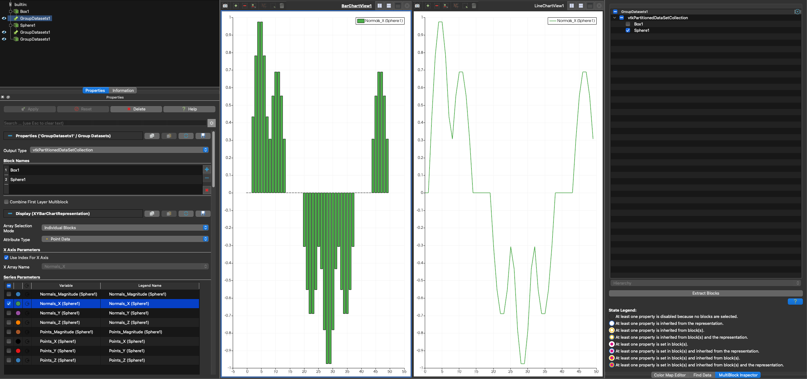
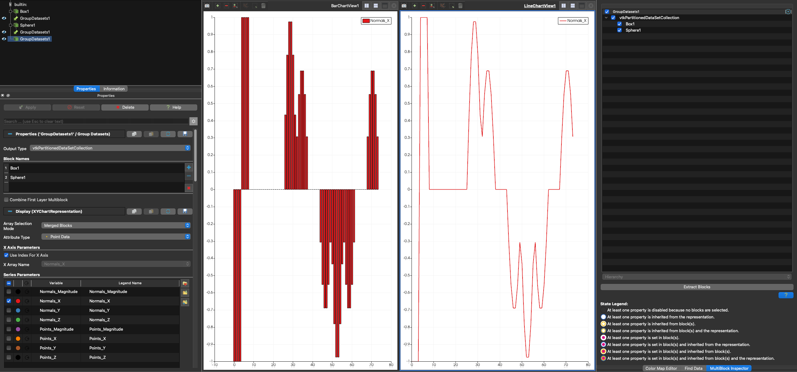

## Support vtkPartitionedDataSetCollections in chart representations

ParaView has the following list of chart related representations that are based on the vtkChartRepresentation class and
its subclasses.

1. XYChartRepresentationsBase/XYChartRepresentations
2. XYPointRepresentation
3. XYBarRepresentation
4. QuartileChartRepresentation
5. ParallelCoordinatesRepresentation
6. ImageChartRepresentation
7. BoxChartRepresentation
8. PlotMatrixRepresentation
9. BagPlotMatrixRepresentation
10. XYBagChartRepresentation
11. XYFunctionalBagChartRepresentation

In this work, the necessary code changes have been implemented to support `Partitioned Dataset Collection` with
`Partitioned Dataset`, as well as `Multi-block Dataset` with `Multi-Piece Dataset`. A notable UI update is the
relocation of the **CompositeDataSetIndex** control to the _Multiblock Inspector_. This change was made to enable block
selection for `Partitioned Dataset Collection` and to unify the block selection workflow across the `Render View` and
`Spreadsheet View`. The **CompositeDataSetIndex** property has been replaced by the **Assembly** and **Block Selectors**
properties, with backward compatibility maintained.

Additionally, for `Partitioned Dataset Collection` and `Multi-block Dataset` datasets, chart representations can now
display all selected blocks (as chosen in the _Multiblock Inspector_) as a single chart entity—such as a line or box
plot—rather than generating a separate entity for each block. This behavior is controlled by the new
**Array Selection Mode** property, which can be set to `Merged Blocks` (new default) or `Individual Blocks` (previous
behavior). With this improvement, users no longer need to manually select every block and enable each block array
individually — a process that was especially cumbersome when working with hundreds or thousands of blocks, each
containing multiple arrays.

