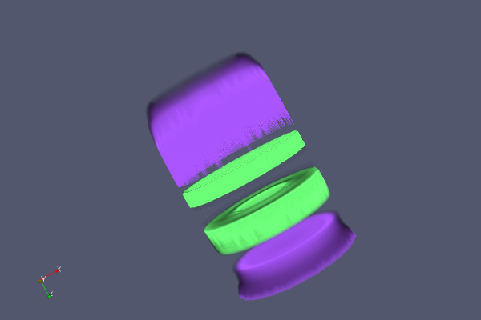

## Advanced multi-channel volume visualization

ParaView's user interface now allows the user to define and edit 2-dimensional transfer functions
for volume visualization of structured data. 2D transfer functions enable the color and opacity of a
data sample to be determined by the value of two separate scalar fields. This enables the
visualization to compare and contrast spatial features of the two fields. The new functionality also
provides for a special mode where a scalar field can be coupled with its gradient magnitude that
enhances "edges" in the scalar values.

### 2D histogram

To aid in the definition of 2D transfer functions, it is useful to compute a 2D histogram over the
two different scalar fields of choice. This histogram helps highlight areas where interesting
relationships between the two fields exist.

ParaView has a new algorithm called `vtkPVExtractHistogram2D` to compute 2D histograms for most types
of vtkDataSets over two different data array components or their gradient magnitudes. The output of
this filter is a one component vtkImageData of type double that can be visualized in ParaView's
render view as an image slice.

                      Histogram2D filter

### Transfer Function Editor

When the user enables the `Use 2D transfer function` checkbox, the color opacity editor switches to
the 2D transfer function editor.

The editor displays the 2D histogram of the chosen scalar field
with the number of bins defined by the `Number of histogram bins` property. Changing the number of
bins triggers an update to the histogram based on whether or not the `Automatic histogram` property
is enabled.

              2D Histogram in ParaView's color opacity editor

The histogram is displayed as a grayscale image where white indicates the highest density and black
indicates lowest density. A legend on the right shows teh density range. Hovering over a pixel/point
in the histogram shows the data values for the histogrammed arrays as well as the density.

### 2D transfer function editor UI

ParaView's new 2D transfer function editor allows the user to generate a 2D transfer function via
rectangular regions of interest. The user can add as many of these regions as he/she likes to
customize the transfer function. Each region is assigned a user-specifiable color and opacity which
are distributed in the box area as a 2D Gaussian distribution. These regions can be dragged and
resized over the 2D histogram to change the overall function.

Once the 2D transfer function editor is activated, a transfer function box can be added by double
clicking anywhere inside the bounds of the histogram. The box can then be moved by left-clicking,
holding and dragging the mouse cursor anywhere inside the bounds of the box. The box can be resized
by holding and dragging any of the four corners of the box. The color and opacity of the box can be
changed by activating the color chooser dialog using the new tool button provided on the right hand
side of the editor. A box can be deleted by clicking on it to select it and pressing the *Delete*
key on the keyboard.

                Transfer Function 2D Editor in ParaView

### New proxy and representation changes

To integrate 2D transfer functions in ParaView, the `vtkImageVolumeRepresentation` has been enhanced
with new functions and corresponding properties:

  - To enable 2D transfer functions - `SetUseTransfer2D`
  - To enable use of gradient magnitude of the scalar array as the Y-axis of the transfer function -
      `SetUseGradientForTransfer2D`
  - Set the second color array and array component - `SetColorArray` and `SetColorArray2Component`
  - Set the 2D transfer function to use - `SetTransferFunction2D`

      

        New Properties for 2D transfer functions

The new properties are availabe in the **Volume rendering** section of the *Properties* panel. They
are marked as advanced, so they are only visible when the advanced properties option is toggled on.
Note that the widget for selecting the Y-axis array is only shown if the option to use gradient is
disabled.

Each box in the 2D transfer function editor is represented by a new class
`vtkPVTransferFunction2DBox` that exposes API for its bounds, color and opacity. A vector of these
boxes is managed by `vtkPVTransferFunction2D` - which provides utility API for adding, removing and
editing control boxes on the transfer function. The image data representing the 2D transfer function
is composed from these boxes via the `vtkPVTransferFunction2D::Build` method.

A new proxy class called the `vtkSMTransferFunction2DProxy` manages the server-side
`vtkPVTransferFunction2D` object.
