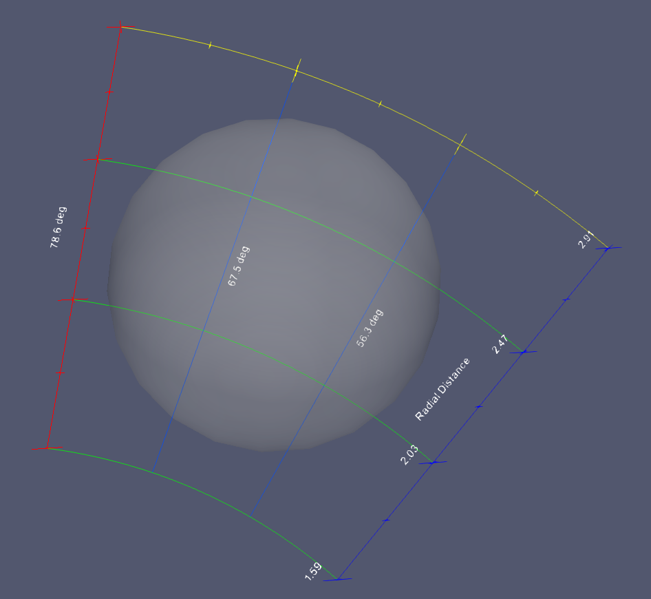
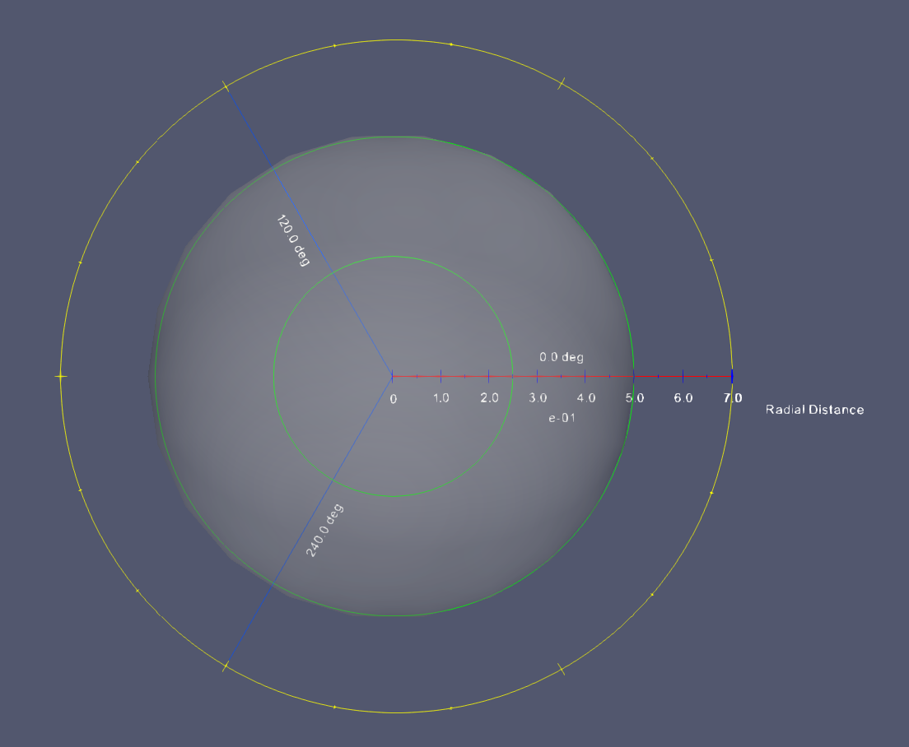

## Improvements of vtkPolarAxesRepresentation

This lists every changes made to this representation, sorted by their category in the ParaView panel.

### Custom Bounds and Range

#### Pole placement

You can now toggle the automatic placement of the pole. When On (by default), the behavior remains unchanged: the pole is
placed at the center of the bounding box. When Off, pole is placed at the origin. Turning this parameter Off becomes more
useful when combined with new automatic parameters (cf. Angles and Radii).

### Aspect Control

#### Polar axes

You can now either specify a **_number of polar axes_** or a **_delta range_** between them to automatically generate them,
similarly to radial axes. If both are specified, it will try to add *number of polar axes* every *delta range*. This means
you can have less polar axes than specified, if your *delta range* is too big, or not enough to fill your arc, if your *delta
range* is too small. By default, *number of polar axes* is set to 5 and *delta range* is set to 0.0, which means it will
generate 5 polar axes equally spaced.

#### Radial axes

You can now either specify a **_number of radial axes_** or a **_delta angle_** between them to automatically generate them.
If both are specified, it will try to add *number of radial axes* every *delta angle*. This means you can have less radial
axes than specified, if your *delta angle* is too big, or not enough to fill your arc, if your *delta angle* is too small.
By default, *number of radial axes* is set to 0 and *delta angle* is set to 45.0, which means it will generate one radial
axe every 45 degrees.

#### Angles and radii

You can toggle the use of custom angles. When On (by default), the behavior remains unchanged: you can specify a minimum and
a maximum angle. When Off, it will compute these angles relatively to pole position.

You can also toggle the use of custom minimum radius. When On (by default), the behavior remains unchanged: you can specify a
minimum radius. When Off, it will compute this radius relatively to pole position. Note that maximum radius remains computed
in both cases.

#### Polar arc resolution

You can now change polar arc resolution per degree. This sets the number of line drawn per degree, default is 0.2, which means
one line will be drawn every 5 degrees. If your ratio is different from 1.0, resolution will depend on it. E.g your ratio is set
to 2.0, your arcs will be larger so the resolution will be multiplied by 2.0.

### Colors

You can now choose an overall color for the whole Polar Axes when the parameter is enabled (by default). When the parameter is
Off, you can choose a color per feature as before.

### Title and Labels Control

#### Titles

You can now control titles offsets for the polar axis and and secondary radial axes. These are 2D offsets. Be aware that the
X offsets won't be applied when centered text was selected.

#### Labels

You can now control labels and exponent Y offset.

### Tick Control

#### Arc ticks

You can now easily make major arc ticks and radial axes match. When On (by default), major arc ticks will match radial axes
and minor ones will be the half of a major tick. When Off, you can specify your own *delta angle major* and *delta angle
minor*. In both cases, it will fill the arc with as many ticks as it can.

#### Axis ticks

You can now easily make major axis ticks and polar axes match. When On (by default), major axis ticks will match polar axes
and minor ones will be the half of a major tick. When Off, you can specify your own *delta range major* and *delta range
minor*. In both cases, it will fill the axes with as many ticks as it can.

#### Ticks size

If you don't specify a size for one type of tick, its size will be computed as a ratio of *maximum radius*. You can now
specify a value for this ratio.

### Sample images

#### Polar axes with automatic parameters set

* Pole placement Off while the sphere is not centered at the origin.
* Custom minimum radius On and custom angles On, so we don't get extra informations outside the sphere.
* Arc and axis ticks matches radial and polar axes On.

#### Polar axes with custom parameters set

* Pole placement On while the sphere is not centered at the origin.
* Custom minimum radius On and custom angles On while pole centered, so we get all useful information inside the sphere.
* Arc and axis ticks matches radial and polar axes Off, so we can set appropriate delta values.
