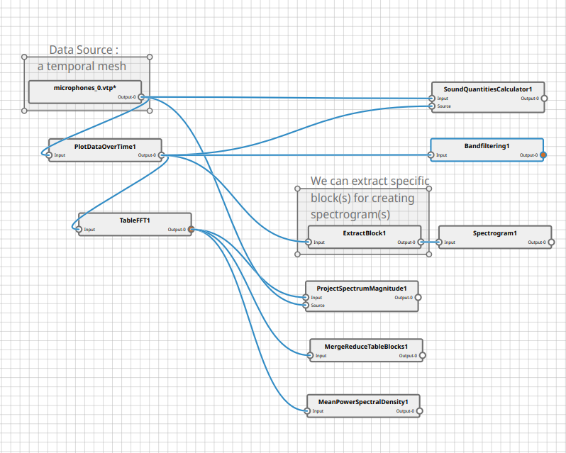
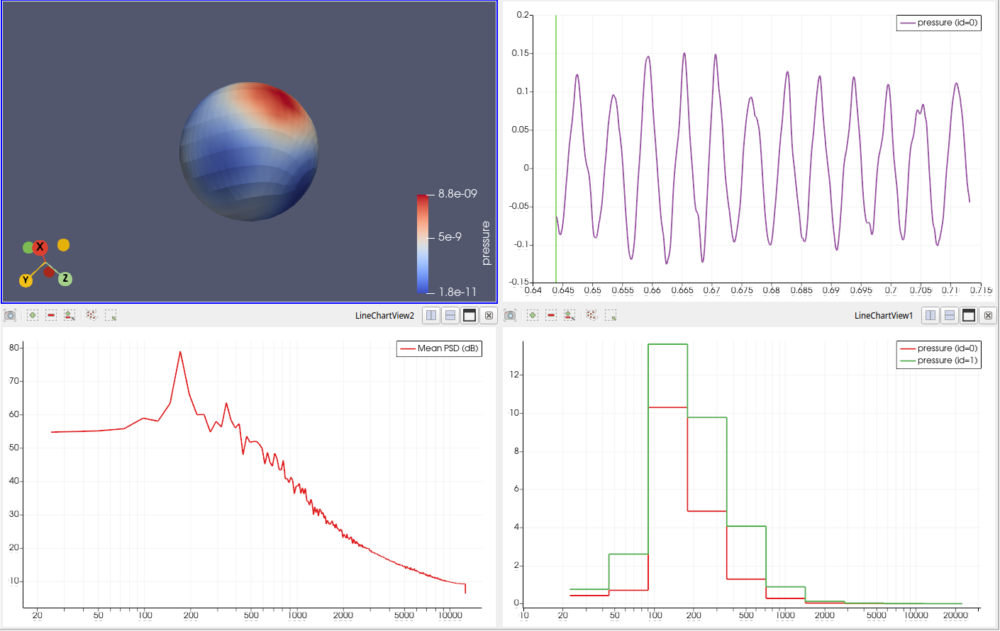

# Digital Signal Processing for Paraview

This plugin aims to bring basic digital signal processing and audio preview to ParaView.
It provides a few filters, a view and a new dock panel.

## General ideas and usage

VTK pipeline and data model do not offer a very efficient way of accessing and processing temporal data on a mesh.
This plugin introduce a data model to be able to process such data through spatial and temporal dimensions.

The idea is that for a given mesh with `n` points and `t` timesteps we create a structure of arrays
with `n` tables inside, and each of these tables contains `t` rows. A column of a table represents a point attribute of the input mesh.

This plugin supports two ways to generate such a structure, either using multidimensional arrays thanks to the `TemporalMultiplexer` filter,
or using a multiblock of tables using the `PlotDataOverTime` filter.

Multidimensional arrays are the preferred structure as they are efficient and support distributed computing.
In that case, a single Table is generated and each array correspond to a data on the input mesh, with `t` rows for each timestep and a
hidden dimension of size `n` for the points.
Please note some processing require specific care and the spatial dimension is hidden in ParaView. To create such a structure, just use the `TemporalMultiplexer` on a temporal dataset.

Multiblock is the legacy structure, while perfectly integrated in ParaView, it is very inefficient with a high number of points and does not support
distributed computing. In that case, each table block of the multiblock correspond to the data of a point, then the table simply contains all arrays for the point
on `t` rows for the timesteps. To create such a structure in ParaView, using the `Plot Data Over Time` filter on a temporal dataset,
with the option `Only Report Selection Statistics` turned off.

## Filters

### Temporal multiplexer

This filter extract the data arrays on all timesteps and all points, storing it in multidimensional arrays, where
the points are in the hidden dimension and the timesteps are the rows of the array.

### Multidimensions browser

This filter gives access to the hidden dimension and extracts the table corresponding to a single point.

### Band filtering

This filter performs a band filtering operation in frequency space. It takes as input a table with at least a column for a specific quantity and an optional time array. It’s possible to pick a custom band or choose between octave and third octave band. The output is a table with the mean of this quantity (in the original unit or in decibels) for each frequency defined in the frequency column (in Hz). 

### Mean Power Spectral Density

This filter computes the mean power spectral density (PSD) of temporal signals.

### DSP Table FFT

A Fast Fourier Transform (FFT) filter dedicated to compute FFT on the output of the Temporal multiplexer. It has the same arguments as the usual Table FFT filter. Similarly to the Temporal Multiplexer, it outputs a table of multi dimensional arrays where the hidden dimension is still related to the spatial discretization and the tuple dimension represents the discretization of frequency space.

### Sound Quantities Calculator

Compute the pressure RMS value (Pa and dB) as well as the acoustic power from a sound pressure (Pa) array.
Could be improved by adding more conversions.

This filter has 2 inputs:
- port 0 is the input geometry for cell connectivity.
- port 1 is a multi-block dataset representing the data through time. Block flat index
corresponds to the index of the point in the input mesh. This kind of dataset
can be obtained e.g. by first applying the filter Plot Data Over Time with the
option "Only Report Selection Statistics" turned off.

The output is the input geometry with the computed sound quantities attached to
it i.e. the mean pressure, the RMS pressure and the acoustic power.

### Spectrogram

This filter computes the spectrogram of the input.
The output is a vtkImageData where the X and Y axes correspond to time and
frequency, respectively.
The spectrogram is computed by applying a FFT on temporal windows each containing
a subset of the input samples. The window size and type can be controlled with the
time resolution and window type properties, respectively.

### Project Spectrum Magnitude

This filter computes the spectrum magnitudes of the selected arrays and places them on the points of a given mesh (source) for
a specified frequency range.

### Merge Reduce Table Blocks

This filter performs reduction operations such as the mean or the sum over columns
across all blocks of the structure.

## ImageChart View

A new type of view dedicated to displaying 2D image data in a chart context. It can be used with  the Spectrogram filter output. It comes with the same customization options as many other charts, such as axis properties, custom labels, etc. It also allows easier data inspection with axis annotations and tooltips.

## Audio Player Panel

The pqAudioPlayer dock widget allows to read audio retrieved from the current active source.
It will output audio to the default system audio sink. Please be carefull with your hears and
lower the volume and raise it gradually, especially if you are using earphones.

The active source has to produce a vtkTable, containing the audio signal. Each column of the vtkTable
is interpreted as a different audio signal and can be selected in the widget. Each row represent
a sample. The sample rate is selected manually in the widget. The default value can be
automatically configured by adding a field data array in the vtkTable named "sample_rate".

## Example

Here's an example of a pipeline that uses all of the filters exposed by this plugin, presented using
the node editor :

And a part of the resulting output :

## Acknowledgement

This work has been funded by the CALM-AA European project (cofunded by the European fund for
regional development)

