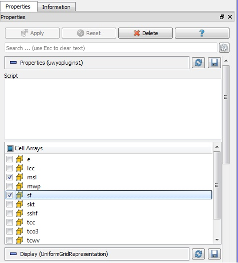
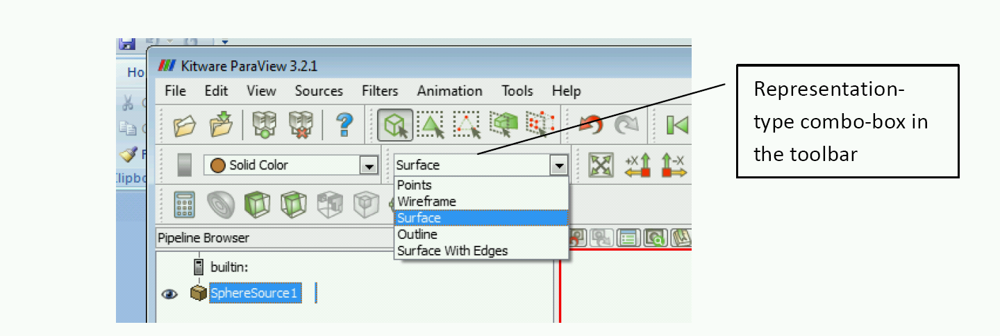

# Plugin Howto      {#PluginHowto}

## Introduction

ParaView comes with plethora of functionality bundled in: several readers,
multitude of filters, different types of views, etc. However, it is not
uncommon for developers to want to add new functionality to ParaView to, for
example, add support to their new file format or incorporate a new filter into
ParaView. ParaView makes it possible to add new functionality by using an
extensive plugin mechanism.

Plugins can be used to extend ParaView in several ways:

  * Add new readers, writers, filters
  * Add custom GUI components such as toolbar buttons to perform common tasks
  * Add new views in for display data

Examples for different types of plugins are provided with the ParaView source
under `Examples/Plugins/`.

This document has major sections:

  * First section covers how to use existing plugins in ParaView.
  * Second section contains information for developers about writing new
    plugins for ParaView.

## Using Plugins

### Types of plugins

Plugins are distributed as shared libraries (`*.so` on Unix and macOS, and
`*.dll` on Windows). For a plugin to be loadable in ParaView, it must be built
with the same version of ParaView as it is expected to be deployed on. Plugins
can be classified into two broad categories:

  * *Server-side plugins*: These are plugins that extend the algorithmic
    capabilities for ParaView. For example, new filters, readers or writers.
    Since ParaView processes data on the server-side, these plugins need to be
    loaded on the server.
  * *Client-side plugins*: These are plugins that extend the ParaView GUI
    including property panels for new filters, toolbars or views. These plugins
    need to be loaded on the client.

Oftentimes a plugin has both server-side as well as client-side components to
it. For example, a plugin that adds a new filter and a property panel that goes
with that filter. Such plugins need to be loaded both on the server as well as
the client.

Generally, users don't have to worry whether a plugin is a server-side or
client-side plugin. Simply load the plugin on the server as well as the client.
ParaView will include relevant components from plugin on each of the processes.

### Loading plugins

There are four ways for loading plugins:

  * *Using the GUI* (`Plugin Manager`)
    - Plugins can be loaded into ParaView using the `Plugin Manager` accessible
      from the `Tools | Manage Plugins/Extensions` menu. The `Plugin Manager`
      has two sections for loading client plugins and server plugins (shown
      only when connected to a server). To load a plugin on the client and
      server side, simply browse to the plugin shared library. If the plugin is
      loaded successfully, it will appear in the list of loaded plugins. The
      `Plugin Manager` also lists the paths it searched to load plugins
      automatically.
    - The `Plugin Manager` remembers all loaded plugins across ParaView
      instances, so once a plugin is loaded once, it will appear in the future
      (unloaded).
    - You can set up ParaView to automatically load the plugin at startup (for
      client plugins) or on connecting to the server (for server plugins) by
      checking the "Auto Load" checkbox on a loaded plugin.


  * *Using environment variable* (Auto-loading plugins)
    - In order to have ParaView automatically load a set of plugins on startup,
      one can use the `PV_PLUGIN_PATH` environment variable. `PV_PLUGIN_PATH`
      may be used to list a set of directories (separated by colon (`:`) for
      Unix platforms or semi-colon (`;`) on Windows) which ParaView will search
      on startup to load plugins. This environment variable needs to be set on
      both the client and server sides to load their respective plugins. Note
      that plugins in PV_PLUGIN_PATH are always auto-loaded irrespective of the
      status of the `Auto Load` checkbox in the `Plugin Manager`. Paths in this
      list may also be of the structure created by the ParaView plugin macros
      (e.g., `MyPlugin/MyPlugin.so`).
    - Finer control can be used using the `PV_PLUGIN_CONFIG_FILE` environment
      variable. `PV_PLUGIN_CONFIG_FILE` can be used to list a set of XML plugin
      configuration files (separated by colon (`:`) on Unix platforms or
      semi-colon (`;`) on Windows). ParaView will read these files on startup
      to load specified plugins. The XML plugin configuration file format looks
      like this:

```xml
<?xml version="1.0"?>
<Plugins>
  <Plugin name="MyPlugin" filename="/absolute/path/to/libMyPlugin.so"/>
  <!-- Note that relative paths are calculated from the directory of this XML file. -->
  <Plugin name="MyPluginRel" filename="relative/path/to/libMyPlugin.so"/>
</Plugins>
```

      Plugins listed this way will always be loaded, irrespective of the status
      of the `Auto Load` checkbox in the `Plugin Manager`.
  * *Using the plugin file `.plugins`* (Make plugins available and possibly
    Auto-load plugins)
    - Plugins that are listed in the `.plugins` file on the client and server
      will automatically be listed in the `Plugin Manager`, and may optionally
      be auto loaded. ParaView creates its own `.plugins` file listing plugins
      known during its build and uses it as the default. An example `.plugins`
      file, auto loading H5PartReader, looks like this:

```xml
<?xml version="1.0"?>
<Plugins>
  <Plugin name="Moments" auto_load="0"/>
  <Plugin name="PrismPlugin" auto_load="0"/>
  <Plugin name="PointSprite_Plugin" auto_load="0"/>
  <Plugin name="pvblot" auto_load="0"/>
  <Plugin name="H5PartReader" auto_load="1"/>
</Plugins>
```

  * *Default search paths*
    - Recognized locations are:
      * A `plugins` subdirectory under the `paraview-X.Y` directory in the
        library path (usually `lib` on Unix platforms and `bin` on Windows).
      * A `plugins` subdirectory in the user's home directory.  On Unix
        platforms, `$HOME/.config/ParaView/ParaView<version>/Plugins`.  On
        Windows `%APPDATA$\ParaView\ParaView<version>\Plugins`. (XXX: no
        evidence of an implementation backing this search path).

## Debugging Plugins

If plugin loading fails, the `PV_PLUGIN_DEBUG` environment variable may be set
for either the client or server processes. ParaView will then print verbose
information about each step and causes for failure, as show below.

```
***************************************************
Attempting to load /home/utkarsh/Kitware/ParaView3/ParaView3Bin/bin/libSurfaceLIC.so
Loaded shared library successfully. Now trying to validate that it's a ParaView plugin.
Updating Shared Library Paths: /home/utkarsh/Kitware/ParaView3/ParaView3Bin/bin
Plugin instance located successfully. Now loading components from the plugin instance based on the interfaces it implements.
----------------------------------------------------------------
Plugin Information:
  Name        : SurfaceLIC
  Version     : 1.0
  ReqOnServer : 1
  ReqOnClient : 1
  ReqPlugins  :
  ServerManager Plugin : Yes
  Python Plugin : No
```

# Writing plugins

This section covers writing and compiling different types of Plugins. To create
a plugin, one must have their own build of ParaView. Binaries downloaded from
www.paraview.org do not include necessary header files or import libraries
(where applicable) for compiling plugins.

The `CMakeLists.txt` file used in all following examples start off with the
following code:

```cmake
# ParaView requires CMake 3.8 in order to be used.
cmake_minimum_required(VERSION 3.8)
project(myplugin C CXX)

find_package(ParaView REQUIRED)
```

Where CMake will ask for the `ParaView_DIR` which you point to the ParaView
build or install tree you would to build your with.

Note that the `C` and `CXX` languages are required in general because ParaView
may need to find other packages which are written with only C in mind (MPI is
the usual culprit here) and need to know about the C compiler that is
available.

## Exposing an Existing Filter

Sometimes, the filter that one wants to add to ParaView is already available in
VTK, it's just not exposed through the ParaView GUI. This is the easiest type
of plugin to create. There are two options:

  1. setup the plugin using only an XML file; and
  2. actually compile the plugin into a shared library.

The first option is the easiest, but the second option will prepare you for
creating a custom filter in the future as the process is nearly identical.

## Adding a New Filter

It is also possible to add new filters to ParaView. The filter has to be a
VTK-based algorithm, written as following the standard procedures for writing
VTK algorithms. Generally for such cases where we are adding a new VTK class to
ParaView (be it a filter, reader or a writer), we need to do the following
tasks:

  * Write a *Server Manager Configuration XML* which describes the `Proxy`
    interface for the filter. Basically, this defines the interface for the
    client to create and modify instances of the new class on the server side.
    Please refer to the [ParaView Guide][] for details about writing these
    server-manager XMLs.
  * Write a configuration XML for the GUI to make ParaView GUI aware of this
    new class, if applicable. For filters, this is optional, since ParaView
    automatically recognizes filters added through plugins and lists them in
    the *Alphabetical* sub-menu. One may use the GUI configuration XML to add
    the new filter to a specific category in the *Filters* menu, or add a new
    category. For readers and writers, this is required since ParaView GUI
    needs to know what extensions your reader/writer supports etc.

## Examples

### XML Plugins

If you have not built ParaView from source, using an XML plugin is your only
option.

First, a server manager XML for the filter is required. The GUI XML to add the
filter to any specific category is optional.

For example, let's say we simply want to expose the `vtkCellDerivatives` filter
in VTK. Then first, we'll write the server manager configuration XML (call it
`CellDerivatives.xml`), similar to what we would have done for adding a new
filter.

```xml
<ServerManagerConfiguration>
  <ProxyGroup name="filters">
    <SourceProxy name="MyCellDerivatives" class="vtkCellDerivatives" label="My Cell Derivatives">
      <Documentation
          long_help="Create point attribute array by projecting points onto an elevation vector."
          short_help="Create a point array representing elevation.">
      </Documentation>
      <InputProperty
          name="Input"
          command="SetInputConnection">
        <ProxyGroupDomain name="groups">
          <Group name="sources"/>
          <Group name="filters"/>
        </ProxyGroupDomain>
        <DataTypeDomain name="input_type">
          <DataType value="vtkDataSet"/>
        </DataTypeDomain>
      </InputProperty>
    </SourceProxy>
  </ProxyGroup>
</ServerManagerConfiguration>
```

At this point, we can stop and use the plugin in ParaView by loading the XML
file directly into the plugin manager.

Please note that if you are writing the XML for a filter that takes just one
input, you *must* set the `name` attribute for the `InputProperty` XML element
to `Input`. If you do not, then the filter will not be displayed properly in
ParaView's pipeline browser.

### Compiling into a Shared Library

If you have built ParaView from source, it is possible to compile the plugin
into into a shared library. To do this, we can use the following top-level:
`CMakeLists.txt`:

```cmake
# Standard CMake boilerplate. ParaView's `find_package` requires at least 3.8.
cmake_minimum_required(VERSION 3.8)
project(sharedlibrary)

# These five lines are required in order to set up installation directories
# (which also control build directory locations) and enable shared builds
# (CMake's default is for a static build).
include(GNUInstallDirs)
set(CMAKE_RUNTIME_OUTPUT_DIRECTORY "${CMAKE_BINARY_DIR}/${CMAKE_INSTALL_BINDIR}")
set(CMAKE_LIBRARY_OUTPUT_DIRECTORY "${CMAKE_BINARY_DIR}/${CMAKE_INSTALL_LIBDIR}")
set(CMAKE_ARCHIVE_OUTPUT_DIRECTORY "${CMAKE_BINARY_DIR}/${CMAKE_INSTALL_LIBDIR}")
set(BUILD_SHARED_LIBS ON)

# Find ParaView. This will bring in ParaView's CMake API and imported targets.
find_package(ParaView REQUIRED)

# Scan the plugin file in order to set up internal data structures for building
# plugins.
paraview_plugin_scan(
  # The `paraview.plugin` file describing the plugin.
  PLUGIN_FILES "${CMAKE_CURRENT_SOURCE_DIR}/Plugin/paraview.plugin"
  # A result variable for the (enabled) plugins found during the scan.
  PROVIDES_PLUGINS plugins
  # Enable plugins during this scan by default.
  ENABLE_BY_DEFAULT ON)

# Build the plugins discovered during the scan.
paraview_plugin_build(
  PLUGINS ${plugins})
```

The mentioned `paraview.plugin` file describes the plugin to the build system:

```cmake
NAME
  CellDerivatives
DESCRIPTION
  Expose the vtkCellDerivatives class to ParaView.
REQUIRES_MODULES
  # This module provides the `vtkCellDerivatives` filter.
  VTK::FiltersGeneral
```

In the `Plugin` directory (beside the `paraview.plugin` file), the plugin is
given the information it needs to build:

```cmake
paraview_add_plugin(CellDerivatives
  VERSION "1.0"
  SERVER_MANAGER_XML CellDerivatives.xml)
```

Then using CMake, one can build a plugin for this new filter. We can now load
the plugin through the plugin manager by selecting the created `.so` or `.dll`
file.

### Qt resource plugins

Similarly compiled Qt resources (`*.bqrc`) can be loaded at runtime. A `.bqrc`
file is a binary file containing resources which can include icons, the GUI
configuration XML for adding categories, etc. A `.bqrc` can be made from a
`.qrc` by running the `rcc` utility provided by Qt:

```sh
rcc -binary -o myfile.bqrc myfile.qrc
```

### Adding a New Filter

For this example, refer to `Examples/Plugins/ElevationFilter` in the ParaView
source. Let's say we have written a new `vtkMyElevationFilter`
(`vtkMyElevationFilter.{h,cxx}`), which extends the functionality of the
`vtkElevationFilter` and we want to package that as a plugin for ParaView. For
starters, we simply want to use this filter in ParaView (e.g., not doing
anything fancy with *Filters* menu categories). As described, we need to write
the server manager configuration XML (`MyElevationFilter.xml`). Once that's
done, we write a `CMakeLists.txt` file to package this into a plugin.

This `CMakeLists.txt` needs to include the following lines:

```cmake
cmake_minimum_required(VERSION 3.8)
project(newfilter)

include(GNUInstallDirs)
set(BUILD_SHARED_LIBS ON)

find_package(ParaView REQUIRED)

paraview_plugin_scan(
  PLUGIN_FILES "${CMAKE_CURRENT_SOURCE_DIR}/Plugin/paraview.plugin"
  PROVIDES_PLUGINS plugins
  ENABLE_BY_DEFAULT ON)

paraview_plugin_build(
  PLUGINS ${plugins})
```

The referenced `paraview.plugin` file contains:

```cmake
NAME
  ElevationFilter
DESCRIPTION
  An example paraview plugin containing server manager XML and the server
  manager classes to build. This plugin can be loaded on the server side.
REQUIRES_MODULES
  VTK::CommonCore
  VTK::FiltersCore
```

And the `CMakeLists.txt` file beside it contains:

```cmake
paraview_add_plugin(ElevationFilter
  VERSION "1.0"
  MODULES ElevationFilters
  MODULE_FILES "${CMAKE_CURRENT_SOURCE_DIR}/ElevationFilters/vtk.module")
```

Because we are building our own custom filter, it needs to be a VTK module in
order to support having its information available to the XML code. First, the
module is declared in a `vtk.module` file:

```cmake
NAME
  ElevationFilters
DEPENDS
  VTK::FiltersCore
PRIVATE_DEPENDS
  VTK::CommonCore
```

And then the module is built with its associated server manager XML file
attached to the module. Note that the module name cannot be the same as the
plugin name due to the way the library targets are managed internally.

```cmake
set(classes
  vtkMyElevationFilter)

# Find external packages here using `find_package`.

vtk_module_add_module(ElevationFilters
  CLASSES ${classes})

# Link to external packages here using `vtk_module_link(ElevationFilters)`.

paraview_add_server_manager_xmls(
  XMLS  MyElevationFilter.xml)
```

Then using CMake, one can build a plugin for this new filter. Once this plugin
is loaded the filter will appear under the *Alphabetical* list in the *Filters*
menu. Note that there will be two libraries in the resulting directory. Be sure
to load the `ElevationFilter` one which is the plugin, not the
`ElevationFilters` module library.

### Filters with Multiple Input Ports

If a filter requires multiple input ports, there are two options:

  1. Create helper functions in the VTK filter such as `SetYourInputName` which
     deal with addressing the VTK pipeline in the C++ code; and
  2. Address/access the input connection by number in the XML. The `port_index`
     property specifies which input connection the particular input will be
     connected to. The `SetInputConnection` function is the command that will
     actually be called with this `port_index` to setup the pipeline.

An example XML file for a filter with multiple inputs is below. The filter
takes three `vtkPolyData` objects as input.

```xml
<ServerManagerConfiguration>
  <ProxyGroup name="filters">
    <SourceProxy name="LandmarkTransformFilter" class="vtkLandmarkTransformFilter" label="LandmarkTransformFilter">
      <Documentation
         long_help="Align two point sets using vtkLandmarkTransform to compute the best transformation between the two point sets."
         short_help="vtkLandmarkTransformFilter.">
      </Documentation>

      <InputProperty
          name="SourceLandmarks"
          port_index="0"
          command="SetInputConnection">
        <ProxyGroupDomain name="groups">
          <Group name="sources"/>
          <Group name="filters"/>
        </ProxyGroupDomain>
        <DataTypeDomain name="input_type">
          <DataType value="vtkPolyData"/>
        </DataTypeDomain>
        <Documentation>
          Set the source data set. This data set that will move towards the target data set.
        </Documentation>
      </InputProperty>

      <InputProperty
          name="TargetLandmarks"
          port_index="1"
          command="SetInputConnection">
        <ProxyGroupDomain name="groups">
          <Group name="sources"/>
          <Group name="filters"/>
        </ProxyGroupDomain>
        <DataTypeDomain name="input_type">
          <DataType value="vtkPolyData"/>
        </DataTypeDomain>
        <Documentation>
          Set the target data set. This data set will stay stationary.
        </Documentation>
      </InputProperty>

      <InputProperty
          name="SourceDataSet"
          port_index="2"
          command="SetInputConnection">
        <ProxyGroupDomain name="groups">
          <Group name="sources"/>
          <Group name="filters"/>
        </ProxyGroupDomain>
        <DataTypeDomain name="input_type">
          <DataType value="vtkPolyData"/>
        </DataTypeDomain>
        <Documentation>
          Set the source data set landmark points.
        </Documentation>
      </InputProperty>

      <Hints>
        <!-- see below for what options to put here -->
      </Hints>

    </SourceProxy>
  </ProxyGroup>
</ServerManagerConfiguration>
```

To set the inputs in ParaView, simply select one of the inputs in the *Pipeline
Browser* and then select the filter from the *Filters* menu. This will open a
dialog box which will allow you to specify which object to connect to each
input port.

### Adding *Categories* to the *Filters* Menu

Now suppose we want to add a new category to the *Filters* menu, called
*Extensions* and then show this filter in that menu. In that case we need to
add a hint to the XML file that tells ParaView what category to display this
filter in. In this case, the `Hints` element of the XML file can contain:

```xml
<Hints>
  <ShowInMenu category="Extensions" />
</Hints>
```

If the name of the category is same as an already existing category such as
*Data Analysis*, then the filter gets added to the existing category.

### Adding Icons

You can see that some filters in the *Filters* menu (e.g., *Clip*) have icons
associated with them. It's possible for the plugin to add icons for filters it
adds as well. For that you need to write a Qt resource file (say
`MyElevation.qrc`) as follows:

```xml
<RCC>
  <qresource prefix="/MyIcons" >
    <file>MyElevationIcon.png</file>
  </qresource>
</RCC>
```

To use the icon for a filter in the pipeline add the following hint to the
server manager XML.

```xml
<Hints>
  <ShowInMenu icon=":/MyIcons/MyElevationIcon.png" />
</Hints>
```

Finally, the plugin's `CMakeLists.txt` file much change to include our
`MyElevation.qrc` file as follows:

```cmake
paraview_add_plugin(ElevationFilter
  VERSION "1.0"
  MODULES ElevationFilters
  MODULE_FILES "${CMAKE_CURRENT_SOURCE_DIR}/ElevationFilters/vtk.module"
  UI_RESOURCES MyElevation.qrc)
```

### Adding GUI Parameters

Simply add these in the server manager XML to expose parameters of the filter
to the ParaView user.

#### Integer Property

This property appears as a text box.

```xml
<IntVectorProperty
    name="bStartByMatchingCentroids"
    command="SetbStartByMatchingCentroids"
    number_of_elements="1"
    default_values="1">
</IntVectorProperty>
```

#### Boolean Property

This property appears as a check box control. A boolean property uses the
`IntVectorProperty` with an extra line (`BooleanDomain`) indicating this should
be a check box rather than a text field.

```xml
<IntVectorProperty
    name="bStartByMatchingCentroids"
    command="SetbStartByMatchingCentroids"
    number_of_elements="1"
    default_values="1">
  <BooleanDomain name="bool"/>
</IntVectorProperty>
```

#### String Property

This property appears as a text box.

```xml
<StringVectorProperty
    name="YourStringVariable"
    command="SetYourStringVariable"
    number_of_elements="1"
    default_values="1">
</StringVectorProperty>
```

#### Double Property

This property appears as a text box.

```xml
<DoubleVectorProperty
    name="YourDoubleVariable"
    command="SetYourDoubleVariable"
    number_of_elements="1"
    default_values="1">
</DoubleVectorProperty>
```

####  Multi-Value Double Property

This property appears as a text box.

```xml
<DoubleVectorProperty
    name="YourDoubleVectorVariable"
    command="SetYourDoubleVectorVariable"
    number_of_elements="3"
    default_values="1.0 0.0 0.0">
</DoubleVectorProperty>
```

####  Double Property Slider

This creates a slider that ranges from `0.0` to `1.0`.

```xml
<DoubleVectorProperty
    name="PercentToRemove"
    command="SetPercentToRemove"
    number_of_elements="1"
    default_values="0.1">
  <DoubleRangeDomain name="range" min="0.0" max="1.0" />
</DoubleVectorProperty>
```

#### Drop Down List

This creates a drop down list with 3 choices. The values associated with the
choices may be specified.

```xml
<IntVectorProperty
    name="TransformMode"
    command="SetTransformMode"
    number_of_elements="1"
    default_values="1">
  <EnumerationDomain name="enum">
    <Entry value="6" text="RigidBody"/>
    <Entry value="7" text="Similarity"/>
    <Entry value="12" text="Affine"/>
  </EnumerationDomain>
  <Documentation>
    This property indicates which transform mode will be used.
  </Documentation>
</IntVectorProperty>
```

#### Drop Down List with Values from Input Arrays

This creates a list that lets you choose among the input arrays of the input of
a `ProgrammableFilter`:

```xml
<StringVectorProperty
    name="SelectInputScalars"
    label="Array"
    command="SetInputArrayToProcess"
    number_of_elements="5"
    element_types="0 0 0 0 2"
    animateable="0">
  <ArrayListDomain
      name="array_list"
      attribute_type="Scalars"
      input_domain_name="inputs_array">
    <RequiredProperties>
      <Property name="Input" function="Input" />
    </RequiredProperties>
  </ArrayListDomain>
</StringVectorProperty>
```

This will look like the following image:


#### Drop Down List with Values from Input File

If you need to populate a list with values from a file and be able to
select/deselect list entries (e.g., to pick which variables are loaded from the
file), use a XML similar to this:

```xml
<StringVectorProperty information_only="1"
                      name="CellArrayInfo">
  <ArraySelectionInformationHelper attribute_name="Cell" />
</StringVectorProperty>
<StringVectorProperty
    command="SetCellArrayStatus"
    element_types="2 0"
    information_property="CellArrayInfo"
    label="Cell Arrays"
    name="CellArrayStatus"
    number_of_elements="0"
    number_of_elements_per_command="2"
    repeat_command="1">
  <ArraySelectionDomain name="array_list">
    <RequiredProperties>
      <Property function="ArrayList"
                name="CellArrayInfo" />
    </RequiredProperties>
  </ArraySelectionDomain>
  <Documentation>
    This property lists which cell-centered arrays to read.
  </Documentation>
</StringVectorProperty>
```

You can see an example in use in ParaView's [core readers][] XML.

You may also do it in the following manner:

```xml
<StringVectorProperty
    command="SetCellArrayStatus"
    element_types="2 0"
    information_property="CellArrayInfo"
    label="Cell Arrays"
    name="CellArrayStatus"
    number_of_elements="0"
    number_of_elements_per_command="2"
    repeat_command="1">
  <ArrayListDomain name="array_list"
                   attribute_type="Scalars"
                   input_domain_name="inputs_array">
    <RequiredProperties>
      <Property name="Input" function="Input" />
    </RequiredProperties>
  </ArrayListDomain>
</StringVectorProperty>
```

In which case the result will look like this:



<!-- TODO: port this section
#### Tutorials for creating filters ====

Go to this page for the main article for the tutorials: [[Python Filters Tutorials]]
-->

#### Adding a Reader

Adding a new reader through a plugin is similar to adding a filter. The only
difference is that we do not need to specify what category the reader should be
added to in the GUI. For the latest version of ParaView we do not need to
specify anything special for the GUI as all of the details of the reader are
available in the XML proxy definition of the reader. For ParaView version 4.0.1
and earlier we need the XML to define what file extensions this reader can
handle. This XML (`MyReaderGUI.xml`) looks like this:

```xml
<ParaViewReaders>
  <Reader name="MyPNGReader" extensions="png"
          file_description="My PNG Files">
  </Reader>
</ParaViewReaders>
```

An example `MyPNGReader.xml` is shown below. In almost all cases you must have
a `SetFileName` function property. You are free to have other properties as
well, as with a standard (non-reader) filter. Also, the `Hints` section is needed
in order to associate the file extension with the reader on the client. The
`ReaderFactory` hint is what the client uses to identify readers from sources.

```xml
<ServerManagerConfiguration>
  <ProxyGroup name="sources">
    <SourceProxy name="MyPNGReader" class="vtkMyPNGReader" label="PNGReader">
      <Documentation
         long_help="Read a PNG file."
         short_help="Read a PNG file.">
      </Documentation>
      <StringVectorProperty
            name="FileName"
            animateable="0"
            command="SetFileName"
            number_of_elements="1">
        <FileListDomain name="files"/>
        <Documentation>
          This property specifies the file name for the PNG reader.
        </Documentation>
      </StringVectorProperty>
      <Hints>
        <ReaderFactory extensions="png"
                       file_description="PNG File Format" />
      </Hints>
    </SourceProxy>
  </ProxyGroup>
</ServerManagerConfiguration>
```

The CMake code for a reader plugin uses the same structure as the filter
example. The only likely difference is that the plugin should also pass
`REQUIRED_ON_SERVER` to `paraview_add_plugin` since the server side needs the
reader available for its use.

If you want your reader to work correctly with a file series, please refer to [[Animating legacy VTK file series#Making custom readers work with file series|file series animation]] for details.

Once you generate the project using CMake and compile the project, in ParaView
go to *Tools > Manage Plugins/Extensions*. Under *Local Plugins*, click *Load
New* and browse for the shared library file you just created. You should now
see your new file type in the *Files of type* list in the *Open file* dialog.

#### Adding a Writer

Similar to a reader plugin, for a writer plugin we need to tell ParaView what
extensions this writer supports. For the current version of ParaView this is
done in the `Hints` section of the server manager XML definition as follows:

```xml
<Hints>
  <WriterFactory extensions="tif"
                 file_description="My Tiff Files" />
</Hints>
```

#### Adding Customizations for Properties Panel

<!-- TODO link to external page -->

[[ParaView/Properties Panel|Properties Panel]] is the primary panel in ParaView
used to change the parameters for visualization modules and displays. Plugins
can provide new types of [`pqPropertyWidget`][pqPropertyWidget] subclasses that
can be used to control properties/property groups on this Properties panel.

To register a new `pqPropertyWidget` subclass to be associated with a
particular widget type for a property (`vtkSMProperty`), use the following
CMake code in your plugin:

```cmake
paraview_plugin_add_property_widget
  KIND kind
  TYPE my_property_widget_type
  CLASS_NAME ClassName
  INTERFACES interfaces
  SOURCES sources)

paraview_add_plugin(propwidget
  VERSION "1.0"
  UI_INTERFACES ${interfaces}
  SOURCES ${sources})
```

The `KIND` argument must be one of `WIDGET`, `GROUP_WIDGET`, or
`WIDGET_DECORATOR`. For a `vtkSMProperty`, `WIDGET` is required.

The `CLASS_NAME` argument must refer to a `pqPropertyWidget` subclass with a
constructor with the following signature:

```cpp
ClassName(vtkSMProxy *smproxy, vtkSMProperty *smproperty, QWidget *parentObject)
```

The `TYPE` argument specifies the string that will be used in the server
manager XML as the value for the `panel_widget` attribute to request creation
of this widget for a `vtkSMProperty` subclass.

To register a new `pqPropertyWidget` subclass to be associated with a
particular widget type for a property group (`vtkSMPropertyGroup`), use
`GROUP_WIDGET` for the `KIND` argument. The referenced `CLASS_NAME` must
subclass `pqPropertyWidget` and have a constructor with the signature:

```cpp
ClassName(vtkSMProxy *smproxy, vtkSMPropertyGroup *smgroup, QWidget *parentObject);
```

As before, the `TYPE` specifies the string that will be used in the server
manager XML as the value for the `panel_widget` attribute on a `PropertyGroup`
element to request creation of this widget for that group.

Another mechanism for adding customizations for *Properties* panel is to
provide [`pqPropertyWidgetDecorator`][pqPropertyWidgetDecorator] subclasses to
add custom control logic for widgets on the panel.

Decorators use the `WIDGET_DECORATOR` argument to `KIND`.

The `CLASS_NAME` must point to a `pqPropertyWidgetDecorator` subclass and the
`TYPE` is the string name used to request the creation of the decorator in the
server manager XML as described [[ParaView/Properties Panel|here]].

An example for customizing the Properties panel can be found in the ParaView
source under `Examples/Plugins/PropertyWidgets`.

#### Adding Documentation for Plugins

Developers can provide documentation for plugins that is shown in ParaView's
*Help* window. There are two mechanisms for adding documentation from plugins.

  * Any server manager XML files added directly to the `paraview_add_plugin`
    function or those attached to modules passed to its `MODULES` argument
    using `paraview_add_server_manager_xmls` are automatically parsed to
    process `Documentation` elements. HTML pages summarizing the proxy and
    properties are automatically generated. This ensures that when the user
    clicks "?" for a filter or source added via the plugin, the help window
    shows appropriate help pages.
  * Using the `DOCUMENTATION_DIR` argument to `paraview_add_plugin` to specify
    a directory containing HTML pages and images that gets added a the
    documentation for the plugin (in addition to the documentation generated
    using the `SERVER_MANAGER_XML` files. For example:

```cmake
paraview_add_plugin(SurfaceLIC
  VERSION "1.0"
  DOCUMENTATION_DIR "${CMAKE_CURRENT_SOURCE_DIR}/doc")
```

This results in adding documentation to the *ParaView Online Help* when the
plugin is loaded, as shown below.


#### Adding a Toolbar

Filters, reader, and writers are by far the most common ways for extending
ParaView. However, ParaView plugin functionality goes far beyond that. The
following sections cover some of these advanced plugins that can be written.

Applications use toolbars to provide easy access to commonly used
functionality. It is possible to have plugins that add new toolbars to
ParaView. The plugin developer implements his own C++ code to handle the
callback for each button on the toolbar. Hence one can do virtually any
operation using the toolbar plugin with some understanding of the ParaView
Server Manager framework and the ParaView GUI components.

Please refer to `Examples/Plugins/SourceToolbar` for this section. There we are
adding a toolbar with two buttons to create a sphere and a cylinder source. For
adding a toolbar, one needs to implement a subclass for
[`QActionGroup`][QActionGroup] which adds the [`QAction`][QAction]s for each of
the toolbar button and then implements the handler for the callback when the
user clicks any of the buttons. In the example `SourceToobarActions.{h,cxx}` is
the `QActionGroup` subclass that adds the two tool buttons.

To build the plugin, the `CMakeLists.txt` file is:

```cmake
# This is a macro for adding QActionGroup subclasses automatically as toolbars.
paraview_plugin_add_action_group(
  CLASS_NAME SourceToolbarActions
  GROUP_NAME "ToolBar/SourceToolbar"
  INTERFACES interfaces
  SOURCES sources)

# Now create a plugin for the toolbar. Here we pass the `interfaces` and
# `sources` returned by the above call.
paraview_add_plugin(SourceToolbar
  VERSION "1.0"
  UI_INTERFACES ${interfaces}
  SOURCES ${sources}
          SourceToolbarActions.cxx)
```

For the `GROUP_NAME`, we are using `ToolBar/SourceToolbar`; here `ToolBar` is a
keyword which implies that the action group is a toolbar (and shows up under
*View > Toolbars* menu) with the name `SourceToolbar`. When the plugin is
loaded, this toolbar will show up with two buttons.

#### Adding a Menu

Adding a menu to the menu bar of the main window is almost identical to adding
a toolbar.  The only difference is that you use the keyword `MenuBar` in lieu
of `ToolBar` in the `GROUP_NAME` of the action group.  So if you change the
`paraview_plugin_add_action_group` command above to the following, the plugin
will add a menu titled `MyActions` to the menu bar.

```cmake
paraview_plugin_add_action_group(
  CLASS_NAME SourceToolbarActions
  GROUP_NAME "MenuBar/MyActions"
  INTERFACES interfaces
  SOURCES sources)
```

If you give the name of an existing menu, then the commands will be added to
that menu rather than create a new one.  So, for example, if the `GROUP_NAME`
is `MenuBar/File`, the commands will be added to the bottom of the *File* menu.

#### Autostart Plugins

This refers to a plugin which needs to be notified when ParaView starts up or
the plugin is loaded which ever happens later and then notified when ParaView
quits. Example is in `Examples/Plugins/Autostart` in the ParaView source. For
such a plugin, we need to provide a `QObject` subclass
(`pqMyApplicationStarter`) with methods that need to be called on startup and
shutdown.

```cpp
class pqMyApplicationStarter : public QObject
{
Q_OBJECT
public:
  // Callback for startup.
  // This cannot take any arguments
  void onStartup();

  // Callback for shutdown.
  // This cannot take any arguments
  void onShutdown();
};
```

The `CMakeLists.txt` looks as follows:

```cmake
# Macro for auto-start plugins. We specify the class name and the methods to
# call on startup and shutdown on an instance of that class. It returns the
# interface and sources created in the variables passed to the `INTERFACES` and
# `SOURCES` arguments, respectively.
paraview_plugin_add_auto_start(
  CLASS_NAME pqMyApplicationStarter # the class name for our class
  STARTUP onStartup   # specify the method to call on startup
  SHUTDOWN onShutdown # specify the method to call on shutdown
  INTERFACES interfaces
  SOURCES sources)

# Create a plugin for this starter
paraview_add_plugin(Autostart
  VERSION "1.0"
  UI_INTERFACES ${interfaces}
  SOURCES pqMyApplicationStarter.cxx ${interfaces})
```

#### Adding new Representations for 3D View using Plugins

ParaView's 3D view the most commonly used view for showing polygonal or
volumetric data. By default, ParaView provides representation-types for showing
the dataset as surface, wireframe, points etc. It’s possible to add
representations using plugins that extends this set of available
representation types.

Before we start looking at how to write such a plugin, we need to gain some
understanding of the 3D view and its representations. The 3D view uses 3 basic
representation proxies for rendering all types of data:

  * (representations, `UnstructuredGridRepresentation`) – for
    `vtkUnstructuredGrid` or a composite dataset consisting of
    `vtkUnstructuredGrid`.
  * (representations, `UniformGridRepresentation`) – for `vtkImageData` or a
    composite dataset consisting of `vtkImageData`
  * (representations, `GeometryRepresentation`) – for all other data types.

Each of these representation proxies are basically composite representation
proxies that use other representation proxies to do the actual rendering, e.g.,
`GeometryRepresentation` uses `SurfaceRepresentation` for rendering the data as
wireframe, points, surface, and surface-with-edges and `OutlineRepresentation`
for rendering an outline for the data. Subsequently, the 3 composite
representation proxies provide a property named `Representation` which allows
the user to pick the representation type he wants to see the data as. The
composite representation proxy has logic to enable one of its internal
representations based on the type chosen by the user.

These 3 composite representation types are fixed and cannot be changed by
plugins. What plugins can do is add more internal representations to any of
these 3 composite representations to support new representations types that the
user can choose using the representation type combo box on the display tab or
in the toolbar.



##### Using a New Mapper

In this example, we see how to integrate a special polydata mapper written in
VTK into ParaView. Let’s say the mapper is called `vtkMySpecialPolyDataMapper`
which is simply a subclass of `vtkPainterPolyDataMapper`. In practice,
`vtkMySpecialPolyDataMapper` can internally use different painters to do
perform special rendering tasks.

To integrate this mapper into ParaView, first we need to create a
`vtkSMRepresentationProxy` subclass for that uses this mapper. In this example,
since the mapper is a simple replacement for the standard
`vtkPainterPolyDataMapper`, we can define our representation proxy as a
specialization of the `SurfaceRepresentation` as follows:

```xml
<ServerManagerConfiguration>
  <ProxyGroup name="representations">
    <RepresentationProxy
        name="MySpecialRepresentation"
        class="vtkMySpecialRepresentation"
        processes="client|renderserver|dataserver"
        base_proxygroup="representations"
        base_proxyname="SurfaceRepresentation">
      <Documentation>
        This is the new representation type we are adding. This is identical to
        the SurfaceRepresentation except that we are overriding the mapper with
        our mapper.
      </Documentation>
    </RepresentationProxy>
  </ProxyGroup>
</ServerManagerConfiguration>
```

`vtkMySpecialRepresentation` is a subclass of
`vtkGeometryRepresentationWithFaces` where in the constructor we simply
override the mappers as follows:

```cpp
vtkMySpecialRepresentation::vtkMySpecialRepresentation()
{
  // Replace the mappers created by the superclass.
  this->Mapper->Delete();
  this->LODMapper->Delete();

  this->Mapper = vtkMySpecialPolyDataMapper::New();
  this->LODMapper = vtkMySpecialPolyDataMapper::New();

  // Since we replaced the mappers, we need to call SetupDefaults() to ensure
  // the pipelines are setup correctly.
  this->SetupDefaults();
}
```

Next we need to register this new type with the any (or all) of the 3 standard
composite representations so that it will become available to the user to
choose in the representation type combo box. To decide which of the 3 composite
representations we want to add our representation to, think of the input data
types our representation supports. If it can support any type of data set, then
we can add our representation all the 3 representations (as is the case with
this example). However if we are adding a representation for volume rendering
of `vtkUnstructuredGrid` then we will add it only to the
`UnstructuredGridRepresentation`. This is done by using the `Extension` XML
tag. It simply means that we are extending the original XML for the proxy
definition with the specified additions. Now to make this representation
available as a type to the user, we use the `RepresentationType` element , with
`text` used as the text shown for the type in the combo-box, `subproxy`
specifies the name of representation subproxy to activate when the user chooses
the specified type. Optionally one can also specify the `subtype` attribute,
which if present is the value set on a property named `Representation` for the
subproxy when the type is chosen. This allows for the subproxy to provide more
than one representation type.

```xml
<ServerManagerConfiguration>
  <ProxyGroup name="representations">
    <Extension name="GeometryRepresentation">
      <Documentation>
        Extends standard GeometryRepresentation by adding
        MySpecialRepresentation as a new type of representation.
      </Documentation>

      <!-- this adds to what is already defined in PVRepresentationBase -->
      <RepresentationType
          subproxy="MySpecialRepresentation"
          text="Special Mapper"
          subtype="1" />

      <SubProxy>
        <Proxy name="MySpecialRepresentation"
               proxygroup="representations"
               proxyname="MySpecialRepresentation">
        </Proxy>
        <ShareProperties subproxy="SurfaceRepresentation">
          <Exception name="Input" />
          <Exception name="Visibility" />
          <Exception name="Representation" />
        </ShareProperties>
      </SubProxy>
    </Extension>
  </ProxyGroup>
</ServerManagerConfiguration>
```

The `CMakeLists.txt` file is not much different from what it would be like for
adding a simple filter or a reader where the representation class is placed
into the contained module.

Source code for this example is available under
`Examples/Plugins/Representation` in the ParaView source directory.

## Examples

The ParaView git repository contains many examples in the `Examples/Plugins`
directory.

## Adding plugins to ParaView source

There are several plugins that are included in ParaView source itself and are
built as part of ParaView's build process. To add such a plugin to the ParaView
build there are two options, adding it to the `ParaView/Plugins` directory is
currently the only supported mechanism.

<!-- TODO: Restore the external plugin building process to support custom plugins in static builds.

  1. Place the source for the plugin in a directory under `ParaView/Plugins`.
  2. Add the source directory to the CMake variable
     `EXTRA_EXTERNAL_PLUGIN_DIRS` when building ParaView.

Both approaches result in identical behavior.
-->

In general users should simply build their plugins separately, outside the
ParaView source. However, when building ParaView statically, adding the plugin
to be built as part of ParaView ensures that the static executables load the
plugin, otherwise there is no mechanism for loading a plugin in statically
built executables.

In your plugin source directory, ParaView searches for a file name
`paraview.plugin` which provides ParaView with information about the plugin.
This file should contain the following contents:

```cmake
# Comments are allowed.
NAME
  PluginName
DESCRIPTION
  A description of the plugin. This text is attached to the CMake option to
  build this plugin.
REQUIRES_MODULES
  # List of VTK modules required by the code contained in the plugin. This
  # allows ParaView to build the full set of requested modules if the plugin is
  # being built.
  VTK::CommonCore
```

If now the plugin is enabled (by the user or by default) by turning ON the
`PARAVIEW_PLUGIN_ENABLE_PluginName` CMake option, then CMake will look for a
`CMakeLists.txt` file next to the `paraview.plugin`. This file contains the
calls to build the plugin including the `paraview_add_plugin` call, and
building of any other libraries that the plugin needs.

A good place to start would be look at examples under `ParaView/Plugins`
directory.

## Plugins in Static Applications

It is possible to import plugins into a ParaView-based application at compile
time. When building ParaView-based applications statically, this is the only
option to bring in components from plugins. When built statically (i.e., with
`BUILD_SHARED_LIBS` set to false), ParaView will automatically link and load
plugins that were enabled via CMake by inserting the necessary
`PV_PLUGIN_IMPORT_INIT` and `PV_PLUGIN_IMPORT` macros.

The code below shows how the `PV_PLUGIN` macros would be used to statically load
plugins in custom applications:

```cpp
#define PARAVIEW_BUILDING_PLUGIN
#include "vtkPVPlugin.h"

// Adds required forward declarations.
PV_PLUGIN_IMPORT_INIT(MyFilterPlugin)
PV_PLUGIN_IMPORT_INIT(MyReaderPlugin)

class MyMainWindow : public QMainWindow
{
  // ....
};

MyMainWindow::MyMainWindow(...)
{
  // ... after initialization ...

  // Calls relevant callbacks to load the plugins and update the
  // GUI/Server-Manager
  PV_PLUGIN_IMPORT(MyFilterPlugin);
  PV_PLUGIN_IMPORT(MyReaderPlugin);
}
```

## Pitfalls

### *Tools > Manage Plugins* is not visible!

Plugins can only be loaded dynamically when ParaView is built with shared
libraries. You must recompile ParaView with `BUILD_SHARED_LIBS=ON`.

### Compile error `invalid conversion from 'vtkYourFiltersSuperClass*' to 'vtkYourFilter*'`

Any VTK object that needs to be treated as a filter or source has to be a
`vtkAlgorithm` subclass. The particular superclass a filter is derived from has
to be given not only in the standard C++ way:

```cpp
class VTKMODULE_EXPORT vtkMyElevationFilter : public vtkElevationFilter
```

but additionally declared with help of the `vtkTypeMacro`. For the example
given above:

```cpp
class VTKMODULE_EXPORT vtkMyElevationFilter : public vtkElevationFilter
{
public:
  vtkTypeMacro(vtkMyElevationFilter, vtkElevationFilter);
}
```

Otherwise, compiling the filter will fail with a variety of error messages
(depending on superclass) like

```
vtkMyElevationFilter.cxx:19: error: no 'void vtkMyElevationFilter::CollectRevisions(std::ostream&)'
  member function declared in class 'vtkMyElevationFilter'
```
or

```
vtkMyElevationFilterClientServer.cxx:97: error: invalid conversion from ‘vtkPolyDataAlgorithm*’ to
  ‘vtkICPFilter*’
```

### Mysterious Segmentation Faults in Plugins that use Custom VTK Classes

This primarily concerns plugins that make calls to your own custom `vtkMy` (or
whatever you called it) library of VTK extensions.

Symptoms:

  * The plugin will load, but causes a segfault when you try to use it.
  * If you use a debugger you may notice that in some cases when your code
    calls `vtkClassA.MethodB`, what actually gets called is
    `vtkClassC.MethodD`, where `MethodB` is a virtual member function.  This is
    occurs because of different vtable entries in the Paraview-internal
    versions of the VTK libraries.

The solution is to make sure that your `vtkMy` library is compiled against
ParaView's internal VTK libraries.  Even if you compiled VTK and ParaView using
the same VTK sources, you *must not* link against the external VTK libraries.
(The linker won't complain, because it will find all the symbols it needs, but
this leads to unexpected behaviour.)

To be explicit, when compiling your `vtkMy` library, you must set the CMake
variable `VTK_DIR` to point to the `VTK` subdirectory in the directory in which
you built ParaView.  (On my system, CMake automatically finds VTK at
`/usr/lib/vtk-5.2`, and I must change `VTK_DIR` to
`~/source/ParaView3/build/VTK`.)

### "Is not a valid Qt plugin" in Windows

Make sure that all the DLLs that your plugin depends on are on the `PATH`.  If
in doubt, try placing your plugin and all its dependent DLLs in the `bin`
directory of your build and load it from there.

### The system cannot find the path specified. `error MSB6006: "cmd.exe" exited with code 3.`

You may get an error like this when trying to build your plugin with
Visual Studio:

```
1>  CS Wrapping - generating vtkMyElevationFilterClientServer.cxx
1>  The system cannot find the path specified.
1>C:\Program Files\MSBuild\Microsoft.Cpp\v4.0\Microsoft.CppCommon.targets(151,5): error MSB6006: "cmd.exe" exited with code 3.
1>Done executing task "CustomBuild" -- FAILED.
```

This is caused for a mismatch between the configuration you used when building
ParaView (e.g. Debug, Release, etc.) and the configuration currently chosen for
building your plugin. So ensure those match.

The problem is caused because inside the Linker properties there are references
to the `*.lib` files, including the name of the directory that matches the
configuration type, which may look something like
`C:\Users\MyUser\ParaView-v4.2.0-build\lib\Release\vtkPVAnimation-pv4.2.lib`.

[ParaView Guide]: http://www.kitware.com/products/books/paraview.html
[core readers]: https://gitlab.kitware.com/paraview/paraview/-/blob/87babdbeab6abe20aac6f8b2692788abc6bb20ac/ParaViewCore/ServerManager/SMApplication/Resources/readers.xml#L158-179
[pqPropertyWidget]: https://kitware.github.io/paraview-docs/nightly/cxx/classpqPropertyWidget.html
[pqPropertyWidgetDecorator]: https://kitware.github.io/paraview-docs/nightly/cxx/classpqPropertyWidgetDecorator.html
[QActionGroup]: https://doc.qt.io/qt-5/qactiongroup.html
[QAction]: https://doc.qt.io/qt-5/qaction.html
